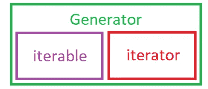
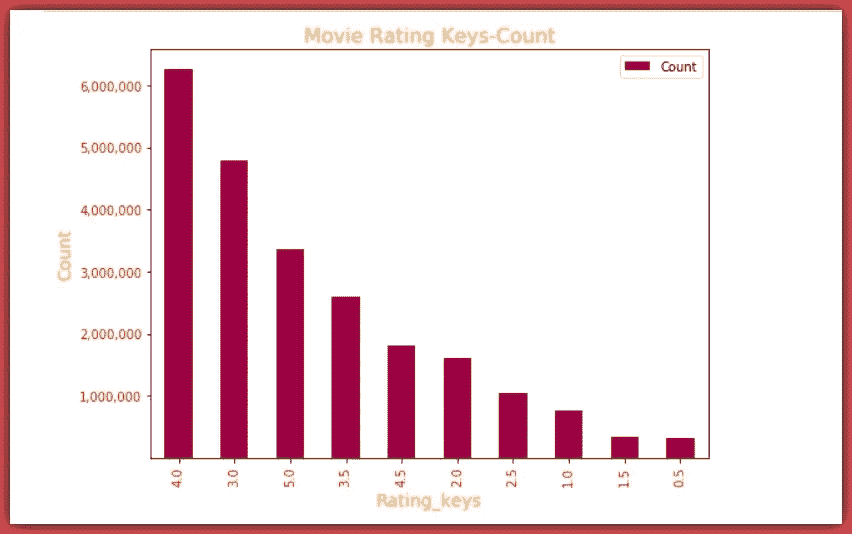
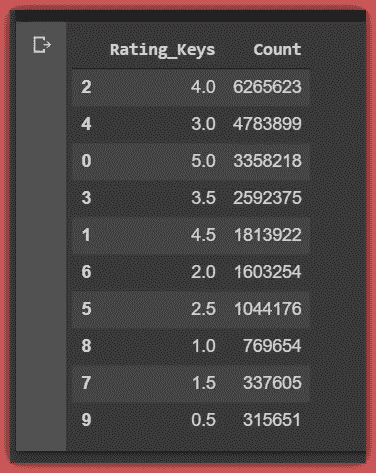

# 高效的熊猫:对大型数据集使用 Chunksize

> 原文：<https://pub.towardsai.net/efficient-pandas-using-chunksize-for-large-data-sets-c66bf3037f93?source=collection_archive---------0----------------------->

## [数据科学](https://towardsai.net/p/category/data-science)

## 使用 Pandas 高效地探索大型数据集


数据科学专业人员经常会遇到具有数百个维度和数百万个观察值的非常大的数据集。有多种方法可以处理大型数据集。我们都知道像 [*Hadoop*](https://hadoop.apache.org/) 和 [*Spark*](https://spark.apache.org/docs/latest/rdd-programming-guide.html#overview) 这样的分布式文件系统，它们通过在集群中的多个工作节点上并行化来处理大数据。但是对于本文，我们将使用 pandas***chunksize***属性或 **get_ *chunk()*** 函数。

想象一下，你正在制作一部新电影，你想知道

> **1。从 0.5 到 5.0 最常见的电影评分是多少**
> 
> **2。大多数制作的电影的平均电影评级是多少？**


[img_credit](https://d26oc3sg82pgk3.cloudfront.net/files/media/edit/image/3372/article_full%401x.jpg)

要回答这些问题，首先，我们需要找到一个包含数万部电影的电影评分的数据集。感谢[***group lens***](https://grouplens.org/about/what-is-grouplens/)*提供[***movie lens***](https://grouplens.org/datasets/movielens/)数据集，包含超过 13.8 万用户超过 2000 万的电影评分，涵盖超过 2.7 万部不同电影。*

*这是一个庞大的数据集，用于构建推荐系统，这正是我们所需要的。所以我们用 wget 提取一下。我在 Colab 工作，但是任何笔记本或者 IDE 都可以。*

```
***!wget -O moviedataset.zip** [**https://s3-api.us-geo.objectstorage.softlayer.net/cf-courses-data/CognitiveClass/ML0101ENv3/labs/moviedataset.zip**](https://s3-api.us-geo.objectstorage.softlayer.net/cf-courses-data/CognitiveClass/ML0101ENv3/labs/moviedataset.zip)**print('unziping ...')****!unzip -o -j moviedataset.zip***
```

*解压缩文件夹会显示 4 个 CSV 文件:*

*links.csv*

*电影. csv*

*评级. csv*

*tags.csv*

*我们感兴趣的是 ratings.csv 数据集，其中包含 27，000 多部电影的 2000 多万个电影评级。*

```
*# First let's import a few libraries
**import pandas as pd
import matplotlib.pyplot as plt***
```

*让我们看一下 ratings.csv 文件*

```
***ratings_df = pd.read_csv('ratings.csv')
print(ratings_df.shape)** >>
  **(22884377, 4)***
```

*正如所料，ratings_df 数据帧有超过 2200 万行。这对我们的计算机内存来说是一个很大的数据处理量。为了对这个数据集进行计算，一个接一个地分块处理数据集是很有效的。以一种懒惰的方式，使用迭代器对象。*

> *请注意，我们不需要读取整个文件。我们可以简单地使用 head()函数查看前五行，如下所示:*

```
***pd.read_csv('ratings.csv').head()***
```

*在这一点上，讨论可迭代对象和迭代器是很重要的…*

**

*iterable 是一个有关联的 *iter()* 方法的对象。一旦这个 *iter()* 方法被应用于 iterable，迭代器对象就被创建了。在引擎盖下，这就是循环的*正在做的事情，它接受一个类似于*列表*、*字符串*或*元组*的可迭代对象，并应用一个 *iter()* 方法，创建一个迭代器并遍历它。iterable 还有一个 *__get_item__()* 方法，可以使用方括号从 iterable 中提取元素。**

*请看下面的例子，将 iterable 转换为 iterator 对象。*

```
*# x below is a list. Which is an iterable object.
**x = [1, 2, 3, 'hello', 5, 7]**# passing x to the iter() method converts it to an iterator.
**y = iter(x)**# Checking type(y)
**print(type(y))**
>>
**<class 'list_iterator'>***
```

*在文件上调用 *pd.read_csv()* 函数返回的对象是可迭代对象。意思是它有 *__get_item__()* 方法和关联的 *iter()* 方法。然而，将数据帧传递给 *iter()* 方法会创建一个地图对象。*

```
***df = pd.read_csv('movies.csv').head()**# Let's pass the data frame df, to the iter() method **df1 = iter(df)****print(type(df1))**
>>
**<class 'map'>***
```

*迭代器被定义为一个对象，它有一个关联的 *next()* 方法来产生连续的值。*

*要从一个 iterable 创建一个迭代器，我们需要做的就是使用函数 *iter()* 并将 iterable 传递给它。然后，一旦我们定义了迭代器，我们将它传递给 *next()* 方法，这将返回第一个值。再次调用 *next()* 返回下一个值，依此类推…直到没有更多的值要返回，然后抛出一个***stopiterionerror。****

```
***x = [1, 2, 3]****x = iter(x)** # Converting to an iterator object# Let’s call the next function on x using a for loop
**for i in range(4): print(next(x))
>>
1
2
3
*StopIterationError*** # Error is displayed if next is called after all items have been printed out from an iterator object*
```

> *请注意，术语“函数”和“方法”在这里可以互换使用。一般来说，它们的意思是一样的。只是方法通常应用于对象，如数据框上的 head()方法，而函数通常接受参数，如 print()函数。*

*如果你想了解 python 的理解和生成器，请看这个 [***链接***](https://github.com/Blackman9t/Effective_Python/blob/master/list_comprehensions_and_generators.ipynb) 到我在 Github 上的笔记本。这篇文章没必要。*

**

*好的。让我们回到*收视率 _df* 数据框。我们想回答两个问题:*

> ***1。0.5 到 5.0 最常见的电影评分是多少***
> 
> ***2。大多数电影的平均电影评分是多少？***

*让我们检查 ratings_df 数据帧的内存消耗*

```
***ratings_memory = ratings_df.memory_usage().sum()**# Let's print out the memory consumption
**print('Total Current memory is-', ratings_memory,'Bytes.')**# Finally, let's see the memory usage of each dimension.
**ratings_df.memory_usage()** >>
**Total Current memory is- 732300192 Bytes.****Index              128
userId       183075016
movieId      183075016
rating       183075016
timestamp    183075016
dtype: int64***
```

*我们可以看到这个数据集的总内存消耗超过了 ***732.3 百万字节*** …哇。*

*因为我们对评级感兴趣，所以让我们从 0.5 到 5.0 获得不同的评级键*

```
*# Let's get a list of the rating scale or keys **rate_keys = list(ratings_df['rating'].unique())**# let's sort the ratings keys from highest to lowest.
**rate_keys = sorted(rate_keys, reverse=True)** 

**print(rate_keys)** >>  **[5.0, 4.5, 4.0, 3.5, 3.0, 2.5, 2.0, 1.5, 1.0, 0.5]***
```

*我们现在知道了我们的评级尺度。接下来，要找到一种方法来获得量表上每个键的评分数。然而，由于内存大小的原因，我们应该分块读取数据集，并对每个块执行矢量化操作。除非必要，否则避免循环。*

*我们的第一个目标是统计每个分级键的电影分级数。在 2200 多万的收视率中，每把钥匙有多少收视率？回答这个问题就自动回答了我们的第一个问题:-*

## *问题一:*

> ***1。0.5 到 5.0 最常见的电影评分是多少***

*让我们使用一个简单的 for 循环来创建一个字典，它的键是惟一的评级键。然后我们把每个键赋值为零。*

```
***ratings_dict = {}
for i in rate_keys: ratings_dict[i] = 0****ratings_dict** >>**{0.5: 0,  1.0: 0,  1.5: 0,  2.0: 0,  2.5: 0,  3.0: 0,  3.5: 0,  4.0: 0,  4.5: 0,  5.0: 0}***
```

*接下来，我们使用 python *enumerate()* 函数，传递 *pd.read_csv()* 函数作为其第一个参数，然后在 *read_csv()* 函数中，我们指定 *chunksize = 1000000* ，一次读取一百万行数据的块。*

*我们从 1 开始 *enumerate()* 函数索引，传递***start = 1****作为它的第二个参数*。这样我们就可以使用索引计算每个块处理的平均字节数。然后，我们对评分键使用一个简单的 for 循环，提取每个组块每个键的评分数，并在 *ratings_dict* 中对每个键的评分数求和***

*最终的 *ratings_dict* 将包含作为关键字的每个评级关键字和作为值的每个关键字的总评级。*

*使用 chunksize 属性我们可以看到:
**总块数:23
每个块的平均字节数:3180 万字节***

*这意味着如果我们一次处理完整的数据帧，我们每块处理大约***3200 万字节的数据*** 而不是 ***732 万字节的数据*** 。这是计算和内存高效的，尽管通过数据帧的懒惰迭代。*

*有 23 个块，因为我们一次从数据集中取出 100 万行，有 2280 万行。这意味着第 23 块有最后的 80 万行数据。*

*我们还可以在下面看到我们的 ratings_dict，包括每个评分键和每个键的评分总数*

```
***{5.0: 3358218, 4.5: 1813922, 4.0: 6265623, 3.5: 2592375, 3.0: 4783899, 2.5: 1044176, 2.0: 1603254, 1.5: 337605, 1.0: 769654, 0.5: 315651}***
```

*注意，通过在`r**ead_csv**`中指定`**chunksize**`，返回值将是一个`**TextFileReader** .`类型的可迭代对象，指定`**iterator=True**`也将返回`**TextFileReader**`对象:*

```
*# Example of passing chunksize to read_csv
**reader = pd.read_csv(’some_data.csv’, chunksize=100)**
# Above code reads first 100 rows, if you run it in a loop, it reads the next 100 and so on# Example of iterator=True. Note iterator=False by default.
**reader = pd.read_csv('some_data.csv', iterator=True)
reader.get_chunk(100)** This gets the first 100 rows, running through a loop gets the next 100 rows and so on.# Both chunksize=100 and reader.get_chunk(100) return same TextFileReader object.*
```

*这表明 *chunksize* 的行为就像迭代器的 next()函数，迭代器使用 *next()* 函数来获取它的下一个元素，而*get _ chunksize()**函数从数据帧中抓取下一个指定数量的数据行，这类似于迭代器。**

**在继续之前，让我们确认我们从上面的练习中获得了完整的评级。总评分应等于 ratings_df 中的行数。**

```
****sum(list(ratings_dict.values())) == len(ratings_df)**
>>
**True****
```

**让我们通过从 *ratings_dict* 中选择具有最大值的键/值对来最终回答**问题一** 。**

```
**# We use the operator module to easily get the max and min values **import operator
max(ratings_dict.items(), key=operator.itemgetter(1))**>>
  **(4.0, 6265623)****
```

**我们可以看到评分值最高的评分键是 **4.0** ，值为**6265623**电影评分。**

> **因此，从 0.5 到 5.0 最常见的电影评级是 4.0**

**让我们从最大值到最小值来可视化评级键和值的图。**

****

**让我们从 *ratings_dict* 创建一个数据帧( *ratings_dict_df* )，只需将每个值转换为一个列表，并将 *ratings_dict* 传递给 pandas *DataFrame()* 函数。然后，我们按照降序对数据帧进行排序。**

****

## **问题二:**

> ****2。大多数电影的平均电影评分是多少？****

**为了回答这个问题，我们需要计算分布的加权平均值。**

> **这仅仅意味着我们将每个评分键乘以其被评分的次数，然后将它们相加，再除以总评分数。**

****

```
**# First we find the sum of the product of rate keys and corresponding values.
**product = sum((ratings_dict_df.Rating_Keys * ratings_dict_df.Count))**# Let's divide product by total ratings.
**weighted_average = product / len(ratings_df)**# Then we display the weighted-average below.
**weighted_average**
>>
 **3.5260770044122243****
```

**为了回答第二个问题，我们可以说**

> ****0.5 到 5.0 的电影平均评分为 3.5。****

**相当鼓舞人心的是，在 ***5.0*** 的评分尺度上，大多数电影的评分都是*4.0，平均评分*3.5……嗯，有人在考虑电影制作吗？****

***如果你像我认识的大多数人一样，那么下一个合乎逻辑的问题是:-***

> ***嘿，劳伦斯，我的电影至少被评为一般的可能性有多大？***

***为了找出多少百分比的电影至少被评为平均水平，我们将计算 ***相对频率*** 的评级百分比分布。***

> **这仅仅意味着每个分级键占电影分级的百分比是多少？**

**让我们使用*应用*和*λ*向 ratings_dict_df 添加一个百分比列。**

```
****ratings_dict_df['Percent'] = ratings_dict_df['Count'].apply(lambda x: (x / (len(ratings_df)) * 100))****ratings_dict_df**
>>**
```

****

**每个键的电影分级百分比。**

**因此，为了找到至少被评为平均水平的电影的百分比(*)3.5，我们简单地将电影关键点 ***3.5*** 到 ***5.0* 的百分比相加。*****

```
****sum(ratings_dict_df[ratings_dict_df.Rating_Keys >= 3.5]['Percent'])**
>>
  **61.308804692389046****
```

## **调查结果:**

**从这些练习中，我们可以推断，在*5.0 的评分范围内，大多数电影的评分为*4.0，电影的平均评分为*3.5，最后，超过 ***61.3%*** 的所有电影的评分至少为 ***3.5。********

****

## **结论:**

**我们已经看到了如何使用 pandas chunksize 属性处理大型数据集，尽管是以一种懒散的方式一个块接一个块地处理。**

**优点可以说是有效的内存使用和计算效率。缺点包括计算时间和可能使用 for 循环。重要的是要说明，对每个块应用矢量化运算可以大大加快计算时间。**

**谢谢你的时间。**

**页（page 的缩写）在 Github 的[](https://github.com/Lawrence-Krukrubo/exploring_python_iterables-iterators)*中可以看到这篇文章的笔记本链接。***

*****干杯！*****

## ***关于我:***

***劳伦斯是技术层的数据专家，对公平和可解释的人工智能和数据科学充满热情。我持有 IBM 的 ***数据科学专业*** *和* ***高级数据科学专业*** *证书。我已经使用 ML 和 DL 库进行了几个项目，我喜欢尽可能多地编写函数代码，即使现有的库比比皆是。最后，我从未停止学习和实验，是的，我拥有几个数据科学和人工智能认证，并且我已经写了几篇强烈推荐的文章。****

**请随时在以下网址找到我**

**[**Github**](https://github.com/Lawrence-Krukrubo)**

**[**领英**](https://www.linkedin.com/in/lawrencekrukrubo/)**

**[**推特**](https://twitter.com/LKrukrubo)**