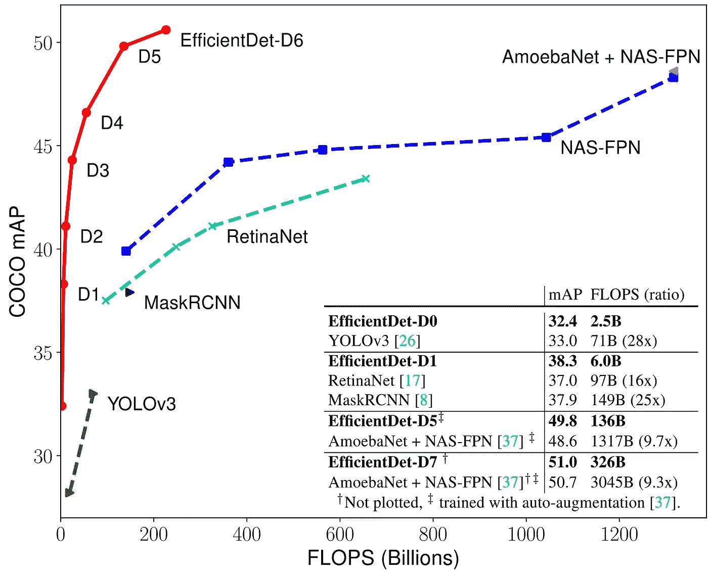
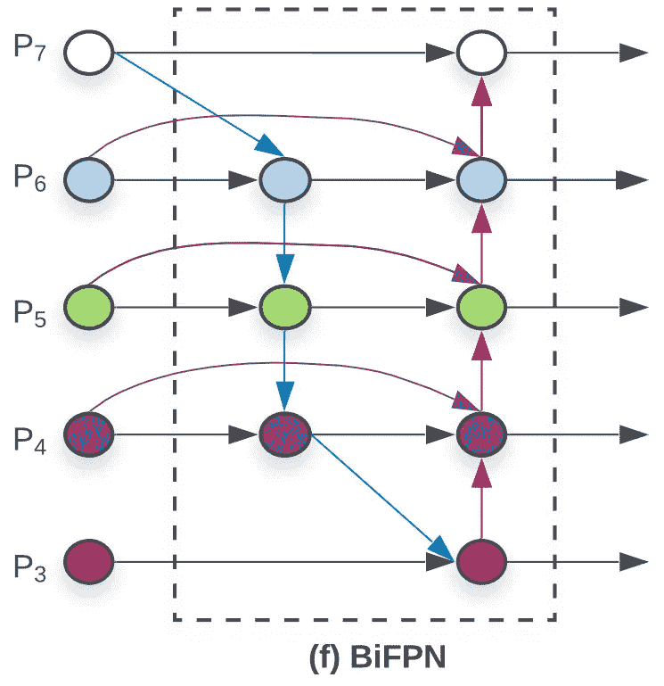
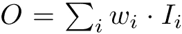
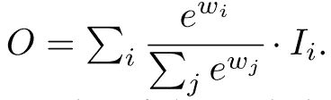
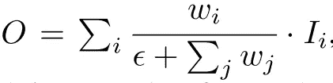
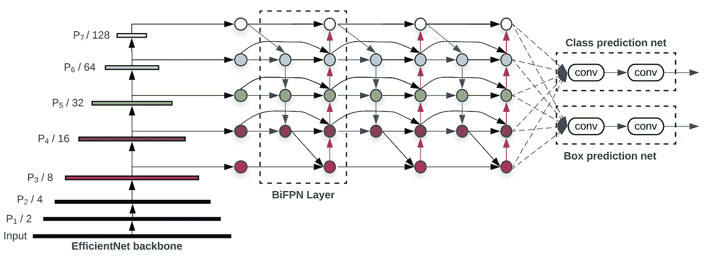

# EfficientDet:当对象检测满足可扩展性和效率时

> 原文：<https://pub.towardsai.net/efficientdet-when-object-detection-meets-scalability-and-efficiency-551e263719aa?source=collection_archive---------1----------------------->

E[efficientdet](https://arxiv.org/abs/1911.09070)，这是一个由谷歌研究团队 Brain 开发的高效且可扩展的先进对象检测模型。它不仅仅是一个单一的模型。它拥有一系列探测器，与以前的物体探测器相比，其参数和触发器数量级更少，精度更高。

EfficientDet 报纸提到了它的 7 个家族成员。

> EfficientDet 探测器[0–6]与其他 SOTA 物体探测模型的比较。

来源: [arXiv:1911.09070v1](https://arxiv.org/abs/1911.09070)

# 论文的快速概述

1.  [**EfficientNet**](https://arxiv.org/abs/1905.11946) 是模型中使用的主干架构。EfficientNet 也是由谷歌的同一批作者编写的。传统的 CNN 模型任意缩放网络尺寸- *宽度、深度和分辨率*。EfficientNet 使用一组固定的缩放系数统一缩放每个维度。它以 10 倍的效率超越了 SOTA 精确度。
2.  **BiFPN:** 而*融合*(应用[残差或跳过连接](https://arxiv.org/abs/1512.03385))不同的输入特征，大部分作品只是简单的总结，没有任何区分。由于两个输入要素的分辨率不同，因此它们对融合输出图层的贡献也不同。提出了一种加权双向特征金字塔网络(BiFPN ),该网络引入了可学习的权重来学习不同输入特征的重要性。
3.  **复合缩放:**对于更高的精度，先前的对象检测模型依赖于更大的主干或更大的输入图像尺寸。复合缩放是一种使用简单的复合系数 **φ** 来联合放大主干网络、BiFPN 网络、类/箱网络和分辨率的所有维度的方法。

> 将 EfficientNet 主干与我们提出的 BiFPN 和复合缩放相结合，我们开发了一个新的对象检测器系列，名为 EfficientDet，它始终以比以前的对象检测器少一个数量级的参数和 FLOPS 实现更好的准确性。

# BiFPN

来源: [arXiv:1911.09070v1](https://arxiv.org/abs/1911.09070) —图 2

传统的 FPN(特征金字塔网络)受到单向信息流的限制。PANet 为信息流增加了一个额外的自下而上的路径。PANet 实现了更好的准确性，但是成本和更多的参数和计算。本文针对跨规模连接提出了几种优化方案:

1.  移除只有一条输入边的结点。
    *如果一个节点只有一条输入边没有进行特征融合，那么它对旨在融合不同特征的特征网络的贡献就比较小。*
2.  如果原始输入节点和输出节点处于同一级别，则从原始输入节点到输出节点添加一条额外的边，以便在不增加太多成本的情况下融合更多功能。
3.  将每个双向(自上而下和自下而上)路径视为一个要素网络图层，并多次重复相同的图层以实现更高级别的要素融合。

# 加权特征融合

而多尺度融合，输入特征不是简单的相加。作者建议在特征融合过程中为每个输入增加额外的权重，并让网络学习每个输入特征的重要性。三种加权融合方法中—
**无界融合:**

来源:[https://arxiv.org/abs/1911.09070](https://arxiv.org/abs/1911.09070)

其中 *W* 是可学习的权重，可以是标量(每特征)、向量(每通道)或多维张量(每像素)。由于标量权重是无限的，这可能会导致训练不稳定。因此，基于 Softmax 的融合被尝试用于归一化权重。
基于 Softmax 的融合:

来源:https://arxiv.org/abs/1911.09070

因为 softmax 将权重归一化为 0 到 1 范围内的概率，这可以表示每个输入的重要性。softmax 导致 GPU 速度变慢。
**快速归一化融合:**

来源:[https://arxiv.org/abs/1911.09070](https://arxiv.org/abs/1911.09070)

添加є是为了数字的稳定性。它在 GPU 上快了 30%,给出的结果几乎和 softmax 一样准确。

> 最终的 BiFPN 集成了双向跨尺度连接和快速归一化融合。

# 高效检测架构

来源: [arXiv:1911.09070v1](https://arxiv.org/abs/1911.09070) —图 3

EfficientDet 遵循一阶段检测范式。预先训练的 EfficientNet 主干与 BiFPN 一起用作特征提取器。BiFPNN 从 EfficientNet 主干网络获取{P3、P4、P5、P6、P7}特征，并重复应用双向特征融合。
融合的特征被馈送到用于预测对象类别和包围盒的类别和包围盒网络。

 [## EfficientDet:可扩展且高效的对象检测

### 模型效率在计算机视觉中变得越来越重要。在本文中，我们系统地研究了各种模型

arxiv.org](https://arxiv.org/abs/1911.09070)  [## EfficientNet:重新思考卷积神经网络的模型缩放

### 卷积神经网络(ConvNets)通常是在固定的资源预算下开发的，然后按比例放大用于…

arxiv.org](https://arxiv.org/abs/1905.11946)  [## 用于实例分割的路径聚合网络

### 信息在神经网络中传播的方式非常重要。在本文中，我们提出了路径…

arxiv.org](https://arxiv.org/abs/1803.01534)  [## 用于图像识别的深度残差学习

### 更深层次的神经网络更难训练。我们提出了一个剩余学习框架，以减轻训练…

arxiv.org](https://arxiv.org/abs/1512.03385) 

> 希望你喜欢这篇文章。

👉[推特](https://twitter.com/aniketmaurya):[https://twitter.com/aniketmaurya](https://twitter.com/aniketmaurya)👉邮件:aniketmaurya@outlook.com