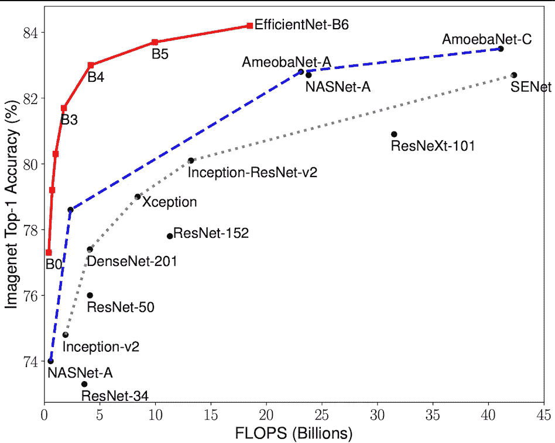
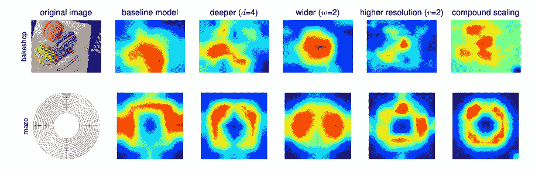
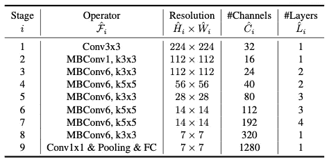
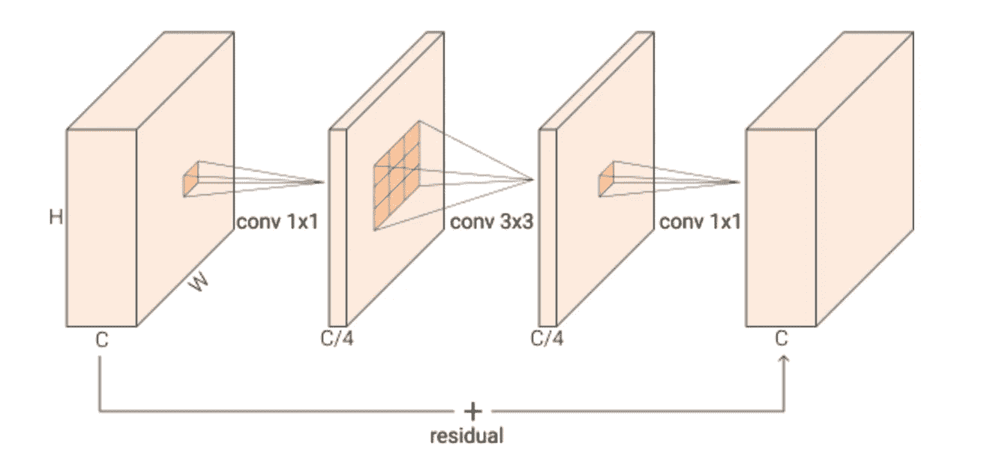
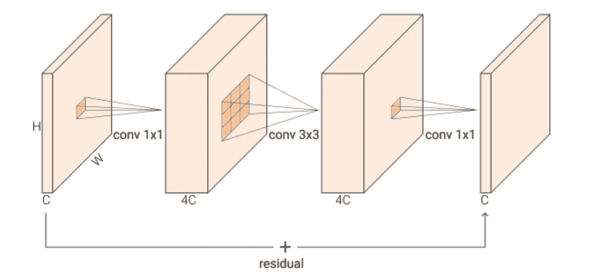
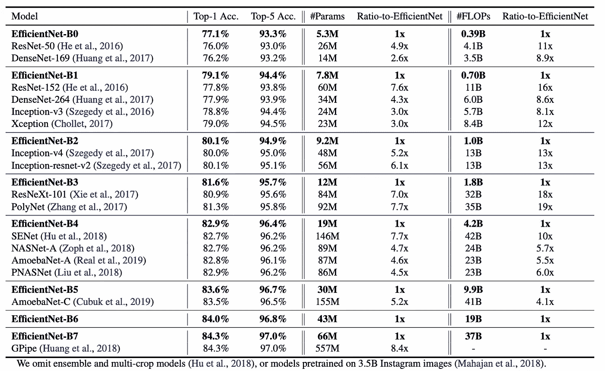

# 高效网——一个优雅、强大的 CNN。

> 原文：<https://pub.towardsai.net/efficientnet-an-elegant-powerful-cnn-6e2a8d528ae3?source=collection_archive---------2----------------------->

> 没有奇特的技术，但效果非常好。
> 
> **优于 ResNet、ResNeXt、DenseNet、InceptionNet、seNet、AmoebaNet，效率更高。**

# 📖目录

[⭐️introduction](#1a51)
[⭐intuition](#ad49)
[⭐复合缩放法](#bb2c)
∘ [⭐ MBConv 块](#06f9)
[⭐表演](#e6d9)
[实现](#b522)
[引用](#430f)

照片由 [Erol Ahmed](https://unsplash.com/@erol?utm_source=medium&utm_medium=referral) 在 [Unsplash](https://unsplash.com?utm_source=medium&utm_medium=referral) 上拍摄

# ⭐ ️Introduction

高效，通俗地说就是不用付出很高的成本就能达到很好的效果的能力。

虽然最先进的(SOTA)深度学习模型努力实现更高的性能，但同时它们的训练成本也越来越高。

然而，有时我们甚至不需要 2100M+数量的参数来达到同样的结果。我们只需要找到一种更有效率的方法。

图 1:高效网系列不仅胜过许多“大牌”CNN，而且使用的计算量也少得多。

# ⭐Intuition

在神经网络中，有几个属性:

*   **深度( *d* )** :层数(包括输出但不包括输入。例如，101)。网络越深，就越有可能经历爆炸或消失的梯度，但它会更复杂，也许更具性能。
*   **宽度( *w* )** :卷积核(通道)的最高数量。正如 Zagoruyko 和 Komodakis 所指出的，“更宽的网络往往能够捕捉到更细粒度的特征，也更容易训练。”然而，太宽和太浅的模型将难以捕捉更高级的特征(例如，1024)。
*   **分辨率( *r* ):** 输入图像的尺寸(图像高度*图像宽度。例如 256×256)。分辨率越高，CNN 就越有可能捕获精细的模式，但是对于非常高的分辨率(例如，560×560)，精度增益会降低。

在 2020 年，Tan 等人发现，现有的网络架构，如 ResNet，通常是先发展其基线，然后通过简单地增加**深度**(层数)来**扩大**，如从 ResNet-18 到 ResNet-200。其他网络可能会随机扩大其他属性。

然而，EfficientNet 的作者指出这是错误的。具体来说，**这种任意缩放需要繁琐的手动调整，并经常导致次优效率。**

**❗️Also，放大任何属性(宽度、深度、分辨率)都会提高精度，但对于更大的模型，精度增益会降低。**

作者发现，在这些网络的属性之间有一种固定的关系(将在中详细阐述),并且有一种更有效的方式来扩展网络，因此人们不太担心使用笨重的模型，而是担心糟糕的性能。

方法是**复合缩放法。**

图 2:复合缩放方法(e)与其他方法的比较

# ⭐ **复合缩放法**

不同的网络属性相互依赖。例如，当增加模型的分辨率(输入尺寸)时，**深度**和**宽度**也应增加，以利用图片中的更多信息(更大的感受野)并捕捉具有更多像素的更精细的图案。

然而，**其他属性应该如何响应一个属性的改变而改变呢？**

没有什么比看一些数学更直接的了。别担心。我会确保你读的是简明英语。

让我们假设:

*   **深度= *d*** *^ϕ*
*   **宽度** = ***宽度*** *^ϕ*
*   **分辨率= *r^*** *ϕ*

**d、w、r** 为常量，在固定 *ϕ=1、*的同时，通过进行**随机网格搜索**对其进行优化，并约束如下

*   *d * w * r ≈ 2*
*   **≥1，****w****≥1，****r****≥1**

> ***🔥所以现在，为了扩大规模，你只需要改变ϕ的值。您不再需要同时调整深度、宽度和分辨率等属性。🔥***

*他们设计了这个等式，使得对于任何值的 *ϕ，*总的 **FLOPS** ( *每秒浮点运算，这里测量训练的速度*)将大约增加 2^ *ϕ.**

*图 3 示出了通过改变模型的不同属性，模型的注意力显著改变，但是只有复合缩放示出了模型具有“最正确”的注意力。*

**

*图 3:模型的注意力可视化使用 GradCAM 对不同的属性变化。第 1 栏:原始投入。第 3–5 列:更改三种不同的属性。第六栏:作者使用方法的注意事项。如图所示，新网络更有效，因为注意力比其他方法的注意力更“正确”。*

*已知 **d，w，**和 **r** ， **EfficientNet-B0** 被提出。*

**

*图 4: EfficientNet-B0 架构总结。MBConv[N]表示扩展因子为 N 的 MBConv(即初始 1 X 1 卷积接收 c 个通道，返回 n*c 个通道)[4]*

***MBConv** 是具有深度方向可分离卷积的反向残差瓶颈块。我先详细解释一下这个。*

## *⭐ **MBConv 模块***

*传统上，3×3 卷积运算只是简单地对具有深度 D1 的输入运行(3，3)大小的核，并产生具有深度 D2 的输出。*

*然而，对于正常的剩余瓶颈块，输入的深度首先通过 1x1 卷积来减小。然后，将 3×3 卷积应用于深度减小的输入。最后，通过 1x1 卷积重新扩展深度。图 4 中示出了图解说明。*

*这种奇特的操作被称为**深度方向可分离卷积**。事实上，它将简单的 3×3 卷积分解为 1×1 压缩、3×3 压缩和 1×1 扩展过程。*

*然后，将初始和结束特征图添加到网络中，可以学习更多样的特征。*

*这种奇特的操作使用的参数少得多，计算效率也更高。*

**

*图 MobileNet 论文中的残余瓶颈。*

*对于反转的残差块，深度改变方案是“反转的”，如图 6 所示。于是，从**宽→窄→宽**到**窄→宽→窄**。*

**

*图 6:来自 MobileNetV2 纸的倒置剩余块。*

***反转版本被证明工作得更好，内存效率更高**，因为它现在可以移除窄层中的非线性，从而具有更好的表示能力(*我知道这听起来很难理解原因，所以如果你不理解，也不用担心*)。*

# *⭐表演*

*B7 的 EfficientNet B0 实现了卓越的性能。*

*图 7 显示了与其他型号相比，高效网-B0 至高效网-B7 的详细性能数据。正如你所看到的，EfficientNet 同时实现了速度和性能。这就是它“高效”的原因*

**

*图 8*

***然而，EfficientNet 走得更远。接下来我们要说的是**[**efficient net v2**](https://arxiv.org/abs/2104.00298)**，这个更厉害。***

***谢谢！❤️
我们可以恳求你考虑给我们一些掌声吗！❤️***

# *履行*

*[tensor flow 中的官方 EfficientNet 实施](https://github.com/keras-team/keras/blob/v2.9.0/keras/applications/efficientnet.py#L564-L587)*

# *参考*

*[1] [EfficientNet:反思卷积神经网络的模型缩放](https://arxiv.org/abs/1905.11946?context=stat.ML)
【2】[mobilenetv 2:反向残差和线性瓶颈](https://arxiv.org/pdf/1801.04381.pdf)
【3】[MobileNets:用于移动视觉应用的高效卷积神经网络](https://arxiv.org/pdf/1704.04861.pdf)
【4】[https://python . plain English . io/implementing-efficent net-in-py torch-part-3-MB conv-squeeze-and-excitation-and-more-4c a9 FD 62d 32](https://python.plainenglish.io/implementing-efficientnet-in-pytorch-part-3-mbconv-squeeze-and-excitation-and-more-4ca9fd62d302)*

* [## Mlearning.ai 提交建议

### 如何成为 Mlearning.ai 上的作家

medium.com](https://medium.com/mlearning-ai/mlearning-ai-submission-suggestions-b51e2b130bfb)*