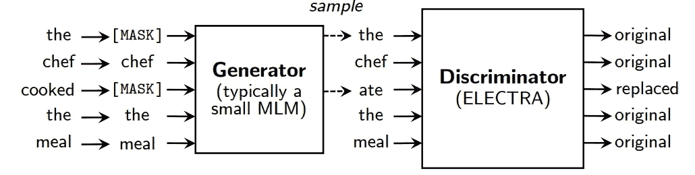
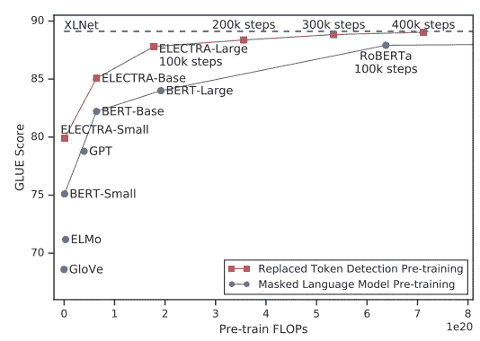
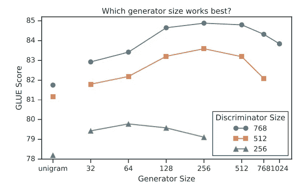
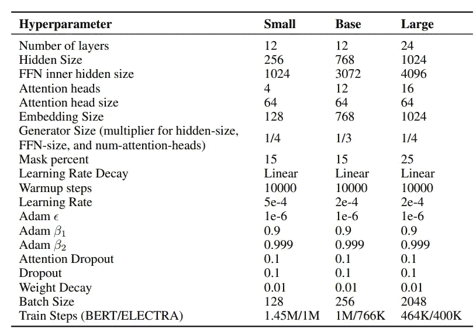

# ELECTRA:预训练文本编码器作为鉴别器而不是生成器

> 原文：<https://pub.towardsai.net/electra-pre-training-text-encoders-as-discriminators-rather-than-generators-c5661f7ea0d5?source=collection_archive---------0----------------------->

## [自然语言处理](https://towardsai.net/p/category/nlp)

## 伊莱克特拉和伯特有什么区别？

[马志威](https://unsplash.com/@makcedward?utm_source=medium&utm_medium=referral)在 [Unsplash](https://unsplash.com/?utm_source=medium&utm_medium=referral) 上拍照

[BERT](https://towardsdatascience.com/how-bert-leverage-attention-mechanism-and-transformer-to-learn-word-contextual-relations-5bbee1b6dbdb) (Devlin et al .，2018)是最近 NLP 任务的基线。基于 BERT 架构发布的新模型有 [RoBERTA](https://medium.com/towards-artificial-intelligence/a-robustly-optimized-bert-pretraining-approach-f6b6e537e6a6) (刘等 2019)[ALBERT](https://medium.com/towards-artificial-intelligence/a-lite-bert-for-reducing-inference-time-bed8d990daac)(兰等 2019)。Clark 等人发布了 ELECTRA (Clark 等人，2020)，其目标是在保持高质量性能的同时减少计算时间和资源。诀窍是引入用于掩蔽语言模型(MLM)预测的生成器，并将生成器结果转发给鉴别器

。MLM 是 BERT 中的培训目标之一(Devlin et al .，2018)。然而，由于训练阶段和微调阶段之间的错位，它受到了批评。简而言之，MLM 面具令牌由[面具]和模型将预测现实世界，以学习单词的代表性。另一方面，ELECTRA (Clark et al .，2020)包含两个模型，即生成器和鉴别器。屏蔽的令牌将被发送到发生器，并为鉴别器生成替代输入(即 ELECTRA 模型)。在训练阶段之后，生成器将被丢弃，而我们只保留鉴别器用于微调和推理。

Clark 等人将这种方法命名为**替代令牌检测**。在下面的章节中，我们将介绍 ELECTRA (Clark et al .，2020)是如何工作的。

# 输入数据

ELECTRA 培训流程概述(Clark 等人，2020 年)

如前所述，有 2 个模型处于培训阶段。不是将屏蔽令牌(例如[MASK])馈送给目标模型(即鉴别器/ ELECTRA)，而是训练小 MLM 来预测屏蔽令牌。不包括任何屏蔽令牌的发生器的输出成为鉴别器的输入。

生成器有可能预测到相同的令牌(即上图中的“the”)。它将继续跟踪以生成鉴别器的真实标签。以上图为例，只有“ate”会被标记为“replaced”，而其余的(包括“the”)都是“original”标签。

你可以想象生成器是一个小型的屏蔽语言模型(例如 BERT)。生成器的目标是为鉴别器和学习单词表示(也称为令牌嵌入)生成训练数据。实际上，生成器的想法类似于在 [nlpaug](https://github.com/makcedward/nlpaug) 中 NLP 的数据扩充方法。

# 模型设置

为了提高预训练的效率，Clark 等人发现在生成器和鉴别器之间共享权重可能不是一个好方法。事实上，它们只在两个模型之间共享令牌和位置嵌入。下图显示了替换标记检测方法优于屏蔽语言模型。

替换标记检测和屏蔽语言模型之间的性能比较(Clark et al .，2020)

其次，较小尺寸的发生器提供了更好的结果。小尺寸的发生器不仅导致更好的结果，而且减少了总的训练时间。

不同发电机尺寸和鉴别器尺寸的性能(Clark 等人，2020 年)

# 调谐超参数

克拉克等人在微调超参数方面做了很多。它包括模型的隐藏大小、学习速率和批量大小。以下是不同尺寸的 ELECTRA 模型的最佳超参数。

预训练超参数(克拉克等人，2020 年)

# 拿走

*   *生成对抗网络(GAN)* :这种方法类似于生成虚假数据来欺骗或攻击模型的 GAN(要了解对抗攻击的更多信息，您可以查看这里的和这里的)。然而，发电机从培训 ELECTRA 是不同的。首先，由生成器生成的正确令牌被认为是“真实的”而不是“伪造的”。此外，生成器被训练为最大似然，而不是欺骗鉴别器。
*   在生产中采用 BERT 的主要挑战是资源分配。1 G 内存几乎是生产中 BERT 机型的最低要求。可以预见，有越来越多的新的 NLP 模型专注于减少模型的规模和推理时间。

# 关于我

我是湾区的数据科学家。专注于数据科学、人工智能，尤其是 NLP 和平台相关领域的最新工作。欢迎在 [LinkedIn](https://www.linkedin.com/in/edwardma1026) 上与 [me](https://makcedward.github.io/) 联系，或者在 [Medium](http://medium.com/@makcedward/) 或 [Github](https://github.com/makcedward) 上关注我。

# 延伸阅读

*   [伯特](https://towardsdatascience.com/how-bert-leverage-attention-mechanism-and-transformer-to-learn-word-contextual-relations-5bbee1b6dbdb)、[罗伯塔](https://medium.com/towards-artificial-intelligence/a-robustly-optimized-bert-pretraining-approach-f6b6e537e6a6)和[艾伯特](https://medium.com/towards-artificial-intelligence/a-lite-bert-for-reducing-inference-time-bed8d990daac)简介
*   NLP 的数据扩充( [nlpaug](https://github.com/makcedward/nlpaug) )
*   自然语言处理中的对抗性攻击( [1](https://medium.com/hackernoon/does-your-nlp-model-able-to-prevent-adversarial-attack-45b5ab75129c) ， [2](https://medium.com/towards-artificial-intelligence/adversarial-attacks-in-textual-deep-neural-networks-245dc90029df) )

# 参考

*   J.Devlin，M. W. Chang，K. Lee 和 K. Toutanova。[伯特:语言理解深度双向转换器的预训练](https://arxiv.org/pdf/1810.04805.pdf)。2018
*   Y.刘、m .奥特、n .戈亚尔、j .杜、m .乔希、d .陈、o .利维、m .刘易斯、L. Zettlemoyer 和 V. Stoyanov。 [RoBERTa:一种稳健优化的 BERT 预训练方法](https://arxiv.org/pdf/1907.11692.pdf)。2019.
*   Z.兰、陈、古德曼、金佩尔、夏尔马和索里科特。ALBERT:一个用于自我监督语言表达学习的 Lite BERT。2019
*   K.Clark，M. Luong，Q. V. Le，C. D. Manning . [ELECTRA:将文本编码器预先训练成鉴别器而不是生成器](https://arxiv.org/pdf/2003.10555.pdf)。2020