# Python 中 Arima 模型的发电量预测

> 原文：<https://pub.towardsai.net/electricity-production-forecasting-using-arima-model-in-python-d3bf38dc3517?source=collection_archive---------1----------------------->

## [数据可视化](https://towardsai.net/p/category/data-visualization)

## 使用 Python 逐步实现 ARIMA 模型的指南。


马太·亨利摄( [Unsplash](https://unsplash.com/photos/yETqkLnhsUI)

ARIMA 是“自回归综合移动平均”的缩写，用于时间序列数据，它提供了对过去值的洞察，如滞后和预测误差，可用于预测未来值。

要了解更多关于 ARIMA 模型，请查看下面的文章:

[](https://jayashree8.medium.com/a-brief-introduction-to-arima-models-for-time-series-forecasting-3328ae5067bf) [## 时间序列预测的 ARIMA 模型简介

### 这篇文章谈论 ARIMA 模型及其背后的概念。

jayashree8.medium.com](https://jayashree8.medium.com/a-brief-introduction-to-arima-models-for-time-series-forecasting-3328ae5067bf) 

# 如何实施 ARIMA 模型来帮助预测？

涉及的步骤如下:

1.  通过绘图或可视化来分析时间序列数据。
2.  以平稳形式转换时间序列数据。
3.  绘制 ACF 和 PACF 图。
4.  构建 ARIMA 模型。
5.  使用创建的模型进行预测。

# 使用 Python 实现

**→进口包装**

像 NumPy 和 pandas 这样用于处理数据的基本包都是导入的。为了可视化，使用 matplotlib。为了实现 ARIMA 模型，引入了 statsmodel。

```
**>>> import** numpy **as** np
**>>> import** pandas **as** pd
**>>> import** statsmodels.api **as** sm
**>>> import** matplotlib.pyplot **as** plt
**>>> %**matplotlib inline
```

**→分析数据**

所使用的数据是电力生产的季节性数据。

```
>>> df **=** pd.read_csv('Electric_Production.csv')
>>> df.head()
```

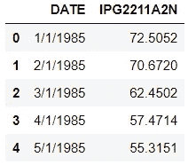

为了便于使用，更改了列名。

```
>>> df.columns **=** ['Date','Production']
>>> df.head()
```

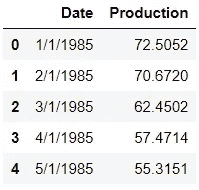

现在，为了处理时间序列数据，“日期”列被转换为日期时间索引。

```
>>> df['Date'] **=** pd.to_datetime(df['Date'])
>>> df.head()
```

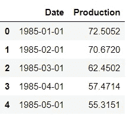

```
>>> df.set_index('Date',inplace**=True**)
>>> df.head()
```

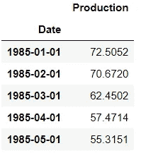

**→数据可视化**

```
>>> df.plot()
```

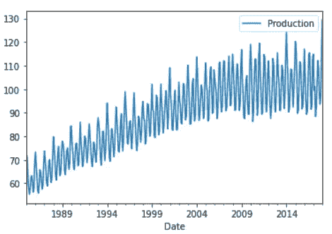

从图中可以看出，这是季节性数据，因为它有一定的季节性和上升趋势。

现在比较 12 个月的简单移动平均线和序列来确定趋势。标准偏差也绘制出来，看看是否有任何变化或没有。

```
>>> df['Production'].rolling(12).mean().plot(label**=**'12 SMA',figsize**=**(16,8))
>>> df['Production'].rolling(12).std().plot(label**=**'12 STD')
>>> df['Production'].plot()
>>> plt.legend()
```

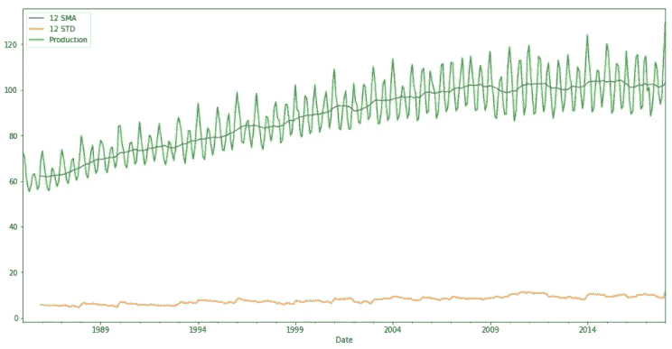

从上面的图可以看出，标准偏差变化不大，所以没有太大的差异。

**→将时间序列数据分解为其趋势、季节性和剩余成分。**

statsmodels 用于分解。

```
**>>> from** statsmodels.tsa.seasonal **import** seasonal_decompose>>> decomp **=** seasonal_decompose(df['Production'])
>>> fig **=** decomp.plot()
>>> fig.set_size_inches(14,7)
```

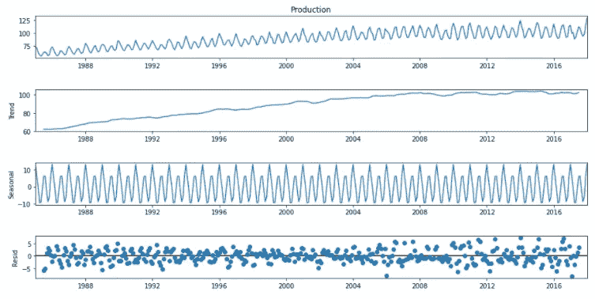

趋势误差、季节性误差和残差可以在这里单独看到。

**→将数据转换为静态形式**

首先使用 Dickey-Fuller 测试对数据进行测试，以检查数据是否处于稳定形式，然后改变其形式。

Dickey-Fuller 的零假设是存在单位根，并且它是非平稳时间序列。另一个假设是没有单位根，数列是平稳的。

我们将借助参数“p”进行测试。如果 p 很小(p<=0.05)，我们拒绝零假设，否则不拒绝零假设。

从 statsmodels 包中，导入了增强的 dickey-fuller 测试函数。它返回一个由以下值组成的元组:adf、pvalue、usedlag、nobs、critical values、icbest 和 resstore。

```
**>>> from** statsmodels.tsa.stattools **import** adfuller
```

然后在数据集的生产列上调用该函数。

```
>>> fuller_test **=** adfuller(df['Production'])
>>> fuller_test(-2.256990350047239,
 0.18621469116586975,
 15,
 381,
 {'1%': -3.4476305904172904,
  '5%': -2.869155980820355,
  '10%': -2.570827146203181},
 1840.8474501627156)
```

现在 p 值被打印出来，使用 p 值可以确定数据是否是稳定的。

```
**>>> def** test_p_value(data):
        fuller_test **=** adfuller(data)
        print('P-value: ',fuller_test[1])
        **if** fuller_test[1] **<=** 0.05:
            print('Reject null hypothesis, data is stationary')
        **else**:
            print('Do not reject null hypothesis, data is not stationary')>>> test_p_value(df['Production'])P-value:  0.18621469116586975
Do not reject null hypothesis, data is not stationary
```

由于数据不是静态的，所以要进行差分。区别在于时间序列从一个时期到下一个时期的变化。计算第一差值、第二差值和季节差值，并检查每个差值的 p 值。

```
df['First_diff'] **=** df['Production'] **-** df['Production'].shift(1)
df['First_diff'].plot()
```

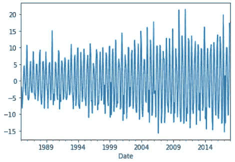

```
>>> test_p_value(df['First_diff'].dropna())P-value:  4.0777865655398996e-10
Reject null hypothesis, data is stationary
```

在第一个差异中，我们得到了稳态形式的数据。如果需要第二个差异，那么将会完成以下操作。

```
>>> df['Second_diff'] **=** df['First_diff'] **-** df['First_diff'].shift(1)
>>> df['Second_diff'].plot()
```

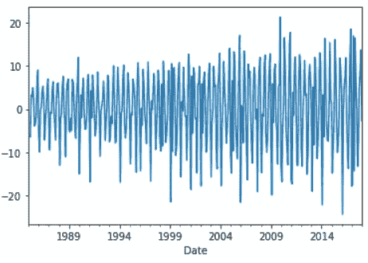

```
>>> test_p_value(df['Second_diff'].dropna())P-value:  4.1836937480000375e-17
Reject null hypothesis, data is stationary
```

季节差异也可以采取如下方式。这种转变将会持续整整 12 个赛季。

```
>>> df['Seasonal_diff'] **=** df['Production'] **-** df['Production'].shift(12)
>>> df['Seasonal_diff'].plot()
```

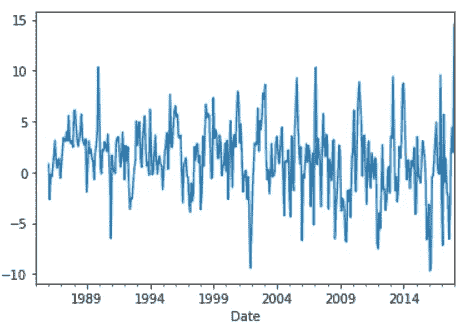

```
>>> test_p_value(df['Seasonal_diff'].dropna())P-value:  8.812644938089026e-07
Reject null hypothesis, data is stationary
```

**→绘制 ACF 和 PACF 图**

从 statsmodels 包中导入 ACF 和 PACF 绘图函数。

```
**>>> from** statsmodels.graphics.tsaplots **import** plot_acf, plot_pacf>>> first_diff **=** plot_acf(df['First_diff'].dropna())
```

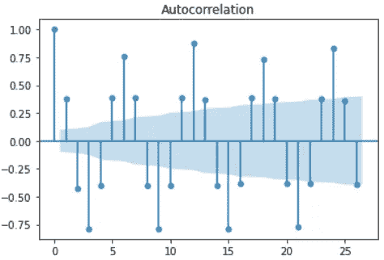

```
>>> sec_diff **=** plot_pacf(df['Second_diff'].dropna())
```

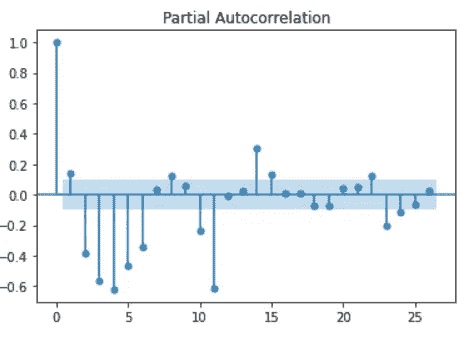

现在将绘制最终的 ACF 和 PACF 图，这些图将被进一步使用。

```
>>> p1 **=** plot_acf(df['Seasonal_diff'].dropna())
>>> p2 **=** plot_pacf(df['Seasonal_diff'].dropna())
```

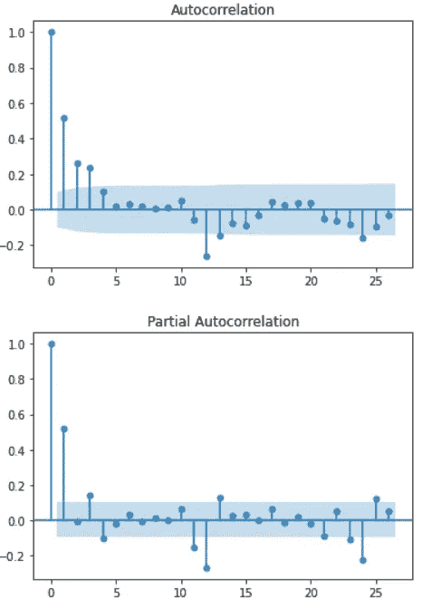

**→构建 ARIMA 模型**

对于非季节性数据，可以从 statsmodels 模块导入 ARIMA 模型。

```
**>>> from** statsmodels.tsa.arima_model **import** ARIMA
```

对于季节性数据，可以从 statsmodels 模块导入季节性 ARIMA 模型。这里使用的数据是季节性数据，因此引入了季节性 ARIMA 模型。传递的参数是生产列、订单和季节性订单。

order:AR 参数、差异和 MA 参数的数量的模型的(p，d，q)阶。

季节性顺序:AR 参数、差异、MA 参数和周期的模型季节性组件的(P，D，Q，s)顺序。

```
>>> model **=** sm.tsa.statespace.SARIMAX(df['Production'],order**=**(0,1,0),seasonal_order**=**(1,1,1,12))
```

一旦创建了模型，接下来要做的就是拟合模型。

```
>>> results **=** model.fit()
>>> results.summary()
```

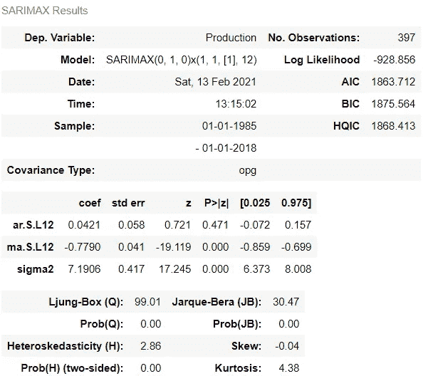

要了解残差值或误差，可以对结果调用“resid”方法。

```
>>> results.residDate
1985-01-01    72.505200
1985-02-01    -1.833200
1985-03-01    -8.221800
1985-04-01    -4.978800
1985-05-01    -2.156300
                ...    
2017-09-01     0.529985
2017-10-01     4.057874
2017-11-01     0.690663
2017-12-01     2.477697
2018-01-01     6.953533
Length: 397, dtype: float64
```

可以创建剩余点的绘图。

```
>>> results.resid.plot()
```

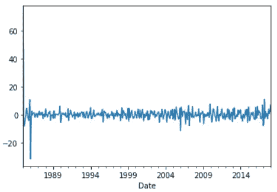

通过绘制 KDE 可以看出误差的分布。从下图可以看出，误差分布在 0 附近，这很好。

```
>>> results.resid.plot(kind**=**'kde')
```

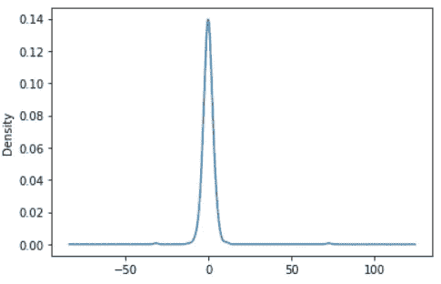

**→预测或预报**

通过预测这些值，可以确定模型的性能。首先，我们可以看看它如何预测现在的数据，然后再预测未来的数据。

```
>>> df['prediction'] **=** results.predict()
>>> df[['Production','prediction']].plot(figsize**=**(12,8))
```


从上图可以看出，该模型在预测当前数据方面做得很好。现在，为了预测未来，我们可以向数据集中添加更多具有空值的月份，并对其进行预测。这可以通过熊猫来实现。获取最后一个索引，即最后一个日期，并向其添加一个月偏移量，从 1 开始一直到 24。

```
**>>> from** pandas.tseries.offsets **import** DateOffset
>>> extra_dates **=** [df.index[**-**1] **+** DateOffset(months**=**m) **for** m **in** range (1,24)]>>> extra_dates
[Timestamp('2018-02-01 00:00:00'),
 Timestamp('2018-03-01 00:00:00'),
 Timestamp('2018-04-01 00:00:00'),
 Timestamp('2018-05-01 00:00:00'),
 Timestamp('2018-06-01 00:00:00'),
 Timestamp('2018-07-01 00:00:00'),
 Timestamp('2018-08-01 00:00:00'),
 Timestamp('2018-09-01 00:00:00'),
 Timestamp('2018-10-01 00:00:00'),
 Timestamp('2018-11-01 00:00:00'),
 Timestamp('2018-12-01 00:00:00'),
 Timestamp('2019-01-01 00:00:00'),
 Timestamp('2019-02-01 00:00:00'),
 Timestamp('2019-03-01 00:00:00'),
 Timestamp('2019-04-01 00:00:00'),
 Timestamp('2019-05-01 00:00:00'),
 Timestamp('2019-06-01 00:00:00'),
 Timestamp('2019-07-01 00:00:00'),
 Timestamp('2019-08-01 00:00:00'),
 Timestamp('2019-09-01 00:00:00'),
 Timestamp('2019-10-01 00:00:00'),
 Timestamp('2019-11-01 00:00:00'),
 Timestamp('2019-12-01 00:00:00')]
```

现在创建另一个数据帧，将这些额外的未来日期值作为索引，其余的列值为 null。

```
>>> forecast_df **=** pd.DataFrame(index**=**extra_dates,columns**=**df.columns)
>>> forecast_df.head()
```

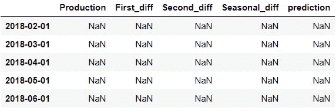

现在，原始数据帧和预测数据帧被连接成一个用于预测的数据帧。

```
>>> final_df **=** pd.concat([df,forecast_df])
```

现在，我们可以通过在调用“预测”函数时提及开始和结束参数来预测结束数据点的值。

```
>>> final_df['prediction'] **=** results.predict(start**=**396, end**=**430)
>>> final_df[['Production','prediction']].plot(figsize**=**(12,8))
```


对于未来值，可以清楚地看到预测线。

# 结论

ARIMA 模型被成功地用于预测发电量的未来值，这是一个具有非平稳行为的季节性数据集。使用适当的步骤，将数据转换为平稳形式，并建立预测模型。

> 此处参考笔记本和数据集[。](https://github.com/jayashree8/Finance_Trading_In_Python/tree/main/ARIMA)

> 联系我: [LinkedIn](https://www.linkedin.com/in/jayashree-domala8/)
> 
> 看看我的其他作品: [GitHub](https://github.com/jayashree8)