# ELO 商户类别推荐

> 原文：<https://pub.towardsai.net/elo-merchant-category-recommendation-6c15049f76d5?source=collection_archive---------2----------------------->

## [机器学习](https://towardsai.net/p/category/machine-learning)


由[粘土银行](https://unsplash.com/@claybanks?utm_source=unsplash&utm_medium=referral&utm_content=creditCopyText)在 [Unsplash](https://unsplash.com/s/photos/credit-card?utm_source=unsplash&utm_medium=referral&utm_content=creditCopyText) 上拍摄

# 概观

巴西最大的支付品牌之一 Elo 与商家建立了合作关系，为持卡人提供促销或折扣。Elo 建立了机器学习模型，以了解客户生命周期中最重要的方面和偏好，从食品到购物。但到目前为止，没有一个是专门为个人或个人资料定制的。因此，Elo 有了一个新的目标，那就是建立一个提供个性化推荐的模型。该模式旨在改善客户的生活，帮助 Elo 减少不必要的活动，为客户创造正确的体验。

# 商业问题

该项目旨在建立一个机器学习模型，通过预测每个支付卡 id 的忠诚度得分来揭示客户忠诚度指标，从而识别和提供与个人最相关的机会。对应于每个卡 id 的忠诚度得分是类别标签，其值使用实数表示。由于它更像是一个回归问题，因此用于评估模型性能的度量是均方根误差(RMSE)。数据集包括卡细节、商户细节、旧交易和新交易细节。关键特征是对应的卡 id，我们必须预测忠诚度得分。卡详细信息由卡 id 和卡的其他详细信息组成。商家详细信息由关于商家的附加信息组成。旧交易和新交易包括每个卡 id 3 个月和 2 个月的交易。市场上已经存在一些解决方案，但是没有一个是针对个人简档偏好定制的。该项目致力于向持卡人提供与产品折扣相关的个性化建议，以增强客户体验。推荐是基于顾客从食物到购物的个人喜好。

# 问题陈述:机器学习的视角

## 第 1 部分:作为一个回归问题

这个项目背后的想法非常简单。给定卡的详细信息、一系列关于卡的交易详细信息以及一些与交易相关的商家详细信息，我们需要找到一个忠诚度得分。这个忠诚度得分是一个实数，因此是一个回归问题。

**性能指标:**

根据均方根误差对提交的内容进行评分。RMSE 被定义为:

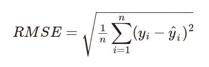

其中，ŷ是每个 card_id 的预测忠诚度得分，y 是分配给 card_id 的实际忠诚度得分。

## 第 2 部分:作为一个分类问题

作为下一步，这个问题也可以作为一个分类任务。给定相似的数据集，现在的目标是对客户是否忠诚进行分类。目标类是二进制的，因此是一个分类问题。

# 数据来源

本案例研究中使用的所有数据集均来自 Kaggle 竞赛。完整的数据集可以从 [Kaggle](https://www.kaggle.com/c/elo-merchant-category-recommendation/data) 中找到。使用的每个数据集的基本描述如下。

## **文件描述:**

*   **train.csv** —训练集。
*   **test.csv** —测试集。
*   **sample _ submission . CSV**——一个格式正确的样本提交文件——包含所有您期望预测的 card _ ids。
*   **historical _ transactions . CSV**—每个 card_id 最多 3 个月的历史交易。
*   **merchants.csv** —数据集中所有商家/merchant _ id 的附加信息。
*   **new _ merchant _ transactions . CSV**—每个 card_id 的两个月的数据，包含 card_id 在 merchant _ ids 购买的所有商品，这些商品在历史数据中没有被访问过。

数据集 train.csv 和 test.csv 文件包含我们将用于训练和预测的 card _ ids。训练和测试数据集分别被重命名为 card_details_train 和 card_details_test。

## **数据集 1: card_details_train**

```
**FEATURES**             | **DESCRIPTIONS**---------------------|--------------------------------------------
- card_id            | Unique card identifier
- first_active_month | ‘YYYY-MM’, month of first purchase
- feature_1          | Anonymized card categorical feature
- feature_2          | Anonymized card categorical feature
- feature_3          | Anonymized card categorical feature
- target             | Loyalty numerical score calculated 2 months   after historical and evaluation period
```

## **数据集 2: card_details_test**

```
**FEATURES**             | **DESCRIPTIONS**
---------------------|------------------------------------
- card_id            | Unique card identifier
- first_active_month | 'YYYY-MM', month of first purchase
- feature_1          | Anonymized card categorical feature
- feature_2          | Anonymized card categorical feature
- feature_3          | Anonymized card categorical feature
```

数据集 merchants.csv 包含数据集中表示的每个 merchant_id 的聚合信息。该商家的数据集被重命名为 merchant_details。

## **数据集 3:商家 _ 详情**

```
**FEATURES **                     | **DESCRIPTIONS**
------------------------------|------------------------------------- - merchant_id                 | Unique merchant identifier
- merchant_group_id           | Merchant group (anonymized )
- merchant_category_id        | Unique identifier for merchant category(anonymized )
- subsector_id                | Merchant category group(anonymized )
- numerical_1                 | anonymized measure
- numerical_2                 | anonymized measure
- category_1                  | anonymized category
- category_2                  | anonymized category
- category_4                  | anonymized category
- city_id                     | City identifier (anonymized )
- state_id                    | State identifier (anonymized )
- most_recent_sales_range     | Range of revenue (monetary units) in last active month --> A > B > C > D > E
- most_recent_purchases_range | Range of quantity of transactions in last active month --> A > B > C > D > E
- avg_sales_lag3              | Monthly average of revenue in last 3 months divided by revenue in last active month
- avg_purchases_lag3          | Monthly average of transactions in last 3 months divided by transactions in last active month
- active_months_lag3          | Quantity of active months within last 3 months
- avg_sales_lag6              | Monthly average of revenue in last 6 months divided by revenue in last active month
- avg_purchases_lag6          | Monthly average of transactions in last 6 months divided by transactions in last active month
- active_months_lag6          | Quantity of active months within last 6 months
- avg_sales_lag12             | Monthly average of revenue in last 12 months divided by revenue in last active month
- avg_purchases_lag12         | Monthly average of transactions in last 12 months divided by transactions in last active month
- active_months_lag12         | Quantity of active months within last 12 months
```

historical_transactions.csv 和 new_merchant_transactions.csv 文件包含每张卡的交易信息。historical_transactions.csv 包含任何所提供的 merchant _ ids 的每张卡最多 3 个月的交易。数据集 new_merchant_transactions.csv 包含两个月内新商户(此特定 card_id 尚未访问的 merchant _ ids)的交易。historical_transactions 和 new_merchant_transactions 分别被重命名为 old_transactions 和 new_transactions。

## **数据集 4:旧交易&数据集 5:新交易**

```
**FEATURES  **             | **DESCRIPTIONS**
-----------------------|-------------------------------------------
- card_id              | Card identifier
- merchant_id          | Merchant identifier (anonymized)
- merchant_category_id | Merchant category identifier (anonymized )
- subsector_id         | Merchant category group identifier (anonymized )
- category_1           | anonymized category
- category_2           | anonymized category
- category_3           | anonymized category
- city_id              | City identifier (anonymized )
- state_id             | State identifier (anonymized )
- month_lag            | month lag to reference date
- authorized_flag      | Y' if approved, 'N' if denied
- installments         | number of installments of purchase
- purchase_amount      | Normalized purchase amount
- purchase_date        | Purchase date
```

# 探索性数据分析

在统计学中，探索性数据分析是一种分析数据集以总结其主要特征的方法，通常使用统计图形和其他数据可视化方法。

## **数据集 1:卡片 _ 详细信息 _ 列车** & **数据集 2:卡片 _ 详细信息 _ 测试**

## **1。目标**


忠诚度得分分布(按作者分类的图片)

## **观察结果:**

*   列车组中的大多数' *card_id* '的' *target* '值在-10 和 10 之间，大多数值为 0。
*   card_id 总数的**199605(98.85%)**左右有这样一个目标值。
*   数据集的一小部分还包含小于-30 的目标值，这样的点可以被认为是异常值。
*   在' *card_id* '总数的**2207(1.09%)**左右有这样一个目标值。

## **2。活跃年份**

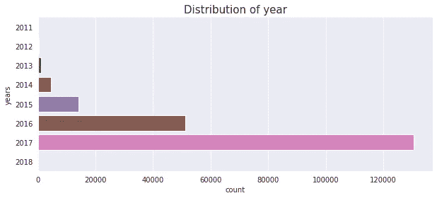

card_details_train 中的年份分布(图片由作者提供)

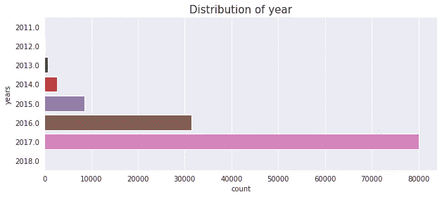

card_details_test 中的年份分布(图片由作者提供)

## **意见:**

*   训练集和测试集中的年分布几乎相同。
*   该数据集包含从 2011 年 11 月 1 日到 2018 年 2 月 1 日的记录。
*   很大一部分交易发生在 2017 年，其次是 2016 年和 2015 年。
*   2011 年和 2018 年几乎没有交易发生。

## **3。特点**

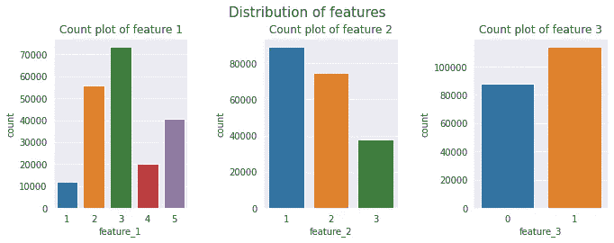

card_details_train 中的特征分布(图片由作者提供)

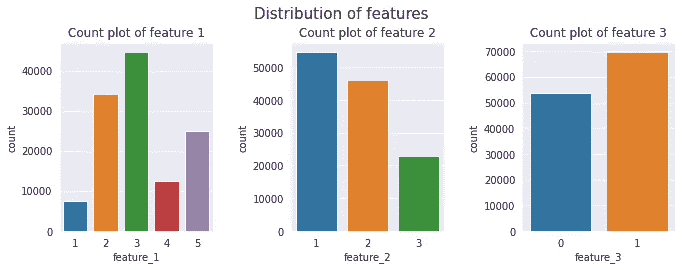

card_details_test 中的特征分布(图片由作者提供)

## **观察结果:**

*   训练集和测试集中的分类特征在每个类别中也具有相似的分布。
*   对于' *feature_1* '，该值介于 1 到 5 之间，其中值 3 具有最大计数。
*   对于' *feature_2* '，该值介于 1 到 3 之间，其中值 1 具有最大计数。
*   对于'*feature _ 3*'，该值介于 0 和 1 之间，其中值 1 具有最大计数。

## **4。单个特征如何影响目标**

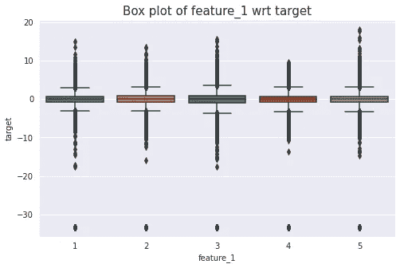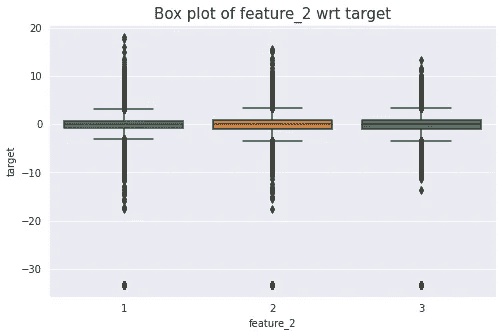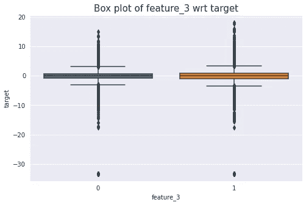

单特征 wrt 目标在 card_details_train 中的分布(图片由作者提供)

## **观察结果:**

*   ' *feature_1* '、 *feature_2* '、 *feature_3* 、【wrt】、 *target* 的分布对于所有分类值来说看起来几乎是相似的。

## **5。多重特征如何影响目标**

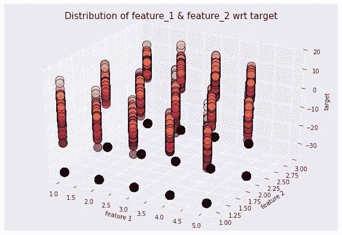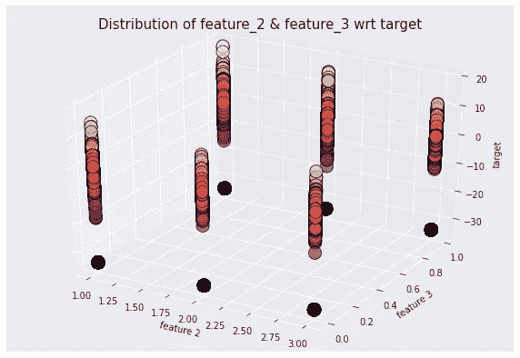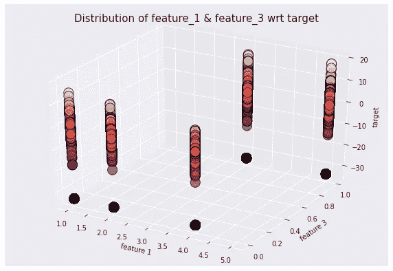

card_details_train 中多个特征 wrt 目标的分布(图片由作者提供)

## **观察结果:**

*   在' *feature_1* 和' *feature_2* 以及' *target* '之间没有太多明显的区别。
*   在' *feature_2* '和' *feature_3* '以及' *target* '之间可以描绘出稍微好一点的分离。
*   在'*特征 _1* '和'*特征 _3* '以及'*目标*'之间可以描绘出更好的分离。

## **6。first_active_month 如何影响卡的数量**

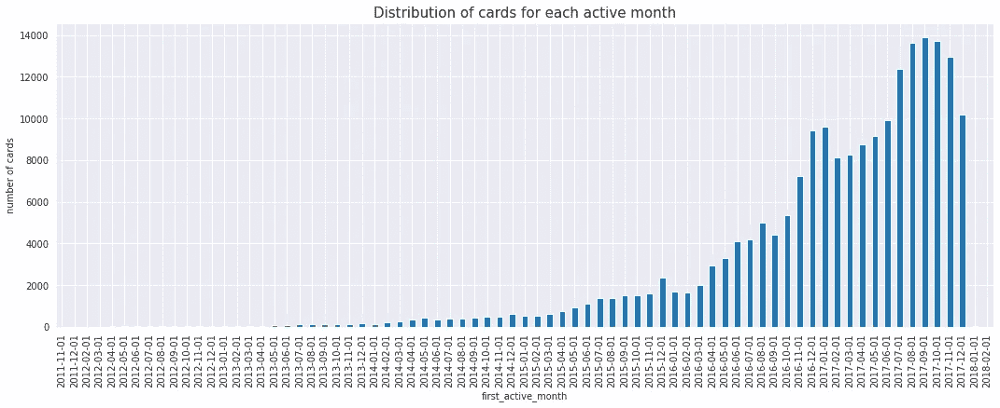

card_details_train 中第一个 _active_month wrt 卡数的分布(图片由作者提供)

## **观察结果:**

*   发行的信用卡数量逐年增加。
*   大量的交易发生在过去的几年里。
*   大部分信用卡在 2017 年 7 月至 2017 年 11 月期间有效。

## **数据集 3: merchant_details**

## **1。最新销售范围**

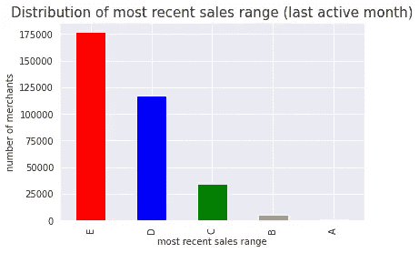

最新销售系列(图片由作者提供)

## **2。最近购买范围**

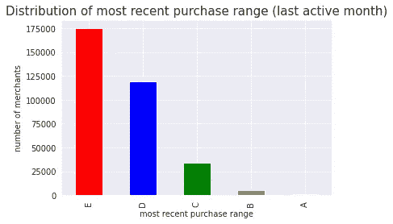

最近的购买范围(图片由作者提供)

## **观察结果:**

*   E 类的' *recent_sales_range* '(最后一个活跃月)是最大的范围，商户数为 177104。
*   E 类的' *recent_purchase_range* '(最后一个活跃月)范围最大，商户数为 175309。

## **数据集 4:旧事务**

## **1。分期付款**

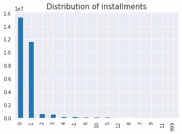

分期付款的分布(作者图片)

## **2。第 1 类**

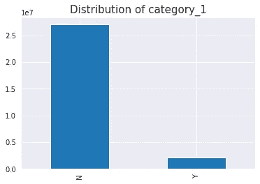

类别 1 的分布(按作者分类的图片)

## **3。类别 2**

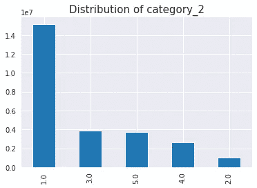

类别 2 的分布(按作者分类的图片)

## **4。类别 3**

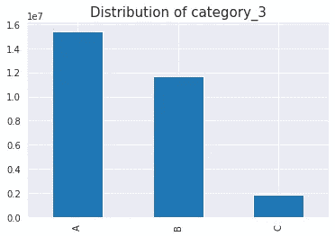

类别 3 的分布(按作者分类的图片)

## **数据集 5:新交易**

## **1。分期付款**

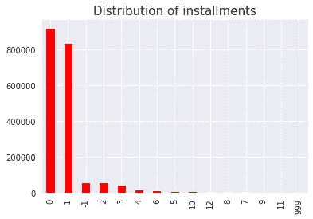

分期付款的分布(作者图片)

## **2。类别 1**

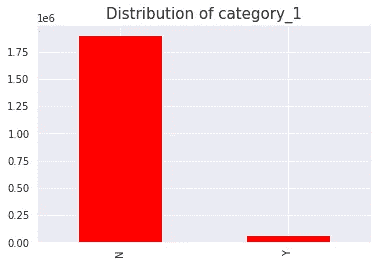

类别 1 的分布(按作者分类的图片)

## **3。类别 2**


类别 2 的分布(按作者分类的图片)

## **4。类别 3**

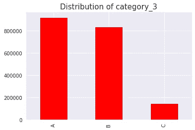

类别 3 的分布(按作者分类的图片)

## **观察结果:**

*   在分期付款功能中，有一些不常见的值-1 和 999 以及前导值 0 和 1。
*   历史交易和新交易都有类别 1、类别 2 和类别 3，它们具有相似的分布。

# 预处理

数据预处理是建立任何基于机器学习的模型的基本步骤。它通过消除冗余、不必要的数据，帮助我们将原始数据转换成可读的格式。这样的数据只能应用于建立任何模型。还通过应用某些数据清理步骤对可用数据进行预处理。这些步骤包括:

*   查找重复行。
*   寻找每个特征的无限值的数量。
*   查找每个要素的缺失值。
*   使用最大计数值的缺失值插补。
*   用 nan 值替换 inf 和-inf 值-存在具有无限值的列，这些值需要用 nan 值替换，然后所有缺失值(nan)都要用各自要素的最大计数值进行估算。
*   数据集中的分类特征包含字母形式的值，需要使用数值进行编码。

# 特征相关性

## **皮尔逊相关:**

在统计学中，皮尔逊相关系数是两组数据之间线性相关性的度量。它是两个变量的协方差，除以它们的标准差的乘积。它有助于在两个连续变量之间进行统计检验。

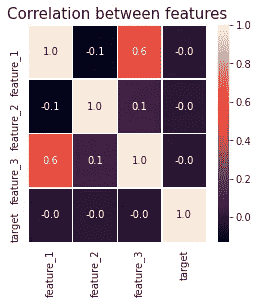

card_details_train 中特征之间的相关性(图片由作者提供)

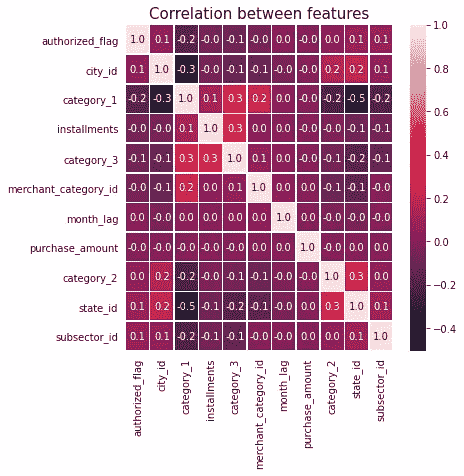

old_transactions 中特征之间的相关性(图片由作者提供)

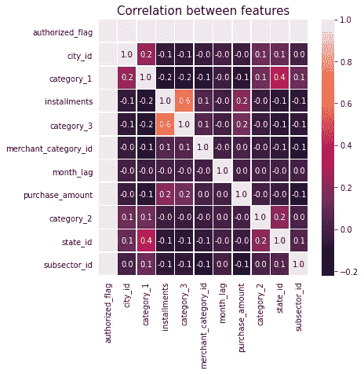

new_transactions 中特征之间的相关性(图片由作者提供)

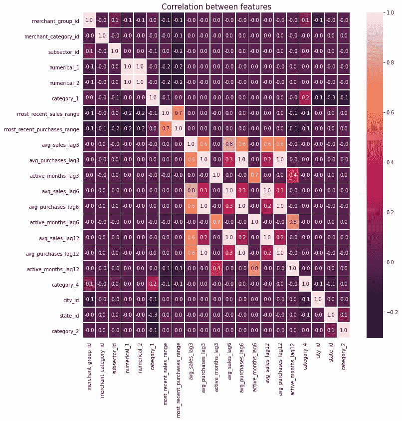

merchant_details 中特征之间的相关性(图片由作者提供)

## **卡方检验:**

卡方统计是显示两个分类变量之间关系的一种方式。它有助于在两个分类变量之间进行统计检验。独立性卡方检验的假设如下:

*   **零假设:**两个分类变量是独立的(两个变量之间没有关联)(H0: Oi = Ei)
*   **替代假设:**两个分类变量是相关的(两个变量之间有关联)(H1: Oi ≠ Ei)

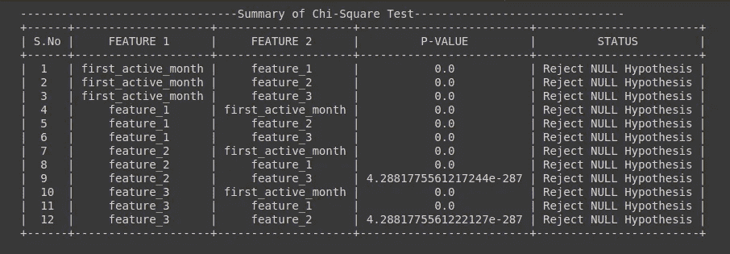

card_details_train 卡方检验汇总(图片由作者提供)

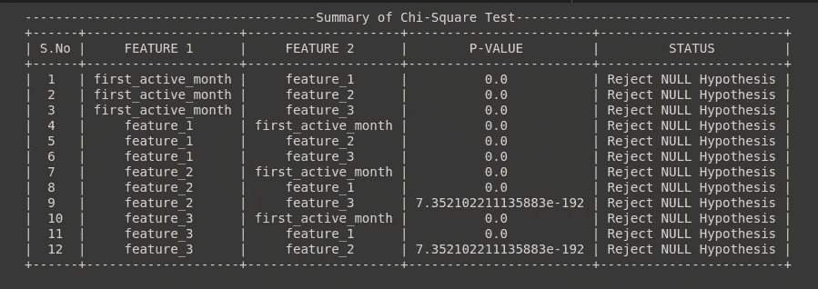

卡方检验总结 _ 详情 _ 检验(图片由作者提供)

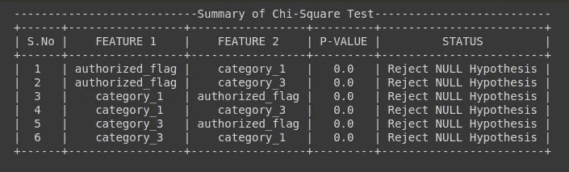

old_transactions 的卡方检验总结(图片由作者提供)


new_transactions 卡方检验总结(图片由作者提供)

## **方差分析检验:**

方差分析(ANOVA)是一种统计技术，用于检查两个或多个组的平均值是否存在显著差异。它有助于在一个连续变量和另一个分类变量之间进行统计检验。方差分析假设可以表述为:

*   **无效假设:**各组均数相等(各组均数无差异)。(H0: μ1=μ2=…=μp)
*   **备选假设:**至少，一组的均值与其他组不同。(H1:所有μ不相等)

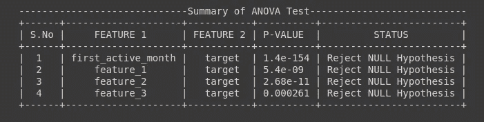

card_details_train 方差分析测试总结(图片由作者提供)

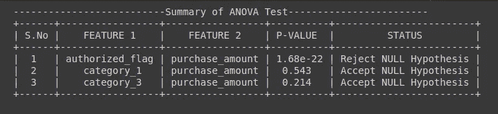

old_transactions 方差分析测试总结(图片由作者提供)

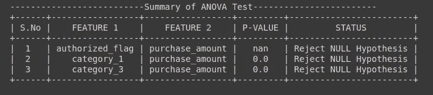

new_transactions 方差分析检验总结(图片由作者提供)

# 特征工程

特征工程是利用领域知识从原始数据中提取特征(特性、性质、属性)的过程。特征是由独立单元共享的属性，对其进行分析或预测。预测模型使用特征并影响结果。应用非常基本的特征工程从每个数据集中提取一些有用的特征。

## **数据集 1:卡 _ 细节 _ 列车&数据集 2:卡 _ 细节 _ 测试**

由于 card_details_train 和 card_details_test 数据集的特征相同，我们对这两个数据集应用了相似的特征工程。

## **数据集 4:旧事务&数据集 5:新事务**

由于 old_transactions 和 new_transactions 数据集的特征是相同的，我们对这两个数据集应用了相似的特征工程。使用现有要素创建某些新要素，然后对所有创建的要素应用聚合操作。

## 观察结果:

*   使用基本特征工程方法总共创建了 32 个特征。

# 特征可视化

将学习到的特征显式化的方法称为特征可视化。一些识别的特征相对于目标特征被绘制，以识别它们对目标变量的分布影响。

## **旧采购的数量如何影响目标**

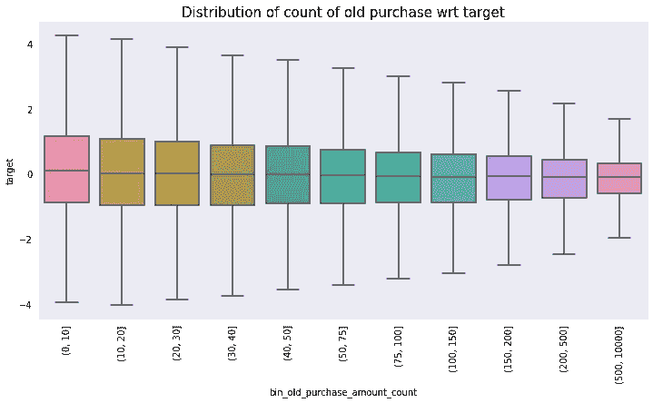

old_transactions 中旧采购 wrt 目标的计数分布(按作者分类的图像)

## **旧采购金额的总和如何影响目标**

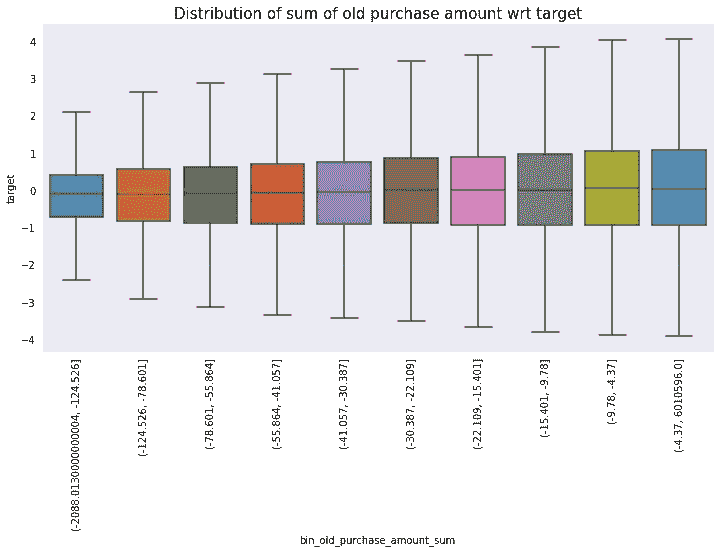

old_transactions 中旧采购总额 wrt 目标的分布(按作者分类的图像)

## **新采购数量如何影响目标**

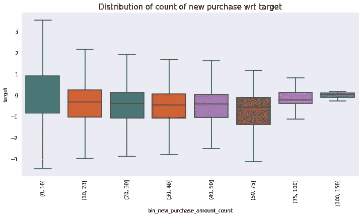

new_transactions 中新采购 wrt 目标的计数分布(按作者分类的图像)

## **新采购金额之和如何影响目标**

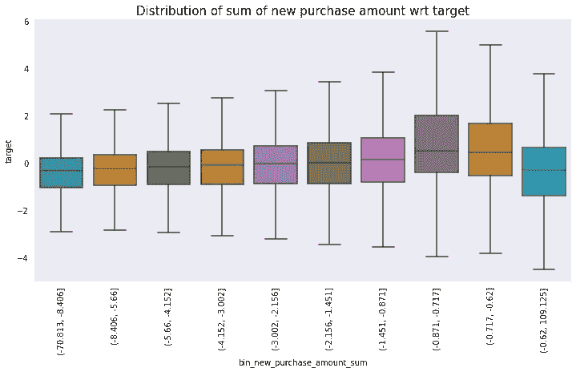

new_transactions 中新采购总额 wrt 目标的分布(按作者分类的图像)

## 观察结果:

*   忠诚度得分似乎随着旧交易次数的增加而降低。
*   忠诚度得分似乎随着旧购买总额的增加而增加。
*   忠诚度得分似乎随着总新购买量的增加而降低，但是忠诚度得分的最小分布也可以在最后一个框中看到。随着新购买总量的增加，可以看到更多的负忠诚度得分。
*   忠诚度得分似乎随着新购买总量的增加而增加。在最后的箱中可以观察到更多的负得分。

# 第一次切割溶液

作为第一个解决方案，我们试图使用一些传统算法建立一个非常基本的机器学习模型。这些模型通过使用一些基本的特征工程方法在上述简单特征上被训练。这些步骤包括:

*   将数据分割为要素和标注。
*   将数据分为训练集和验证集。
*   选择模型。
*   超参数调整，调整模型参数以提高性能。
*   尽可能经常地训练模型以做出正确的预测。
*   使用测试集数据进行预测，该测试集数据在此之前从模型中保留(并且其类别标签是已知的)，用于测试模型；更好地模拟模型在现实世界中的表现。

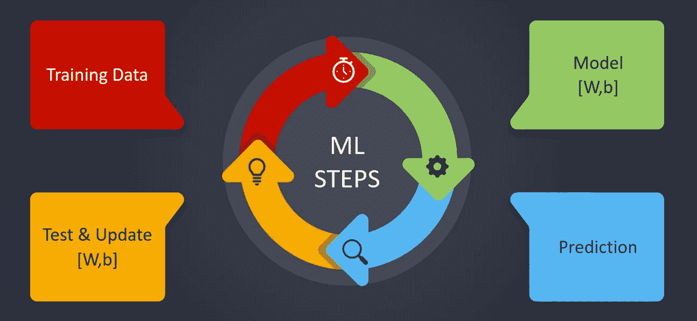

ML 步骤(图片由作者提供)

## 基线模型

在构建非常基本的模型之前，我们使用目标变量的平均值创建了一个基线模型。这个简单的模型得出的 RMSE 为 3.856821。给出了第一次切割模型预期结果的合理范围。我们相信我们会取得比这更好的成绩。

## 模型结构

每个基本特征被合并，然后应用于训练传统的机器学习模型。这些功能也与测试集合并，以进一步评估模型在看不见的数据上的性能。最后，捕捉每个训练模型的 RMSE 分数。

## **1。线性回归**

## **2。支持向量回归机**

## 3.随机森林回归量

## 4.轻型 GBM 回归器

## 5.带 LGBM 的自动编码器

# 高级特征工程

应用非常基本的特征工程从每个数据集中提取一些有用的特征。这些特性不足以提高我们模型的性能。需要提取更多相关的和改进的特性，这些特性有可能改进性能指标。从每个数据集中提取了更高级的特征。这些特征最终被合并以构建模型。

## **数据集 1:卡 _ 细节 _ 火车&数据集 2:卡 _ 细节 _ 测试**

由于 card_details_train 和 card_details_test 数据集的特征相同，我们对这两个数据集应用了相似的特征工程。

## **数据集 4:旧事务&数据集 5:新事务**

由于 old_transactions 和 new_transactions 数据集的特征是相同的，我们对这两个数据集应用了相似的特征工程。使用现有特征创建更有用的新特征，然后对所有创建的特征应用聚合操作。

## 观察结果:

*   所有提取的特征被合并以建立最终的训练和测试集。该训练和测试集用于构建模型。
*   使用高级特征工程方法，分别为训练集和测试集创建了总共 168 个和 166 个特征。

# 改进的解决方案

通过适当的分析将数据的复杂性可视化，我们得出的结论是，基于树的模型比任何其他传统模型都要好得多。Google Colab 使用基于 GPU 的设置来训练 LGB 模型，测试集用于测试模型性能。最后，每次迭代都返回 RMSE 分数，并最终获得最佳结果。

## **带 KFold 的 LGB 车型**

为了获得最佳性能，需要执行超参数调整。我们使用了 [*Optuna*](https://optuna.readthedocs.io/en/stable/) 来完成这个任务。 *Optuna* 是一个软件框架，用于自动化这些超参数的优化过程。它通过使用不同的采样器，如网格搜索、随机、贝叶斯和进化算法，自动找到最佳超参数值。获得的超参数用于训练具有 KFold 的 LGB 模型。

## **重复 KFold 的 LGB 模型**

将类似的超参数调谐方法应用于具有重复 KFold 的 LGB 模型。因此，获得的最佳超参数也用于训练具有重复 KFold 的 LGB 模型。

# 模型比较

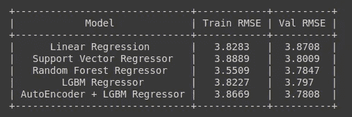

首次切割解决方案摘要(图片由作者提供)

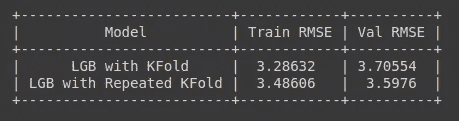

改进解决方案摘要(图片由作者提供)

上面列出了各型号性能的对比总结。线性模型不足以处理复杂的数据。配备 LGBM 的 AutoEncoder 比配备基本功能的其他型号性能稍好，尽管这也是因为我们在 AutoEncoder 中使用了较少的基本功能。具有高级特征基于树的模型优于具有基本特征的其他传统模型。LGB 与反复 KFold 已经取得了最好的验证 RMSE 3.59。

# Kaggle 分数

## 第一次切割溶液

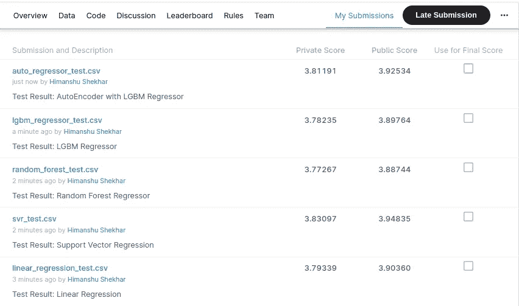

首款解决方案的排行榜得分(图片由作者提供)

## 改进的解决方案

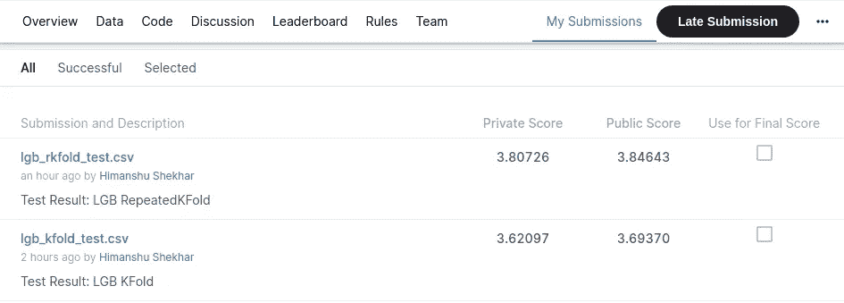

改进解决方案的排行榜得分(图片由作者提供)

# 结论和未来工作

*   特征工程在决定模型性能方面发挥了重要作用。可以实现和应用更多的高级和相关特征来增加模型分数。
*   也可以应用像堆叠这样的集合模型来提高模型的效率。
*   作为未来的工作，这个案例研究也可以被框定为一个分类问题，目标是对客户是否忠诚进行分类。

# 参考

*   [https://www . ka ggle . com/c/elo-merchant-category-推荐](https://www.kaggle.com/c/elo-merchant-category-recommendation)
*   [https://www . ka ggle . com/c/elo-merchant-category-re commendation/code](https://www.kaggle.com/c/elo-merchant-category-recommendation/code)
*   [https://www . ka ggle . com/c/elo-merchant-category-推荐/讨论](https://www.kaggle.com/c/elo-merchant-category-recommendation/discussion)
*   [https://en.wikipedia.org/wiki/](https://en.wikipedia.org/wiki/Main_Page)

## 现场演示:

[https://share.streamlit.io/shekhartz/elo-app](https://share.streamlit.io/shekhartz/elo-app)

## Github:

[https://github.com/shekhartz/elo](https://github.com/shekhartz/elo)

## LinkedIn:

[https://www.linkedin.com/in/shekhartz/](https://www.linkedin.com/in/shekhartz/)