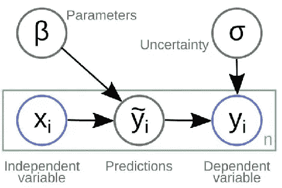
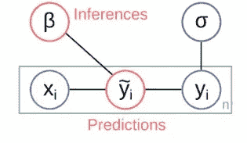
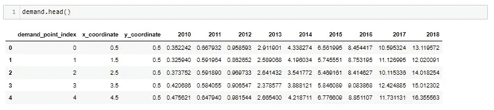
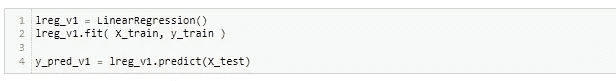
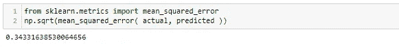
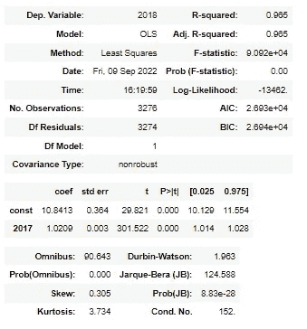
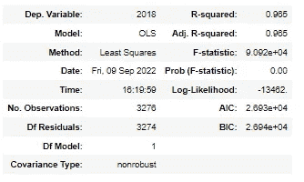
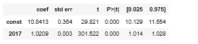
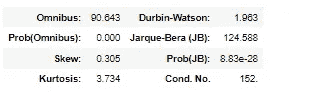

# 阐明推理统计的力量，做出更明智的决定！

> 原文：<https://pub.towardsai.net/elucidating-the-power-of-inferential-statistics-to-make-smarter-decisions-6e8d4b0643ef?source=collection_archive---------1----------------------->

*推论统计学失去的重要性……*

数据科学团队在行业中的战略角色基本上是**帮助企业做出更明智的决策。**这包括对*微小规模的决策*(如优化营销支出)以及*由企业做出的独特而重大的决策*(如如何在竞争市场中定位新进入者)。在这两种情况下，只有当**人类和机器参与者都从数据中学习**并且**数据科学家与整个企业的决策者进行有效沟通**时，数据科学的潜在影响才会被意识到。在机器学习的整个生命周期中，推理和预测之间肯定存在二元性。从平衡的角度来看，预测和推理是将模型与数据进行比较的过程中不可或缺的组成部分。

> 然而，**一种不平衡的、以预测为导向的观点在行业中盛行**，数据科学家倾向于直接预测目标变量。这种方法可能不利于做出更明智的决策。

通过这个博客，我提供解释推理和预测的真正力量，携手合作。

## **预测和推理的二重性**

通常，一个简单的监督机器学习设置从*数据*开始——由自变量和因变量组成。这两个变量都有一个潜在的存在关系，通常表示为 Y = f(β。x)

这种设置通过下面给出的图表进行解释:

资料来源:Lauritzen，S. L. (1996 年)。*图形模型*。克拉伦登出版社。

现在，让我们尝试将上面的图表分解为预测和推理。在此之前，出于实际目的，让我尽可能简单地定义这两个术语。

*   **预测:***输出由数据生成过程的模型根据特定的输入配置发出*。
*   **推论**:通过系统地比较来自模型的预测和来自数据生成过程的观察数据，获得关于数据生成过程的*信息。*

> 具有平衡视角的监督机器学习设置，评估预测和推理组件，可以归结为:

资料来源:Lauritzen，S. L. (1996 年)。*图形模型*。克拉伦登出版社。

上图说明了**预测和推理是建模过程的两个不同目标，它们都为组织**提供价值，并且在建模过程中不可分割地联系在一起，但是可以以不同的方式来看待。这两种观点在不同的背景下都是有效的，分析师和组织需要考虑并**认识到特定数据科学项目的适当方向。**

## **让我们来测试一下推断统计学的威力吧！**

在这里，我用一个例子来说明推理和预测的双重性。假设我们的目标是**预测某个地区在 2019 年对电动滑板车**的需求，并且我们已经获得了该地区对电动滑板车的历史年度需求。给定设置后，*让我们考虑从推理和预测组件中生成相等的值。*

**读取数据—** 下面的数据表明，对于每个需求点指数，我们都有电动踏板车的历史需求。这里，2018 年对电动滑板车的需求成为因变量(Y)，历史需求值是自变量(x)

来源:作者综合创造的数据

**使用线性回归进行需求预测-** 我们可以使用线性回归快速预测电动踏板车的需求，并使用 RMSE 评估模型误差。

在这里，0.34 的 RMSE 是个例外。所以，我不应该再往前看了，应该尽快完成对未来几年的预测。

> 但是等等！我们对模型的参数或重要变量或可解释性了解多少，或者哪个模型表现更好，为什么？

这种学习来自监督机器学习设置的推理组件，并且应该被认为与预测组件一样重要。

让我们尝试使用回归汇总表来回答几个问题。

带有假设值的回归汇总表

首先，让我将这个汇总表分成 3 个部分。

**(1)第一部分列出了解释回归模型拟合度**的测量值，即回归模型与数据集的拟合度。以下措施有助于我们了解整体模型的适用性。

*   **R 的平方—** 这通常写为 r2，也称为*决定系数*。可以用预测变量来解释的是响应变量中方差的比例。R 平方的值可以从 0 到 1。 ***值为 1 表示响应变量可以被预测变量完美无误地解释。*** 在本例中，**R 的平方为 0.965** ，这表明电动车需求变化的 96.5%可以用历史需求数字来解释。
*   **F-统计量-** 该统计量表示回归模型是否比不包含独立变量的模型更适合数据。 ***本质上是测试回归模型整体是否有用。*** 一般来说，如果模型中的预测变量都不具有统计显著性，那么总体 F 统计量也不具有统计显著性。此统计数据对于在具有不同独立变量的多个模型中测试哪个模型更合适非常有用。

同样，AIC 和 BIC 也有助于获得关于模特装修的类似见解。

**(2)第二部分帮助翻译围绕系数**估计值、估计值的标准误差、t-stat、p 值和回归模型中每一项的置信区间的推论。

*   **系数—** 系数为我们提供了写出估计回归方程所需的数字。在本例中，估计回归方程为:

**2019 年电动车需求= 10.84+1.02 * 2017 年电动车需求**

每个系数被解释为 ***给定预测变量*** 每增加一个单位，响应变量的平均增加，假设所有其他预测变量保持不变。例如，对于 2017 年销售的每辆电动滑板车，下一年的平均预期需求增长是 1.02 辆，*假设其他一切保持不变。*截距被解释为电动滑板车的预期平均需求单位，不考虑其历史需求。

*   **标准误差和 p 值—** 标准误差是对每个变量的系数估计值的*不确定性的测量。p 值告诉我们给定的响应变量在模型中是否重要。在本例中，我们看到 2017 年*需求的 p 值为 0.000。这表明 2017 年的*需求*是 2018 年需求的重要预测指标。
*   **系数估计的置信区间-** 表格中的最后两列提供了系数估计的 95%置信区间的下限和上限。例如，2017 年的*需求的系数估计值为 1.02，但这一估计值存在一定的不确定性。我们永远无法确定这是否是准确的系数。因此，95%的置信区间给出了真实系数的一系列可能值。在这种情况下，2017 年*的*需求的 95%置信区间为(1.014，1.028)。*

**(3)最后一节给我们提供了一个关于残差或误差的推论。**让我们来看看列出的每个值:

*   **Omnibus/Prob(Omnibus)** —残差的偏度和峰度的测试。我们希望看到一个接近零的值，这表示正常。Prob (Omnibus)执行统计测试，表明残差呈正态分布的概率。我们希望在这里看到接近 1 的东西。这种情况下 Omnibus 比较高，Prob (Omnibus)比较低，所以数据不正常。
*   **偏斜** —衡量数据对称性的指标。我们希望看到接近零的东西，表明残差分布是正态的。注意，这个值也驱动综合。
*   **峰度**——数据“峰值”或曲率的度量。更高的峰值导致更大的峰度。峰度越大，可以解释为残差在零附近的聚类越紧密，意味着模型越好，离群值越少。
*   **德宾-沃森** —同质性检验。我们希望值在 1 和 2 之间。在这种情况下，数据是接近的，但在限制范围内。
*   **Jarque-Bera(JB)/Prob(JB)**—类似于综合测试，它测试偏斜度和峰度。我们希望在这次测试中看到对综合测试的确认。
*   **条件号** —该测试测量功能输出相对于输入的敏感度。当我们有多重共线性时，我们可以预期数据的微小变化会产生更大的波动。因此，我们希望看到一个相对较小的数字，大约在 30 以下。在这种情况下，我们在 152 的屋顶上。

总而言之，在这种情况下，回归汇总表比预测组件的 RMSE 有更多的内容要说。我们已经得到了关键问题的答案，如 **(a)模型拟合，(b)对重要变量及其附加标准误差的洞察，以及对残差的深入研究。**

参数的可见性和正确解释为我们提供了更好的控制以做出更明智的决策。

简而言之，对预测和推理的平衡观点是做出明智决策的关键。这两个组件必须密切配合，才能使机器学习模型对企业有意义和有用。

最后，感谢你耐心阅读到最后，如果你觉得这篇文章有用，那么给我一两下掌声吧！如果没有，请回复你的评论和问题；我很乐意回答并连接到 [Linkedin](https://www.linkedin.com/in/harjot-kaur-99792118/) 进行讨论。

**参考文献:**

*   【https://hdsr.mitpress.mit.edu/pub/a7gxkn0a/release/7 
*   [https://www.statology.org/read-interpret-regression-table/](https://www.statology.org/read-interpret-regression-table/)
*   [https://medium . com/swlh/interpreting-linear-regression-through-stats models-summary-4796d 359035 a](https://medium.com/swlh/interpreting-linear-regression-through-statsmodels-summary-4796d359035a)
*   [https://www . accele brate . com/blog/interpreting-results-from-linear-regression-is-the-data-appropriate](https://www.accelebrate.com/blog/interpreting-results-from-linear-regression-is-the-data-appropriate)