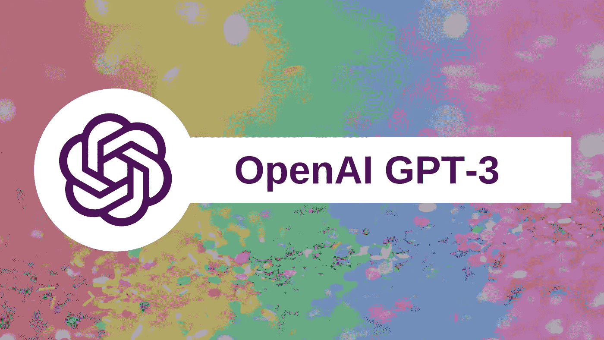
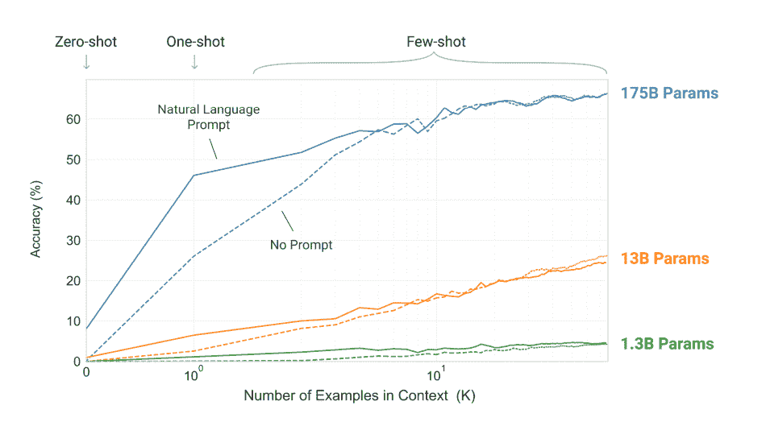
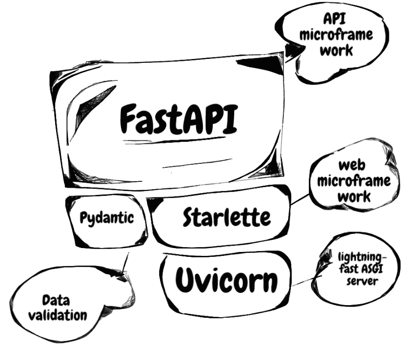
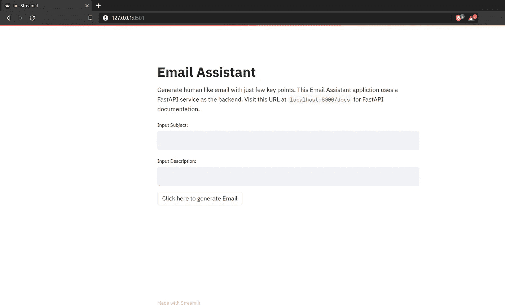
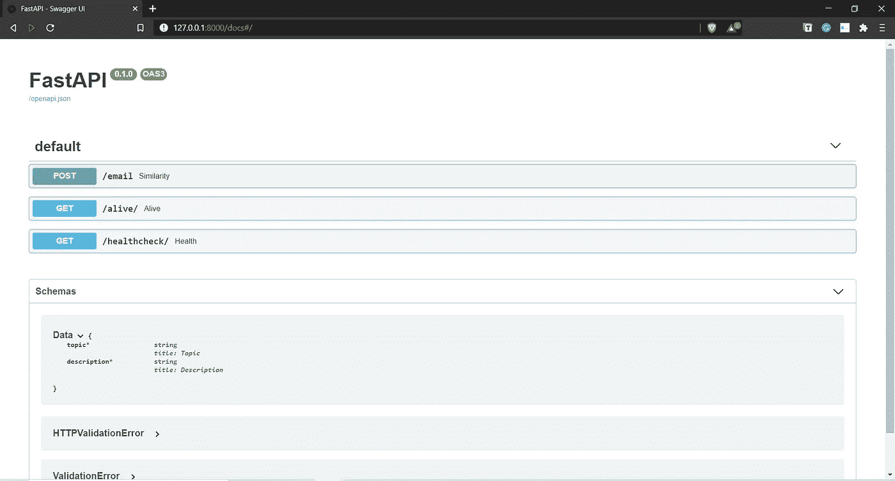

# 由 GPT-3 支持的电子邮件助手

> 原文：<https://pub.towardsai.net/email-assistant-powered-by-gpt-3-ba39dfe999d3?source=collection_archive---------0----------------------->

## [自然语言处理](https://towardsai.net/p/category/nlp)

## *OpenAI 最近发布了他们语言模型的新继任者，GPT-3，这是迄今为止最大的训练模型，有 1750 亿个参数。*

*傻瓜所谓的“浪费时间”通常是最好的投资——纳西姆·塔勒布的 GPT-3 版本*

## 什么是 GPT-3？

**GPT-3** 代表**创成式预训练变压器 3。**它是一个[自回归](https://en.wikipedia.org/wiki/Autoregressive_model) [语言模型](https://en.wikipedia.org/wiki/Language_model)，利用[深度学习](https://en.wikipedia.org/wiki/Deep_learning)在各种语言任务中产生类似人类的结果。是 [OpenAI](https://en.wikipedia.org/wiki/OpenAI) [ [1](https://en.wikipedia.org/wiki/GPT-3) ]打造的 GPT-n 系列中的语言模型第三代。

GPT-3 是 GPT-2 模型架构的扩展和放大版本，它包括修改的初始化、预规范化和可逆令牌化，并在零触发、单触发和少触发设置中的许多 NLP 任务上显示出强大的性能。

语言模型越大，就越能适应上下文信息。

在上面的图表中，可以清楚地看到 GPT-3 如何支配所有的小模型，并在几乎所有的 NLP 任务中获得实质性的收益。它基于对大型数据集进行预训练，然后针对特定任务进行微调或启动的方法。今天的人工智能系统在各种语言任务之间切换时，在性能方面有其局限性，但 GPT-3 使其在不同语言任务之间切换非常灵活，在性能方面非常高效。

GPT-3 使用了 1750 亿个参数，这是迄今为止模型被训练的最大数量的参数。它带来了一些有趣的见解，向我们展示了如果我们可以扩大语言模型的训练，它可以显著提高任务不可知的，少数镜头的性能，使其与以前的 SOTA 方法相当，甚至更好。

> 将 GPT3 的壮观性能外推至未来表明，生命、宇宙和一切的答案只是 4.398 万亿个参数。— [杰弗里·辛顿](https://twitter.com/geoffreyhinton/status/1270814602931187715) [ [3](https://twitter.com/geoffreyhinton/status/1270814602931187715)

GPT-3 是通过记住技术和非技术观众而创建的，它不需要复杂的梯度微调或更新，界面设计简单直观，任何人都可以很容易地使用，几乎没有先决条件。

## 进入 GPT-3

对 GPT-3 的访问是以 API 的形式给出的。由于模型的庞大，openAI 社区决定不发布包含 1750 亿个参数的整个模型。与当前为一个用例设计的人工智能系统不同，GPT-3 的设计是任务不可知的，并提供了一个通用的“文本输入，文本输出”界面，为用户提供了灵活性，可以尝试任何语言任务。

GPT-2 与 GPT-3 的比较

API 的设计方式是，一旦你给它提供 apt 文本提示，它将在 OpenAI 服务器的后端处理它，并返回完整的文本，试图匹配你给它的模式。与当前需要海量数据来实现 SOTA 性能的深度学习系统不同，API 需要一些例子来为你的下游任务做准备[ [2](https://openai.com/blog/openai-api) ]。

该 API 被设计得非常简单和直观，以使机器学习团队更具生产力。以 API 的形式发布 GPT-3 背后的想法是让数据团队专注于机器学习研究，而不是担心分布式系统问题。

## GPT 3 号在行动

为了看到 GPT-3 的运行，我创建了一个自动化的电子邮件助手，它能够在最少的外部指令下，以正式的身份编写一封类似人类的电子邮件。在本文的下一部分，我将向您介绍电子邮件助手应用程序的工作流程以及用于构建该应用程序的技术栈。

## 技术堆栈

*   open ai GPT-3 API:open ai API 将应用程序连接到托管 GPT-3 模型的服务器，用于发送输入和获取输出。API key 为我们提供了一个简单直观的文本提示界面(具有文本输入/文本输出功能)，可以很容易地用于获取模型训练和预测。

*   **FastAPI:** FastAPI 用作我们的数据应用程序的包装器，将其功能公开为 RESTFUL 微服务。它是一个现代、快速、高性能的 web 框架，用于使用 Python 构建 API。它建立在 Starlette、Pydantic 和 Uvicorn 的顶部。要了解 FastAPI 的更多信息，请参考这篇[文章](https://medium.com/towards-artificial-intelligence/fastapi-the-spiffy-way-beyond-flask-b00f4f883e1d)。

*   我们在前端使用了 Streamlit，为我们的应用程序提供了一个简单而优雅的用户界面。它是一个开源的 python 库，能够在几分钟内将数据脚本转换成可共享的 web 应用程序。它使得用最少的努力和对前端设计框架的零知识来构建定制的 web 应用程序变得非常容易。要了解更多关于 Streamlit 的信息，请阅读这篇[文章](https://medium.com/towards-artificial-intelligence/streamlit-revolutionizing-data-app-creation-e269177d9112)。

## 应用程序演练:

现在，我将一步一步地向您介绍电子邮件助手应用程序:

因此，我基于两个主要组件创建了 ***培训提示*** 。快速设计是启动 GPT-3 模型以给出有利响应的最重要的过程。我的即时设计流程的两个主要组成部分如下:

*   主题:告诉助理邮件内容的一行程序。
*   **描述:**用最少的相关信息，用一两句话来描述邮件的主要目的。

Streamlit 支持的 UI

FastAPI 的魔力——自动化 API 文档

让我们看一个实际例子，来真正了解 GPT-3 的威力。在下面的例子中，我们将通过向人工智能电子邮件助手提供最少的指令来生成几封电子邮件。

运行中的电子邮件助手…

## 结论

GPT-3 将重新定义我们看待技术的方式，我们与设备通信的方式，并将降低获取先进技术的壁垒。GPT 三号可以写作、创作和交谈。它有巨大的潜力创造一系列的商业机会，并向富裕的社会迈出一大步。它可能成为人工智能民主化的关键一步。

## 参考

1.  [https://en.wikipedia.org/wiki/GPT-3](https://en.wikipedia.org/wiki/GPT-3)
2.  [https://openai.com/blog/openai-api](https://openai.com/blog/openai-api/)
3.  [https://Twitter . com/Geoffrey hint on/status/1270814602931187715](https://twitter.com/geoffreyhinton/status/1270814602931187715)

如果你想了解更多，或者想让我写更多关于这个主题的东西，请随时联系我们。

我的社交链接:[LinkedIn](https://www.linkedin.com/in/shubhamsaboo/)|[Twitter](https://twitter.com/Saboo_Shubham_)|[Github](https://github.com/Shubhamsaboo)

如果你喜欢这篇文章或觉得它有帮助，请花一分钟按一下拍手按钮，它增加了文章对其他媒体用户的可见性。