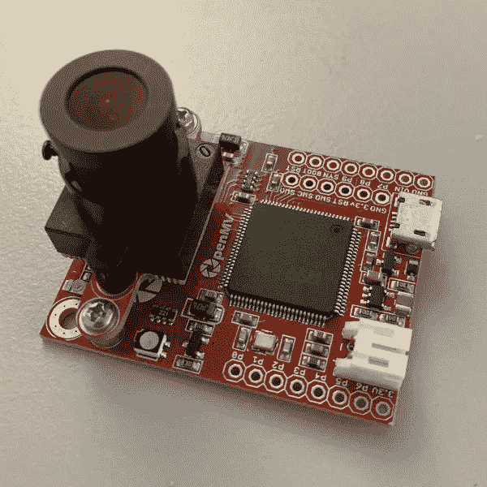
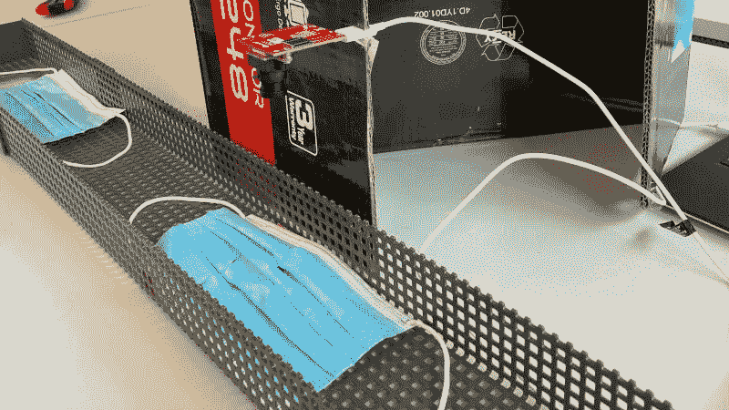
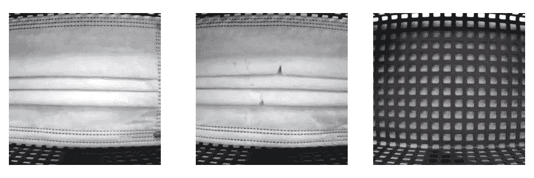

# 使用 PyTorch 在 Arm Cortex-M7 处理器上进行嵌入式 COVID 屏蔽检测

> 原文：<https://pub.towardsai.net/embedded-covid-mask-detection-on-an-arm-cortex-m7-processor-using-pytorch-771fabc845e2?source=collection_archive---------2----------------------->

## [计算机视觉](https://towardsai.net/p/category/computer-vision)

## **我们如何在 OpenMV-H7 板上构建在设备上运行的可视新冠肺炎掩模质量检测原型，以及在此过程中面临的挑战。**

**TLDR；**训练和部署自己的图像分类器的源代码可以在这里找到:[https://github . com/ARM-software/endpoint ai/tree/master/ProofOfConcepts/Vision/OpenMvMaskDefaults](https://github.com/ARM-software/EndpointAI/tree/master/ProofOfConcepts/Vision/OpenMvMaskDefaults)

2020 年夏天，我们与 Arm 合作，构建了一个易于使用的教程，介绍如何在 Arm 微控制器上训练和部署图像分类器。在本帖中，我们展示了我们是如何应对和解决以下挑战的:

*   将 PyTorch ResNet 转换为 TensorFlow，并将其量化为使用 8 位整数值
*   收集、选择和注释有缺陷和无缺陷掩模的数据
*   使用自我监督的预训练来提高处理较少图像时的模型性能。

# 预期的结果

这个项目的目标是展示一个端到端的工作流程，说明如何在 OpenMV-H7 板上训练和部署卷积神经网络。

下面的视频展示了我们的分类器如何实时检测有缺陷的面具。

OpenMV-H7 支持的缺陷新冠肺炎掩模实时图像分类

# OpenMV-H7 板

该板由一个运行频率为 480MHz 的[STM 32h 743 VI](https://www.st.com/en/microcontrollers/stm32h743vi.html)Arm Cortex-M7 CPU、多个外设和一个安装在其上的摄像头模块组成。
摄像头模块有一个来自 OmniVision 的 [OV7725](http://www.ovt.com/products/sensor.php?id=80) 传感器，可以以 75 FPS 的 VGA 分辨率(640x480)进行录制。

由于主板的计算能力和内存有限，我们的目标是一个非常小的深度学习模型。我们称该变体为 ResNet-9，因为它更像是对 ResNet-18 变体的删减。下面您可以找到一些关于模型配置、运行时间和其他指标的数字。

*   **输入尺寸:** 64x64x3
*   **CPU 频率。:** 480 兆赫
*   **操作:** 33.4 拖把
*   **型号大小:** 90 千字节
*   **推断时间:** 150 毫秒
*   **操作/秒**:249 MOp/秒

详细规格可以在 OpenMV 官网[这里](https://openmv.io/products/openmv-cam-h7)找到。

我们用的 OpenMV H7 板的特写图。

# 数据收集

神经网络非常需要数据。为了有效地收集足够的训练数据，我们做了以下工作:

1.  我们使用 OpenMV-H7 板上的摄像头来记录视频序列。通过 USB 接口和 [OpenMV IDE](https://openmv.io/pages/download) ，我们能够轻松记录相机流并将其保存为视频文件。
2.  为了模拟真实的生产线，我们将摄像机安装在纸板上，以确保摄像机稳定。光学器件指向生产线，生产线是一个带有高边框的金属板。这种设置确保相机在相同的环境中看到缺陷和非缺陷掩模。
3.  最后，我们通过推拉相结合的方式将口罩移过我们的检测线。

我们数据收集管道的图片。我们在纸板上切了一个小洞来夹住 USB 桌，把板放进去。

# 数据选择和注释

在这个阶段，我们有多个视频文件，每个文件都拍摄了几分钟。下一个挑战是提取帧并注释数据。我们使用 FFmpeg 进行帧提取，使用[和](http://lightly.ai/)来选择不同的帧。请注意，我们有超过 20k 帧，但没有时间对它们进行注释。轻轻使用，我们选择了几百帧覆盖所有相关场景。
[轻度](http://lightly.ai/)使用自我监督学习来获得图像的良好表示。然后，它使用这些表示来选择应该被注释的最有趣的图像。这种方法的好处是，我们可以访问预训练的模型，并仅在少数标记图像上对其进行微调。

使用 OpenMV H7 相机拍摄的示例图像显示了数据的三个标签。从左到右:好面膜，缺陷面膜，无面膜。

**模型微调
然后，我们在总共 500 幅带注释的图像上训练分类器 100 个时期。**

# 从 PyTorch 到 Keras 再到 TensorFlow Lite

将预先训练好的 PyTorch 模型迁移到 TensorFlow Lite 是我们工作中最困难的部分。

我们用 ONNX 尝试了几个技巧来导出我们的模型。一个简单的名为 [pytorch2keras](https://github.com/nerox8664/pytorch2keras) 的库对于一个仅由线性层组成的模型来说工作得很好，但是对于我们的 conv +线性模型来说就不行了。

使用 pytorch2keras 将 PyTorch 模型导出到 Keras 的代码。

我们遇到的主要问题是 PyTorch 对 tensors 使用 CxHxW(通道、高度、宽度)格式，而 TensorFlow 使用 HxWxC。这意味着，在将我们的模型转换为 TensorFlow Lite 后，分类器之前的层的输出被置换，因此，分类器的输出是不正确的。为了解决这个问题，我们考虑手动置换线性分类器的权重。

我们的代码在从 PyTorch 导出到 Keras 后手动改变权重。

然而，我们决定采用更简单的解决方案。我们将最后一个卷积层的输出汇集成一个 Cx1x1 形状。这样，改变通道的顺序不会影响神经网络的输出。

最后一步是量化和导出 Keras 模型到 TensorFlow Lite。在我们的例子中，量化减少了模型的大小，加快了模型推理的速度，代价是精度降低了几个百分点。

将 Keras 模型量化并导出到 Tensorflow Lite 的代码。我们损失了几个百分点的精度，因为量化后我们没有重新训练。

特别感谢 Arm 的合作者和 Lightly 的 Philipp Wirth 使这个项目成为可能。这里有[的完整源代码](https://github.com/ARM-software/EndpointAI/tree/master/ProofOfConcepts/Vision/OpenMvMaskDefaults)。您可以轻松训练自己的分类器，并在嵌入式设备上运行它。如果您有任何问题，请随时联系我们或发表评论！

Igor
联合创始人 [Lightly.ai](http://lightly.ai/)