# EMI:探索相互信息

> 原文：<https://pub.towardsai.net/emi-exploration-with-mutual-information-16b6c7fbe800?source=collection_archive---------0----------------------->

## 面向人工智能的强化学习探索策略|

## 一种新的基于表征学习的探索方法

来源:[安德鲁·尼尔](https://unsplash.com/@andrewtneel?utm_source=unsplash&utm_medium=referral&utm_content=creditCopyText)在 [Unsplash](https://unsplash.com/search/photos/explore?utm_source=unsplash&utm_medium=referral&utm_content=creditCopyText) 上的照片

# 介绍

当奖励信号稀疏时，强化学习可能会很难。在这些场景中，探索策略变得至关重要:一个好的探索策略不仅能帮助主体更快更好地理解世界，还能使其对环境的变化具有鲁棒性。在本文中，我们讨论了一种新颖的探索方法，即 Kim 等人在 2019 年 ICML 会议上提出的互信息探索(EMI)。简而言之，EMI 学习观察(状态)和动作的表示，期望我们可以在这些表示上有一个线性动力学模型。EMI 然后计算内在报酬作为线性动力学模型下的预测误差。内在奖励与环境奖励相结合形成最终的奖励函数，该函数可以被任何 RL 方法使用。

为了避免冗余，我们假设您熟悉[互信息](https://en.wikipedia.org/wiki/Mutual_information)和[马尔可夫决策过程](https://en.wikipedia.org/wiki/Markov_decision_process)的概念。

# 表征学习

## 状态和动作的表示

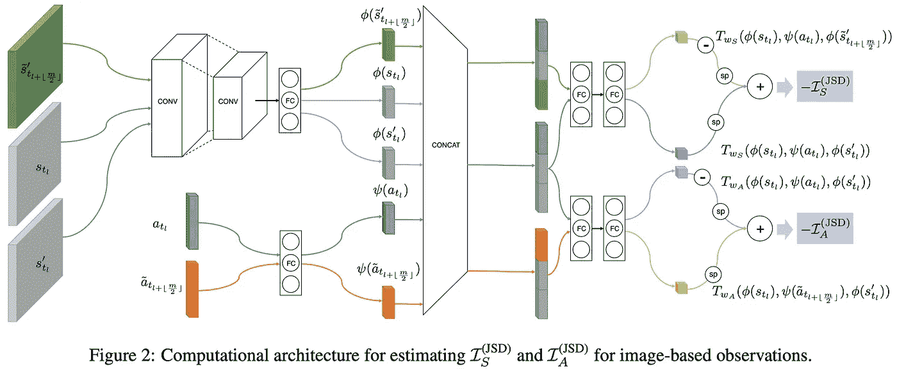

资料来源:EMI:探索与相互信息

在 EMI 中，我们的目标是分别学习状态和动作的表示 *ϕ(s): S→ ℝᵈ* 和 *ψ(a): A→ ℝᵈ* ，使得学习到的表示承载关于动态的最有用的信息。这可以通过最大化两个互信息目标来实现:1)在*【ϕ(s】、ψ(a)】**【ϕ(s')*之间的互信息；2)*【ϕ(s】【ϕ(s'】**ψ(a)*之间的交互信息。数学上，我们最大化以下两个目标

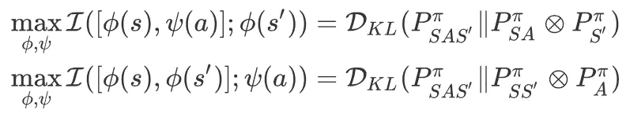

等式 1 .相互信息目标

其中 *P_{SAS'}^π* 表示独生子女经历元组 *(s，a，s’)*遵循政策 *π、*和 *P_{A}^π* 、 *P_{SA}^π* 、 *P_{SS'}^π* 为边际分布。这些目标可以通过我们之前讨论过的 [MINE](/{{ site.baseurl }}) 或 [DIM](/{{ site.baseurl }}) 进行优化。在 EMI 中，我们遵循 DIM 提出的目标，通过詹森-香农散度(JSD)最大化 *X* 和 *Y* 之间的互信息(MI)

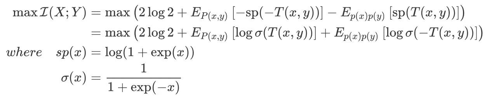

等式 2 .最大化互信息的 JSD 目标。该目标的一个重要性质是它受 *2log2 约束，解决了*地雷的梯度爆炸问题

# 用误差模型嵌入线性动力学模型

除了上述目标之外，EMI 还在转换是线性的嵌入空间上强加了简单和方便的拓扑。具体地，我们还试图学习状态 *ϕ(s)* 和动作 *ψ(a)* 的表示，使得对应的下一个状态 *ϕ(s')* 的表示遵循线性动态，即

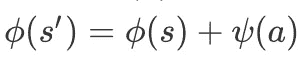

直觉上，这可能允许我们将大部分建模负担转移到嵌入函数上。

然而，不管神经网络的表达能力如何，在线性动态模型下，总会存在一些不可约误差。例如，在线性动态模型下，在 Atari 环境中引导代理从一个房间到另一个房间的状态转换是非常难以解释的。为此，作者引入误差模型 *e(s，a): S×A→ ℝᵈ* ，这是另一种以状态和动作为输入的神经网络，在线性模型下估计不可约误差。为了训练误差模型，我们最小化误差项的欧几里德范数，使得误差项有助于少量的不可解释的情况。以下目标示出了在线性动态下具有建模误差的嵌入学习问题:

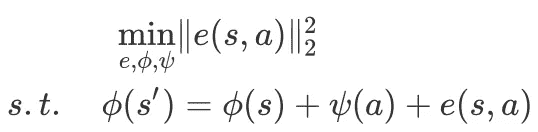

等式 3 .误差模型的目标

# 表征学习的目标

现在我们把所有的目标放在一起:

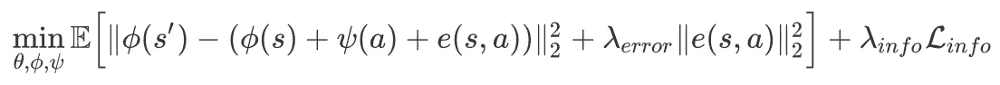

方程式 4 .表征学习的最终目标。λ_{error}和λ_{info}是对误差模型的简单性和表示之间的互信息进行加权的超参数

通过将[拉格朗日乘数](https://en.wikipedia.org/wiki/Lagrange_multiplier)应用于前面小节中定义的约束优化问题，获得第一个期望项，第二个期望项是 MI 目标的负值。

在实践中，作者发现当我们正则化动作嵌入表示的分布以遵循预定义的先验分布，例如标准正态分布时，优化过程更稳定。这引入了一个额外的 KL 惩罚 *D_{KL}(P_A^π‖𝒩(0，I)】*类似于 VAEs，其中 *P_A^π* 是一个经验正态分布，其参数是从一批样本中近似得到的。这里，我们给出一个示例张量流代码来演示如何从样本中计算 KL 散度。

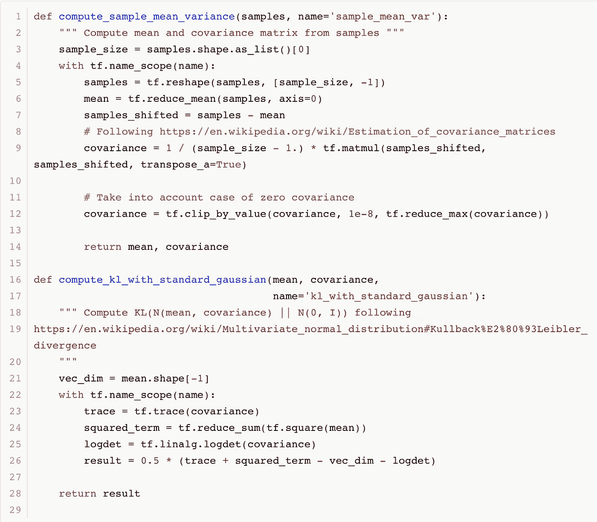

计算 D_{ *KL}(P_A^π‖𝒩(0，I))的张量流代码*

作者还试图调整状态嵌入，但他们发现这会使优化过程更加不稳定。这可能是由于状态的分布比动作的分布更容易偏斜，尤其是在优化的初始阶段。

# 内在奖励

我们现在将内在报酬定义为嵌入空间中的预测误差:

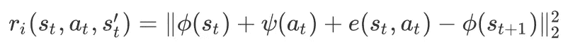

内在报酬函数

这个公式包含了误差项，并确保我们区分不可约误差，这种不可约误差不构成新颖性。我们将它与外在奖励相结合，得到最终的奖励函数，用于训练一个 RL 代理

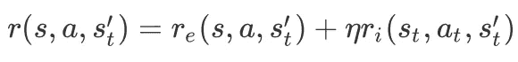

最终的奖励函数。η是内在报酬系数。

# 算法

既然我们已经定义了表征学习的目标和强化学习的回报函数，算法就变得简单了

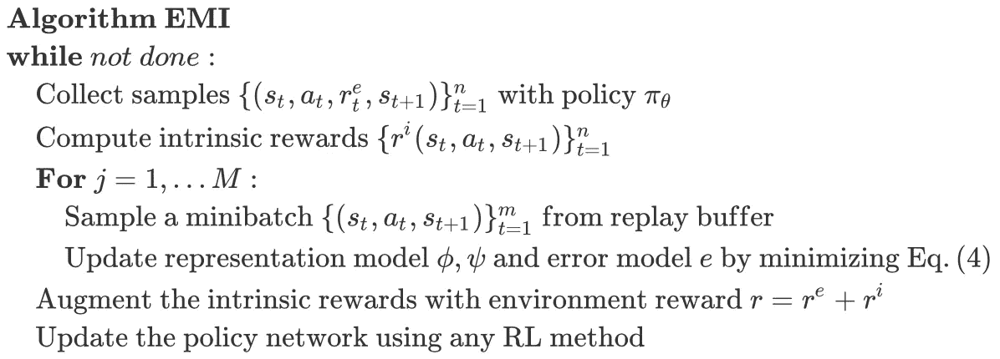

EMI 伪代码

# 实验结果

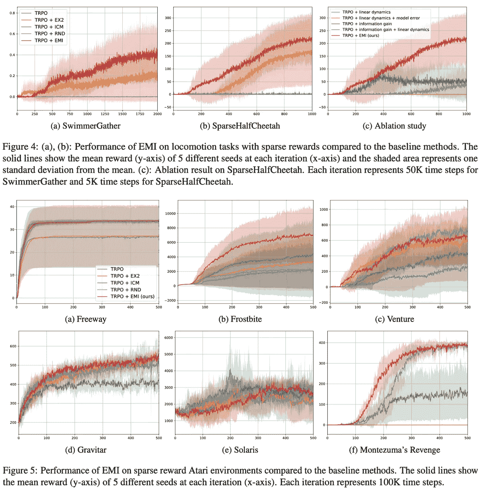

资料来源:EMI:探索与相互信息

我们可以看到，尽管 EMI 的方差很大，但它在具有挑战性的低维运动任务中取得了更好的结果(图 4)。另一方面，它与基于视觉的任务中的许多以前的方法有某种联系。总之，电磁干扰是一种广泛适用的方法，可以获得令人满意的性能。

# *参考文献*

1.  金亨锡，金在贤，郑延宇，谢尔盖·莱文，玄武铉。EMI:探索相互信息