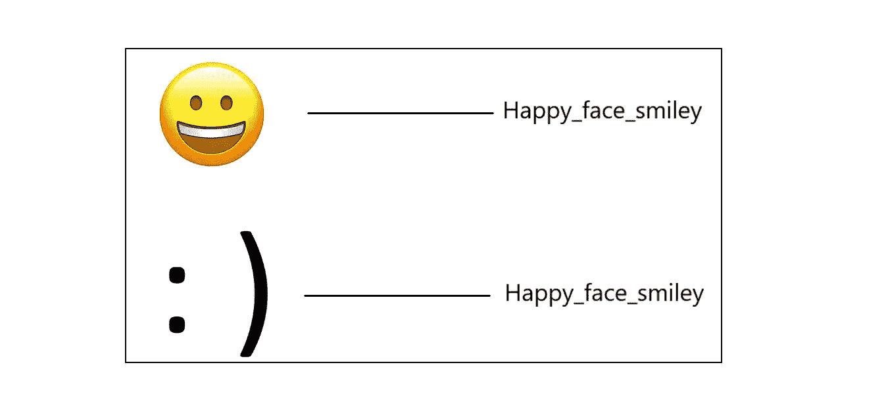

# 文本挖掘中的表情符号和表情符号

> 原文：<https://pub.towardsai.net/emoticon-and-emoji-in-text-mining-7392c49f596a?source=collection_archive---------0----------------------->

## 使用 Python 将表情符号和表情符号转换成 word 格式


来源:壁纸游戏

在今天的在线交流中，表情符号和表情符号正在成为主要语言，当你需要快速准确时，它允许我们与全球任何人进行交流。表情符号和表情符号都在文本分析中发挥着重要作用。

表情符号和表情符号最常用于社交媒体、电子邮件和短信，尽管它们也可能出现在任何类型的电子交流中。一方面，我们可能需要为我们的一些文本分析除去。另一方面，我们需要保留这些信息，因为它们提供了一些有价值的信息，特别是在情感分析方面，删除它们可能不是一个正确的解决方案。

例如，如果一家公司想在社交媒体上了解人们对新产品、新活动或品牌本身的感受。*表情符号可以通过描绘用户的心情、态度和观点来帮助识别哪里需要提高消费者参与度。*我们可以通过分析表情符号和表情符号来捕捉人们的情绪。这将提供一条重要的信息，对于公司来说，更好地理解客户的感受是至关重要的。



收集和分析表情符号和表情符号的数据给公司提供了有用的见解。因此，我们将把它们转换成 word 格式，以便在建模过程中使用。在这篇博客中，我们将看到如何使用 python 将表情符号和表情符号保存为 word 格式。

## 什么是表情符号？🙂 🙁

一个**表情符号**是一个足够小的图像，可以插入到文本中，表达一种情感或想法。单词*表情符号*本质上的意思是“图片-字符”(来自日语*e*——“图片”，和*莫吉*——“字母，字符”)。

## 什么是表情？:) :-]

一个**表情符号**是一种人类面部表情的表示，只使用键盘字符，如字母、数字和标点符号。

在这里，我使用了一个名为 **emot 的库。**关于这个库的更多细节，请查看这个 [Github repo](https://github.com/NeelShah18/emot) 。它有一个很好的表情符号和相应单词的集合。我用同样的方法把表情符号和表情符号转换成单词。

## 密码

```
**#Installing emot library**
!pip install emot**#Importing libraries**
import re
from emot.emo_unicode import UNICODE_EMO, EMOTICONS
```

```
**# Function for converting emojis into word**
def convert_emojis(text):
    for emot in UNICODE_EMO:
        text = text.replace(emot, "_".join(UNICODE_EMO[emot].replace(",","").replace(":","").split()))
    return text**# Example**
text1 = "Hilarious 😂. The feeling of making a sale 😎, The feeling of actually fulfilling orders 😒"
convert_emojis(text1)
```

## 输出

```
'Hilarious **face_with_tears_of_joy**. The feeling of making a sale **smiling_face_with_sunglasses**, The feeling of actually fulfilling orders **unamused_face**'
```

# 表情符号转换成文字形式

## 密码

```
**# Function for converting emoticons into word**
def convert_emoticons(text):
    for emot in EMOTICONS:
        text = re.sub(u'('+emot+')', "_".join(EMOTICONS[emot].replace(",","").split()), text)
    return text**# Example**
text = "Hello :-) :-)"
convert_emoticons(text)
```

**输出**

```
'Hello **Happy_face_smiley** **Happy_face_smiley'**
```

## 注意:

表情符号或表情符号的移除和转换纯粹基于业务用例。

感谢阅读。请继续学习，并关注更多内容！