# 分类数据编码——正确的方法

> 原文：<https://pub.towardsai.net/encoding-categorical-data-the-right-way-4c2831a5755?source=collection_archive---------2----------------------->


Icons8 团队提供的照片来自 Unsplash

```
**Table of Contents**· [Types of Data](#d708)
  ∘ [Continuous Data](#b4c2)
  ∘ [Discrete Data](#8bdf)
  ∘ [Nominal Data](#f86d)
  ∘ [Ordinal Data](#bc98)· [How to Encode Categorical data?](#6222)
  ∘ [Ordinal Encoding](#8bac)
  ∘ [Nominal Encoding](#99b1)
  ∘ [OneHotEncoding using Pandas](#23f3)
  ∘ [Dummy Variable Trap](#3848)
  ∘ [OneHotEncoding using Sklearn](#908d)
```

# 数据类型

在统计学和机器学习中，我们将数据分为两种类型，即**数值型**和**分类型**

> **数值**数据分为**离散**和**连续**数据。**分类**数据分为两种类型，**名义**数据，和**序数**数据。

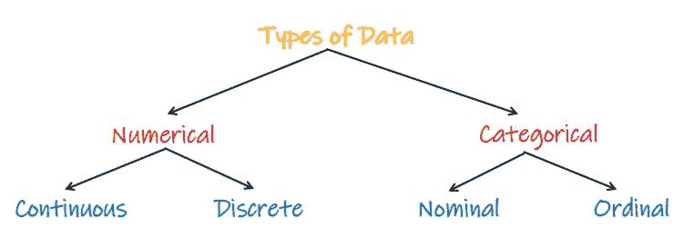

作者解释数据类型的图片

## 连续数据

连续数据是采用任意数字的数据(可以包括小数值)。它有无限多的可能值，可以在给定的特定范围内选择。

**举例:**一个人的体重身高，体温，年龄，距离。


作者图片

[](/step-by-step-approach-to-building-a-recommendation-system-a65be5a54045) [## 一个完整的基于端到端机器学习的推荐项目

### 基于协同过滤和流行度过滤的机器学习推荐方案

pub.towardsai.net](/step-by-step-approach-to-building-a-recommendation-system-a65be5a54045) 

## 离散数据

离散数据只能取离散值(不能有小数值)。离散信息只包含有限数量的可能值。这些价值无法进行有意义的细分。在这里，事情可以用整数来计算。

**举例:**一个家庭的人数，一个人可以拥有的银行账户数，一个教室的学生数，一场足球赛的进球数。

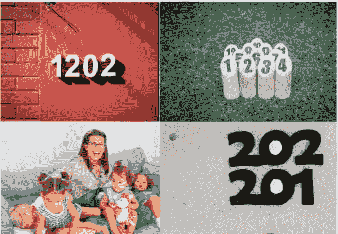

作者图片

[](https://medium.com/@gowthamsr37/outlier-detection-and-treatment-9a9f41df0fb2) [## 我们应该如何检测和处理异常值？

### 什么是离群值？我们需要如何检测异常值？我们需要如何处理异常值？

medium.com](https://medium.com/@gowthamsr37/outlier-detection-and-treatment-9a9f41df0fb2) 

## 标称数据

名义数据被定义为用于命名或标记变量而没有任何定量值的数据。它有时被称为“命名”数据。

名义数据通常没有内在的顺序。例如，性别是一个名义变量，有两个类别，但没有特定的方式从最高到最低排序，反之亦然。

**例子:**字母、符号、单词、性别、颜色等。


作者图片

## 序数数据

序数数据是一种遵循自然顺序的数据。它是一种有序的分类数据。序数数据中的变量是按顺序排列的。

**示例:**客户评级(好、一般、差)、奥运会奖牌类别(金、银、铜)


作者图片

[](https://medium.com/@gowthamsr37/pattern-programming-in-python-23d5af04211e) [## 用 Python 编写复杂模式的简单方法，仅需 4 分钟。

### 用 python 编写复杂模式程序的简单方法

medium.com](https://medium.com/@gowthamsr37/pattern-programming-in-python-23d5af04211e) 

# 分类数据如何编码？

> 分类数据编码是**将分类数据转换为整数格式的过程，以便数据可以提供给不同的模型**。

分类数据将采用字符串或对象数据类型的形式。但是，机器学习或深度学习算法只能对数字起作用。因此，作为机器学习工程师，将分类数据转换为数字形式是我们的职责。

## 顺序编码

在将顺序数据转换为数值数据时，我们需要保持固有的顺序。因此，每个类别将被赋予从 0 到多个类别的数字。如果数据中有 3 个类别，如“坏”、“一般”和“好”，那么坏将被编码为 0，一般为 1，好为 2。以便维持秩序。

当我们训练机器学习模型时，它将学习具有内在顺序的模式，从而给出更好的结果。

我们使用 sklearn 中的 OrdinalEncoder 类对有序数据进行编码。

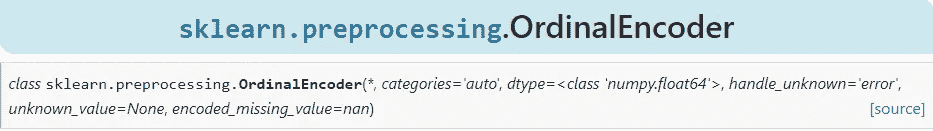[](https://medium.com/@gowthamsr37/which-feature-scaling-technique-to-use-standardization-vs-normalization-9dcf8eafdf8c) [## 标准化与规范化

### 特征缩放是强制性的吗？什么时候使用标准化？何时使用规范化？会发生什么……

medium.com](https://medium.com/@gowthamsr37/which-feature-scaling-technique-to-use-standardization-vs-normalization-9dcf8eafdf8c) 

让我们看看如何实际编码序数数据。

```
import pandas as pd
import numpy as npdf = pd.read_csv('customer.csv')df.head()
```

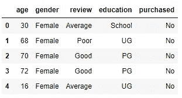

```
**df['age'].unique()** array([30, 68, 70, 72, 16, 31, 18, 60, 65, 74, 98, 51, 57, 15, 75, 59, 22,19, 97, 32, 96, 53, 69, 48, 83, 73, 92, 89, 86, 34, 94, 45, 76, 39,23, 27, 77, 61, 64, 38, 25], dtype=int64)**df['gender'].unique()** array(['Female', 'Male'], dtype=object)**df['review'].unique()** array(['Average', 'Poor', 'Good'], dtype=object)**df['education'].unique()** array(['School', 'UG', 'PG'], dtype=object)**df['purchased'].unique()** array(['No', 'Yes'], dtype=object)
```

**【年龄】** —数值数据

**‘性别’**—名义分类数据

**‘回顾’**—有序分类数据

**‘教育’**—有序分类数据

**‘已购’**—目标变量

让我们分离序数数据，并学习如何对它们进行编码。

```
df = df.iloc[:,2:]
df.head()
```

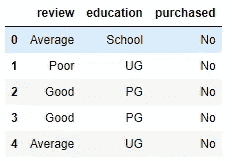

```
X = df.iloc[:,0:2]
y = df.iloc[:,-1]from sklearn.model_selection import train_test_split
X_train, X_test, y_train, y_test = train_test_split(X,y,test_size =0.2, random_state=1)from sklearn.preprocessing import OrdinalEncoderordinal_encoder = OrdinalEncoder(categories=[['Poor','Average','Good'],['School','UG','PG']])ordinal_encoder.fit(X_train)X_train = ordinal_encoder.transform(X_train)
X_test = ordinal_encoder.transform(X_test)
```

在上面的代码中，我们可以看到我们按照顺序将类别传递给了 ordinalEncoder 类，在特性审查的情况下，差是最低顺序，好是最高顺序。

同样，在教育栏的情况下，学校是最低顺序，PG 是最高顺序。

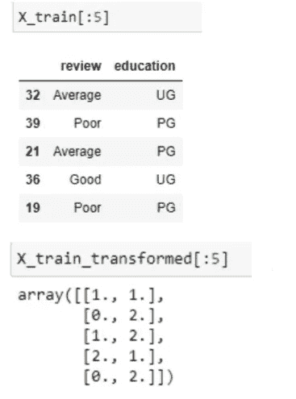

转换后，我们可以观察上面的结果，它显示了前 5 行。

第一行有 review = Average 和 education = UG，因此它被转换为[1，1]

第二行的 review = Poor，education = PG，因此转换为[0，2]

## 名义编码

名义数据没有内在的顺序，我们使用 sklearn 的 OneHotEncoder 类对名义数据进行编码。

如果我们开始对从 0，1，2 到所有类别的类别进行编码，那么机器学习算法将赋予 2 重要性(大于 0 和 1)，这将不是真的，因为数据是名义上的，并且没有内在的顺序。因此，这种方法不适用于名义数据。

这里，每个类别都将被转换为一个新列，并根据相应类别的出现情况被赋予值 0 或 1。因此，转换后功能的数量将会增加。

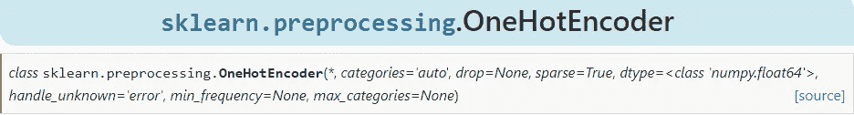

让我们看看如何实际编码名义数据。让我们拿一个带有特征‘性’和‘上船’(两者都是名义特征)的泰坦尼克号数据集。

```
import pandas as pd
import numpy as npdf = pd.read_csv('titanic.csv')df.head()
```

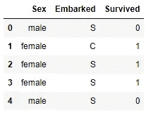

```
**df['Sex'].unique()**
array(['male', 'female'], dtype=object)**df['Embarked'].unique()** array(['S', 'C', 'Q'], dtype=object)**df['Survived'].unique()** array([0, 1], dtype=int64)
```

## OneHotEncoding 使用熊猫

```
pd.get_dummies(df,columns=['Sex','Embarked'])
```

下面的输出显示了每个类别是如何转换成一个列的。“Sex”列已转换为“Sex_female”和“Sex_male”，而“Embarked”列已转换为“Embarked_C”、“Embarked_Q”和“Embarked_S”。

这些新创建的属性/列被称为 ***虚拟变量*** 。

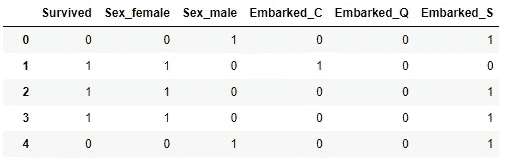

## **虚拟变量陷阱:**

虚拟变量陷阱是一种场景，其中有高度相关的属性(多重共线性)，一个变量预测其他变量的值。当我们使用*一键编码*处理分类数据时，那么一个虚拟变量(属性)可以在其他虚拟变量的帮助下预测。因此，一个虚拟变量与其他虚拟变量高度相关。

对模型使用所有虚拟变量会导致 ***虚拟变量陷阱*** (一些机器学习算法，如线性回归、逻辑回归存在多重共线性)

[](https://medium.com/@gowthamsr37/why-multicollinearity-is-a-problem-4c273d1d1f2e) [## 为什么多重共线性是一个问题？

### 什么是多重共线性？以及为什么我们应该在创建机器学习模型之前处理多重共线性

medium.com](https://medium.com/@gowthamsr37/why-multicollinearity-is-a-problem-4c273d1d1f2e) 

**例如** —
让我们考虑性别有两个值*男* (0 或 1)和*女* (1 或 0)的情况。包含两个虚拟变量会导致冗余，因为在这种情况下，如果一个人不是男性，那么这个人将是女性，因此，我们不需要在回归模型中使用两个变量。这将保护我们远离虚拟变量陷阱。

[](/how-to-verify-the-assumptions-of-linear-regression-54ba4d17c231) [## 我如何验证线性回归的假设？

### 线性回归的假设有哪些？以及如何用 python 来验证它们？

pub.towardsai.net](/how-to-verify-the-assumptions-of-linear-regression-54ba4d17c231) 

因此，模型的设计应该排除一个虚拟变量。通常，我们删除第一个变量，如下所示。

```
pd.get_dummies(df,columns=[‘Sex’,’Embarked’],drop_first=True)
```

结果显示第一个变量已被删除。**性别 _ 女性**和**上船 _C** 是从结果中掉出来的两列。

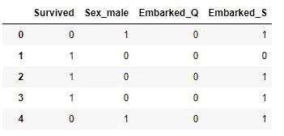

## 使用 Sklearn 进行 OneHotEncoding

我们可以使用 sklearn 的 OneHotEncoder 类来执行上述步骤。

```
X = df.iloc[:,0:2]
y = df.iloc[:,-1]from sklearn.model_selection import train_test_split
X_train,X_test,y_train,y_test = train_test_split(X,y,test_size=0.2,random_state=1)
```

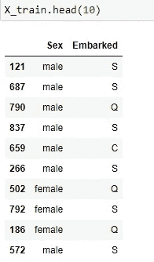

```
from sklearn.preprocessing import OneHotEncoder
ohe = OneHotEncoder(drop='first',sparse=False,dtype=np.int32)X_train_new = ohe.fit_transform(X_train)
X_test_new = ohe.transform(X_test)
```

请注意，将根据字母顺序创建新要素。在给定的示例中，按字母顺序将**‘性别’**列转换为**性别 _ 女性**和**性别 _ 男性**，女性被删除，因为它是第一列。

并且在**' emboaded '**特性中，**emboaded _ C**，**emboaded _ Q**和**emboaded _ S**是按照字母顺序排列的新列，类别‘C’已经被删除，因此数组[0，0]将表示 C，[1，0]表示‘Q’，而[0，1]表示‘S’。

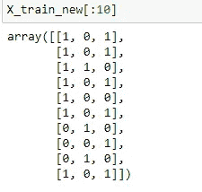[](/regression-metrics-6690815bb51f) [## 仅用 5 分钟解释 5 个回归指标

### 有哪些不同的回归指标？R2 分数会变成 0 吗？R2 分数什么时候会变成负数？什么是…

pub.towardsai.net](/regression-metrics-6690815bb51f)