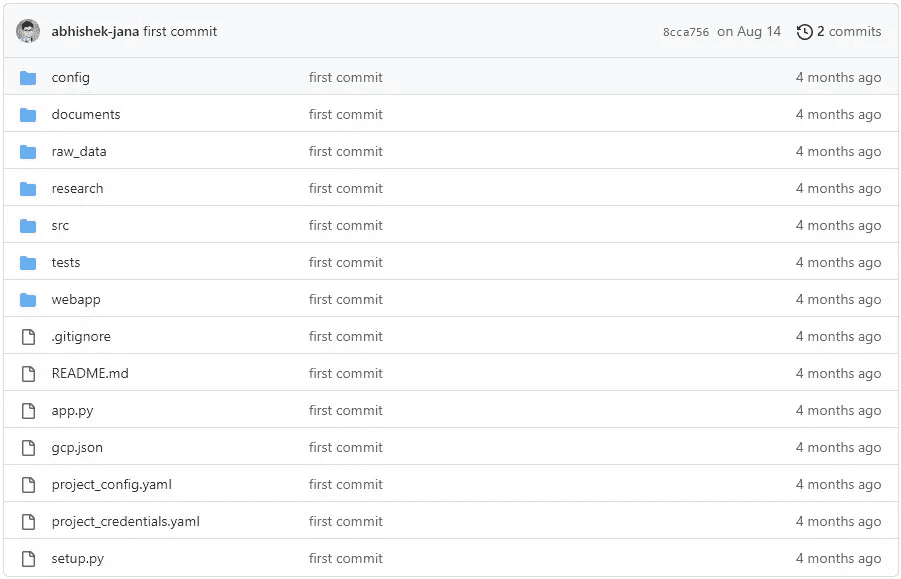

# 部署的端到端机器学习项目第 1 部分:项目设置

> 原文：<https://pub.towardsai.net/end-to-end-machine-learning-project-with-deployment-part-1-project-set-up-af156d98c776?source=collection_archive---------4----------------------->

## 让您的项目为机器学习做好准备:分步指南

我们中的许多人在进行端到端项目时经常犯直接进入编码的错误。当处理不需要太多预处理的小数据集时，这种方法可以很好地工作。在这些情况下，我们可以快速训练一个预测性的机器学习模型，并将其部署在云中。但是这种方法有其局限性。如果项目设置不正确，代码可能不是“可重用的”或“可伸缩的”，这可能会导致问题。

> 机器学习项目中的“可重用”和“可扩展”是什么意思？

“可重用”指的是一个项目或其组成部分在未来项目中被再次使用的能力。通过减少从头开始的需要，可重用性可以在未来的项目中节省时间、金钱和资源。

我们说，当一个项目可以很容易地适应更大或更小的数据集，而不需要对其整体设计或结构进行重大更改时，它就是“可伸缩的”。这一点很重要，因为它允许在各种情况下有效地使用项目，而不管它所处理的数据的大小。

如果你想知道如何开始，这里有一个分步指南。请记住，我不会详细解释代码，而是提供项目流程的概述。

# **第一步。不要编码！**

在开始处理数据集之前，仔细阅读并理解问题陈述和数据描述非常重要。这样做可以提供关于数据集的有价值的信息，例如它的来源、列的数量和名称，以及如何访问数据。在某些情况下，描述甚至可能表明数据集已经过时或常用，因此可能无法提供新的见解。让我们看一个例子。

我目前正在做一个[租赁自行车共享](https://github.com/abhishek-jana/rental_bike_share)，这是一个 10 年前的数据集，被许多数据科学爱好者使用。所以这不会给我们任何新的信息。因此，如果你看一下[数据集](https://archive.ics.uci.edu/ml/datasets/bike+sharing+dataset)，它给我们一个数据集的描述，甚至不需要查看数据。它告诉我们最新版本的数据的来源。我们可以利用这一点。

在行业中，数据描述通常与数据集一起提供。这被称为“**数据共享协议、**或 **DSA。**在开始分析之前，阅读并理解这些信息非常重要。这使我们进入下一步。

# 第二步。文档！

数据科学或机器学习项目通常涉及多个团队，如数据维护团队、数据分析团队、模型训练团队和前端开发团队。以清晰和有组织的方式记录项目很重要，这样所有团队成员都可以理解它并跟上最新的发展。当向涉众展示项目时，或者当新成员加入团队并需要快速上手时，这一点尤其重要。通过一致和全面地记录项目，团队可以确保每个人都在同一页上，并朝着相同的目标努力。

我们需要维护五种类型的文档:

*   **概要设计文档:**概要设计文档，简称 HLD，是概述项目整体流程的通用文档。它通常包括对将要使用的数据、项目中涉及的步骤以及完成项目所需的工具和资源的描述。该文档提供了项目的高级概述，用于指导开发团队实施项目。它还可用于向风险承担者和其他相关方传达项目的目的和目标。
*   **低层次设计文档:**低层次设计(LLD)文档是一个更加具体的文档，关注于数据处理和机器学习模型训练的细节。LLD 对项目的技术方面以及各种组件如何协同工作提供了更深入的观察。
*   **架构设计文档:** AD 提供一个程序内部结构的详细描述。它包括一个带有方法及其关系的类图，以及程序规范的描述。该文档作为程序员的指南，允许他们直接根据设计编写代码。
*   **线框文档:**这是项目部署后前端外观的预览。
*   **详细的项目报告:** DPR 主要面向利益相关者，介绍项目的总体发现。

概要设计(HLD)和详细设计(LLD)是项目的早期规划阶段，在这两个阶段中，项目的总体结构和详细规格分别被列出。一旦 HLD 和 LLD 被批准，开发团队就可以开始编写代码和创建应用程序设计(AD)和线框文档。项目进展和发现通常总结在最终文件中，称为详细项目报告(DPR)。

**第三步。选择一个模板！**

现在开始编码，我们可以创建一个 GitHub 库，并把我们的工作推到那里。

项目结构

这里有一个项目模板，可以帮助你开始一个新项目。在下面的部分中，我将解释模板中每个目录和文件的用途。现在，您可以克隆这个存储库并浏览“documents”目录。

阅读完本文后，您应该能够使用该模板为您自己的项目创建概要设计(HLD)和概要设计(LLD)。试一试，让我知道进展如何。

你可以在 [GitHub](https://github.com/abhishek-jana) 、 [LinkedIn](https://www.linkedin.com/in/ajana-1992/) 和 [medium](https://abhijana.medium.com/) 上关注我的最新动态，并随时了解即将发布的博客文章。

# 参考资料:

 [## GitHub-abhishek-Jana/sample _ project _ templet

### 在 GitHub 上创建一个帐户，为 abhishek-Jana/sample _ project _ templet 开发做贡献。

github.com](https://github.com/abhishek-jana/sample_project_templete) 

[https://ineuron.ai/](https://ineuron.ai/)