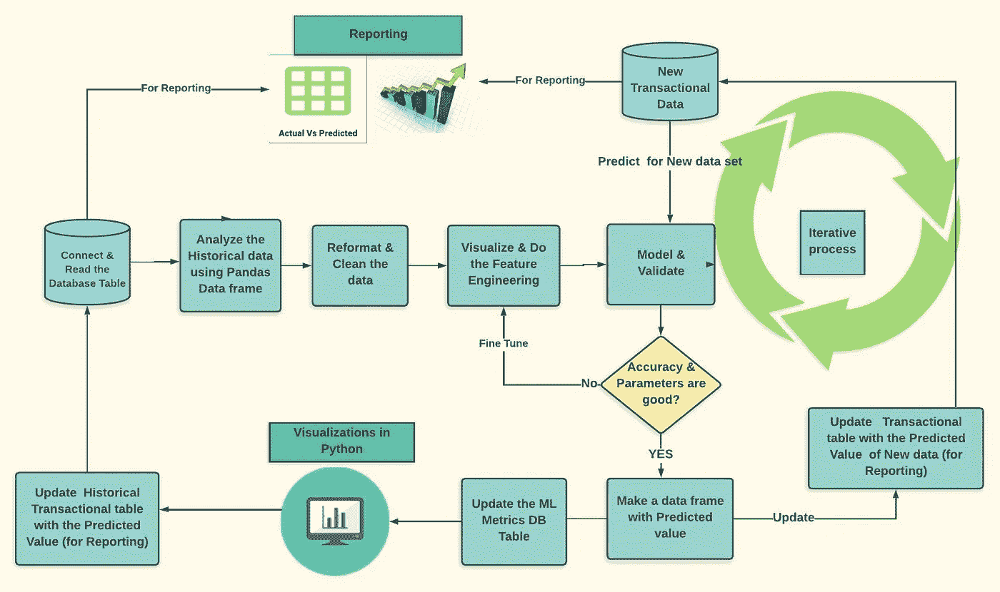
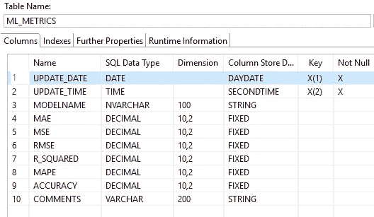
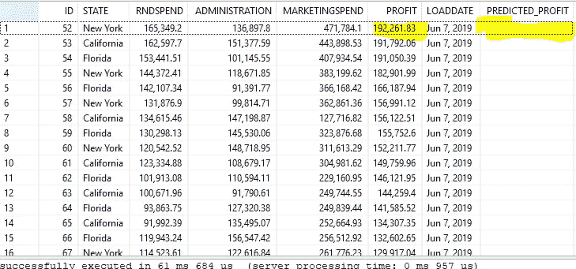
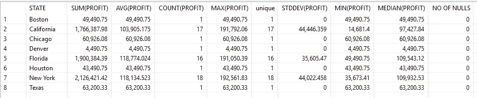
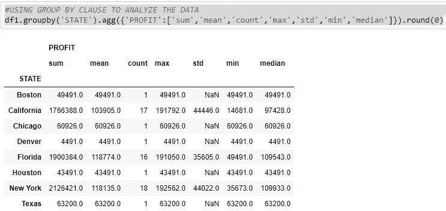
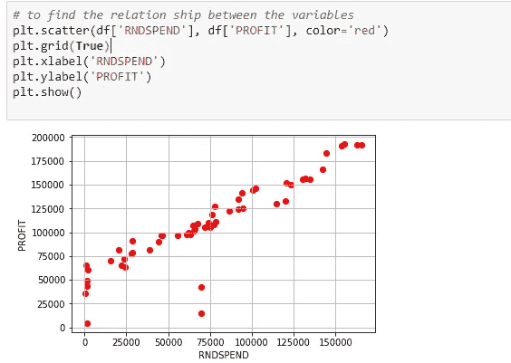
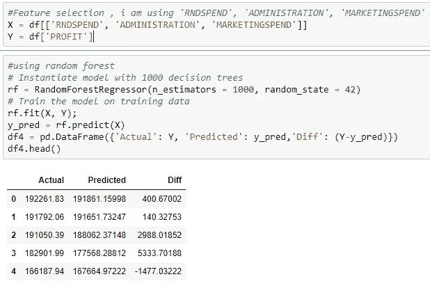
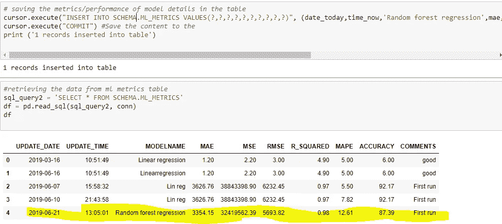

# 使用 Python 对 SAP HANA 表数据进行数据分析和预测的端到端模型

> 原文：<https://pub.towardsai.net/end-to-end-model-of-data-analysis-prediction-using-python-on-sap-hana-table-data-800614d956ca?source=collection_archive---------1----------------------->

## [机器学习](https://towardsai.net/p/category/machine-learning)， [Python](https://towardsai.net/p/category/programming/python)

这个博客帮助连接 SAP HANA DB(版本 1.0 SPS12)，然后从 HANA 表/视图中提取数据，并使用 Python Pandas 库分析数据。然后，您可以清理和选择独立变量/特征数据，以供机器学习算法预测因变量或找到见解。

在当今的数字经济中，企业无法根据陈旧的见解采取行动，因此真正的内存数据平台应该支持实时处理交易和分析公司的所有数据。SAP HANA 有助于在单一内存平台中管理数据，因此您可以立即采取行动。加快创新步伐，在这个新的数字经济中运行。SAP HANA 功能包括数据库服务、高级分析处理、应用程序开发、数据访问、管理和开放性。

Python 在分析和数据科学中越来越受欢迎。它也是便携、免费和简单的。Python 可以让您快速工作，更有效地集成系统。Python 有一个很大的库可供你使用，所以你不必为每一件事都写自己的代码。有用于正则表达式、文档生成、单元测试、web 浏览器、线程、数据库、CGI、电子邮件、图像处理和许多其他功能的库。

**场景:**我正在获取 state wise 初创公司的支出(研发支出、管理支出和营销支出)和利润数据。

目标是预测给定支出值集的利润。我在这里不解释关于 ML 算法和参数调整的细节。我想展示从 SAP HANA DB 提取数据、分析、清理、特征选择和应用机器学习模型的端到端流程，最后将结果和 ML 算法性能指标写回到 HANA 表中。

线性回归是研究和商业中最常用的模型，也是最容易理解的，因此使用随机森林回归方法我们可以预测利润。

下图显示了 ML 预测生命周期和用例中遵循的步骤。



这一过程涉及的基本步骤是:

1.检查 HANA 表数据，并在 HANA Studio/WEB IDE 中使用 SQL 进行分析。

(确保您拥有对 SAP HANA 数据库中的表执行 DML 操作所需的权限。)

2.用 python 导入 Pyodbc，Pandas，Sklearn，Matplotlib，seaborn 库。

3.创建到 HANA 数据库的连接，并执行所需的 SQL。

4.将所有历史数据提取到数据框对象中，并使用 pandas 开始在 Python 中对其进行分析。

5.进行特征工程、数据清洗，然后将最终的一组独立变量输入到机器学习算法(随机森林)中，以预测因变量(利润)。

6.分析机器学习算法指标，并通过重复步骤 5 进行微调以获得更高的准确性。将机器学习算法指标存储在日志表中，并将历史数据的预测值更新到 HANA 表中。

7.对于新数据集，创建 python 程序，该程序使用 Pyodbc 连接读取新数据，预测因变量(利润),并更新用于报告的实际事务表。

8.安排此计划，并持续监控模型指标和预测值。

## **1。** **检查 HANA 表数据并使用 SQL 进行分析**

我创建了两个表，一个包含实际的公司数据，用于存储交易数据。第二个存储机器学习算法的度量(例如:平均误差、R 平方、MAPE、RMSE、精确度等。)

请找出下面两个表格的结构。

主事务数据表结构。


存储评估参数的 ML 度量表。



预测前的历史数据(少于当前月份),各州的支出和利润如下所示。我还添加了预测利润列，使用 python 通过 ML 算法存储预测值，现在它被更新为 NULL。

**从**“模式”中选择 * **。"启动 _ 数据 2 "**



让我们使用 HANA Studio 中的 SQL 和可用函数来分析数据，我们可以使用下面的 SQL 找到平均值、标准差、中值、最大值、最小值和空值计数。(您可以尝试所有措施)

**选择**状态，**总和**(利润)，**平均值**(利润)，**计数**(利润)，**最大值**(利润)，**计数** ( **截然不同的**利润)**为**“独特”， **stddev** (利润)，**最小值**(利润)，中位数(利润)，

**sum**(**case****当** Profit **为** **NULL** **则**1**ELSE**0**END**)**为**【NULL 数】**来自**“模式”。【启动 _ 数据 2】**组** **由**状态**命令**由状态；



## **2。** **在 python 中导入 Pyodbc、pandas、Sklearn 库**

现在我来说说 Python 脚本接口(Jupyter 或者 spyder)。

导入所需的库。

PYODBC 是一个开源 Python 模块，它使得访问 ODBC 数据库变得简单。它实现了 DB API 2.0 规范，但是打包了更方便的 Pythonic。使用 Pyodbc，您可以通过 odbc 驱动程序轻松地将 Python 应用程序连接到数据源。

通常，Pyodbc 像任何其他 Python 包一样通过运行以下命令来安装:

```
pip install Pyodbc
```

从 Windows DOS 提示符或 Unix shell。

要使用 Conda run 安装此软件包:

```
conda install -c anaconda pyodbc
```

有关 Pyodbc 的更多信息，请参见 Github Pyodbc Wiki 。

Seaborn: Seaborn 是一个构建在 Matplotlib 之上的图形库。它可以让您的图表更漂亮，并有助于一些常见的数据可视化需求

Pandas 是一个开源的、BSD 许可的库，为 [Python](https://www.python.org/) 编程语言提供高性能、易于使用的数据结构和数据分析工具。

Numpy: NumPy 是使用 Python 进行科学计算的基础包。除了其明显的科学用途，NumPy 还可以用作通用数据的高效多维容器

Sklearn: Scikit-learn 通过 Python 中的一致接口提供了一系列监督和非监督学习算法。它具有各种[分类](https://en.wikipedia.org/wiki/Statistical_classification)、[回归](https://en.wikipedia.org/wiki/Regression_analysis)和[聚类](https://en.wikipedia.org/wiki/Cluster_analysis)算法，包括[支持向量机](https://en.wikipedia.org/wiki/Support_vector_machine)、[随机森林](https://en.wikipedia.org/wiki/Random_forests)、[梯度推进](https://en.wikipedia.org/wiki/Gradient_boosting)、 [k-means](https://en.wikipedia.org/wiki/K-means_clustering) 和 [DBSCAN](https://en.wikipedia.org/wiki/DBSCAN) ，并且设计用于与 Python 数值和科学库 [NumPy](https://en.wikipedia.org/wiki/NumPy) 和 [SciPy](https://en.wikipedia.org/wiki/SciPy) 互操作

## **3。** **创建一个到 HANA 数据库的连接，并执行所需的 SQL。**

建立连接，一旦建立了连接，您的应用程序就可以执行选择、插入或其他驱动程序和数据库支持的 ODBC 操作。

```
conn = pyodbc.connect(‘DRIVER={HDBODBC};SERVERNODE=10.xx.xxx.xx:30115;SERVERDB=ED1;UID=USERID;PWD=PASSWORD’)#Open connection to SAP HANA and check for count of records.# check if table has entriescursor = conn.cursor()sql_query1 = ‘SELECT count(*) FROM SCHEMA.STARTUP_DATA2’dcount = pd.read_sql(sql_query1, conn)dcountprint (‘Table exists and contains’, dcount.head(1), ‘records’ )
```

## **4。** **将数据提取到一个数据框对象中，并使用熊猫开始用 Python 对其进行分析**

执行 Select SQL，读取数据并将其保存到数据框中。将数据放入数据框后，您可以应用所有统计函数来分析数据，如下所示。

```
#querying the sap hana db data and store in dataframesql_query2 = ‘SELECT * FROM SCHEMA.STARTUP_DATA2’df = pd.read_sql(sql_query2, conn)df.head()#USING GROUP BY CLAUSE TO ANALYZE THE DATAdf1.groupby(‘STATE’).agg({‘PROFIT’:[‘sum’,’mean’,’count’,’max’,’std’,’min’,’median’]}).round(0)
```



## 5.**进行特征工程、数据清理，将最终的一组独立变量输入机器学习算法(随机森林)以预测一个因变量**

使用函数检查缺失值或空值，并相应地用平均值/模式替换这些值。

例如，我在 Rnd 支出列中有两个空值，所以用平均值/中值替换。如果该列有更多的空值，那么您可以从分析中删除该列。

对名义值进行编码，例如，州有 3 个唯一值(“纽约”、“加利福尼亚”、“佛罗里达”)，使用映射函数用 0、1、2 代码替换它们

```
Map ({‘New York’:0,’California’:1,’Florida’:2})
```

现在找到因变量和自变量之间的相关性，以最终确定用于预测的最终自变量/特征。观察数据后，选择(R&D 支出、管理支出和营销支出)作为自变量，利润作为因变量。

现在我用随机森林回归来预测利润。

随机森林或随机决策森林是一种用于[分类](https://en.wikipedia.org/wiki/Statistical_classification)和[回归](https://en.wikipedia.org/wiki/Regression_analysis)(以及其他任务)的[集成学习](https://en.wikipedia.org/wiki/Ensemble_learning)方法，其通过在训练时构建大量[决策树](https://en.wikipedia.org/wiki/Decision_tree_learning)并输出作为个体树的类(分类)或均值预测(回归)的模式的类来操作。随机森林是**袋装决策树**模型，其在每次分割(在每次迭代中)时在特征的**子集上训练。**



## **6。将机器学习算法指标存储在日志表中，并将预测值更新到 HANA 表中**

使用 insert 和 update 语句，您可以将数据发送回数据库表(例如:ML 度量和预测值)。在进行插入时，注意主键。



检查 SAP HANA 表中的数据，以查看预测利润列中的更新值。

## 7 .**。** **对于新数据集，创建 python 程序，该程序使用 Pyodbc 连接读取新数据，预测因变量(利润)并更新实际交易表用于报告**

在业务中，新的事务数据将流入表/数据仓库。(在我的例子中是 SAP HANA SQL 数据仓库)。对于新的数据集，假设您想知道如果我下个月花费“X”支出，会有多少利润。

分析这种成本增加/减少是否给你带来投资回报/利润。然后，

创建 Python 脚本，您可以在其中执行以下任务

获取新数据集，并通过预测器/模型对其进行处理

将预测值更新回数据库。

使用 Windows 调度程序/ python 调度程序调度此 python 脚本

## **8。** **安排此计划，并使用 HANA 模型/报告持续监控模型指标和预测值**

您可以使用 Windows 调度程序/使用如下所示的调度程序来调度 Python 脚本。

```
# sample piece of code$ pip install scheduleimport scheduleimport timedef predict_job(x,y,z):Y_pred = rf.predict([[x,y,z]])print(“Predicted Value is”, Y_pred)#@daily scheduleschedule.every().day.at(“10:30”).do(predict_job)schedule.every().monday.do(predict_job)while True:schedule.run_pending()time.sleep(1)
```

现在，在 SAP HANA 客户端工具 WEB IDE/ HANA Studio 中，创建 HANA 模型，将主要交易数据与维度表(如时间、位置)连接起来，以用于报告目的。

各州实际利润与预测利润对比图。

当使用 Python IDE(如 Jupyter)时，数据通过上述方法保存到客户端，这意味着当您拥有大型数据集时需要更多的处理时间，从而导致数据科学家的工作效率下降。

这就是 SAP HANA 数据框架能够为数据科学家的工作增加真正价值的地方。SAP HANA 2.0 SPS03 版本中包含更多特性和功能，可通过 Python 驱动程序(hdbcli)和用于机器学习算法的 Python 客户端 API 来分析/处理数据科学用例。

请在 GitHub 中找到 python 代码，以供参考

[https://github . com/josephreddy 07/Linear-regression-with-SAP-HANA-d b-Integration](https://github.com/JOSEPHREDDY07/Linear-regression-with-SAP-HANA-DB-Integration)

# 参考

[https://blogs . sap . com/2019/04/05/new-r-and-enhanced-python-API-for-sap-HANA-machine-learning-released/](https://blogs.sap.com/2019/04/05/new-r-and-enhanced-python-api-for-sap-hana-machine-learning-released/)

[https://blogs . sap . com/2018/04/06/whats-new-in-sap-HANA-2.0-SPs-03-by-the-sap-HANA-academy/](https://blogs.sap.com/2018/04/06/whats-new-in-sap-hana-2.0-sps-03-by-the-sap-hana-academy/)

[https://datatofish.com/python-script-windows-scheduler/](https://datatofish.com/python-script-windows-scheduler/)

[https://github.com/dbader/schedule](https://github.com/dbader/schedule)

[https://blogs . sap . com/2018/10/29/python-client-API-for-machine-learning-in-sap-HANA-2.0-express-edition-SPs-03-revision-33/](https://blogs.sap.com/2018/10/29/python-client-api-for-machine-learning-in-sap-hana-2.0-express-edition-sps-03-revision-33/)

[https://blogs . sap . com/2018/04/20/对 sap-hana-2.0-sps-03/中外部机器学习的增强](https://blogs.sap.com/2018/04/20/enhancements-to-external-machine-learning-in-sap-hana-2.0-sps-03/)

[https://help . sap . com/viewer/42668 af 650 f 84 f 9384 a 3337 BCD 373692/2 . 0 . 02/en-US/B2 a 37 c 7 ecec 2416 bbf 1889 B2 f 2883 ade . html](https://help.sap.com/viewer/42668af650f84f9384a3337bcd373692/2.0.02/en-US/b2a37c7ecec2416bbf1889b2f2883ade.html)

[https://towards data science . com/why-random-forest-is-my-favorite-machine-learning-model-b 97651 fa 3706](https://towardsdatascience.com/why-random-forest-is-my-favorite-machine-learning-model-b97651fa3706)