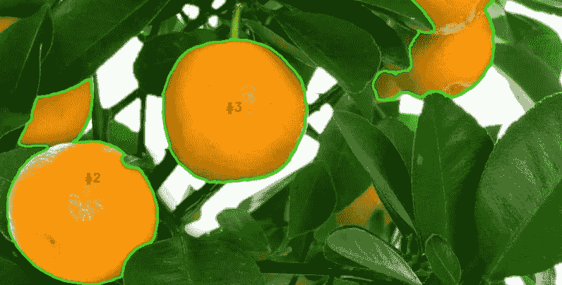
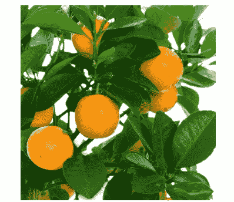
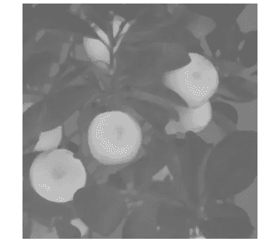
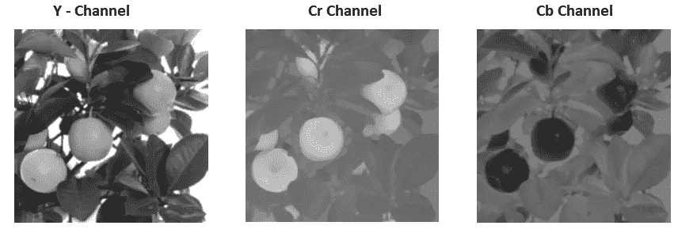
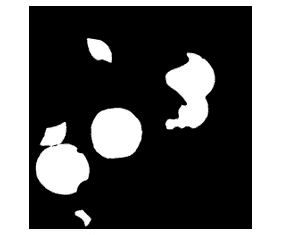
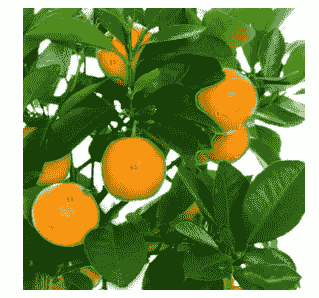

# 使用 Python 项目增强图像处理技能

> 原文：<https://pub.towardsai.net/enhance-image-processing-skill-with-python-project-9bbbb1ce338c?source=collection_archive---------0----------------------->

## [深度学习](https://towardsai.net/p/category/machine-learning/deep-learning)

## 图像处理中的目标检测和分割



作者图片

如今，目标定位是图像处理应用中一项基本而重要的任务。从 OpenCV 到深度学习有各种各样的方法，在本文中，我们借助 OpenCV 进行橘子定位。在这里，我们将做各种图像预处理任务，以实现良好的对象检测。

本文中使用的方法如下所示:

```
1\. Denoising Filters
2\. Color Space in image processing
3\. Threshold operations
4\. Pixel connections and noise removal
5\. Finding contours
6\. Drawing boundary on object
```

第一步是加载将在程序中使用的所有库，如下所示:

```
import numpy as np
import imutils
import cv2
```

**号**和**号**分别用于多维数值计算和图像功能操作。

现在，我们将借助 OpenCV 中的 read 方法来读取图像。将输入影像保存在 python 文件所在的文件夹中。

```
image = cv2.imread('o2.jpg')
```



输入图像。作者的照片

> ***去噪滤镜***

该滤波器将抑制输入图像中的噪声。过滤函数在代码下面使用。

```
dst = cv2.fastNlMeansDenoisingColored(image, None, 11, 11, 6, 12)#Argument pass to the denoising filter
p1 = 11: Kernel size to compute weights
p2 = 11: computing average weight
p3 = 6: luminescence strength filter
p4 = 12: color component filter 
```

OpenCv 的读取格式是 BGR，我们需要将其转换为 RGB 格式以进行进一步的预处理。

```
rgb_image = cv2.cvtColor(dst, cv2.COLOR_BGR2RGB)
```

> ***图像处理中的色彩空间***

图像处理中的颜色空间是在计算机视觉中用于各种应用的一种颜色模式和映射函数。这里，我们使用 YCrCb 颜色空间，因为在检查 Cr 图像后，可以很容易地将其转换为二值图像。

```
ycbcr_image = cv2.cvtColor(new_image, cv2.COLOR_RGB2YCrCb)#splitting all three channel of YCrCb
Y, Cr, Cb = cv2.split(ycbcr_image)#saving the Cr channel image
cv2.imwrite('Cr.jpg',Cr)
```



Cr 通道图像。作者的照片

YCrCb 的三个不同通道如下所示:



YCrCb 的三个通道图像。作者的照片

[](/opencv-different-color-spaces-in-image-processing-with-python-17bbed3592ad) [## OpenCV:Python 图像处理中的不同色彩空间

### 特征提取和目标检测的预处理技术

pub.towardsai.net](/opencv-different-color-spaces-in-image-processing-with-python-17bbed3592ad) 

> ***阈值操作***

在这一步中，我们将使用 Cr 图像来获得用于对象检测的二值图像。在 Cr 通道图像中很明显，二值图像可以分为黑白两类。

```
ret,th1=cv2.threshold(Cr,180,255,cv2.THRESH_BINARY+cv2.THRESH_OTSU)#saving the binary image
cv2.imwrite('Binary_image.jpg',th1)
```


二进制图像。作者的照片

[](/image-processing-morphological-operations-with-python-7e0f8d1983eb) [## 图像处理:用 Python 进行形态学运算

### 为了从图像中去除噪声

pub.towardsai.net](/image-processing-morphological-operations-with-python-7e0f8d1983eb) 

> ***像素连接和噪声去除***

现在，我们知道我们的对象橙色是二值图像中的白色像素，但图像中仍有一些噪声，这些也是橙色的像素，但形状不正确。我们可以通过腐蚀和膨胀等形态学操作来去除噪声。但是，在这一步中，我们将移除具有连通分量的噪声，这些连通分量将找到该区域并用阈值移除它们。

```
#getting the connected components area
nb_components, output, stats, centroids = 
           cv2.connectedComponentsWithStats(th1, connectivity=8)
```

黑色背景也是一个组件，但是我们不需要这个对象，用下面的代码移除这个背景

```
sizes = stats[1:, -1]; nb_components = nb_components - 1
```

现在，选择要从二进制图像中移除的像素区域。

```
min_size = 2000#your answer image
img2 = np.zeros((output.shape))#keeping the area above the threshold value
for i in range(0, nb_components):
    if sizes[i] >= min_size:
        img2[output == i + 1] = 255
        cv2.imwrite('img2.jpg',img2)

img3 = img2.astype(np.uint8) 
cv2.imwrite('binary_connected_components.jpg',img3)
```

这里，去除噪声的图像如下所示:



去噪图像。作者的照片

> ***寻找等高线***

这一步是找到图像中的轮廓，即下面代码中的白色像素区域:

```
# find contours in the thresholded image
cnts = cv2.findContours(img3.copy(), cv2.RETR_EXTERNAL,
                                     cv2.CHAIN_APPROX_SIMPLE)
cnts = imutils.grab_contours(cnts)
print("[INFO] {} unique contours found".format(len(cnts)))#output:
[INFO] 5 unique contours found
```

轮廓保存在 cnts 变量中。

> ***在对象上绘制边界***

现在，我们将在轮廓区域的帮助下围绕物体的边界。

```
# loop over the contours
for (i, c) in enumerate(cnts):
 # draw the contour
 ((x, y), _) = cv2.minEnclosingCircle(c)
 cv2.putText(image, "#{}".format(i + 1), (int(x) - 10, int(y)),
  cv2.FONT_HERSHEY_SIMPLEX, 0.6, (0, 0, 255), 2)
 cv2.drawContours(image, [c], -1, (0, 255, 0), 2)#save the result image
cv2.imwrite('Result_Image.jpg',image)
```



结果图像。作者的照片

> ***结论***

本文讨论了 OpenCV 中图像预处理的基本操作。

我希望你喜欢这篇文章。通过我的 [LinkedIn](https://www.linkedin.com/in/data-scientist-95040a1ab/) 和 [twitter](https://twitter.com/amitprius) 联系我。

# 推荐文章

1.[8 Python 的主动学习见解收集模块](/8-active-learning-insights-of-python-collection-module-6c9e0cc16f6b?source=friends_link&sk=4a5c9f9ad552005636ae720a658281b1)
2。 [NumPy:图像上的线性代数](/numpy-linear-algebra-on-images-ed3180978cdb?source=friends_link&sk=d9afa4a1206971f9b1f64862f6291ac0)3。[Python 中的异常处理概念](/exception-handling-concepts-in-python-4d5116decac3?source=friends_link&sk=a0ed49d9fdeaa67925eac34ecb55ea30)
4。[熊猫:处理分类数据](/pandas-dealing-with-categorical-data-7547305582ff?source=friends_link&sk=11c6809f6623dd4f6dd74d43727297cf)
5。[超参数:机器学习中的 RandomSeachCV 和 GridSearchCV](/hyper-parameters-randomseachcv-and-gridsearchcv-in-machine-learning-b7d091cf56f4?source=friends_link&sk=cab337083fb09601114a6e466ec59689)
6。[用 Python](https://medium.com/towards-artificial-intelligence/fully-explained-linear-regression-with-python-fe2b313f32f3?source=friends_link&sk=53c91a2a51347ec2d93f8222c0e06402)
7 全面讲解了线性回归。[用 Python](https://medium.com/towards-artificial-intelligence/fully-explained-logistic-regression-with-python-f4a16413ddcd?source=friends_link&sk=528181f15a44e48ea38fdd9579241a78)
充分解释了 Logistic 回归 8。[数据分发使用 Numpy 与 Python](/data-distribution-using-numpy-with-python-3b64aae6f9d6?source=friends_link&sk=809e75802cbd25ddceb5f0f6496c9803)
9。[机器学习中的决策树 vs 随机森林](/decision-trees-vs-random-forests-in-machine-learning-be56c093b0f?source=friends_link&sk=91377248a43b62fe7aeb89a69e590860)
10。[用 Python 实现数据预处理的标准化](/standardization-in-data-preprocessing-with-python-96ae89d2f658?source=friends_link&sk=f348435582e8fbb47407e9b359787e41)