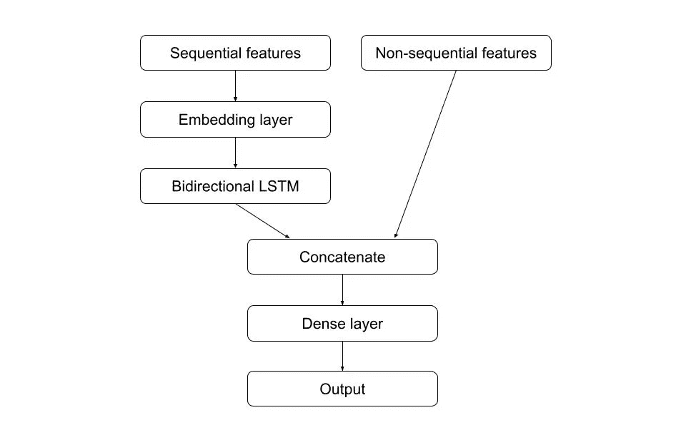

# 如何使文本输入的模型受益于用户的年龄

> 原文：<https://pub.towardsai.net/enriching-sequential-lstm-model-with-non-sequential-features-7224b5262132?source=collection_archive---------1----------------------->

## [深度学习](https://towardsai.net/p/category/machine-learning/deep-learning)

## **用非序列特征丰富序列 LSTM 模型**

序列数据可以在机器学习的各个领域和用例中找到，例如时间序列预测、生物信息学、语音识别或自然语言处理。随着深度学习的趋势，通常使用递归神经网络的变体对序列进行建模，递归神经网络在每个时间步长在*顺序地获取输入。*

然而，有时我们可能会有可用的**附加特性**，这些特性**是非连续的**，但仍然与我们试图解决的任务相关。例如，这些可能是我们试图预测其股票的公司的地理位置，我们试图识别其声音的说话者的性别，或者写产品评论的人的年龄。

这些特性可能不会成就或破坏你的模型，但是通常可以帮助你获得一点点性能。在本文中，我将向您展示如何将这些非顺序特性与 LSTM 结合起来，并训练一个单一的端到端模型。

不集中的光线，模糊的声音(2020)由[尤拉杰·波利亚克](http://www.jurajpoliak.sk)

## 资料组

因为我的背景主要是自然语言处理，所以我决定用一个相关的用例来演示这个原理。为此，我选择了名为[女装电商服装评论](https://www.kaggle.com/nicapotato/womens-ecommerce-clothing-reviews)的数据集。

数据集包含以*自由文本*编写的客户评论，这些评论对应于我们的序列数据(令牌序列——单词)。此外，它还包含客户年龄、产品 ID、产品部门、客户对产品的评级以及客户是否会向其他人推荐产品等特性。在我们的实验中，对他人的产品推荐实际上不会作为一个特征，而是作为*我们将尝试预测的目标值*。

## 基线

让我们首先创建一个序列模型，它只接受输入的评审的*文本，并且可以作为我们的基线。*

这里使用的模型相对简单。首先使用 [Glove:单词表示的全局向量](https://nlp.stanford.edu/projects/glove/)用单词嵌入来表示评论的文本。之后，该模型由一个双向 LSTM 层和一个全连接层组成。输出层使用*一个 sigmoid 函数*，因为我们的输出只是 0 或 1，对应于客户是否会推荐产品。

在 Keras 中，模型可能是这样的:

所描述的模型已经在所提到的数据集(以 90:10 的比例分割)上被训练和评估。这使得*的准确率达到了 89%* 。

## 添加非连续特征

现在，让我们向刚刚定义的同一个模型中添加非顺序特性。我看到有几种方法可以做到这一点。

其中之一是在序列的开头添加特征作为特殊标记。这样，*任何序列的前 N 个记号*将总是对应于这些特征。我不觉得这个解决方案特别干净，主要是因为这些特征需要以某种方式编码，并伪装成单词嵌入(或其他序列表示)。这可能会有一点麻烦和令人疲惫，主要是如果要素是不同的数据类型。

我更喜欢并且发现更干净的解决方案是用 **2 个独立输入**构建模型。这样，第一个输入可以纯粹用于顺序特征，第二个输入用于非顺序特征。顺序输入通常通过嵌入和 LSTM 层，然后与非顺序输入连接。*产生的组合向量*然后通过全连接层，最后通过输出层。下图展示了这种架构。

具有顺序和非顺序输入的模型的体系结构。图片作者。

Keras 中相应的代码如下所示:

我在这个模型中使用的非顺序特征是*客户年龄*和提供的*产品评级*。我发现，客户的年龄与客户是否会推荐该产品只有轻微的相关性(0.0342)，因此，我决定也使用产品评级，这显然是强相关的(0.7928)。这样做是为了演示添加非顺序特性的效果，然而，实际上我们可能没有这么强的特性。

要训练模型，您需要提供如下单独的输入:

最终的模型达到了*94%*的精确度，在我们的例子中，与基线相比**增加了 5%**。当然，改进完全依赖于提供给模型的特性的质量，但是一般来说，任何与您的目标值至少有一点相关的非顺序特性都应该有所帮助。

## 结论

在本文中，我们演示了如何将两种不同类型的输入组合成一个端到端模型。在实践中，我们不需要将自己限制在任何给定的输入数量，而是添加我们想要的数量。你可以想象另一个输入，例如*一个图像*，在与其余输入连接之前，它通过几个卷积层。

我希望这种方法能对您未来的项目有所帮助。

我用过的所有**代码**都在[这个 kaggle 笔记本](https://www.kaggle.com/sebastianpoliak/sequential-model-with-non-sequential-features)里。

感谢您的阅读！

 [## 1 到 5 星评级—分类还是回归？

### 通过实验找出答案。

towardsdatascience.com](https://towardsdatascience.com/1-to-5-star-ratings-classification-or-regression-b0462708a4df)  [## 通过观察偏差和方差来系统地调整你的模型

### 有没有想过是否有比盲目猜测超参数或…更系统的方法来调整您的模型

towardsdatascience.com](https://towardsdatascience.com/systematically-tuning-your-model-by-looking-at-bias-and-variance-4986662315b2)