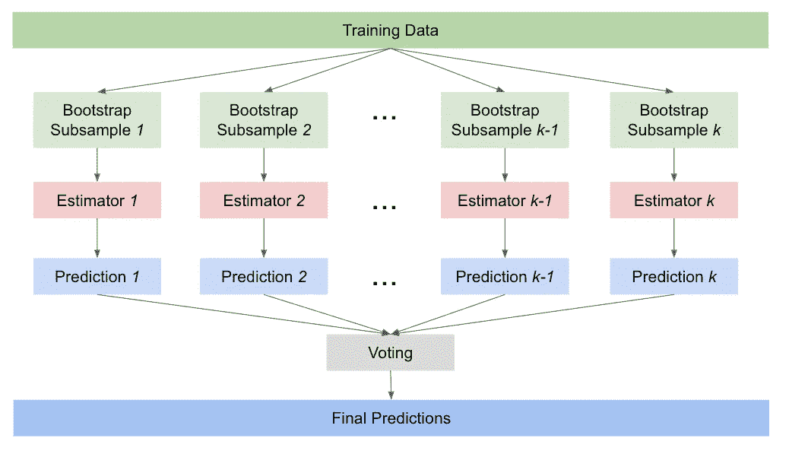

# 用简单英语解释的集合方法:装袋

> 原文：<https://pub.towardsai.net/ensemble-methods-explained-in-plain-english-bagging-47bef8ac7690?source=collection_archive---------2----------------------->

## [机器学习](https://towardsai.net/p/category/machine-learning)

## 用 Python 中的例子理解 bagging 背后的直觉

在本文中，我将介绍一种流行的同质模型集成方法——bagging。同质集成结合了大量的基础估计器或相同算法的弱学习器。

同质集合背后的原则是“群体智慧”的想法——许多不同模型的集体预测比单个模型做出的任何一组预测都好。实现这一点有三个要求:

1.  模型必须是独立的；
2.  每个模型的表现都略好于随机猜测；
3.  所有的单个模型本身都有相似的性能。

当这三个要求都满足时，添加更多的模型应该会提高您的整体性能。

集成方法有助于减少方差并防止过度适应训练数据集，从而使模型能够更好地学习泛化模式，而不是过度适应训练数据集中的噪声。

# 制袋材料

## 装袋的工作原理

在 bagging 中，大量独立的弱模型被组合在一起，以同样的目标学习同样的任务。术语“bagging”来自`**b**ootstrap + **agg**regat**ing**`，其中每个弱学习者都在用替换(bootstrapping)采样的数据的随机子样本上接受训练，然后模型的预测被聚合。

Bootstrapping 保证了独立性和多样性，因为每个数据子样本都是用替换法单独采样的，我们只剩下不同的子集来训练我们的基本估计量。

基本估计器是弱学习器，其性能仅比随机猜测稍好。这种模型的一个例子是最大深度限制为三的浅层决策树。然后通过平均将这些模型的预测结合起来。

Bagging 可以应用于分类和回归问题。对于回归问题，最终预测将是基本估计量预测的平均值(软投票)。对于分类问题，最终的预测将是多数票(硬投票)。



Bagging 算法图

## 用 Scikit-Learn 实现 Bagging 算法

您可以使用 Python 包 Scikit-Learn 中的`[BaggingRegressor](https://scikit-learn.org/stable/modules/generated/sklearn.ensemble.BaggingRegressor.html)`或`[BaggingClassifier](https://scikit-learn.org/stable/modules/generated/sklearn.ensemble.BaggingClassifier.html)`构建自己的打包算法。

首先，实例化您的基本估算器，并将其作为您的基本估算器输入到`BaggingRegressor`或`BaggingClassifier`中。下面是一个以线性回归作为基本估计量的 bagging 回归器示例，以及一个以决策树分类器作为基本估计量的 bagging 分类器示例。估计值的默认数量是 10。

```
from sklearn.linear_model import LinearRegression
from sklearn.ensemble import BaggingRegressorreg_lr = LinearRegression()
reg_bag = BaggingRegressor(base_estimator=reg_lr)
reg_bag.fit(X_train, y_train)====================================================================from sklearn.tree import DecisionTreeClassifier
from sklearn.ensemble import BaggingClassifierclf_dt = DecisionTreeClassifier(max_depth=3)
clf_bag = BaggingClassifier(base_estimator=clf_dt)
clf_bag.fit(X_train, y_train)
```

## 随机森林

随机森林是打包算法的一个流行例子。它使用平均来集成在训练数据集的子集上训练的多个单独的决策树。

使用 Python 中的 [scikit-learn 的随机森林](https://scikit-learn.org/stable/modules/generated/sklearn.ensemble.RandomForestClassifier.html)，可以指定特定于树的参数。以下是一些需要调整的重要超参数，以便针对您的数据集进行优化:

*   `n_estimators`:待汇总训练的树数。通常 100 到 500 棵树就足够了，一般来说，更多的树会改善你的模型(收益递减),但这也会增加计算量；
*   `max_depth`:一棵树的最大深度。更深的树将有助于减少偏差，但代价是增加方差。随机森林中多个树的聚合有助于解决这个问题，但您仍然应该小心；
*   `max_features`:每次分割要考虑的最大特征数。一个好的起点通常是特性数量的平方根。

随机森林中的另一个重要概念是出袋(OOB)分数。当执行自举时，会有实例被遗漏在用于训练估计器的子样本之外。这些样本外实例可用于评估模型，以获得随机(OOB)得分，本质上类似于随机森林模型的伪验证集。要获得 OOB 分数，请在初始化随机森林对象时设置`oob_score=True`。

```
rf = RandomForestClassifier(n_estimators=100, oob_score=True)
rf.fit(X_train, y_train)
print(rf.oob_score_)
```

请注意，如果您的要素中存在空值，scikit-learn 的随机森林算法将返回一个错误，因此请记住在对您的数据调用 fit 之前用 pandas 的`fillna`填充空值，否则它将抛出一个错误。

## 装袋的利弊

*   **减少方差**:假设抽样是通过自举真正随机完成的，装袋通常有助于减少方差和防止过度拟合。
*   **易于并行化**:估值器是独立的，因此模型可以与 bagging 并行构建。
*   **更高的稳定性和稳健性**:聚集在一起的大量估计量有助于为预测提供更高的稳定性和稳健性。
*   **难以解释**:bagging 算法的最终预测是基于基本估计量的平均预测。虽然这提高了准确性，但解释模型变得更加困难。

# 摘要

Bagging 基于集体学习的思想，其中许多独立的弱学习者在数据的自举子样本上接受训练，然后通过平均进行聚合。它可以应用于分类和回归问题。

随机森林是打包算法的一个流行例子。当在随机森林中为数据集调整超参数时，需要注意的三个重要方面是:I)树的数量(`n_estimators`)；ii)修剪树(从`max_depth`开始，但也要探索节点和/或分割所需的样本)iii)每次分割要考虑的最大要素数量(`max_features`)。

Bagging 是一个非常强大的概念和模型集成方法的例子。希望这能激励你在下次处理预测建模问题时尝试 bagging 算法！