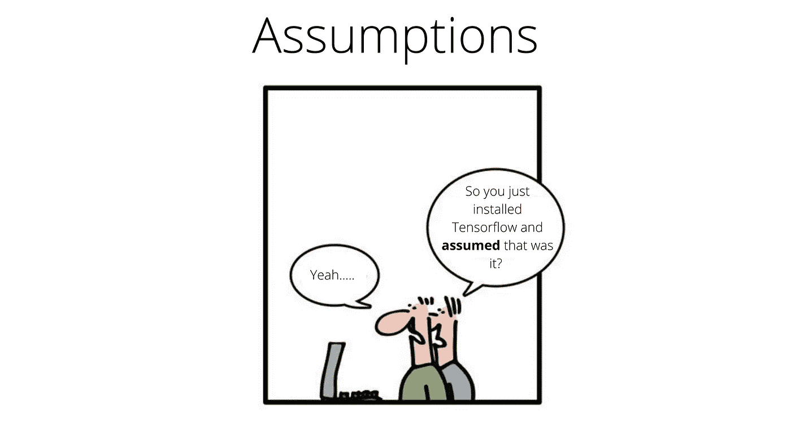

# 确保每个机器学习项目的成功

> 原文：<https://pub.towardsai.net/ensure-success-of-every-machine-learning-project-dbe1ea187597?source=collection_archive---------1----------------------->

## 确保必要的辩论并防止项目即将失败。

-由[geek-and-poke.com](http://geek-and-poke.com/)下 [CC-BY-3.0](https://creativecommons.org/licenses/by/3.0/)

> 机器学习项目甚至可以让无神论者相信“细节决定成败”。

*据称*，Gartner 的一份报告预测 **85%的机器学习项目会失败**。嗯，我不太惊讶。

酪有一种治疗方法，我们将在本博客后面探讨。

# 问题是

问题不在于团队之间和团队内部没有足够的讨论。

相反，问题在于:

*   不同背景的人理解不同的语言
*   *在定义一个 ML 项目时，几乎总是缺少一种通用语言*
*   大多数讨论很快变成了中国耳语游戏
*   由假设产生的模糊性会不断积累
*   在最初的时间跨度内完成变得不可行

> 长话短说，可能会很乱！
> 
> 为什么？
> 
> 简单的回答:假设

# 解决方案

来自 DeepMind 的论文[机器学习的分析水平](https://arxiv.org/abs/2004.05107)讨论了如何利用 Marr 的分析水平:

*   尽量减少项目不同层面的假设
*   通过为来自不同背景的人们提供一种共同的语言
*   并鼓励相关的讨论/辩论
*   为了避免最后一分钟的损失控制

# 背景

Marr 的*层次分析*最初是一个来自神经科学的概念，它促进了这样一种观点，即诸如大脑、计算机或人类行为这样的复杂系统应该在不同的层次上被理解。

虽然这些层次传统上被用来对生物行为进行逆向工程，但 Marr 的框架被证明是对复杂系统进行推理的一种优雅而流行的方式。

# 期望的结果

Marr 框架的预期结果是:

*   将解决方案分成不同的级别
*   鼓励每个级别的讨论
*   分歧是这些讨论的预期结果
*   迫使任何不同的假设公开化
*   探索和比较每个级别的不同解决方案
*   产生双方同意的解决方案

# ML 实现

Marr (1982)确定了一个描述和分析计算系统的三层体系:

## 计算级别:

*   项目的目标是什么？
*   每个模型对项目目标的预期贡献是什么？
*   数据的各种格式是什么？
*   ML 模型的期望输出是什么？
*   我们如何制定一个 ML 模型的效率？
*   训练集的规模和质量如何？
*   在生产中，开发/测试集在多大程度上模拟了 ML 模型的输入？
*   生产中输入数据的预期速度是多少？
*   可供选择的硬件有哪些？
*   以及其他等等

## 算法级别:

*   创建 ML 模型的候选算法有哪些？
*   每种算法的优缺点是什么？
*   每个算法的内在可伸缩性如何？
*   每种算法的样本效率如何？
*   每个算法在不同域上的泛化能力如何？
*   在分布式系统上并行化算法的效率有多高？
*   每个算法的资源效率如何？
*   以及其他等等

## 实施级别:

*   使用什么语言？
*   使用什么框架？
*   如何针对提供的硬件优化算法？
*   如何保证最小延迟？
*   如何持续更新模型？
*   算法如何规模化？
*   以及其他等等

# 注意

> 这种讨论层次结构还使我们能够选择哪些人需要参加哪些讨论。
> 
> 项目期间的大量时间被浪费了，因为人们最终参加了他们没有参与的会议。

# 结论

这些层次运作良好的原因是，它们允许每个人使用一个共同的参考框架来进行讨论，突出不同的选择或假设，简化讨论，同时也鼓励怀疑。

> 感谢你的阅读！祝你今天开心！玩的开心！