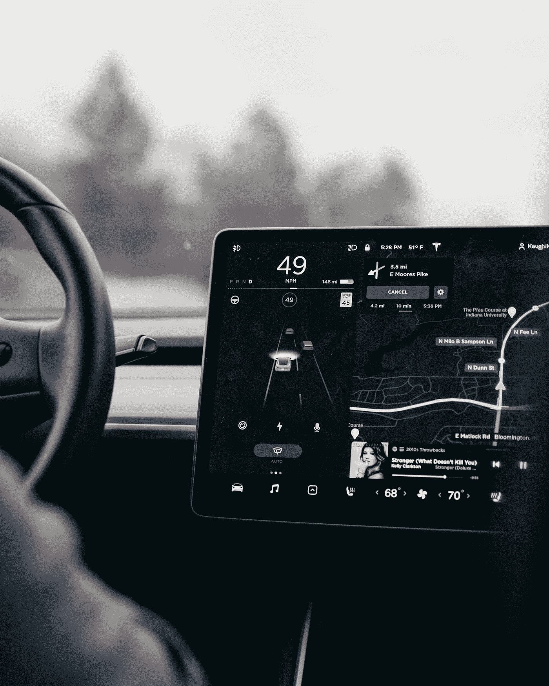

# 利用世界上最大的公共场景数据库确保自动驾驶汽车的安全部署

> 原文：<https://pub.towardsai.net/ensuring-safe-autonomous-vehicle-deployments-with-the-worlds-largest-public-scenario-database-42b45ed70fba?source=collection_archive---------3----------------------->

在 [Unsplash](https://unsplash.com?utm_source=medium&utm_medium=referral) 上由 [Karthik Sridasyam](https://unsplash.com/@karthik1324?utm_source=medium&utm_medium=referral) 拍摄的照片

## [自动驾驶汽车](https://towardsai.net/p/category/self-driving-cars)

## 通过合作和知识交流实现安全自动驾驶汽车部署的计划

今天，华威大学与 Deepen AI 合作推出了全球最大的公共场景数据库**Safety Pool**TM Scenario Database，后者是一家总部位于硅谷的初创公司，为自主系统提供唯一安全第一的数据生命周期工具和服务，并得到世界经济论坛 Innovate UK Zenzic 的支持。

**安全池** TM 计划的任务是通过协作和知识交流，实现安全的自动驾驶汽车部署。

该计划建立了一个公共存储库，行业、政府、创业公司和其他利益相关者可以在其中访问测试场景(不同的可能性)。

该数据库包含各种运营设计领域(赔率或运营条件)的一系列不同场景，政府、行业和学术界可以使用这些场景来测试和基准测试自动驾驶汽车系统，并提供对数据驱动的政策和监管指南的见解。

最初的场景是在华威大学的 WMG 开发的一种新的混合方法的帮助下创建的，这种方法结合了基于知识和基于数据的方法。

# 自动驾驶汽车解决方案数据库

安全池方案数据库将使组织能够在其库中创建方案，通过共享和公共库与其他组织合作，并允许公众提交具有挑战性的真实世界方案。

通过将场景与特定的环境和运行条件相匹配，可以在模拟环境、受控测试设施和公共道路上进行试验和测试，利用来自每个环境的证据来了解我们对安全行为的理解，使自动驾驶汽车快速接近市场。

自动驾驶汽车在上路之前必须被认为是安全就绪的，并且要求它们比一般的人类驾驶员更安全。

出于这个原因，有人提议在 110 亿英里的道路上测试它们，这在现实世界中是不可能的任务。因此，在模拟环境中的虚拟道路上进行测试的能力对于制造商和政府机构来说至关重要，以确保安全行为和自动驾驶汽车对道路安全产生积极影响。

自动驾驶汽车的实际测试将是这些行驶里程的质量和复杂性，这导致行业广泛采用基于场景的测试方法，以确保自动驾驶汽车的行为和能力为现实世界做好准备。

# 结论

根据华威大学的说法，安全池倡议欢迎世界各地的政府和行业利益相关者加入该倡议，并带头将安全标准和认证带到各自的国家。

欢迎自动驾驶汽车行业的成员加入 Safety PoolTM 社区，并访问安全场景，以透明地测试、验证和基准测试广告。

请访问 [www.safetypool.ai](http://www.safetypool.ai) 了解更多信息并加入这项任务。

# 还有一件事…

如果你有兴趣阅读关于自动驾驶技术和机会的文章，下面的文章会让你感兴趣:

*   [分析自动驾驶汽车治理生态系统:决策者指南](https://medium.com/predict/analyzing-the-autonomous-vehicle-governance-ecosystem-a-guide-for-decision-makers-d0ccea14e702)
*   [测量共享和电动自动驾驶汽车(SAEV)对城市交通的影响](https://jairribeiro.medium.com/measuring-the-effects-of-shared-and-electric-autonomous-vehicles-saev-on-urban-mobility-417b404128e4)。
*   [自动驾驶汽车:500 亿美元的颠覆机会](/autonomous-vehicles-a-50-billion-opportunity-for-disruption-2f032678c62f)
*   [沃尔沃集团和 Aurora 宣布在自动驾驶交通领域建立合作关系](https://medium.com/predict/volvo-group-and-aurora-announced-a-partnership-on-autonomous-transportation-e0d625300a8b)。
*   [这就是自动驾驶卡车将如何重塑运输行业。](https://medium.datadriveninvestor.com/this-is-how-driverless-trucks-will-reshape-the-transportation-industry-eadca7559a47)
*   [在无人驾驶卡车竞赛中领先的 18 家公司和初创公司](https://medium.datadriveninvestor.com/18-companies-and-startups-that-are-leading-the-race-for-the-autonomous-trucks-4ba5a50e6dee)
*   [自主车辆来了！你准备好了吗？](https://jairribeiro.medium.com/just-published-my-newsletter-about-autonomous-vehicles-8798d27fe9c3)
*   [2021 年中国将有 5000 辆自动驾驶卡车上路](https://medium.datadriveninvestor.com/5-000-autonomous-trucks-will-hit-the-roads-in-china-in-2021-4e13ab17b54e)

# 资源:

*   世界上最大的公共场景数据库，用于测试和…[https://www . eurekalert . org/pub _ releases/2021-03/uow-WLP 033121 . PHP](https://www.eurekalert.org/pub_releases/2021-03/uow-wlp033121.php)
*   www.warwick.ac.uk/fac/sci/wmg 华威大学 WMG 分校
*   深化艾-
*   **世界上最大的用于测试和确保自动驾驶汽车安全部署的公共场景数据库—[https://warwick . AC . uk/newsandevents/press releases/worlds _ largest _ public](https://warwick.ac.uk/newsandevents/pressreleases/worlds_largest_public)**