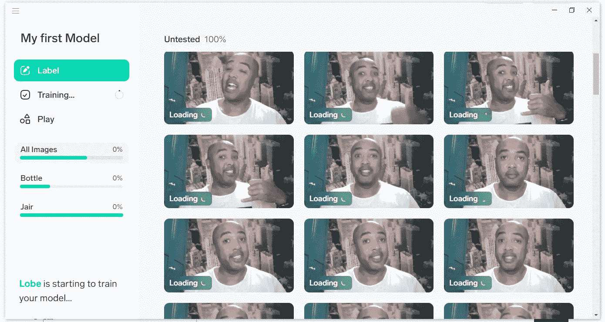
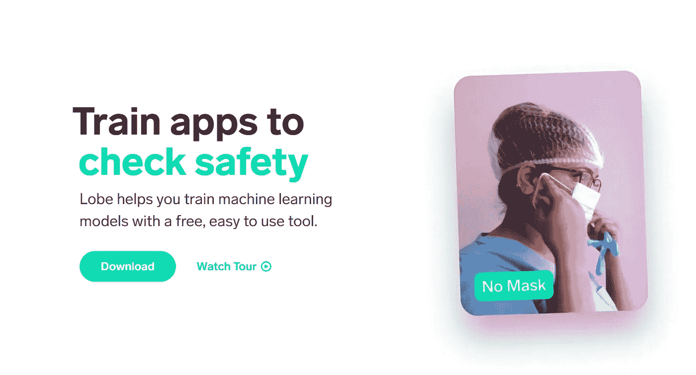
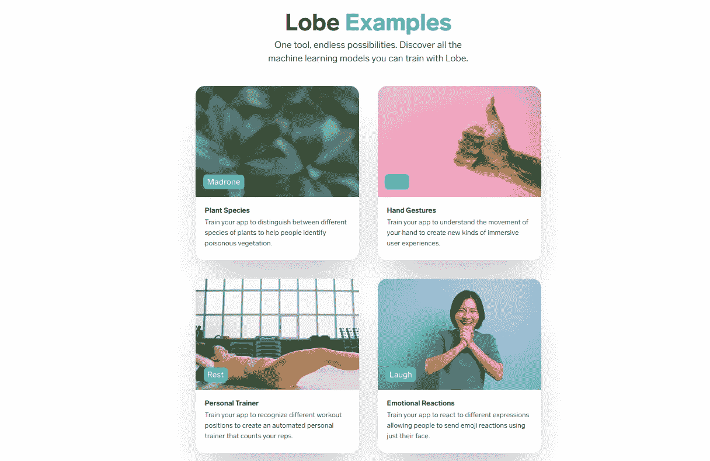

# Lobe 是什么，微软是如何努力让 AI 成为主流的？

> 原文：<https://pub.towardsai.net/enter-lobe-and-how-microsoft-is-trying-to-make-ai-mainstream-419c9dfe55f5?source=collection_archive---------2----------------------->

## [自动化机器学习](https://towardsai.net/p/category/automl)

## 微软发布了一个工具的免费公开预览，让人们不用编写一行代码就可以训练人工智能模型。

人工智能和机器学习是复杂的。我们必须承认。它们需要先进的知识和经验，但今天微软开始用一种非常用户友好的工具来改变这种情况，这种工具叫做 [Lobe](https://lobe.ai/) ，这是一种免费的软件框架，允许任何人创建机器学习模型——不需要任何技术技能。

云计算、通用 GPU、大型数据集可用性的增加以及人工智能机器学习子集深度学习的进步，引发了现代人工智能淘金热，但该技术的复杂性仍然是许多人的准入门槛。

[波瓣](https://lobe.ai/)背后的想法并不新鲜。它始于 2016 年 8 月由[迈克·马塔斯](https://www.linkedin.com/in/mike-matas-a53b3b21/)、[亚当·孟格斯](https://www.linkedin.com/in/adammenges/https://www.linkedin.com/in/adammenges/)、[马库斯·贝辛格](https://www.linkedin.com/in/mbeissinger/)发起，2018 年 9 月[微软收购 AI 初创公司 Lobe](https://techcrunch.com/2018/09/13/microsoft-acquires-lobe-a-drag-and-drop-ai-tool/) 允许任何人创造人工智能。

资料来源:https://lobe.ai/

# 什么是 Lobe？

[Lobe](https://lobe.ai/) 是一个 Windows 或 Mac 桌面软件程序，允许每个人创建用于图像分类的机器学习模型。

它让你在一个简单的拖放界面的帮助下建立机器学习模型。

步骤很简单-使用网络摄像头或现有图像创建数据集，标记类别，训练模型，评估结果，然后运行模型。

一旦开发了模型，您就可以将它导出到多个平台。Lobe 模型可以导出为[tensor flow 1.15 saved model](https://www.tensorflow.org/tutorials/keras/save_and_load)，这是运行 TensorFlow 1.x 或托管在 AWS、Google Cloud 和 Azure 上的 Python 应用程序中使用的标准格式。

Lobe 支持苹果 iOS 通过 Core ML 构建 iOS、iPad、Mac 应用。出口到 [TensorFlow Lite](https://www.tensorflow.org/lite) 支持 Android / Raspberry Pi 智能手机和物联网应用。Lobe 支持本地、电子表格和照片，它提供 Python 和。用于导出的. NET APIs。

来源:https://lobe.ai/examples

# 你能用 Lobe 做什么？

微软表示，早期用户使用 Lobe 创建的应用程序可以识别危险的植物，检测黄蜂等蜂箱入侵者，或者在他们误开车库门时发出警告。

Lobe 的分类模型可用于许多方面。[例子](https://lobe.ai/examples)包括教软件区分有毒和无毒植物，用表情符号回应面部表情，以及验证口罩佩戴。

目前，Lobe 只支持图像分类项目，但我可以想象未来可以发布对象检测和数据分类模型。

# 结论

随着 Lobe 今天向公众发布，微软已经迈出了将机器学习推向大众的第一步——这一变化将加速 AI 从 B2B 走向主流客户。

现在，每个人都可以获得机器学习技能，不需要任何技术知识就可以创建模型。

它能代表人工智能民主化的新一步吗？

# 更多相关内容

如果你想阅读更多关于 Lobe、人工智能和数据科学的内容，这里有一些我写的关于它的其他文章:

 [## 微软刚刚给 Lobe 增加了 3 个有趣的新功能。

### 微软刚刚发布了一个新版本的工具，让你不用写一行代码就可以训练人工智能模型。

jairribeiro.medium.com](https://jairribeiro.medium.com/check-these-3-interesting-new-features-in-lobe-39bf4dfedcc7)  [## 23 个令人惊叹的 Youtube 频道，让你免费学习人工智能、机器学习和数据科学…

### 这是开始学习新东西的完美时刻，为什么不从人工智能开始呢？

medium.com](https://medium.com/swlh/21-amazing-youtube-channels-for-you-to-learn-ai-machine-learning-and-data-science-for-free-486c1b41b92a)  [## Google object Ron——3D 物体探测的巨大飞跃

### 谷歌刚刚宣布推出 MediaPipe Objectron，这是一项用于实时检测 3D 图像的移动技术

towardsdatascience.com](https://towardsdatascience.com/google-objectron-a-giant-leap-for-the-3d-object-detection-9d8393b7a183)