# 具有空间的企业级 NER

> 原文：<https://pub.towardsai.net/enterprise-grade-ner-with-spacy-eb14532e5870?source=collection_archive---------2----------------------->

## [自然语言处理](https://towardsai.net/p/category/nlp)

## 在几分钟内构建行业优势命名实体识别(NER)应用程序…

空间=不受空间/平台限制+更快的计算速度

命名实体识别是自然语言处理中最重要和应用最广泛的任务之一。这是从一堆非结构化或半结构化数据中提取实体(关键信息)的方法。实体可以是指同一事物的任何单词或一系列单词。每个检测到的实体被分类到预定的类别中。例如，NER 模型可能检测到文本中的单词“India ”,并将其归类为“Country”。

我们在日常生活中使用的许多流行技术，如 Siri、Alexa 等智能助手，都是由命名实体识别支持的。NER 的一些其他现实应用包括客户支持的票务分类、简历筛选、授权推荐引擎。这里有一个 NER 的例子:

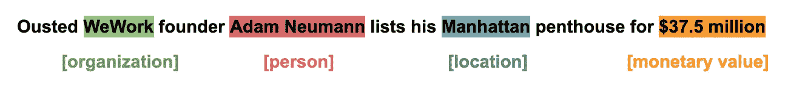

现在，无论您是 NLP 新手还是有一些先验知识，spacy 都有适合每个人的东西。它迎合了从初学者到高级观众的各种需求。现在让我们了解一下 ***是什么，为什么，以及如何成为*** 的一部分。

# spaCy 是什么？

spaCy 是一个**免费的开源库**，用于高级**自然语言处理** (NLP)，具有对 Python 的原生支持。如今，对于数据科学家和组织来说，使用预训练的空间模型来完成生产级 NER 任务，而不是在内部从头开始训练新模型，已经成为事实上的选择。

如果您正在处理大量的文本，您最终会想要了解更多的信息。比如说，讲的是什么？这些单词在上下文中是什么意思？谁在对谁做什么？提到了哪些公司和产品？哪些文本彼此相似？… ***spaCy 会回答你所有的问题***

spaCy 是专门为**生产使用**而设计的，帮助您构建处理和“理解”大量文本的应用程序。它可以用来构建**信息抽取**或**自然语言理解**系统或为**深度学习**预处理文本。

> **空间**是**快速**，**精确**，**人性化**带有**温和的学习曲线** …

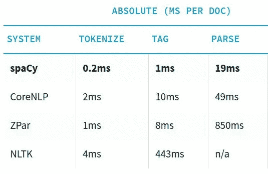

spaCy 与其竞争对手的速度比较…

# 为什么是 spaCy？

spacy 有自己的内置特性和功能。它有许多全球语言的预训练模型集合，可以简单地作为 python 包安装。这些包成为应用程序的组件，就像任何其他模块一样。它们是有版本的，可以被定义为`requirements.txt`文件中的一个依赖项。

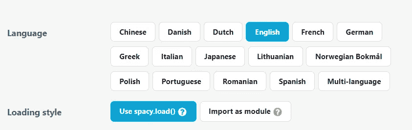

以下是 spacy 区别于任何潜在竞争对手的特点:

*   **预处理:**它由一个预定义的标记化器、词汇化器和依赖解析器组成，用于自动预处理输入数据。
*   语言特性:它还有一个最先进的词性标注器，可以自动将词性标注与每个单词关联起来。
*   可视化:它有可视化依赖树的能力，并为 NER 任务创建漂亮的插图。

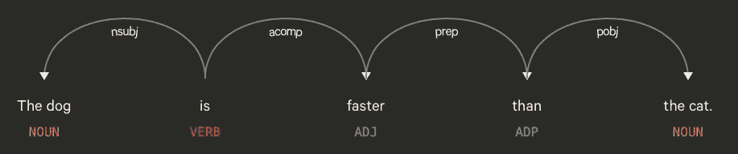

依赖树可视化...

NER 任务可视化...

*   **灵活性:**具有扩充或替换任何管道组件或添加新组件(如文本分类器)的灵活性。
*   **迁移学习:**它为用户提供了选择任何预训练模型并在下游任务中对其进行微调的可行性。
*   **Pipeline: S** pacy 提供了一个内置特性，用于创建一个处理管道，该管道可以自动处理原始文本并生成一个空间可识别的 doc 对象，该对象可用于各种 NLP 任务。

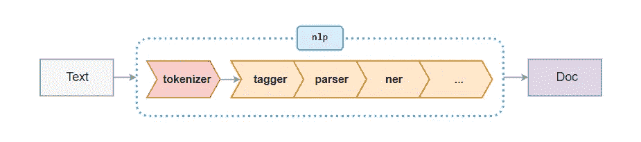

空间处理流水线

# 行动空间

spaCy 是 PyPI 上的一个标准 python 库，可以根据 python 环境使用 pip 或 conda 轻松安装。以下是安装 spacy 的命令:

通过 pip 进行空间安装

通过康达空间安装

现在让我们来探索如何使用 spacy 高效地执行命名实体识别。为此，我们需要下载一个预先训练好的语言模型，它在 spacy 中非常方便。正如我们前面看到的，spacy 支持多种语言，但我们将仅限于英语。英语语言模型有三种变体，即目前在 spacy 中存在的小型、中型和大型。

它们都以前缀`en_core_web_*`开始，并加载了预定义的标记器、标记器、解析器和实体识别器组件。作为一般趋势，语言模型的准确性随着模型大小而增加。这里我们将加载英语语言模型的大型变体。

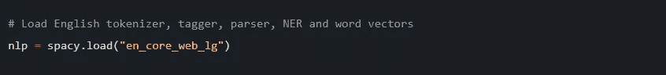

在将模型加载到一个`nlp`对象中之后，这个对象的管道中现在有了一个标记器、标记器、解析器和实体识别器。下一步是加载文本数据，并使用`nlp`对象的不同组件对其进行处理。

对于下游/特定领域的任务，spacy 还为我们提供了添加自定义停用词和默认停用词的可行性。在 spacy 中，停用词非常容易识别，其中每个标记都有一个 IS_STOP 属性，它让我们知道这个词是否是停用词。

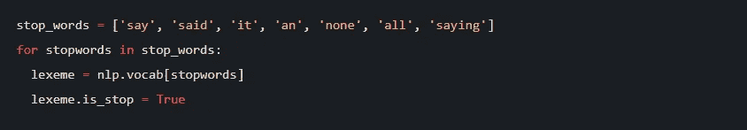

添加自定义停用词

## 词性标注

**词性** (POS)标注是根据一个词在句子中出现的上下文及其与其他词的关系，按照语言的语法规则，给一个词加上相应的词性，如*名词*、*形容词*、*动词*、*副词*等。

在标记化之后，SpaCy 可以使用其最先进的统计模型来标记给定的 *sent* 对象。标签可作为*令牌*对象的属性。下面的代码显示了使用 SpaCy 从给定文本中解析出的令牌及其对应的 P.O.S .标记。

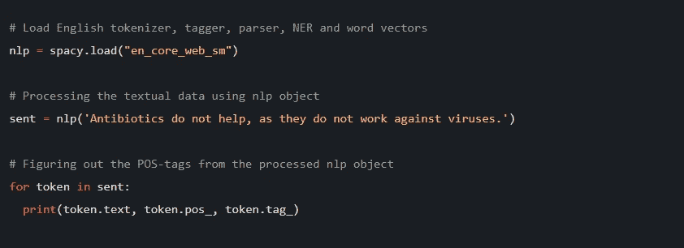

**输出:**

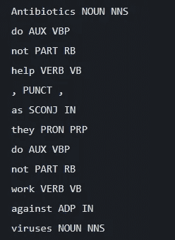

## 可视化词类

spaCy 自带一个名为 ***displacy*** 的内置依赖可视化工具，可以用来可视化标记和文本中包含的实体之间的语法依赖(关系)。

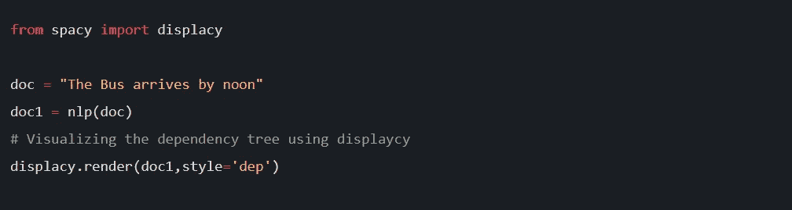

**输出:**

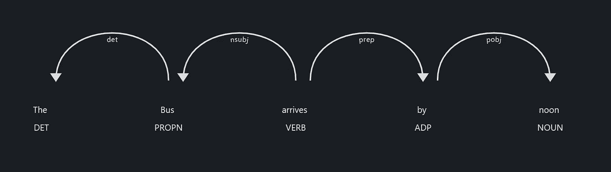

## 命名实体识别:

命名实体是具有适当名称的真实世界对象，例如，印度、拉斐尔·纳达尔、谷歌。在这里，印度是一个国家，被标识为 **GPE** ( *地缘政治实体*)，拉菲尔·纳达尔是的**(*人*)，谷歌是**组织** ( *组织*)。SpaCy 本身提供了一组预定义的实体。NER 标记不是结果，它最终有助于进一步的任务。**

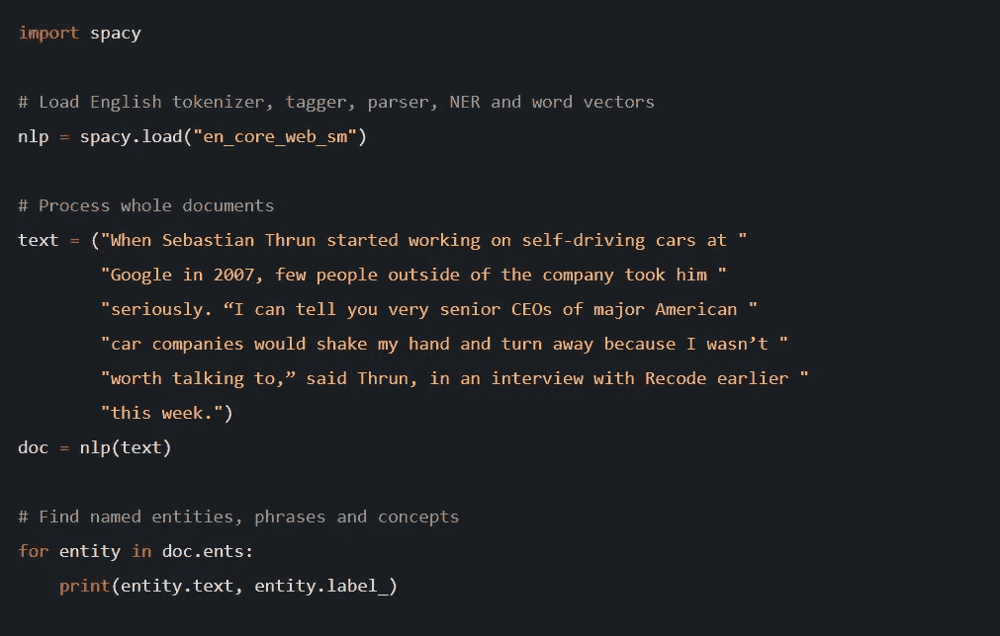

**输出:**

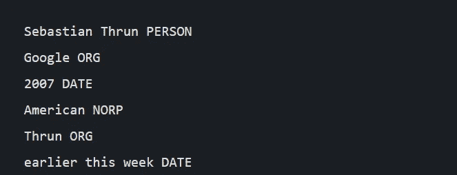

spaCy 还提供了一种使用 ***displacy*** 可视化 NER 标记任务的巧妙方式，这为我们提供了一种直观的方式来可视化命名实体…

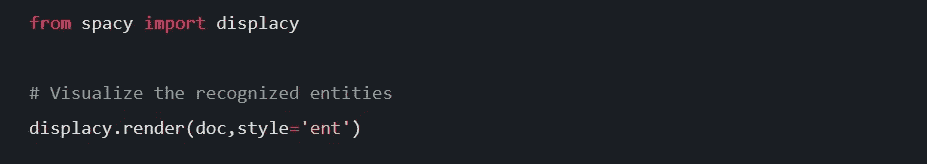

**输出:**

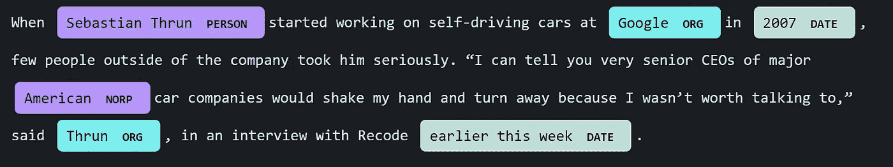

# 结论

今天，当许多财富 500 强的组织正在冒险进入人工智能，ML 和 NLP。spaCy 引领着组织将自然语言处理用于其下游任务。spaCy 是用户友好的，已经熟悉该领域的人可以通过零到最小的努力来学习。对于数据团队来说，在构建最先进的、生产就绪的 NLP 应用程序时整合 spaCy 已经成为事实上的选择。

如果你想了解更多，或者想让我写更多关于这个主题的东西，请随时联系…

我的社交链接:[LinkedIn](https://www.linkedin.com/in/shubhamsaboo/)|[Twitter](https://twitter.com/Saboo_Shubham_)|[Github](https://github.com/Shubhamsaboo)

如果你喜欢这篇文章或觉得它有帮助，请花一分钟按一下拍手按钮，它增加了文章对其他媒体用户的可见性。