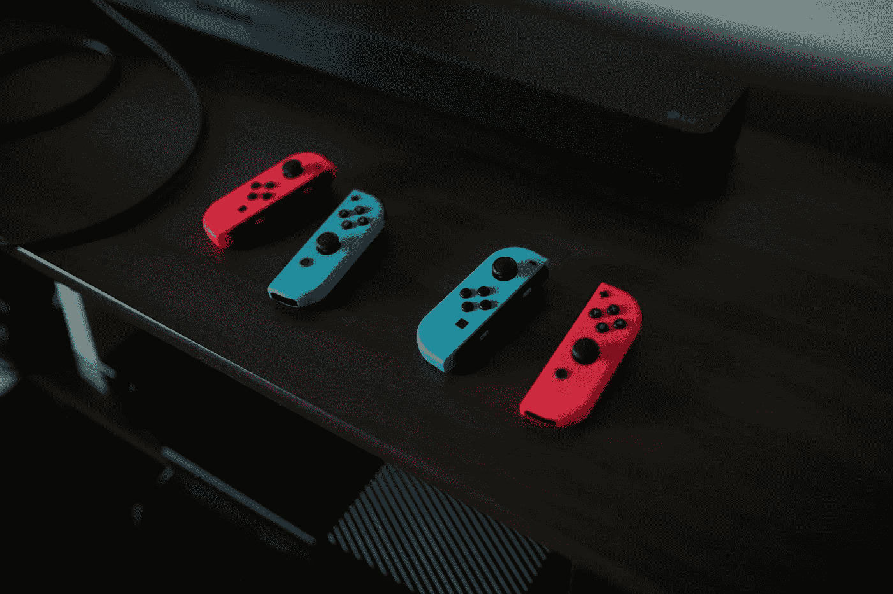
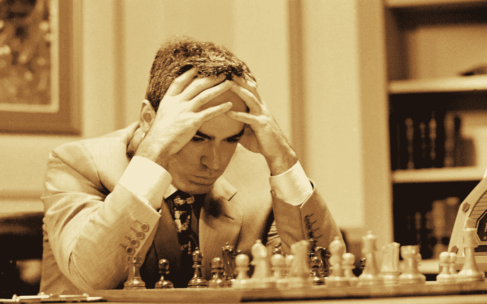
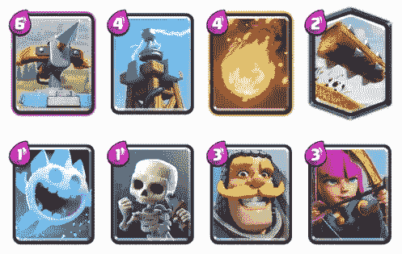
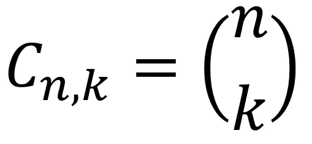
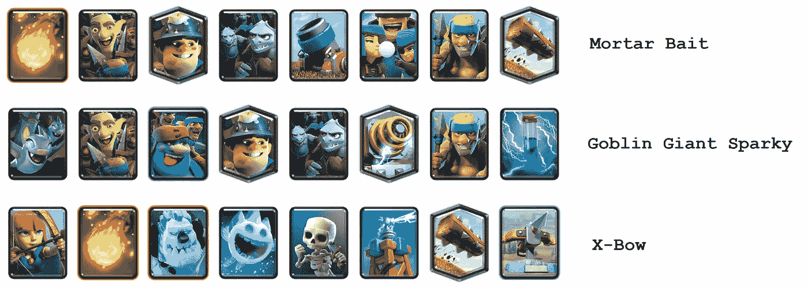
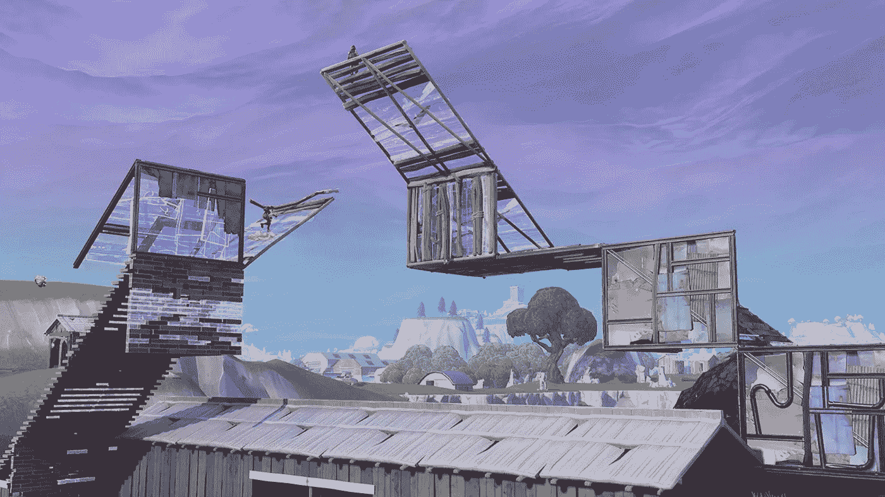
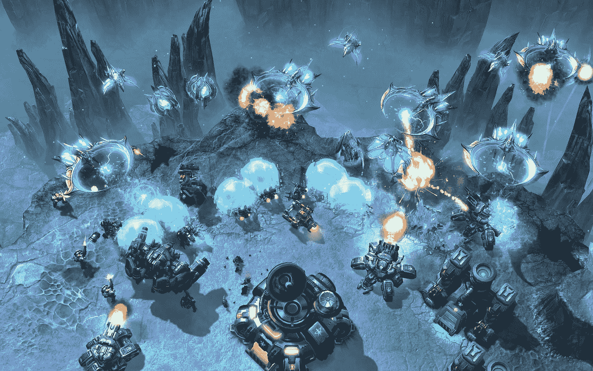
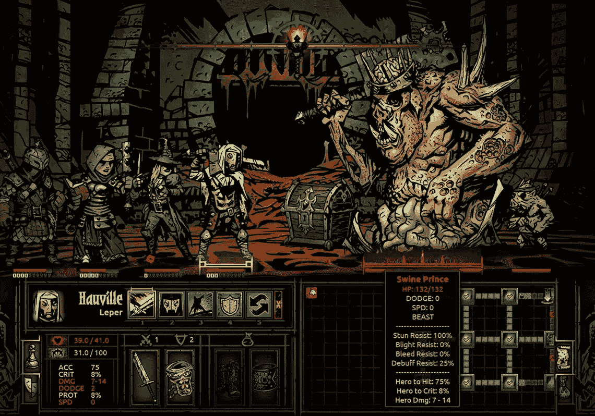

# 认识论:游戏如何变成主体

> 原文：<https://pub.towardsai.net/epistemology-how-games-turn-into-subjects-3898ea4bcf0a?source=collection_archive---------2----------------------->

## [认识论，教育学](https://towardsai.net/p/category/education)

## 一个游戏就是这样慢慢变成一个有学术结构的学科

[**点击这里了解我，我的项目，我的最新文章。**](http://www.michelangiolo.best/)

在过去的几年里，我一直从财务角度关注电子竞技的发展，随着时间的推移，我越来越注意到电子竞技世界中新模式的出现:随着时间的推移，多个视频游戏的共同因素变得越来越明显，发展越来越快。

照片由[凯勒·伍兹](https://unsplash.com/@caleb_woods?utm_source=medium&utm_medium=referral)在 [Unsplash](https://unsplash.com?utm_source=medium&utm_medium=referral) 上拍摄

然后这个想法出现在我的脑海里:电子游戏是否像学术科目一样被对待？他们有自己的规则吗？他们能在一门课程中被教授吗？最重要的是，这些规则从何而来，为什么每一个游戏都遵循相同的模式？

## 游戏规则

我的直觉最终在《异化论者》的一集里被表达出来。当主角拉兹洛与传奇投资人 J.P .摩根有了一次偶遇。

> 摩根先生，你是这个领域的先驱。你把金融变成了一门学科。**-拉兹洛，外星人**

我不知道这如何帮助我将我在视频游戏上的发现表达成具体的东西，甚至可以用数学公式来描述(与流行病学研究程度相同)，但让我意识到，摩根大通能够以比其前辈或当代人更先进的方式理解当时被称为金融的东西，同样的事情也发生在游戏上。游戏有自己的机制:玩家发明自己的规则来充分利用这些机制。

我将以两个游戏为例进行详细解释，国际象棋和游戏应用 Clash Royale。你可以向下滚动到文章的底部，立即**跳到结论**。

## “主体”的定义

确定历史上第一个 **techne** (希腊语“工艺、艺术”，可以解释为一种活动本身，如“雕塑家的艺术”)的日期是具有挑战性的。纵观历史，人类已经能够将分组并**分类到定义的类别中，分离出执行特定任务所需的知识块，将它们转化为主题。随着时间和世代的流逝，这些知识块已经被完善、改进，以它们自己的变化和秘密传递给下一代。**

例如，雕刻艺术，烹饪，甚至战争艺术，以及无数其他的艺术，已经跨越多个互不相连的地方，经历了相同的生命周期，进入了这个世界。他们从模糊分散的原则开始，然后收集起来教给下一代。迭代地，更多的知识被添加到原来的知识块中，允许学校为这个唯一的目的培养专门的公民。几代人之后，一些领域的知识变得如此庞大、有条理和专业化，以至于需要几年甚至十年才能培养出大师。

## 功夫的概念

有趣的是，这个东方概念如何完美地表达了古希腊人的**技术**的概念。它的字面翻译意思是“人类的成就”，它指的是灵魂破碎的过程，以获得完美的东西。尽管引用一本书可能很美，但我更愿意引用网飞系列的《马可波罗》:

> 功夫的意思是来自努力工作的最高技能。一位伟大诗人到达了功夫；画家，书法家，可以说有功夫。连厨子，扫台阶的，使唤仆人的，都能有功夫。练习，准备，无止境的重复，直到你的头脑疲劳，骨头酸痛，直到你累得流汗，累得喘不过气来。 **-100 只眼睛，马可波罗**

## 认识论和主体

认识论是研究知识的哲学分支。我认为将我的想法(有趣且有娱乐性，但同样地，我认为它们将被限制在媒介中)归入这个范围是合适的。

# 国际象棋比赛

我们不能否认，象棋作为一种游戏，本质上有其背后的理论库。现在的大师们需要终生全职学习，才能掌握足够的理论达到巅峰。

臭名昭著的大师卡斯帕罗夫在一次采访中描述了这一过程:

> 每一代玩家都更加了解上一代

本质上，除了成为一个有天赋的玩家(在 2021 年，在这个竞争领域有天赋意味着不仅仅是出类拔萃)，玩家还需要学习大量的理论。只有通过理论，他们才能够通过节省处理能力来击败对手。例如，知道雷·洛佩兹(国际象棋开局之一)所有可能的发展可以为玩家节省无数的计算能力，并在采取行动时预测他们的决定。到目前为止，正如 Bobby Fisher 解释的那样，大师们每次变化可以达到 17-18 步(我过于简化了)，希望在游戏的后期获得优势。

卡斯帕罗夫 vs 深蓝|来源:[电讯报](https://www.telegraph.co.uk/books/what-to-read/chess-champion-garry-kasparov-vs-deep-blue-wasnt-fair-fight/)

## 一个游戏是怎么变成理论的？

为什么会有这么大的象棋文献？这发生在玩家开始创建社区、竞赛、创建共享知识的网络的时候。例如，从 19 世纪开始，国际象棋理论已经开始兴起，出版物和技术书籍已经开始在社区中传播。

每一年，每一场比赛，游戏都被发布，击败对手和获得优势的新方法被测试、分类，并向玩家社区开放。慢慢地，棋局变成了一门学科。

# 游戏应用《皇家冲突》

虽然国际象棋是有限复杂性的经典例子(规则是静态的，移动被限制在一个 8×8 的棋盘上)，但视频游戏要复杂得多。为了说明象棋中的相同发展也适用于视频游戏，这是 Clash Royale 手机应用程序的一个例子。

相比所有其他科目，电子游戏引入了**元**的概念:因为理论是不断变化的，元是游戏中顶级玩家最近采用的可行策略。

## 以皇家冲突为例:元甲板

专业的电子游戏玩家已经把对竞技电子游戏的研究变成了一门真正的学科。

在视频游戏中，你需要从一堆卡片中准备一副牌，有大量可能的组合，从这些可能性的海洋中出现了一小批帮助玩家获得竞争优势的组合:所谓的**元牌**。

## 皇家冲突，选择 8 张牌

在这个游戏中，有一个 98 张卡的池(直到 2020 年 5 月，每隔几个月游戏就增加一张卡)。每个玩家必须组成一副 8 张牌，与其他玩家对战。

从[www.theclashify.com](http://www.theclashify.com/)获得的一副由 8 张牌组成的牌的例子

## 有多少副牌？

简单组合的公式

可能的牌组数量是 **6345015248033280，**从这个组合池中，顶级玩家找出哪些是元牌组。元牌经常变化，所以职业玩家需要保持更新，继续研究游戏。

皇家对抗赛中著名的元牌示例，图片来自 www.statsroyale.com

## meta 套牌是怎么诞生的？

不幸的是，没有数学方法来确定哪些是最好的套牌。冠军拥有的唯一可能性是尝试他们中的许多人，看看哪一个比其他球员表现得更好。

从本质上讲，通过不断的迭代，元牌是那些允许顶级玩家持续获胜的牌，因此允许他们在竞争对手的等级中攀升至顶级。因此，这些特定的套牌在社区中数百万场比赛中幸存了下来。

基于分数(或玩家位置)的所有牌组的等级

# 需要其他例子吗？

独立于游戏的种类，RPG(角色扮演游戏)、FPS(第一人称射击游戏)、策略游戏……(你想要，你说吧)我们可以观察到完全相同的行为。玩家社区按照等级对自己进行分类，然后是游戏中的最佳指标组合(可能是卡片、动作、建筑配置…游戏中玩家看重的任何指标)

## 《堡垒之夜》

堡垒之夜是第一人称射击游戏。虽然看起来游戏中不可能有任何理论(你只需要向人开枪)，但游戏也允许玩家建造。顶级玩家为了获得竞争优势，训练建造一系列的墙(他们称这些序列为**建造**，一个例子是 60 年代)。每个赛季，当游戏机制发生变化时，一个新的元就会出现，处于顶端的玩家要么改变他们使用版本的习惯，要么提出在社区中传播的新版本。

在比赛中有多达 3 名球员的团队建设也是球员们非常有效地发明的东西。

堡垒之夜玩法:[https://www . rockppapershotgun . com/fort nite-building-and-editing-guide-V7-30-fort nite-building-tips-and-editing-tips-material-stats-1x1s-90s-2](https://www.rockpapershotgun.com/fortnite-building-and-editing-guide-v7-30-fortnite-building-tips-and-editing-tips-material-stats-1x1s-90s-2)

## 星际争霸 2

这个游戏是一个策略游戏的例子。在你可以用来与敌人战斗的不同部队中，有一些组合成为了元的一部分。玩家需要保持对当前元素的更新，并训练建筑序列来开始游戏(和国际象棋没什么不同)。

星际争霸 2 玩法:[https://game room . LV/en/battle net/products/starcraft-2-battle chest-20-1386](https://gameroom.lv/en/battlenet/products/starcraft-2-battlechest-20-1386)

## 最黑暗的地牢

最黑暗的地牢，没有竞技模式(只有一个 DLC，但不是游戏的核心功能)，是一个游戏不需要竞技就可以允许任何规则出现的例子。在这个游戏中，飘带已经找到了你的队伍和能力的几个获胜组合，可以在游戏中使用。

最黑暗的地牢玩法:[https://www . toledoblade . com/a-e/culture/2016/02/11/darkness-Dungeon-is-sure-to-stress-you-out/stories/20160211005](https://www.toledoblade.com/a-e/culture/2016/02/11/Darkest-Dungeon-is-sure-to-stress-you-out/stories/20160211005)

# 假设

概括起来，这是我的假设:

*   **WHERE** :在任何我们可以隔离已定义知识的环境中(我说的已定义知识是指可以在这个领域下严格分类的信息)。
*   **如果**:如果有一个用户群和用户有联系(一个知识交流的网络:在视频游戏的情况下引入流媒体服务，如 Twitch 或 Youtube)。
*   **然后**:规则出现了，并由处于能力层级顶端的人(参与竞争的人)来策划。
*   **因为**:知识允许在领域中表现得更好(在游戏中，表现得更好意味着击败对手，从而获得竞争优势)。

2019 年 5 月 23 日，中国指南，[https://www . thechina guide . com/blog/kung-fu-the-art-of-the-patience-the-art-of-incidence-by-army-arts](https://www.thechinaguide.com/blog/kung-fu-the-art-of-patience-embodied-by-martial-arts)