# 数据科学和机器学习的基本线性代数

> 原文：<https://pub.towardsai.net/essential-linear-algebra-for-data-science-and-machine-learning-10d47d61000b?source=collection_archive---------0----------------------->

## [数据科学](https://towardsai.net/p/category/data-science)，[机器学习](https://towardsai.net/p/category/machine-learning)

## *初学者或成熟的数据科学从业者必须非常熟悉线性代数中的基本概念*

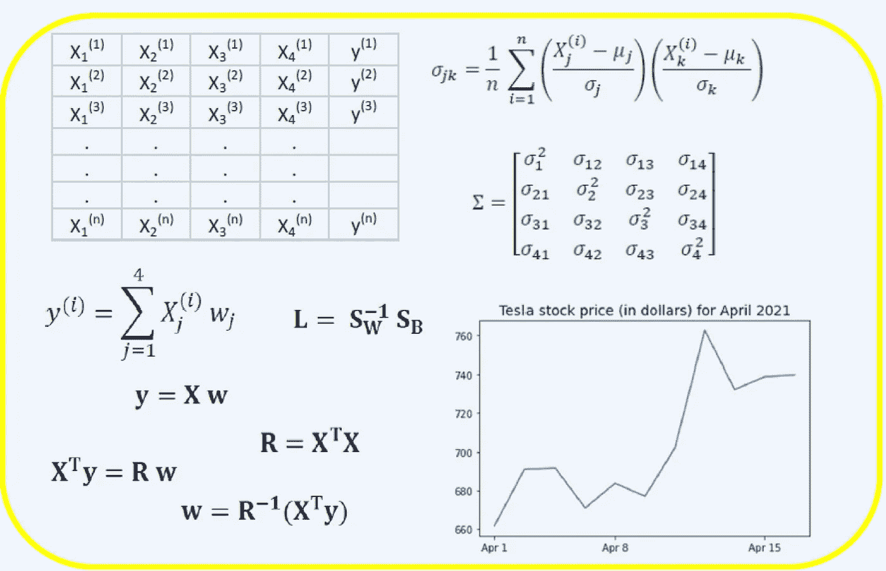

Benjamin O. Tayo 的图片。

线性代数是数学的一个分支，在数据科学和机器学习中非常有用。线性代数是机器学习中最重要的数学技能。大多数机器学习模型都可以用矩阵形式表示。数据集本身通常表示为矩阵。线性代数用于数据预处理、数据转换和模型评估。以下是您需要熟悉的主题:

*   ***矢量***
*   ***矩阵***
*   ***矩阵的转置***
*   ***矩阵的逆***
*   ***矩阵的行列式***
*   ***一丝矩阵***
*   ***点积***
*   ***特征值***
*   ***特征向量***

在本文中，我们使用科技股数据集来说明线性代数在数据科学和机器学习中的应用，该数据集可以在[这里](https://github.com/bot13956/datasets/blob/master/tech-stocks-04-2021.csv)找到。

# 1.用于数据预处理的线性代数

我们从说明线性代数如何用于数据预处理开始。

**1.1 导入必要的线性代数库**

```
import numpy as np import pandas as pd import pylab import matplotlib.pyplot as plt import seaborn as sns
```

**1.2 读取数据集并显示特征**

```
data = pd.read_csv("tech-stocks-04-2021.csv") data.head()
```

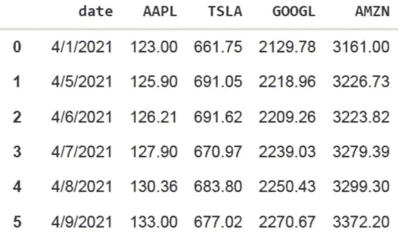

***表 1*** *。2021 年 4 月前 16 天所选股票价格*

```
print(data.shape) output = (11,5)
```

***data.shape*** 函数使我们能够知道数据集的大小。在这种情况下，数据集有 5 个要素(日期、AAPL、TSLA、GOOGL 和 AMZN)，每个要素有 11 个观测值。*日期*是指 2021 年 4 月的交易日(截止到 4 月 16 日)。AAPL、TSLA、谷歌和 AMZN 分别是苹果、特斯拉、谷歌和亚马逊的收盘价。

**1.3 数据可视化**

为了执行数据可视化，我们需要为要可视化的特征定义 ***列矩阵*** :

```
x = data['date'] y = data['TSLA'] plt.plot(x,y) plt.xticks(np.array([0,4,9]), ['Apr 1','Apr 8','Apr 15']) plt.title('Tesla stock price (in dollars) for April 2021',size=14) plt.show()
```

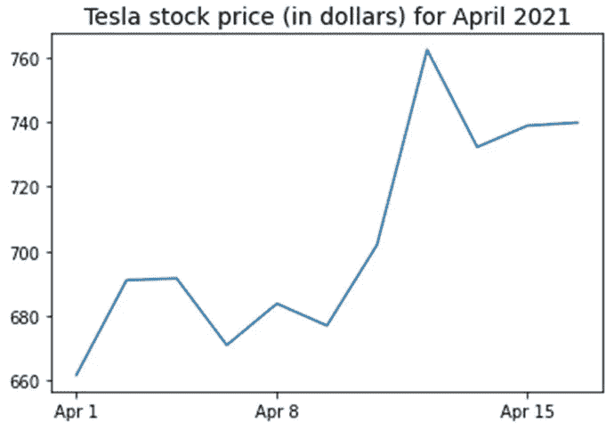

***图一*** *。2021 年 4 月前 16 天特斯拉股价。*

# 2.协方差矩阵

***协方差矩阵*** 是数据科学和机器学习中最重要的矩阵之一。它提供了关于特征之间的共同运动(相关性)的信息。假设我们有一个具有 *4 个*特征和 *n 个*观察值的特征矩阵，如**表 2** 所示:

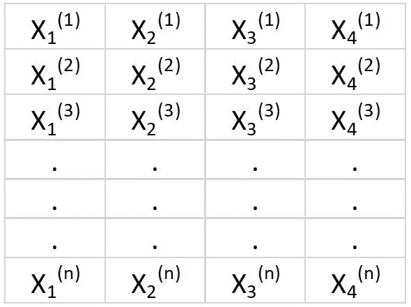

***表二*** *。具有 4 个变量和 n 个观察值的特征矩阵。*

为了可视化特征之间的相关性，我们可以生成散点图:

```
cols=data.columns[1:5] print(cols) output = Index(['AAPL', 'TSLA', 'GOOGL', 'AMZN'], dtype='object') sns.pairplot(data[cols], height=3.0)
```

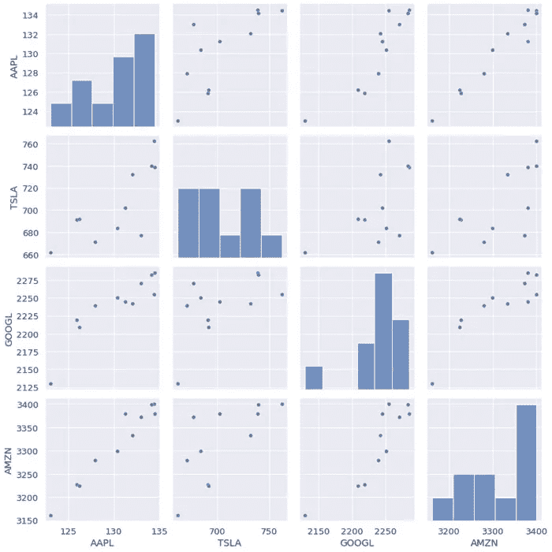

***图 2*** *。选定科技股的散点图。*

要量化要素之间的相关程度(多重共线性)，我们可以使用以下公式计算协方差矩阵:

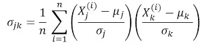

其中和分别是特征的均值和标准差。该等式表明，当特征被标准化时，协方差矩阵简单地是特征之间的 ***点积*** 。

在矩阵形式中，协方差矩阵可以表示为 4 x 4 实对称矩阵:

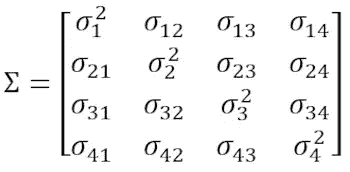

该矩阵可以通过执行 ***酉变换*** 来对角化，也称为主成分分析(PCA)变换，以获得以下内容:

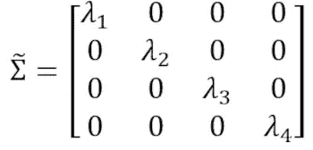

由于矩阵 的 ***迹在酉变换下保持不变，我们观察到对角矩阵的特征值之和等于包含在特征 X 1、X 2、X 3 和 X 4 中的总方差。***

**2.1 计算科技股的协方差矩阵**

```
from sklearn.preprocessing import StandardScaler stdsc = StandardScaler() X_std = stdsc.fit_transform(data[cols].iloc[:,range(0,4)].values) cov_mat = np.cov(X_std.T, bias= True)
```

注意，这里使用了标准化矩阵的 ***转置*** 。

**2.2 协方差矩阵的可视化**

```
plt.figure(figsize=(8,8)) sns.set(font_scale=1.2) hm = sns.heatmap(cov_mat, 
                 cbar=True, 
                 annot=True, 
                 square=True, 
                 fmt='.2f', 
                 annot_kws={'size': 12}, 
                 yticklabels=cols, 
                 xticklabels=cols) plt.title('Covariance matrix showing correlation coefficients') plt.tight_layout() plt.show()
```

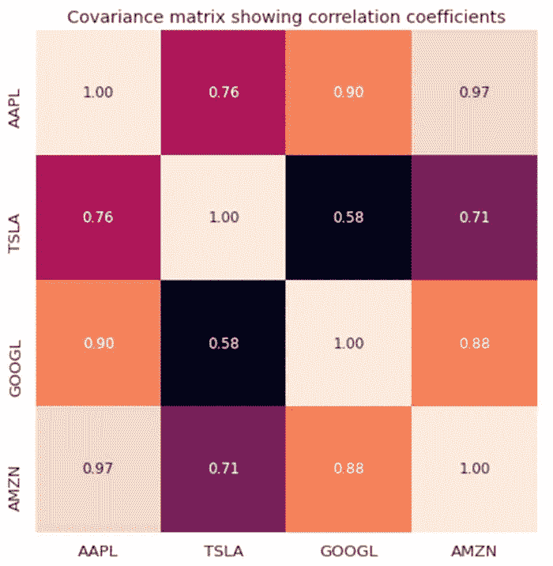

***图 3*** *。选定科技股的协方差矩阵图。*

我们从图 3 中观察到，AAPL 与 GOOGL 和 AMZN 的相关性很强，而与 TSLA 的相关性很弱。TSLA 与 AAPL、古格尔和阿姆津的相关性一般较弱，而 AAPL、古格尔和阿姆津之间的相关性较强。

**2.3 计算协方差矩阵的特征值**

```
np.linalg.eigvals(cov_mat) output = array([3.41582227, 0.4527295 , 0.02045092, 0.11099732]) np.sum(np.linalg.eigvals(cov_mat)) output = 4.000000000000006 np.trace(cov_mat) output = 4.000000000000001
```

我们观察到协方差矩阵的迹等于特征值之和，正如所预期的那样。

**2.4 计算累积方差**

由于矩阵的迹在酉变换下保持不变，我们观察到对角矩阵的特征值之和等于包含在特征 X 1、X 2、X 3 和 X 4 中的总方差。因此，我们可以定义以下数量:

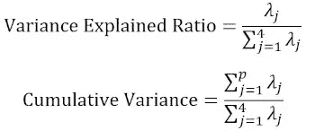

注意，当 *p* = 4 时，累积方差如预期的那样等于 1。

```
eigen = np.linalg.eigvals(cov_mat) cum_var = eigen/np.sum(eigen) print(cum_var) output = [0.85395557 0.11318237 0.00511273 0.02774933] print(np.sum(cum_var)) output = 1.0
```

我们从累积方差( ***cum_var*** )中观察到，方差的 85%包含在第一特征值中，11%包含在第二特征值中。这意味着当实施 PCA 时，只有前两个主成分可以被使用，因为总方差的 97%由这两个成分贡献。当实现 PCA 时，这可以基本上将特征空间的维数从 4 减少到 2。

# 3.线性回归矩阵

假设我们有一个包含 4 个预测要素和 *n* 个观测值的数据集，如下所示。

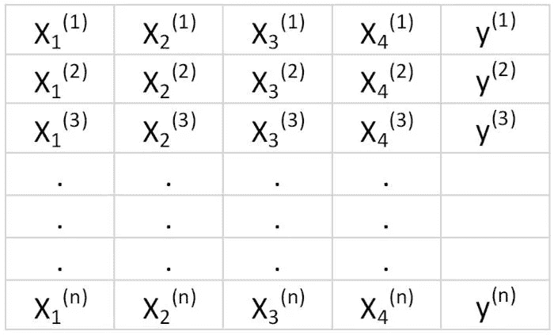

***表 3*** *。具有 4 个变量和 n 个观察值的特征矩阵。第 5 列是目标变量(y)。*

我们希望构建一个多元回归模型来预测 *y* 值(第 5 列)。因此，我们的模型可以表示为

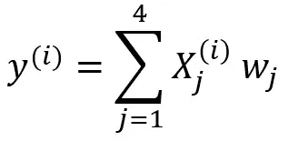

在矩阵形式中，该方程可以写成

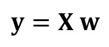

其中 **X** 是(n×4)特征矩阵， **w** 是表示待确定回归系数的(4×1)矩阵， **y** 是包含目标变量 y 的 n 个观测值的(n×1)矩阵

注意 **X** 是一个矩形矩阵，所以我们不能通过取 **X** 的逆来解上面的方程。

为了将 **X** 转换成方阵，我们将等式的左侧和右侧乘以 **X** ，即

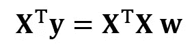

这个等式也可以表示为

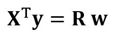

在哪里

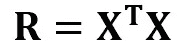

是(4×4)回归矩阵。显然，我们观察到 **R** 是实对称矩阵。请注意，在线性代数中，两个矩阵乘积的转置遵循以下关系

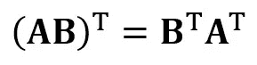

既然我们已经简化了我们的回归问题，并用(4×4)实对称可逆回归矩阵 **R** 来表示它，那么就可以直接表明回归方程的精确解是


预测连续和离散变量的回归分析示例如下:

[绝对初学者的线性回归基础](/linear-regression-basics-for-absolute-beginners-68ed9ff980ae)

[使用最小二乘法构建感知机分类器](https://github.com/bot13956/perceptron_classifier)

# 4.线性判别分析矩阵

数据科学中实对称矩阵的另一个例子是线性判别分析(LDA)矩阵。该矩阵可以用以下形式表示:

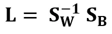

其中是特征内散布矩阵，是特征间散布矩阵。由于两个矩阵都是实对称的，因此 **L** 也是实对称的。 **L** 的对角化产生了一个特征子空间，优化了类别可分性，降低了维数。因此，LDA 是一种监督算法，而 PCA 不是。

有关 LDA 实施的更多详细信息，请参见以下参考资料:

[机器学习:通过线性判别分析降维](https://medium.com/towards-artificial-intelligence/machine-learning-dimensionality-reduction-via-linear-discriminant-analysis-cc96b49d2757)

[使用 Iris 数据集实现 LDA 的 GitHub 知识库](https://github.com/bot13956/linear-discriminant-analysis-iris-dataset)[Sebastian rasch ka 的 Python 机器学习，第 3 版(第 5 章)](https://github.com/rasbt/python-machine-learning-book-3rd-edition)

# 摘要

总之，我们已经讨论了线性代数在数据科学和机器学习中的几个应用。使用科技股数据集，我们举例说明了矩阵的大小、列矩阵、方阵、协方差矩阵、矩阵的转置、特征值、点积等重要概念。线性代数是数据科学和机器学习的基本工具。因此，对数据科学感兴趣的初学者必须熟悉线性代数中的基本概念。

*原载于*[*https://www.kdnuggets.com*](https://www.kdnuggets.com/2021/05/essential-linear-algebra-data-science-machine-learning.html)*。*