# 预测模型的基本数学方程

> 原文：<https://pub.towardsai.net/essential-mathematical-equations-for-predictive-models-fcb79630ec96?source=collection_archive---------0----------------------->

## [数据科学](https://towardsai.net/p/category/data-science)

## 以及如何用 Python 计算它们

**简介**

数学模型是用来描述变量行为的方程，如果足够好，可以用来预测未来的行为或描述模式。在这篇文章中，我将使用我们在高中学习的数学方程来描述一些最常见和最容易拟合的模型。为了适应模型，我将通过谷歌 Colab 使用 Python。所有的代码和数据集也可以在 [Github](https://github.com/cdanielaam/math_models_medium) 上获得。

对于本文中提供的所有示例，我们将使用来自葡萄牙人口的新冠肺炎数据集，该数据集每天更新，可以在 [Github](https://github.com/cdanielaam/covid19pt-data) 上找到。

(请注意，我使用的样本来自 2021 年 10 月 26 日下载的数据集)

在我们开始拟合模型之前，我们需要加载一些 python 库:

```
import numpy as np
import matplotlib.pyplot as plt
import pandas as pd
import seaborn as sns
from sklearn.linear_model import LinearRegression
from numpy.random import randn
from numpy.random import seed
from scipy.stats import pearsonr
from sklearn.linear_model import LinearRegression
from sklearn import datasets, linear_model
from sklearn.metrics import *
import statistics
import statsmodels.api as sm
from lmfit import Model
```

**线性方程组**

线性方程用于拟合线性回归模型，其形式为 *y = mx+b，*其中 *m* 是斜率，b 是与 *y 轴*的截距。使用显示每天病例数的新冠肺炎数据集样本，我们获得了以下数据:

```
df = pd.read_csv('/content/lm.csv')
dfplt.scatter(df["ID"], df["confirmados"])
plt.show()
```

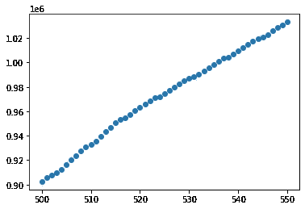

图一。每日新冠肺炎累积病例的增加。

很容易看出，该图从第 500 天到第 550 天呈线性增长。为了拟合此数据的模型，我们将使用:

```
y = df['confirmados']
X = df['ID']
X1 = sm.add_constant(X)
model = sm.OLS(y, X1)
results_model = model.fit()
print(results_model.summary())
```

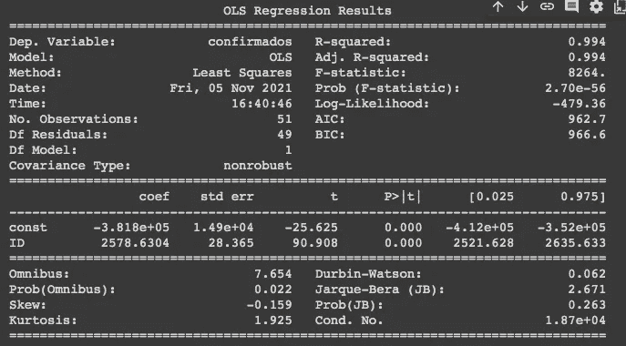

从模型总结中，我们可以看到 R 的平方为 0.99，并获得我们方程的参数:

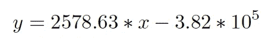

> 如果你想了解更多关于线性回归的知识，你可以查看我的另一篇文章。

**多项式方程**

多项式方程的形式为:

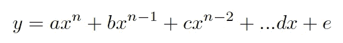

其中 ***a*** *，* ***b*** *，* ***c*** *，* ***，*** ，*e***x***是多项式而*

**多项式函数可用于预测疾病流行的进程，如新冠肺炎。在本例中，我们将分析来自葡萄牙新冠肺炎数据集的样本，其中包含每天确诊的病例数。**

```
**#Load and view dataset:
datas = pd.read_csv('poly.csv')
datas**
```

**我们将只使用“ID”和“confirmados”列。ID 是自卫生当局开始发布新冠肺炎病例每日报告以来的天数，“confirmados”是当天确认的新冠肺炎阳性病例数。我们将用这两个变量来绘制图表，并检查它们是否有线性关系。**

```
**#Plotting the number of cases according to the number of elapsed days:
sns.regplot(x=datas["ID"], y=datas["confirmados"])**
```

**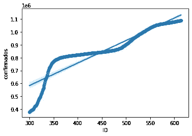**

**图二。根据每日报告开始后经过的天数确定的确诊病例数。**

```
**#Deriving the polynomial model:
mymodel = numpy.poly1d(numpy.polyfit(datas["ID"], datas["confirmados"], 4)) # The number 4 at the end is the degree we want for our polynomial equation. #Drawing a new plot with new regression line:
myline = numpy.linspace(300, 620, 320)
plt.scatter(datas["ID"], datas["confirmados"])
plt.plot(myline, mymodel(myline))
plt.show()**
```

**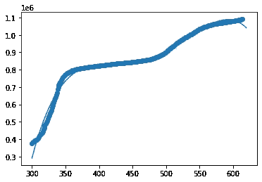**

**图 3。一个新的多项式回归线图。**

```
**#Obtaining the equation:
poly = np.poly1d(mymodel)
print(poly)**
```

**现在我们有了模型的多项式方程:**

**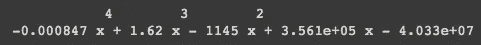**

**形象。多项式模型的最终方程。**

****指数方程****

**指数函数的形式如下:**

**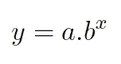**

**其中*a*0≠1， *x* 为实数。多项式函数有不止一个指数表达式，而指数方程只有一个，我们的 *x* 就是那个值。指数模型可以用来解释增长和衰退模式。再次使用新冠肺炎数据集，我们可以预测由于新冠肺炎导致的入院人数，作为自每日报告开始以来经过天数的函数。**

```
**#Plotting the graph:
plt.scatter(datas["ID"], datas["internados"])
plt.show()**
```

**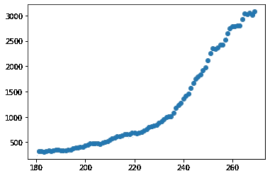**

**图 4。根据每日报告开始后经过的天数计算的住院人数。**

**然后，我们选择希望包含在模型中的变量:**

```
**x = datas["ID"]
y = datas["internados"]**
```

**我们建立了这个模型:**

```
**#Model building using log transformation to y variable:
fit = np.polyfit(x, np.log(y), 1)
print(fit)**
```

**当我们对 *y* 变量进行对数变换时，我们得到了以下线性方程:**

```
**ln(y) = 0.2368051 + 0.0295562(x)**
```

**现在，为了获得一个指数方程，我们需要将 *e(欧拉数)*应用到方程的两边:**

```
**print(np.exp(0.2368051))
#output:  1.2671941175723809print(np.exp(0.0295562))
#output:  1.0299973196946968**
```

**我们得到了等式:**

**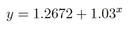**

****平方根方程****

**根模型实际上是幂函数，其中幂的形式为 1/2 *。*该功能**

**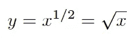**

**方法**

**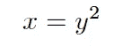**

**平方根模型用于描述在开始时快速增长，但增长趋于缓慢的函数。平方根函数的行为类似于对数函数。在平方根变换或对数变换之间进行选择时，我们可以两者都尝试，看看哪一个对可用数据更有效。在本例中，我们将使用新冠肺炎新增确诊病例数来预测活跃病例数。当我们绘制图表时，我们可以看到它具有平方根形式:**

```
**df = pd.read_csv('/covid19.csv')
plt.scatter(df["confirmados_novos"], df["ativos"])
plt.show()**
```

****

**图 5。根据新确诊病例数计算的新冠肺炎活跃病例数。**

**我们还可以看到，使用的数据是右偏的。**

```
**sns.distplot( a=df["confirmados_novos"], hist=True, kde=False, rug=False )**
```

**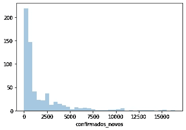**

**图 6。新冠肺炎新增确诊病例数**

```
**sns.distplot( a=df["ativos"], hist=True, kde=False, rug=False )**
```

**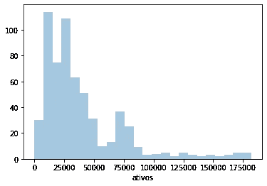**

**图 7。新冠肺炎的活跃病例数。**

**下一步是对新确诊病例的可变数量应用平方根变换:**

```
**df["conf_new_root"] = np.sqrt(df["confirmados_novos"])**
```

**而如果我们再绘制一次，我们会阿瑟更多的线性关系:**

```
**plt.scatter(df["conf_new_root"], df["ativos"])
plt.show()**
```

**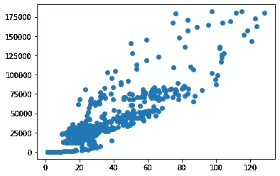**

**图 8。新冠肺炎活跃病例数按新增确诊病例数的平方根计算。**

**现在我们可以拟合一个简单的线性回归模型:**

```
**y = df['ativos']
X1 = df['conf_new_root']
X1a = sm.add_constant(X1)
model_1a = sm.OLS(y, X1a)results_model_1a = model_1a.fit()
print(results_model_1a.summary())**
```

**根据从模型中获得的总结，我们现在可以建立平方根方程:**

**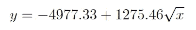**

****对数方程****

**和所有其他函数一样，对数函数可以用来解释增长和衰退。当对数函数用于解释衰变时，首先是快速衰变的行为，然后趋于减速。下图中可以看到一个例子，该图显示，随着分娩开始时间的推移，新冠肺炎新增病例数在减少。**

```
**df = pd.read_csv('/content/covid19se.csv')plt.scatter(df["confirmados_novos"], df["ID"])
plt.show()**
```

**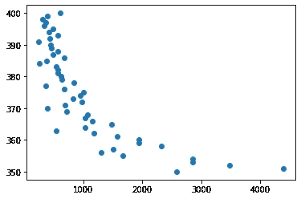**

**图 9。分娩开始后，随着时间的推移，新的新冠肺炎病例数量会减少。**

**然后，我们对“confirmados_novos”应用自然对数变换，并再次检查散点图，以查看现在我们有一个更线性的关系。**

```
**df["conf_new_log"] = np.log(df["confirmados_novos"])plt.scatter(df["conf_new_log"], df["ID"])
plt.show()**
```

**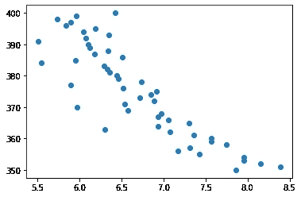**

**图 10。分娩开始后，新冠肺炎新增病例数随着时间的推移而减少的自然记录。**

**现在我们可以应用线性回归模型。**

```
**y2 = df['ID']
X2 = df['conf_new_log']
X2a = sm.add_constant(X2)
model_2a = sm.OLS(y2, X2a)results_model_2a = model_2a.fit()
print(results_model_2a.summary())**
```

**我们的最终等式可以写成:**

**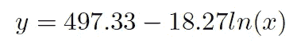**

****正弦方程****

**正弦模型用于描述周期模式，即使我们只对正弦曲线的一个周期使用该函数。一般正弦方程为:**

**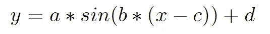**

**正弦函数的图形是:**

**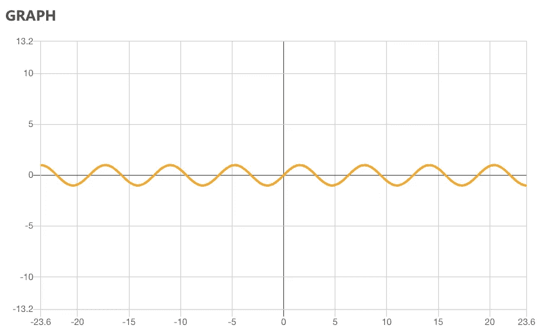**

**新冠肺炎数据集中周期性模式的一个例子是随着隔离措施的收紧或放松，新病例的增加和减少。对于这个例子，我们从新冠肺炎数据集中选择了一个具有这种模式行为的样本，即使它不是完美的正弦曲线。我们将使用 **lmfit** 来拟合我们的正弦模型**T5(你可以在**[https://lmfit.github.io/lmfit-py/](https://lmfit.github.io/lmfit-py/)了解更多)。******

```
****plt.scatter(df["ID"], df["confirmados_novos"])
plt.show()****
```

********

****图 11。随着隔离措施的收紧或放松，新诊断的新冠肺炎病例数量的增加和减少。****

****为了用正弦模型拟合数据，我们将使用:****

```
****#To define the model function:
def sinfunc(x, a, b, c, d):
    return a * np.sin(b*(x - c)) + d#To define our parameters:
predictor = df["ID"]
predicted = df["confirmados_novos"]#Create a model variable:
model  = Model(sinfunc)#To define the parameters of the function (note that a, b, c and d are guessed parameters that we could try by error by analysing the scatterplot):
params = model.make_params(a=1000, b=0.1, c=0, d=0)#Model fitting:
result = model.fit(predicted, params, x=predictor)#Print models summary to get our final parameters:
print(result.fit_report())****
```

****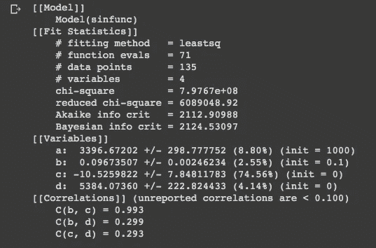****

****在本报告中，我们可以检查 *a* 、 *b* 、 *c、*和 *d* 的最终值，并建立等式:****

****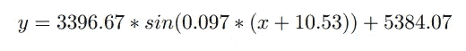****

```
****#To build the graph and plot the model line:
plt.scatter(predictor,predicted,label='Confirmados_Novos')
plt.plot(predictor, result.best_fit, 'r-',label='Fitted function')
plt.title("ID vs Confirmados_Novos")
plt.xlabel('ID')
plt.ylabel('Confirmados_Novos')
plt.legend()
plt.show()****
```

****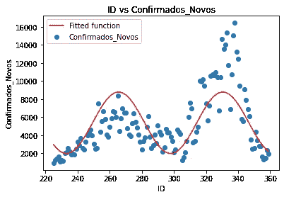****

****图 12。带有拟合函数的数据。****

****最后，我们可以看到拟合函数的数据。****

****这些只是可以通过回归在预测模型中使用的一些最基本的例子，这比线性回归稍微多一点。如果您有任何其他想要讨论的模型，或者您有任何建议或更正，请告诉我。****

****如果你喜欢这篇文章，别忘了关注我，这样你就能收到所有关于新出版物的更新。****

****如果想了解更多，可以通过[我的推荐链接](https://cdanielaam.medium.com/membership)订阅 Medium 会员。它不会花你更多的钱，但会给我一杯咖啡。****