# 机器学习中统计显著性的基本统计检验

> 原文：<https://pub.towardsai.net/essential-statistical-tests-for-statistical-significance-in-machine-learning-78298295648f?source=collection_archive---------1----------------------->

## 必须知道检验回归模型中特征的统计显著性的统计检验:单侧和双侧 T 检验，f 检验，2 样本 Z 检验，2 样本 T 检验，卡方检验

图片来源:[安娜·涅克拉舍维奇](https://www.pexels.com/photo/businessman-man-person-hand-6802044/)

> "事实是顽固的东西，但统计数字是易驾驭的."
> ― **马克·吐温**

试图确定一个变量或一组变量是否对另一个因变量有真正的影响是使用回归模型的最常见原因之一，如**线性回归**。

在回归分析中**假设检验**和**统计显著性**是最重要的，你必须知道两个最流行的统计检验，即 **T 检验、**和 **F 检验**。

在本文中，我将涵盖所有这些在使用回归类型的模型来检测统计显著性时你应该知道的主题。

**注意**这是每个数据科学家都应该知道的更广泛的统计学基础指南的一部分。所以，*如果你没有先验的统计知识，可以简单的跳过统计推导和公式。但是，如果您想学习或更新基本统计概念的知识，您可以查看这篇文章:* [***数据科学家和数据分析师的统计学基础***](https://towardsdatascience.com/fundamentals-of-statistics-for-data-scientists-and-data-analysts-69d93a05aae7)

 [## 数据科学家和数据分析师的统计学基础

### 数据科学或数据分析之旅的关键统计概念

towardsdatascience.com](https://towardsdatascience.com/fundamentals-of-statistics-for-data-scientists-and-data-analysts-69d93a05aae7) 

图片来源:[梅丽莎·托马斯](https://www.pexels.com/photo/yellow-sedan-on-road-while-people-walking-on-sidewalk-1498843/)

# 统计假设检验

检验统计学中的假设是检验实验或调查结果的一种方法，以确定这些结果有多大意义。基本上，一个是通过计算结果偶然发生的几率来测试获得的结果是否有效。如果是信，那么结果不可靠，实验也不可靠。假设检验是 ***统计推断*** 的一部分。

## 无效假设和替代假设

首先，你需要确定你想要测试的论题，然后你需要制定 ***零假设*** 和 ***替代假设*。测试有两种可能的结果，根据统计结果，你可以拒绝或接受既定的假设。根据经验，统计学家倾向于将假设的版本或表述放在需要拒绝的无效假设下*、*，而可接受的和期望的版本则放在备选假设下*。***

## 统计显著性

让我们看看前面的例子，线性回归模型被用来调查企鹅的*鳍长*(自变量)是否对*(因变量*)体重有影响。我们可以用下面的统计表达式来建立这个模型:

然后，一旦估计了系数的 OLS 估计，我们可以制定以下零假设和替代假设来测试脚蹼长度是否对身体质量有 ***统计上显著的*** 影响:

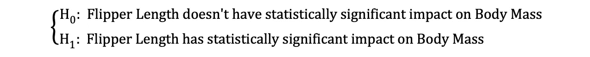

其中 H0 和 H1 分别代表零假设和替代假设。拒绝零假设意味着*鳍状肢长度*增加一个单位会对*体重*产生直接影响。假设β1 的参数估计值描述了自变量*脚蹼长度*对因变量*身体质量的影响。这个假设可以重新表述如下:*

其中 H0 陈述β1 的参数估计等于 0，即*鳍长*对*体质量*的影响 ***统计上不显著*** 而H0 陈述β1 的参数估计不等于 0，暗示*鳍长*对*体质量*的影响 ***统计上显著*** *。*

图片来源:[乔希希尔德](https://www.pexels.com/photo/aerial-photography-of-cinque-terre-in-italy-2422259/)

# 统计测试

一旦陈述了无效假设和替代假设，并定义了测试假设，下一步就是确定哪个统计测试是合适的，并计算***测试统计量*** 。通过将测试统计量与 ***临界值*进行比较，可以确定是否拒绝空值。**该比较显示观察到的测试统计值是否比定义的临界值更极端，可能有两种结果:

*   检验统计量比临界值更极端→可以拒绝零假设
*   检验统计量不像临界值那样极端→不能拒绝零假设

临界值基于预先指定的 ***显著性水平* α** (通常选择等于 5%)和检验统计遵循的概率分布类型。临界值将该概率分布曲线下的面积分为 ***拒绝区域*** 和 ***非拒绝区域*** 。有许多统计测试用来测试各种假设。统计检验的例子有[学生 t 检验](https://en.wikipedia.org/wiki/Student%27s_t-test)、 [F 检验](https://en.wikipedia.org/wiki/F-test)、[卡方检验](https://en.wikipedia.org/wiki/Chi-squared_test)、[德宾-豪斯曼-吴内生性检验](https://www.stata.com/support/faqs/statistics/durbin-wu-hausman-test/)和 W [海特异方差检验](https://en.wikipedia.org/wiki/White_test#:~:text=In%20statistics%2C%20the%20White%20test,by%20Halbert%20White%20in%201980.)。在本文中，我们将研究其中的两个统计测试。

# “学生”t 检验

最简单也是最受欢迎的统计测试之一是学生的 t 检验。其可用于测试各种假设，尤其是在处理主要关注领域是寻找单变量**的统计显著效果的证据的假设时。*t 检验的检验统计量遵循 [***学生的 t 分布***](https://en.wikipedia.org/wiki/Student%27s_t-distribution) ，可以确定如下:*

**

*其中，指定器中的 h0 是参数估计值的测试值。因此，t 检验统计量等于参数估计值减去假设值除以系数估计值的标准误差。在早先陈述的假设中，我们想测试鳍状肢的长度是否对体重有统计学上的显著影响。该测试可以使用 t-test 来执行，并且在这种情况下，h0 等于 0，因为斜率估计是针对值 0 来测试的。*

*t 检验有两个版本:一个 ***双边 t 检验*** 和一个 ***单边 t 检验*** 。你是需要前一个版本的测试还是后一个版本的测试，完全取决于你想要测试的假设。*

**

*图片来源:[迈克尔·布洛克](https://www.pexels.com/photo/colorful-cliffside-village-3225528/)*

# ****双面 t 检验****

*双边或 ***双尾 t 检验*** 可用于假设在无效和替代假设下检验*等于*与*不等于*的关系，类似于下例:*

**

*双边 t 检验有两个拒绝区域*，如下图所示:**

**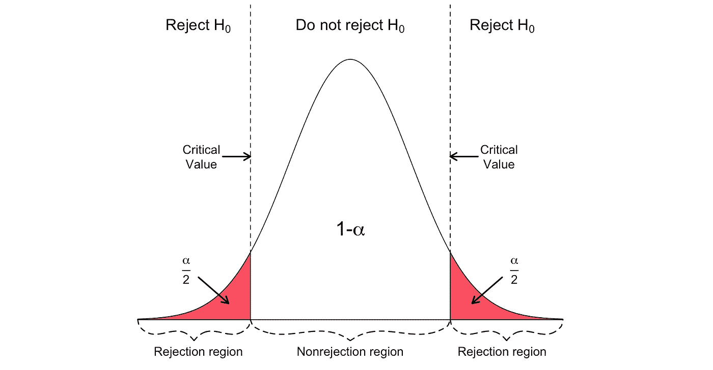**

**图片来源: [*Hartmann，k .，Krois，j .，Waske，b .(2018):SOGA 电子学习项目:统计和地理空间数据分析。柏林自由大学地球科学系*](https://www.geo.fu-berlin.de/en/v/soga/Basics-of-statistics/Hypothesis-Tests/Introduction-to-Hypothesis-Testing/Critical-Value-and-the-p-Value-Approach/index.html)**

**在这个版本的 t-检验中，如果计算的 t-统计量太小或太大，则拒绝空值。**

****

**这里，根据样本大小和选定的显著性水平，将测试统计数据与临界值进行比较。为了确定截止点的精确值，可以使用双边 T32 分布表。**

## *****单侧 t 检验*****

**当假设正在检验零假设和备选假设下的*正/负*对*负/正*关系时，可以使用单侧或 ***单尾 t 检验*** ，类似于以下示例:**

**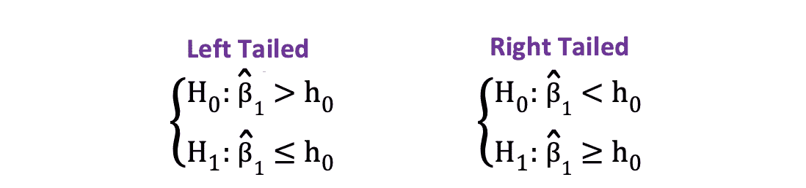**

**单侧 t 检验有一个 ***单个*** ***拒绝区域*** 并且取决于假设侧的拒绝区域在左侧或右侧，如下图所示:**

**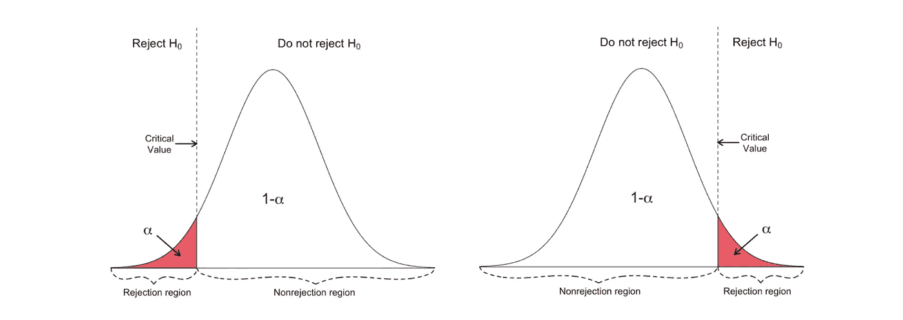**

**图片来源: [*Hartmann，k .，Krois，j .，Waske，b .(2018):SOGA 电子学习项目:统计和地理空间数据分析。柏林自由大学地球科学系*](https://www.geo.fu-berlin.de/en/v/soga/Basics-of-statistics/Hypothesis-Tests/Introduction-to-Hypothesis-Testing/Critical-Value-and-the-p-Value-Approach/index.html)**

**在这个版本的 t 检验中，如果计算出的 t 统计值小于/大于临界值，则拒绝空值。**

********

**图片来源:[马克·尼尔](https://www.pexels.com/photo/colosseum-in-rome-2225439/)**

> **t 检验有两种版本:双边 t 检验和单边 t 检验。你是需要前一个版本的测试还是后一个版本的测试，完全取决于你想要测试的假设。**

# **联合统计显著性的 f 检验**

**f 检验是另一种非常流行的统计检验，常用于检验假设检验****多个变量的联合统计显著性*** *。*当您想要测试多个自变量是否对因变量有显著的统计影响时，就是这种情况。下面是一个可以使用 f 检验进行检验的统计假设示例:***

****

**其中零表示对应于这些系数的三个变量在统计上联合不显著，而备选项表示这三个变量在统计上联合显著。f 检验的检验统计量遵循 [F 分布](https://en.wikipedia.org/wiki/F-distribution)，可确定如下:**

****

**其中 SSRunrestricted 是****的残差平方和 ***受限* *模型*** 的残差平方和，该模型是从数据中排除了在空值*，*下声明为无关紧要的目标变量的同一模型，SSRunrestricted 是未受限****模型**** *的残差平方和，该模型包括所有变量， q 代表在空值下联合检验显著性的变量数量，N 是样本大小，k 是无限制模型中的变量总数。 运行 OLS 回归后，在参数估计值旁边提供 SSR 值，这同样适用于 F 统计。以下是 MLR 模型输出的示例，其中标记了 SSR 和 F 统计值。*******

*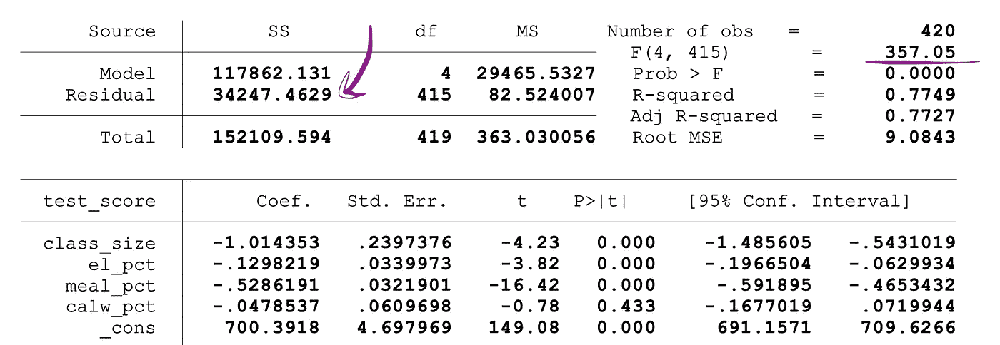*

*图片来源:[股票和沃森](https://www.uio.no/studier/emner/sv/oekonomi/ECON4150/v18/lecture7_ols_multiple_regressors_hypothesis_tests.pdf)*

*F-test 有**一个单一剔除区域**，如下图所示:*

*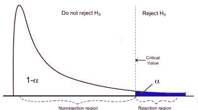*

*图片来源: [*密歇根大学*](https://www.statisticshowto.com/probability-and-statistics/f-statistic-value-test/)*

*如果计算出的 F-统计量大于临界值，则可以剔除空值，这表明独立变量共同具有统计显著性。拒绝规则可以表示如下:*

****

*图片来源:[马里奥·夸德罗斯](https://www.pexels.com/photo/photo-of-road-during-dawn-2760519/)*

# *双样本 T 检验*

*如果您想测试控制组和实验组之间是否存在统计意义上的显著差异，这些差异以平均值的形式表示(例如，平均购买金额)，指标遵循 *student-t* 分布，当样本量小于 30 时，您可以使用双样本 T 检验来测试以下假设:*

*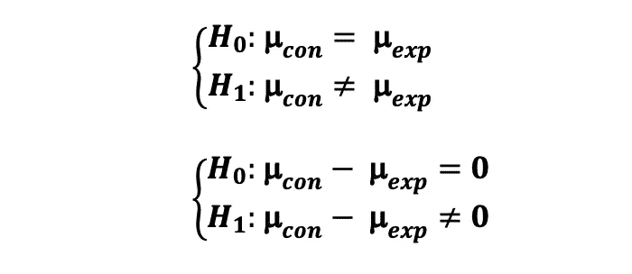*

*其中对照组均值的抽样分布遵循自由度为 N_con-1 的 Student-t 分布。此外，实验组均值的抽样分布也遵循自由度为 N_exp-1 的 Student-t 分布。注意，N_con 和 N_exp 分别是控制组和实验组中的用户数量。*

*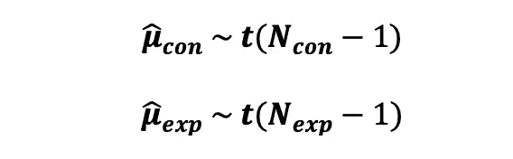*

*然后，两个样本的**合并方差**的估计值可以计算如下:*

*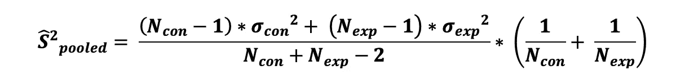*

*其中σ _con 和σ _exp 分别是对照组和实验组的样本方差。那么**标准误差**等于集合方差估计的平方根，可以定义为:*

**

*因此，带有前述假设的双样本 T 检验的**检验统计量**可计算如下:*

*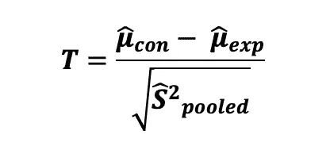*

*为了检验样本均值间观察到的差异的**统计显著性**，我们需要计算检验统计量的 **p 值**。p 值是由于随机机会而观察到的值至少与普通值一样极端的概率。换句话说，假设零假设为真，p 值是获得至少与样本数据中的效应一样极端的效应的概率。那么检验统计的 p 值可以计算如下:*

*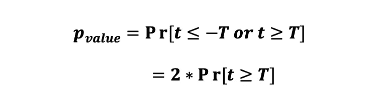*

*对 *p* 值的解释取决于所选的显著性水平α，该水平是在*功率分析*期间运行测试之前选择的。如果计算出的*p*-值似乎小于等于α(例如，对于 5%显著性水平为 0.05)，我们可以拒绝零假设，并声明对照组和实验组的主要指标之间存在统计学显著差异。*

*最后，为了确定获得的结果有多准确，也为了评价获得的结果的实际意义，您可以使用以下公式计算您的测试的**置信区间**:*

*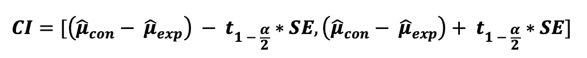*

*其中，t(1-alpha/2)是与具有 alpha 显著性水平的双边 t 检验相对应的检验的临界值，可以使用 [t 表](https://www.sjsu.edu/faculty/gerstman/StatPrimer/t-table.pdf)找到。*

# *双样本 Z 检验*

*如果您想要测试控制组和实验组的指标(以平均值(例如平均购买量)或比例(例如点击率)的形式)之间是否存在统计上的显著差异，指标遵循*正态*分布，或者当样本大小大于 30 时，您可以使用中心极限定理(CLT)来说明控制组和实验组的抽样分布是渐近正态的，您可以使用双样本 Z 检验。这里我们将区分两种情况:一种情况是主要指标采用比例形式(例如点击率)，另一种情况是主要指标采用平均值形式(例如平均购买量)。*

***案例 1:比较比例的 Z 检验(双边)***

*如果您想测试控制组和实验组之间的比例(如 CTR)指标是否存在统计学上的显著差异，以及点击事件是否独立发生，您可以使用双样本 Z 测试来测试以下假设:*

*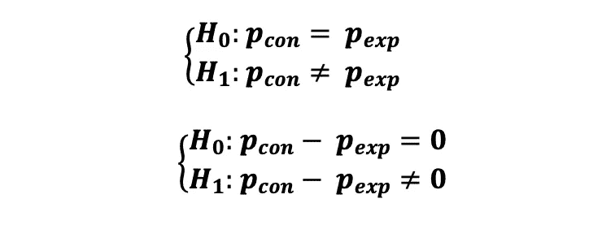*

*其中每个点击事件可以由随机变量来描述，该随机变量可以取两个可能的值 1(成功)和 0(失败),遵循伯努利分布(点击:成功和没有点击:失败),其中 p_con 和 p_exp 分别是对照组和实验组的点击概率(成功概率)。那就是:*

**

*因此，在收集了控制用户和实验用户的交互数据后，您可以计算这两个概率的估计值，如下所示:*

*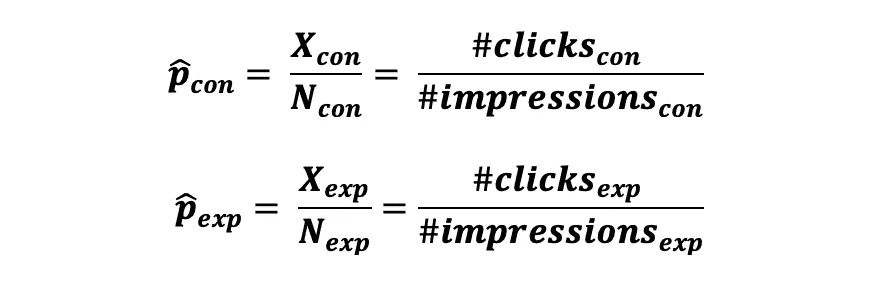*

*因为我们正在测试这些概率的差异，所以我们需要获得一个对联合成功概率的估计和一个对联合方差的估计，如下所示:*

*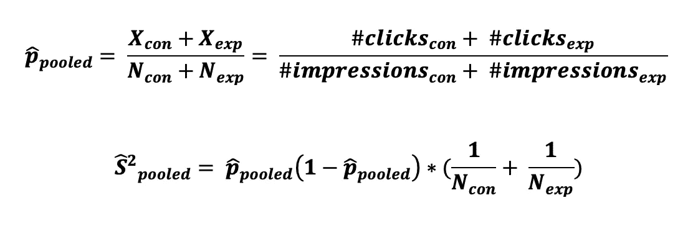*

*那么**标准误差**等于集合方差估计的平方根，可以定义为:*

**

*因此，比例差异的双样本 Z 检验的**检验统计量**可以计算如下:*

**

*那么这个检验统计的 p 值可以计算如下:*

*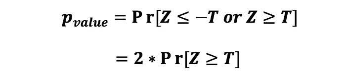*

*最后，您可以计算测试的**置信区间**，如下所示:*

*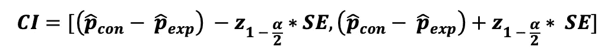*

*其中，Z(1-alpha/2)是与具有 alpha 显著性水平的双边 Z 测试相对应的测试临界值，可以使用 [Z 表](http://www.z-table.com/)找到。这种双边 2 样本 Z 检验的拒绝区域可以通过下图来显示。*

*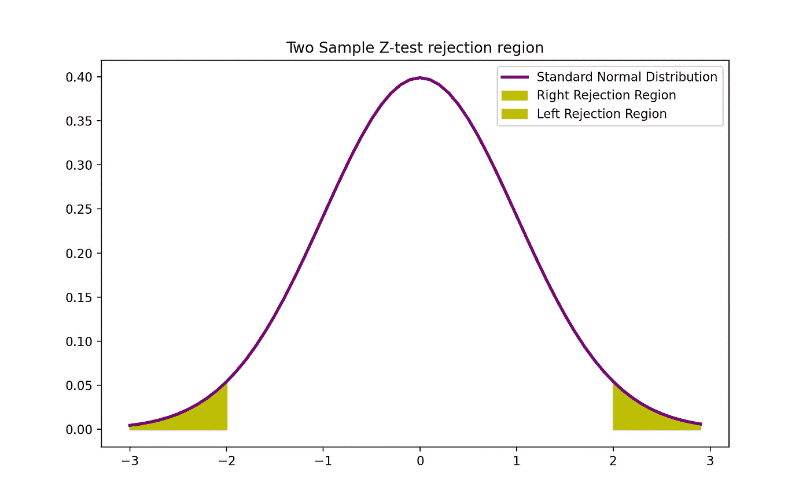*

*图片来源:作者*

# ***比较平均值的 Z 检验(双边)***

*如果您想测试对照组和实验组的平均值(如 CTR)是否存在显著的统计学差异，您可以使用双样本 Z 检验来测试以下假设:*

*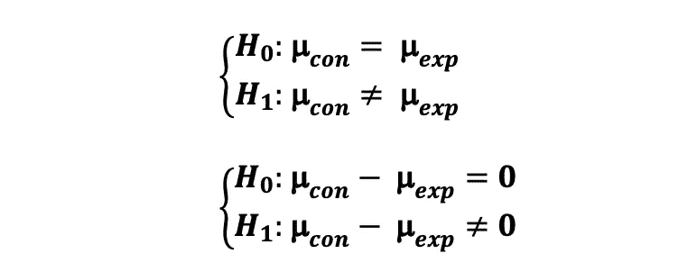*

*其中对照组均值的抽样分布服从正态分布，均值为μ_ con 和σ _con/N_con，此外，实验组均值的抽样分布也服从正态分布，均值为μ_ exp 和σ _exp/N_exp。*

*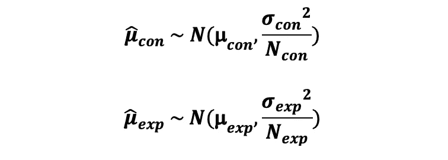*

*然后，对照组和实验组的均值差异也遵循正态分布，均值为μ_ con-μ_ exp，方差为σ _con/N_con + σ _exp/N_exp。*

*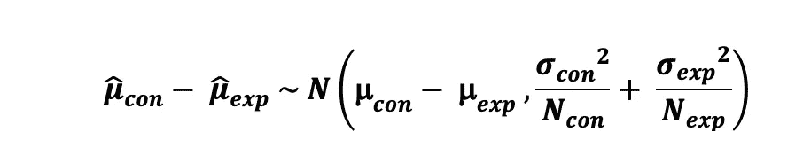*

*因此，均值差异的双样本 Z 检验的**检验统计量**可计算如下:*

*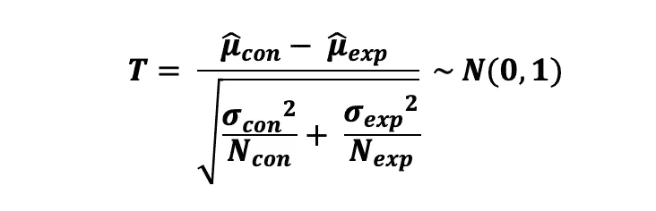*

***标准误差**等于混合方差估计值的平方根，可定义为:*

*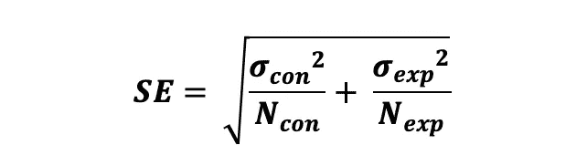*

*那么这个检验统计的 p 值可以计算如下:*

*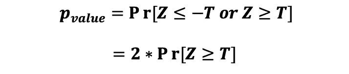*

*最后，您可以如下计算测试的**置信区间**:*

*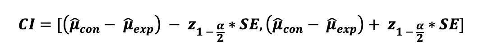*

# ***卡方检验***

*如果您想测试控制组和实验组的绩效指标(例如它们的转化率)之间是否存在统计上的显著差异，并且您并不想知道这种关系的本质(哪一个更好)，您可以使用卡方检验来测试以下假设:*

*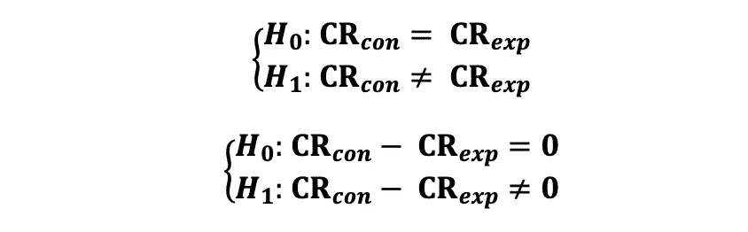*

*请注意，该指标应采用二进制变量的形式(例如，转换或无转换/点击或无点击)。数据可以用下表的形式表示，其中 O 和 T 分别对应于观察值和理论值。*

*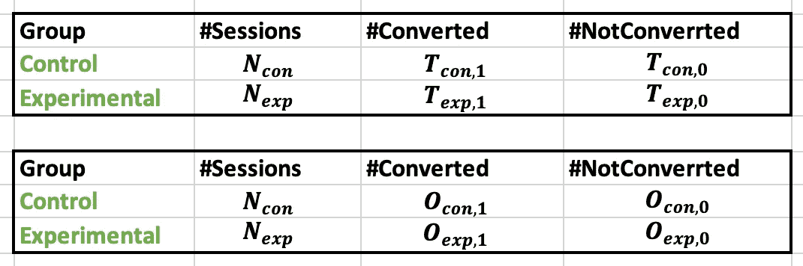*

*那么卡方检验的检验统计量可以表示如下:*

*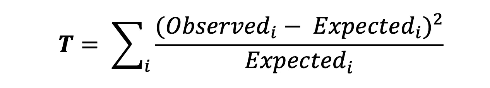*

*其中*observed***对应的是观测数据 *Expected* 对应的是理论值，我可以取值 0(不换算)和 1(换算)。重要的是要看到这些因素中的每一个都有一个单独的分母。当只有两个组时，测试统计的公式可以表示如下:***

***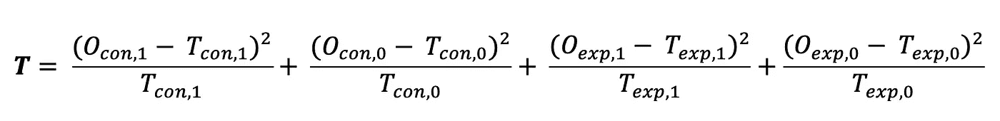***

***期望值等于产品的每个版本被浏览的次数乘以导致转化的概率(或者在点击率的情况下导致点击)。***

***请注意，由于卡方检验不是参数检验，其标准误差和置信区间不能像在参数 Z 检验或 T 检验中那样以标准方式计算。***

***这种双边 2 样本 Z 检验的拒绝区域可以通过下图来显示。***

***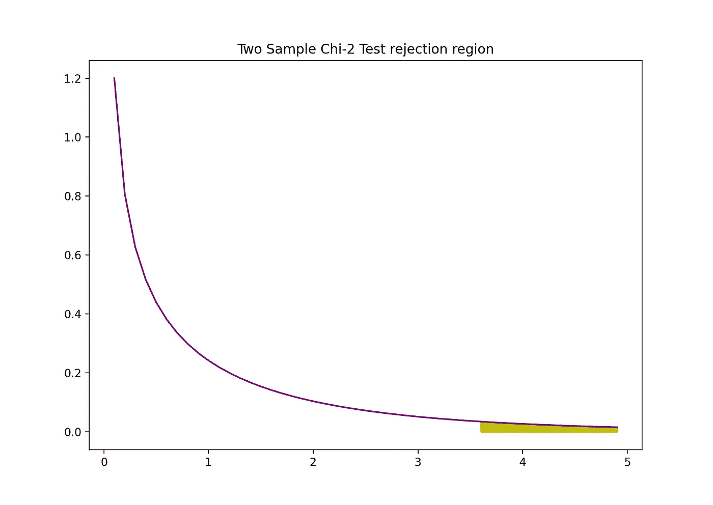***

***图片来源:作者***

# ***f 检验的 p 值***

***另一种快速确定是拒绝还是支持零假设的方法是使用 ***p 值*** 。p 值是零发生条件下的概率。换句话说，假设零假设为真，p 值是观察到至少与检验统计量一样极端的结果的概率。p 值越小，反对零假设的证据越强，表明它可以被拒绝。***

***对 *p* 值的解释取决于所选的显著性水平。通常，1%、5%或 10%的显著性水平用于解释 p 值。因此，这些检验统计的 p 值可以用来检验相同的假设，而不是使用 t-检验和 F-检验。***

***下图显示了具有两个独立变量的 OLS 回归的样本输出。在此表中，t 检验的 p 值(测试 *class_size* 变量参数估计的统计显著性)和 F 检验的 p 值(测试 *class_size、*和 *el_pct* 变量参数估计的联合统计显著性)带有下划线。***

***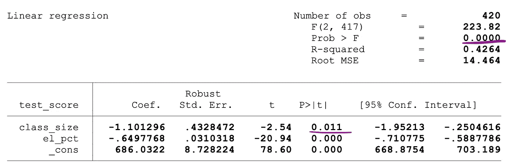***

***图片来源:[股票和 Whatson](https://www.uio.no/studier/emner/sv/oekonomi/ECON4150/v18/lecture7_ols_multiple_regressors_hypothesis_tests.pdf)***

***对应于 *class_size* 变量的 p 值为 0.011，当将该值与显著性水平 1%或 0.01、5%或 0.05、10%或 0.1 进行比较时，可以得出以下结论:***

*   ***0.011 > 0.01 →在 1%的显著性水平上不能拒绝 t 检验的空值***
*   ***0.011 < 0.05 → Null of the t-test can be rejected at 5% significance level***
*   ***0.011 < 0.10 →Null of the t-test can be rejected at 10% significance level***

***So, this p-value suggests that the coefficient of the *class_size* 变量在 5%和 10%的显著性水平上具有统计显著性。对应于 f 检验的 p 值为 0.0000，因为 0 小于所有三个截止值；0.01、0.05 和 0.10，我们可以得出结论，在所有三种情况下都可以拒绝 f 检验的零值。这表明 *class_size* 和 *el_pct* 变量的系数在 1%、5%和 10%的显著性水平上共同具有统计显著性。***

******

***图片来源: [Pixabay](https://www.pexels.com/photo/architecture-buildings-gallery-gothic-37079/)***

# ***如果你喜欢这篇文章，这里有一些你可能喜欢的其他文章:***

*** [## 如何破解 Spotify 数据科学现场面试

### 利用技巧和 Python 实现破解 Spotify 现场访谈的端到端数据科学案例研究

towardsdatascience.com](https://towardsdatascience.com/spotify-data-science-case-study-what-makes-a-playlist-successful-28fec482c523)  [## 如何破解 Spotify 数据科学技术屏面试

### 要了解 Spotify 技术屏幕，您应该知道的确切 Python/SQL 命令和实验主题列表

towardsdatascience.co](https://towardsdatascience.com/how-to-crack-spotify-data-science-technical-screen-interview-23f0f7205928)  [## 理解机器学习中的偏差-方差权衡、过拟合和正则化

### 介绍偏差-方差权衡，过度拟合&如何使用正则化解决过度拟合:脊和套索…

towardsdatascience.com](https://towardsdatascience.com/bias-variance-trade-off-overfitting-regularization-in-machine-learning-d79c6d8f20b4)  [## Python 中的数据采样方法

### 使用不同的数据采样技术创建 Python 中的随机样本的现成代码

tatev-aslanyan.medium.com](https://tatev-aslanyan.medium.com/data-sampling-methods-in-python-a4400628ea1b)  [## 数据科学家和数据分析师的统计学基础

### 数据科学或数据分析之旅的关键统计概念

towardsdatascience.com](https://towardsdatascience.com/fundamentals-of-statistics-for-data-scientists-and-data-analysts-69d93a05aae7)  [## 简单完整的 A/B 测试指南

### 为您的数据科学实验进行端到端 A/B 测试，面向非技术和技术专家，提供示例和…

towardsdatascience.com](https://towardsdatascience.com/simple-and-complet-guide-to-a-b-testing-c34154d0ce5a)  [## 蒙特卡罗模拟和 Python 变种

### 蒙特卡洛模拟指南，必须了解 Python 实现的统计抽样技术

towardsdatascience.com](https://towardsdatascience.com/monte-carlo-simulation-and-variants-with-python-43e3e7c59e1f) 

# 调查:完美的数据科学课程对你来说是什么样的？

*你是否也注意到，作为数据科学家，我们很难浏览多个博客和课程，即使在这种情况下，也没有一个地方涵盖所有主题。所以，我愿意为您打造这个* ***【一站式数据科学店】*** *课程。*

*为了为您定制本课程，我很想了解您的意见，以了解“完美的数据科学课程对您来说是什么样的？”。*

*因此，我想请您回答几个问题来完成这个* [***简短调查***](https://docs.google.com/forms/d/e/1FAIpQLSeRxugd3ACiD1wsC8H3y8Y29L4sk2fdysw1lxzGNedL5sPqUw/viewform)**，一旦课程开始，您将是第一个收到通知的人。也请* [***与你认为会对此课程感兴趣的人分享***](https://docs.google.com/forms/d/e/1FAIpQLSeRxugd3ACiD1wsC8H3y8Y29L4sk2fdysw1lxzGNedL5sPqUw/viewform) *？**

*预先感谢您，非常感谢您的参与！*

****为调查链接:*** [***点击此处***](https://docs.google.com/forms/d/e/1FAIpQLSeRxugd3ACiD1wsC8H3y8Y29L4sk2fdysw1lxzGNedL5sPqUw/viewform)*

****感谢阅读****

**我鼓励你* [***加入 Medium today***](https://tatev-aslanyan.medium.com/membership) *以拥有* *完整访问所有跨媒体发布的伟大锁定内容，并在我的 feed 上发布关于各种数据科学、机器学习和深度学习主题的内容。**

**关注我* [***中型***](https://medium.com/@tatev-aslanyan)**阅读更多关于各种数据科学和数据分析主题的文章。更多机器学习的动手应用，数学和统计概念查看我的*[***Github***](https://github.com/TatevKaren)**账号。
我欢迎反馈，可以联系*[***LinkedIn***](https://www.linkedin.com/in/tatev-karen-aslanyan/)*。****

*****快乐学习！********