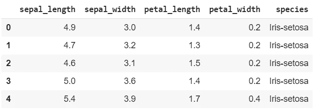
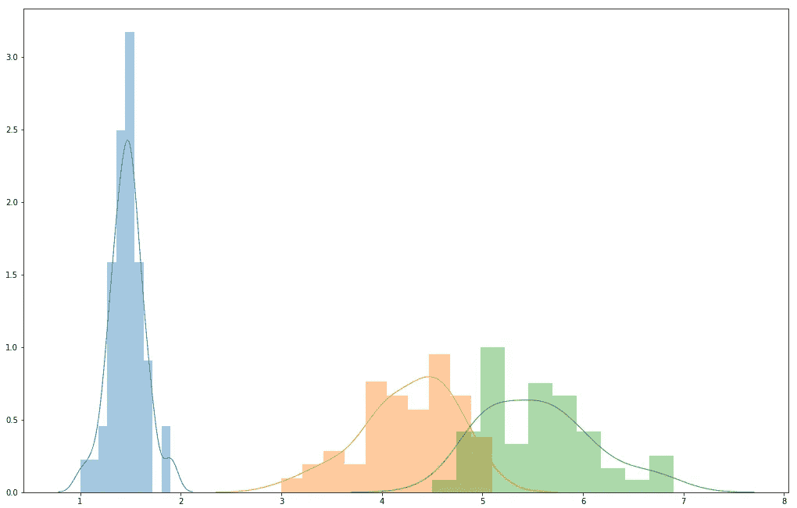
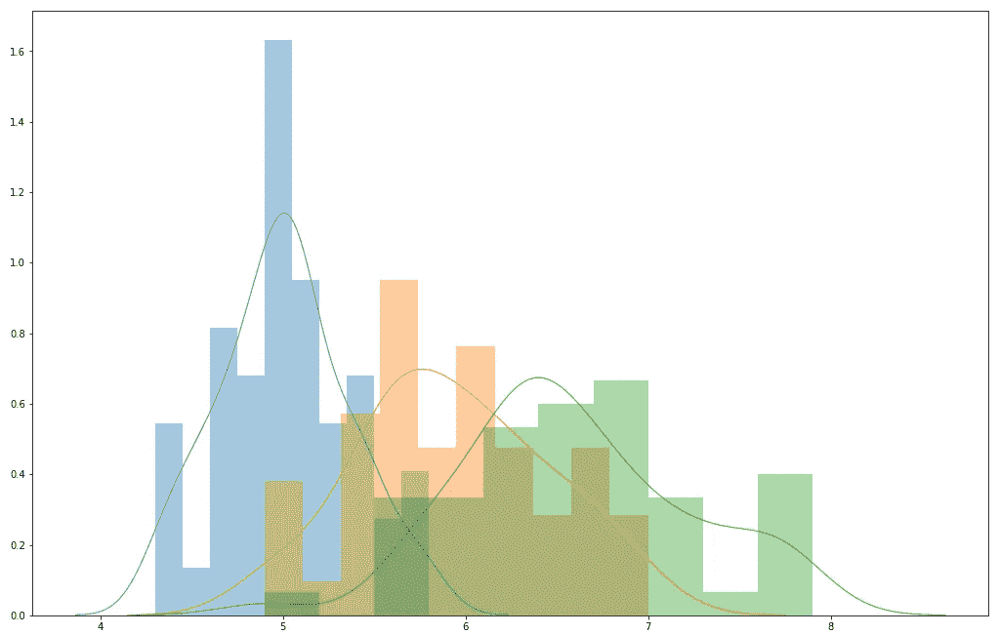
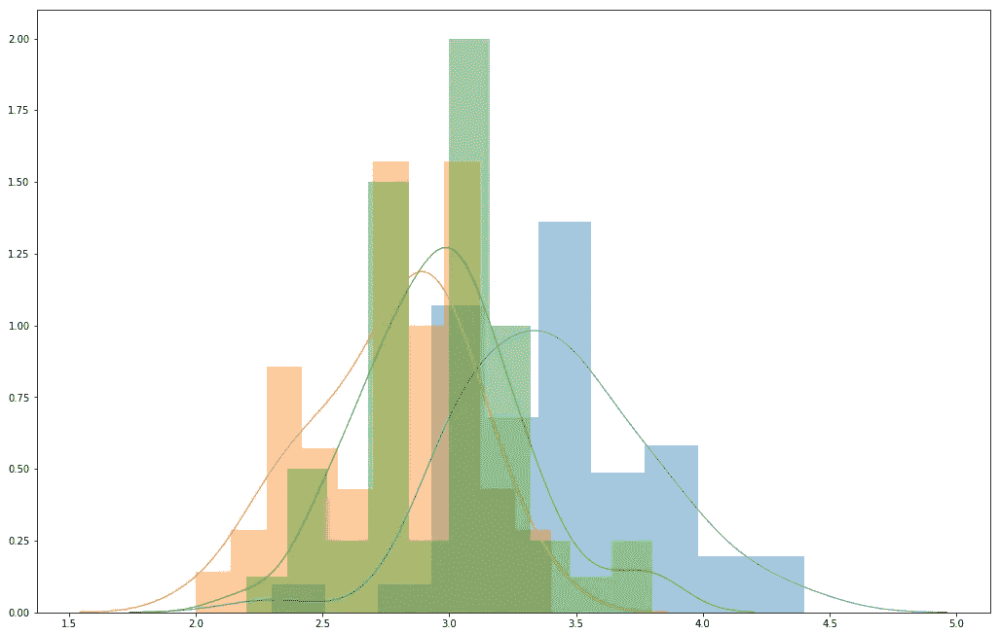
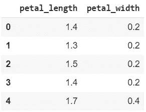

# 仅通过查看分布来评估分类器性能

> 原文：<https://pub.towardsai.net/estimating-a-classifier-performance-just-by-looking-at-the-distributions-385d99cb2e13?source=collection_archive---------1----------------------->

大多数时候，当我们的人工智能没有如我们所愿地表现时，我们可能会责怪模型背后的算法。然而，一个有足够经验的程序员知道，数据的质量对我们的人工智能的表现有很大的影响。

# 在训练人工智能之前查看数据

要确切了解数据集的表现，唯一的方法就是对其进行训练。然而，从头开始查看数据可以节省我们大量的时间和痛苦。

# 观察虹膜数据集的分布

在本文中，我将以 Iris 数据集为例:我是否能够在训练模型之前就确定数据的质量？

让我们首先用几行代码导入数据集:

```
import pandas as pd
X = pd.read_csv('http://archive.ics.uci.edu/ml/machine-learning-databases/iris/iris.data')
X.head()
```



虹膜数据集

因为列和标签还没有命名，所以我将手动命名。X 数据框将包含这些特征。

```
X.columns = ['sepal_length', 'sepal_width', 'petal_length', 'petal_width', 'species']
```

y 数据帧将包含标签。

```
y = X.pop('species')
y = pd.DataFrame(y)
```

* * *我决定将 y 格式的 as 系列转换成 DataFrame 供将来使用。

# 我们如何表示数据？

我们的目标不是训练模型，而是查看原始数据来估计准确性。

之前，我将使用直方图绘制按标注分组的所有要素。对于每个特征，我将用不同的颜色表示所有三个不同的标签。我选择这种特定表示方法的原因是，我想看看分类器在选择每个标签时的选择是如何依赖于特征的分布的。

例如，给定分布在单个直方图上的第一特征**花瓣宽度**、**T3 的所有值，我们可以尝试自己确定分类器的估计。在下图中，我代表了**花瓣宽度的整列；每种**颜色代表三种可能的输出之一:三个标签。**

如果我必须用一个单独的值**花瓣宽度**来估计我的标签，如果这个值位于[.7，2.1]之间，我会 100%准确。正如我们从分布中看到的，对于[.7，2.1]之间的数据集中的每个单独的**花瓣 _ 宽度**，输出将是第一个标签(用蓝色表示)。从我们的数据来看，没有其他选择。



相反，如果**花瓣宽度**值位于[3.7，5.8]之间，我们的估计可能是橙色或绿色标签:结果是不明确的。

# 按标签分组的所有要素的列表

到目前为止，我们在我的示例中看到的是，给定按标注分组的所有要素的图表分布，我们甚至可以通过快速浏览来估计哪些标注很容易以 100%的准确度预测，哪些标注在正确估计时会有问题。

使用此代码，您将在一个数组中分发按标签分组的数据帧中的所有要素:

```
import matplotlib.pyplot as plt
import seaborn as sns
a = list()
for region, df_region in X.groupby(‘species’):
a.append(df_region)b = list()
for c in X.columns[:-1]:
for l in range(len(a)):
b.append(pd.DataFrame(a[l][c]))
for k in range(0,3): #len(X['species'].unique())
  sns.distplot(b[k], hist = True, bins = 10, kde = True, kde_kws = {'linewidth': 1})
```

# 绘制按标注分组的要素

```
fig, ax = plt.subplots()
fig.set_size_inches(17.55, 11.4)for k in range(0,3):
  sns.distplot(b[k], hist = True, bins = 10, kde = True, kde_kws = {'linewidth': 1})
```



```
fig, ax = plt.subplots()
fig.set_size_inches(11.7, 8.27)for k in range(3,6):
  sns.distplot(b[k], hist = True, bins = 10, kde = True, kde_kws = {‘linewidth’: 1})
```



```
fig, ax = plt.subplots()
fig.set_size_inches(17.55, 11.4)for k in range(6,9):
  sns.distplot(b[k], hist = True, bins = 10, kde = True, kde_kws = {‘linewidth’: 1})
```


```
fig, ax = plt.subplots()
fig.set_size_inches(17.55, 11.4)for k in range(9,12):
  sns.distplot(b[k], hist = True, bins = 10, kde = True, kde_kws = {‘linewidth’: 1})
```


# 得出结论

上面绘制的直方图非常清楚:指示前两个特征的前两个图显示了所有分布的重叠:基本上，前两个特征不允许我们准确地预测任何标签。

相反，最后两个图表特征显示分布彼此远离，并且它们充当标签的几乎完美的估计。

# 测试我们的假设

我将继续测试两个不同的假设:

> 假设 _1

我将去掉前两组分布，并在数据集上查看结果。剩下的两个特征彼此相距甚远:我假设即使只有这两个特征，数据集也会获得很高的精确度。

> 假设 _2

在我的第二个假设中，我将去掉最后两组分布。因为剩余的分布几乎在每个点都是重叠的，我可以假设很难有一个精确的结论:这将导致低水平的准确性。

# 测试假设 _1

如果我们重新加载并重命名初始数据集，我们只需进行以下更改:

```
X.pop(‘sepal_length’)
X.pop(‘sepal_width’)
```

这是我们剩下的:



```
#splitting the dataset
from sklearn.model_selection import train_test_split
X_train, X_test, y_train, y_test = train_test_split(X, y, test_size=0.2, random_state=11)
print(X_train.shape, X_test.shape, y_train.shape, y_test.shape)import numpy as np
from sklearn.naive_bayes import GaussianNB#creating the model
clf = GaussianNB()#training the model
clf.fit(X_train, y_train)
print(clf.score(X_test, y_test))
0.9666666666666667
```

正如我们所看到的，即使只使用最后两个特征，我们也获得了惊人的 0.97 的准确度。

# 测试假设 _2

现在，我将做同样的事情，去掉最后两组分布。

```
X.pop(‘petal_length’)
X.pop(‘petal_width’)
```

运行模型后，结果如预期的那样低:

```
0.7
```

# 结论

我们可以得出一个简单的结论:如果在所有的图中，我们识别出任何只对应于一个标签的值，那么该预测将是 100%准确的。因此，对于不与同一平面中的其他分布重叠的每个分布，该模型获得了准确性。

由[向 AI](https://towardsai.net/) 发布