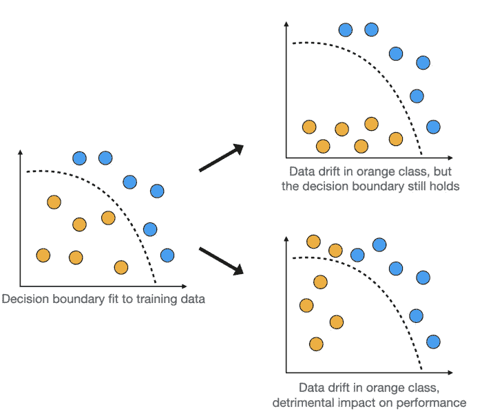
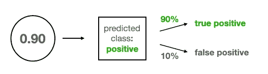
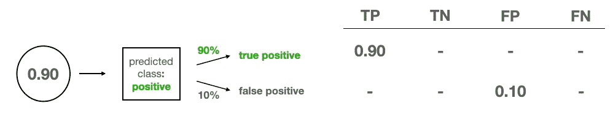
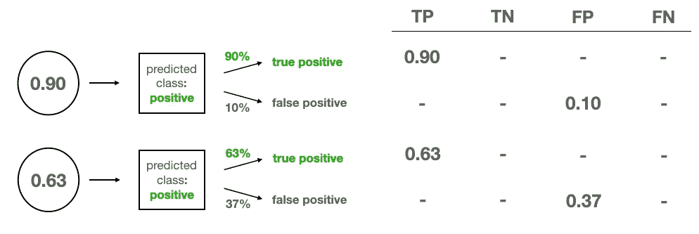
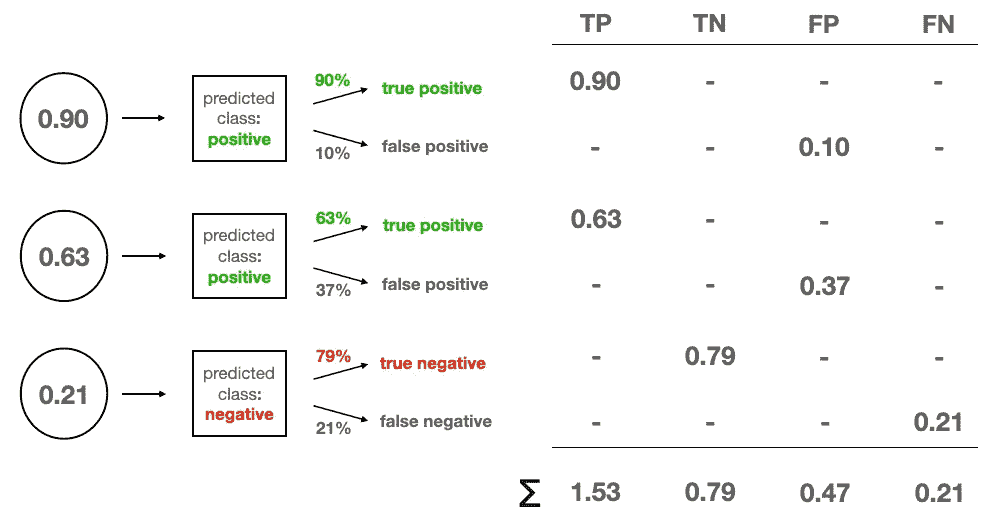
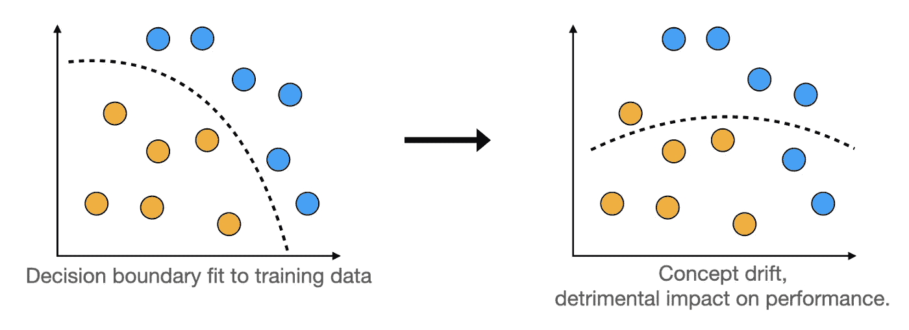
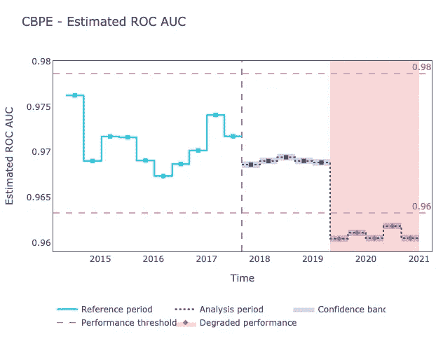

# 在没有基础事实的情况下评估模型性能

> 原文：<https://pub.towardsai.net/estimating-model-performance-without-ground-truth-453b850dad9a?source=collection_archive---------2----------------------->

## 这是可能的，只要你保持你的概率校准

对于数据科学人士来说，一旦预测模型最终部署完毕，乐趣才刚刚开始，这应该不是什么新闻。生产中的模型就像一个婴儿:它需要被观察和照顾，以确保它一切正常，没有太危险的事情发生。保姆的主要杂务之一是不断监控模特的表现，如果恶化就做出反应。这是一个相当标准的任务，只要你有观察到的目标。但是，在缺乏基本事实的情况下，如何评估模型性能呢？让我给你看看！

# 性能监控

让我们从基础开始。为什么我们还要关心性能监控？毕竟，在发货之前，模型已经在新的、看不见的数据上进行了适当的测试，对吗？不幸的是，就像金融投资一样，过去的表现并不能保证未来的结果。机器学习模型的质量往往会随着时间而恶化，罪魁祸首之一就是[数据漂移](https://towardsdatascience.com/dont-let-your-model-s-quality-drift-away-53d2f7899c09)。

## 数据漂移

*数据漂移*(也称为*协变量漂移*)是模型输入的分布发生变化的情况。这种变化的潜在原因很多。

想想由某种传感器自动收集的数据。该设备可以中断或接收改变测量方式的软件更新。如果数据描述的是人，例如用户、客户或调查受访者，他们甚至更有可能离开，因为时尚和人口统计数据在不断变化。

因此，与在培训期间看到的数据相比，生产中的模型被提供了不同的分布数据。对其性能有什么影响？考虑下面的图形。

数据漂移。图片由作者提供。来源:[链接](https://towardsdatascience.com/dont-let-your-model-s-quality-drift-away-53d2f7899c09)。

当输入数据的分布变化太大时，它可能会越过模型的决策边界，从而导致性能下降。

## 监控模型性能

关键是要有适当的监控，以便能够发现模型性能下降的早期迹象。例如，如果我们得到足够早的警告，可能还有时间调查其原因并决定重新训练模型。

在许多情况下，性能监控是一项相对标准的任务。当地面真实目标可用时，这是最容易的。想想客户流失预测。我们有我们的模型对一组用户的预测，我们知道他们是否在给定的时间范围内发生了变化。这允许我们计算我们选择的指标，如准确度、精确度或 ROC AUC，并且我们可以用新的数据批次不断地计算它们。

在其他场景中，我们可能不会直接观察到地面真实目标，但是仍然会收到一些关于模型质量的反馈。想想垃圾邮件过滤器。最终，您永远不会知道数据库中的每封特定电子邮件是否是垃圾邮件。但是您应该能够观察到一些表明这一点的用户操作，例如将邮件从收件箱移至垃圾邮件，或将归类为垃圾邮件的电子邮件从垃圾邮件文件夹中取出。如果这种行为的频率没有增加，这可能会使我们得出结论，模型性能是稳定的。

> 性能监控是很容易的，只要地面真实目标或其他关于模型质量的直接反馈是可用的。

最后，让我们考虑关于模型质量的反馈很少甚至没有的最终场景。我曾经参与了一个移动设备地理定位项目，目标是预测用户的位置，以便为他们提供相关的营销优惠。虽然整个企业的表现表明了机器学习模型的质量，但对于模型在生产中收到的每个输入，都没有可用的基础数据点。那么，我们如何进行监测呢？

> 当模型被正确校准时，我们可以在没有地面真实标签的情况下估计模型性能。

在缺乏地面真实数据的情况下估计模型性能是棘手的，但可能完成。我们只需要一样东西:一个校准过的模型。现在来说说是什么意思。

# 概率校准

要理解[概率标定](https://towardsdatascience.com/calibrating-classifiers-559abc30711a)，先说概率本身。接下来，我们将看看这个概念如何与分类模型相关联。

## 概率是什么？

令人惊讶的是，对于真正的*是*的概率，人们并没有达成共识。我们都同意这是一个确定性度量，通常用 0 到 1 之间的数字表示，数值越高表示越确定。协议到此结束。

关于概率有两个思想流派:频率主义者(也称为古典)和贝叶斯。一个频率主义者会告诉你“一个事件的概率是它在许多试验中相对频率的极限”。如果你抛硬币很多次，大约有一半会正面朝上。投掷次数越多，这个比率就越接近 0.5。因此，用硬币掷人头的概率是 0.5。

贝叶斯不同意 T1 的观点，声称你也可以在不观察某件事情发生多次的情况下得出概率。你可以在这里[和](https://towardsdatascience.com/bayesian-tricks-for-everyday-use-2b51da45f3ec)[这里](https://towardsdatascience.com/on-the-importance-of-bayesian-thinking-in-everyday-life-a74475fcceeb)阅读更多关于贝叶斯思维方式的内容。然而，让我们跳过这个讨论，因为我们的主要话题是关于概率的频率主义定义。事实上，我们需要我们的分类模型来产生常客概率。

## 机器学习模型和概率

产生频率概率的模型被认为是校准良好的。在这种情况下，如果模型为许多测试用例返回 0.9 概率的肯定类，我们可以预期它们中的 90%确实是肯定类。

> 产生频率概率的模型被称为校准良好的模型。

然而，大多数二元分类器[产生倾向于被解释为概率的分数，事实上，它们不是](https://towardsdatascience.com/calibrating-classifiers-559abc30711a)。这些分数有利于排名——较高的数字确实意味着积极类的可能性较高——但它们不是概率。其原因因不同的模型架构而异，但一般来说，许多分类器倾向于高估低概率，低估高概率。

## 校准分类器

上述规则的一个例外是逻辑回归。通过构建，它模拟概率并产生校准的结果。这就是为什么校准校准不良模型的一种方法是将其预测传递给逻辑回归分类器，该分类器应该适当地移动它们。

知道了所有这些，有了我们校准好的模型，我们终于可以在没有目标的情况下进行性能评估了！

# 基于置信度的性能评估

由部署后数据科学开源库 [NannyML](https://bit.ly/mblog-nannyml-website) 开发的算法允许我们在缺乏基础事实的情况下估计模型性能，该算法被称为*基于信心的性能估计*，或 CBPE。

其背后的想法是基于预期误差率来估计混淆矩阵的元素，假设模型校准良好，我们知道这一点。有了混淆矩阵，我们就可以评估我们选择的任何性能指标。让我们看看它是如何工作的。

## CBPE 算法

为了理解 CBPE 算法，让我们看一个简单的例子。假设我们的模型在生产中使用了三次，并产生了以下概率:`[0.90, 0.63, 0.21]`。当然，我们不知道真正的目标群体。

考虑第一个预测值 0.9，在下图中用气泡表示。因为它大于 0.5 的典型阈值，所以这个例子被分类为正类。因此，有两种选择:如果模型是正确的，这是一个真正的积极，如果它是错误的，这是一个错误的积极。由于模型产生的 0.9 是一个校准的概率，我们可以预计模型在 90%的类似情况下是正确的，或者换句话说，我们预计模型是正确的概率为 90%。这使得预测有 10%的可能性是假阳性。

图片由作者提供。

因此，我们建立了混淆矩阵。它有四个条目:真阳性(TP)、真阴性(TN)、假阳性(FP)和假阴性(FN)。如前所述，我们的第一个例子只有两种可能性，我们根据它们的概率来分配。

通常，混淆矩阵包含每种预测类型的计数，但 CBPE 算法将它们视为连续量。因此我们将 0.9%的真阳性和 0.1%的假阳性分配给矩阵。

图片由作者提供。

输入模型输出为 0.63 的第二个测试示例。我们把它放在图片中，作为第一个下面的新气泡。同样，它是 TP 或 FP，所以我们相应地分配分数。

图片由作者提供。

最后，我们有第三个测试案例，其中 0.21 的预测转换为负类。先放在前两个下面吧。第三个例子可能是 100–21 = 79%概率的真阴性，也可能是 21%概率的假阴性。我们将相应的分数分配给混淆矩阵，并对四种预测类型中的每一种进行求和。

图片由作者提供。

一旦完成，我们就可以计算我们想要的任何性能指标。例如，我们可以通过将 TPs 和 TNs 的总和除以测试用例的数量来计算预期的准确性:`(1.53 + 0.79) / 3 = 0.77`。

以类似的方式，人们可能开始计算精确度、回忆，或者甚至 ROC 曲线下的面积。

## 危险区域:假设

统计学上没有免费的午餐。与大多数统计算法类似，CBPE 确实附带了一些假设，需要保持这些假设以使性能估计可靠。

首先，正如我们已经讨论过的，CBPE 假设模型是校准的。正如我们所说的，大多数模型都不是默认的。我们可以校准我们的模型，例如通过在其上添加逻辑回归分类器，但这可能会对准确性指标产生不利影响。事实上，更好的校准并不能保证更好的性能，而只是更可预测的性能。在每个精度百分点都至关重要的情况下，人们可能不愿意牺牲它。

> 更好的校准并不保证更好的性能，只是更可预测的性能。

第二，只要没有*概念漂移*，CBPE 算法就能工作。概念漂移是数据漂移的更邪恶的孪生兄弟。这是输入要素和目标之间关系的变化。

> CBPE 只在没有概念漂移的情况下工作。

当它发生时，模型学习的决策边界不再适用于《美丽新世界》。

概念漂移。图片由作者提供。来源:[链接](https://towardsdatascience.com/dont-let-your-model-s-quality-drift-away-53d2f7899c09)。

如果发生这种情况，由模型学习的特征-目标映射变得过时，并且校准不再重要——模型就是错误的。小心概念漂移！

# CBPE 和奶奶

CBPE 算法背后的公司 NannyML 也提供了其开源实现，作为他们可安装 pip 的 Python 包`nannyml`的一部分。你可以在他们的文档中查看算法[的数学细节描述。](https://bit.ly/mblog-nannyml-docs)

在不知道目标的情况下估计分类器的 ROC AUC 只需用 nannyML 编写 5 行代码，并在此过程中生成好看的可视化效果，如下所示。

预期 ROC AUC 可视化。来源: [nannyML 文档](https://docs.nannyml.com/latest/quick.html#estimating-performance-without-targets)

一定要看看他们的[快速入门指南](https://bit.ly/mblog-nannyml-quickstart)，看看如何自己轻松实现它！

感谢阅读！

如果你喜欢这篇文章，为什么不订阅电子邮件更新我的新文章呢？并且通过 [**成为媒介会员**](https://michaloleszak.medium.com/membership) ，可以支持我的写作，获得其他作者和我自己的所有故事的无限访问权限。

需要咨询？你可以问我任何事情，也可以在这里 为我预定 1:1 [**。**](http://hiretheauthor.com/michal)

你也可以试试[我的另一篇文章](https://michaloleszak.github.io/blog/)。不能选择？从这些中选择一个:

 [## 不要让你的模型质量渐行渐远

### 解决生产 ML 系统中的数据漂移和概念漂移

towardsdatascience.com](https://towardsdatascience.com/dont-let-your-model-s-quality-drift-away-53d2f7899c09)  [## 贝叶斯思维在日常生活中的重要性

### 这个简单的思维转变将帮助你更好地理解你周围不确定的世界

towardsdatascience.com](https://towardsdatascience.com/on-the-importance-of-bayesian-thinking-in-everyday-life-a74475fcceeb)  [## 校准分类器

### 你确定你的模型返回概率吗？🎲

towardsdatascience.com](https://towardsdatascience.com/calibrating-classifiers-559abc30711a)