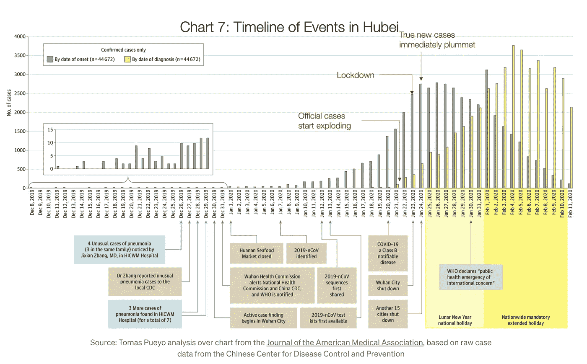
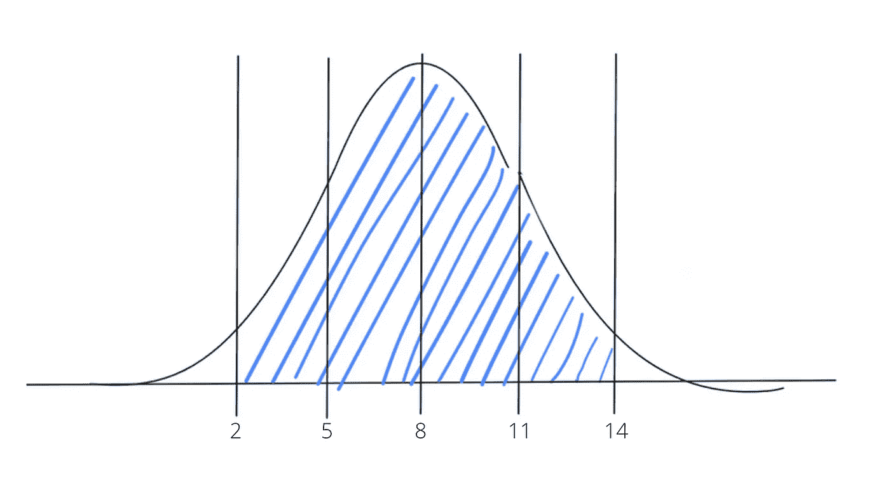
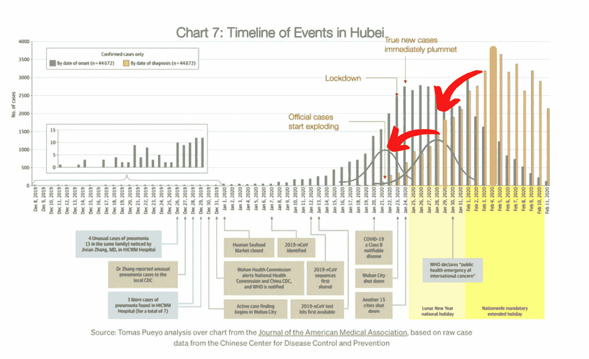
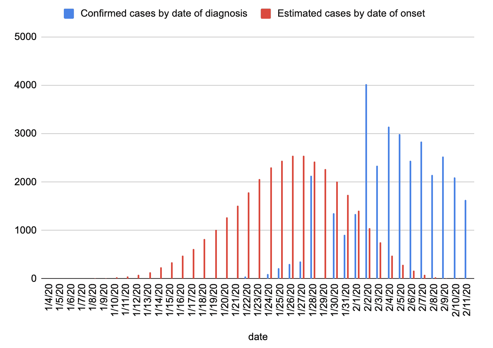
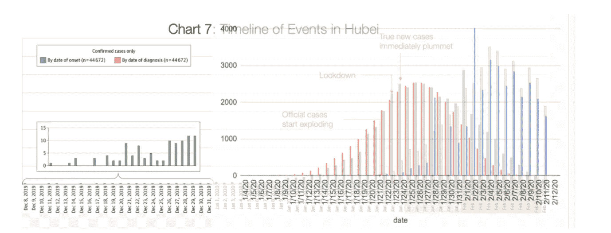
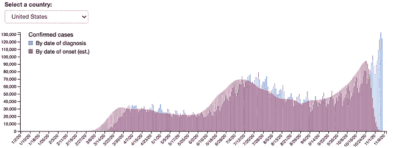
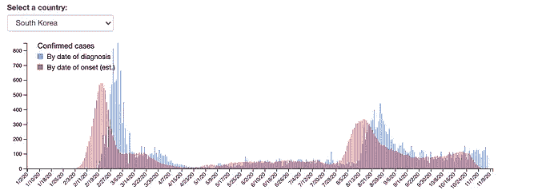
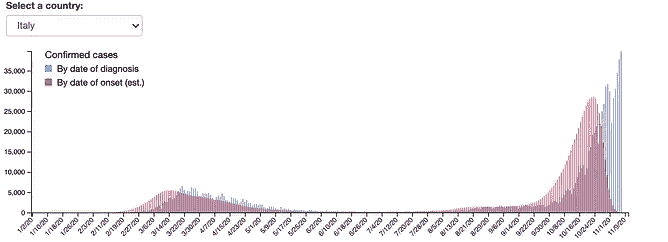

# 给定诊断日期，估计病毒暴露日期

> 原文：<https://pub.towardsai.net/estimating-the-date-of-virus-exposure-given-the-date-of-diagnosis-848bd7458831?source=collection_archive---------7----------------------->

## [数据科学](https://towardsai.net/p/category/data-science)

## 使用贝叶斯统计和正态分布来模拟冠状病毒

***免责声明:*** *本文仅作教育用途。我们不鼓励任何人抓取网站，尤其是那些可能有条款和条件反对此类行为的网站。*

到目前为止，你可能已经读过托马斯·普约关于冠状病毒的 [**文章**](https://tomaspueyo.medium.com/coronavirus-act-today-or-people-will-die-f4d3d9cd99ca) 。记得这个图表吗？

上图显示了中国湖北省确诊的新冠肺炎病例数，但图中*和*也显示了这些病例首次感染病毒的预计日期。该图清楚地表达了为什么 1 月 23 日封锁对湖北很重要——尽管当时确诊病例不到 1000 例，但蓝绿色曲线显示，真实病例数要高得多。

中国疾病预防控制中心通过在诊断期间询问患者症状开始的时间来收集这些数据。不幸的是，其他国家没有效仿这个例子，当人感染病毒时，这种关于*的双边数据集没有被广泛使用。*

所以我试着根据对湖北和病毒的了解来模拟其他国家的数据。

疾控中心表示，接触新冠肺炎病毒后 2 至 14 天可能会出现症状。我将假设症状出现的天数服从平均值为 8 的正态分布。

如果我们假设 2 到 14 天涵盖了 95%的情况，那么遵循 68–95–99.7 规则，该范围涵盖了远离平均值的两个标准差。那么，假设的分布是正态分布，均值为 8，标准差为 3。

图片由作者提供。

上面的曲线是我对暴露于新冠肺炎和出现症状之间的天数分布的估计。正如 CDC 所说，95%的病例在暴露后 2 至 14 天内出现症状。

然而，我们试图建模的数据是基于测试日期的——我假设在注意到症状后，平均需要 2 天时间进行测试并收到结果。这意味着我将用于模型的正态分布的平均值为 10，标准差为 3。因此，现在的范围是 4 到 16 天，代表暴露于病毒和检测结果呈阳性之间的天数。

我的理论是这样的:如果我们把原始图表中的每一个橙色条，用这个分布把它们转换成一条正态曲线，然后我们可以把这些正态曲线一条接一条地叠加起来，估计出蓝绿色曲线。

这里有一个做得很差的例子来解释这个过程:

将该数据应用于原始图表中的湖北案例数据会产生以下曲线:

让我们将它覆盖在原始图表上…

该死的。我想说这是一个很好的匹配。

然后，我从**世界计量表中搜集了所有死亡人数超过 1000 人的国家的新冠肺炎病例数据，并使用相同的估计方法来确定这些国家的“发病日期”曲线。**

**这是美国、韩国和意大利的曲线。蓝色曲线代表按诊断的病例数，红色曲线代表我对按发病日期的病例数的估计。**

************

**作者图片。**

**这些可视化效果是互动的——你可以与它们互动，并在这里看到其他国家[的曲线。](https://vastava.github.io/coronavirus-dashboard/)**

**我用红色曲线来估算病毒的增长率，这比用蓝色曲线的估算更“实时”准确。**

**如果你对这个分析感兴趣，请观看我解释它的视频文章:**