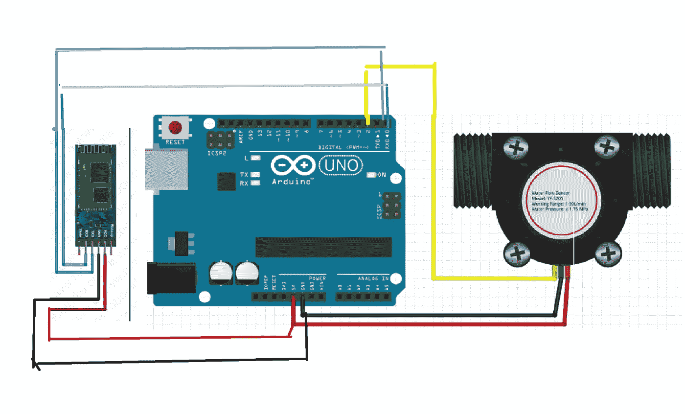

# 用水量估算

> 原文：<https://pub.towardsai.net/estimation-of-water-usage-6337ca29718f?source=collection_archive---------1----------------------->

## [编程](https://towardsai.net/p/category/programming)，[技术](https://towardsai.net/p/category/technology)

## 使用传感器测量我们日常所需的水

如果你是一个兴奋的极客，想测量用水量，这里有一个有趣的应用程序给你。在这种方法中，我们将使用不同的模块来测量我们使用的水。让我们来了解一下如何在手机上进行测量和展示。我们自己安装模块会很有趣。

来自 shutterstock.com

## **霍尔效应水传感器:**

霍尔效应传感器位于您的水管线上，包含一个风车传感器来测量有多少液体通过它。它包括一个集成的磁性霍尔效应传感器，每转输出一个电脉冲。它通过密封水管使传感器保持安全和干燥。通过计算传感器输出产生的脉冲，您可以轻松计算水流量。它不是一个精密的传感器，脉冲率确实会根据流速、流体压力和传感器方向而有所不同。如果要求高于 10%的精度，则需要仔细校准。脉冲信号是一个简单的方波，很容易用下面的公式转换成升/分钟。脉冲频率(Hz) / 7.5 =以升/分钟为单位的流速。

## Arduino:

Arduino 是一个开源平台，用于构建我们自己的电子项目。它由物理可编程电路板和运行在 PC 上的 IDE(集成开发环境)组成，用于编写、调试和上传计算机代码到物理电路板。与大多数以前的可编程电路板不同，它不需要单独的硬件来将新代码转储到板上。我们可以用 USB 线转储。此外，Arduino IDE 使用 C++的简化版本，这使得学习和编写程序更加容易。

这里我们用的是 Arduino-Uno。它由 14 个数字引脚和 6 个模拟引脚组成。每一个都提供 10 位的分辨率，从而产生 1024 个不同的值。这些引脚的测量范围为 0 至 5V。

## **HC-06:**

它是一个蓝牙模块，设计用于在两个模块之间建立短程透明无线通信。它工作在**蓝牙 2.0 通信协议上。**它只能作为从设备。它是最便宜的无线数据传输设备，与其他方法相比更灵活，甚至可以以高达 2.1Mb/s 的速度传输文件

它使用 FHSS(跳频扩频技术)来避免与其他模块的干扰，并具有全双工传输。它工作在 2.402 GHz 到 2.480GHz 的频率范围内

## **麻省理工学院应用发明者**

麻省理工学院的应用程序发明者是一个网络应用程序，一个可视化编程环境，允许每个人都为 Android 手机构建功能齐全的应用程序。我们可以制作我们的应用程序，并将它们与您的模块连接起来。我们可以发送和接收来自模块的数据。

## **实现:**

为此，我们需要 Arduino、HC06 蓝牙模块、霍尔效应水传感器、连接线。最初，在你的 PC 或笔记本电脑上安装 Arduino-Uno，并确保你安装了所需的驱动程序。

使用麻省理工学院的应用程序发明者，在这里制作你的应用程序。更多细节，可以参考上面链接的麻省理工学院 app inventor。你可以在不知道任何编码的情况下开发你的应用。甚至你可以在这里下载(APK)文件[。](https://github.com/santhoshbandaru/water-used/blob/master/water_used.apk)

## **连接:**

作者提供的照片

连接上图所示的电路，并确保所有连接正确。使用连接器将以下代码转储到 Arduino。将代码存入微控制器后，您会看到 HC06 开始闪烁 LED。当你接通后，你会发现 HC06 停止闪烁。在这里，将水管连接到霍尔效应传感器上，并使用 DC 电源通过适配器为 Arduino 供电。

> 转储代码时，确保移除 RX 和 TX 线。
> 您必须手动连接到 HC06。
> HC06/HC05 的密码通常为 0000 或 1234。

你可以在 Github 上查看整个项目

## **结论:**

坐下来放松，现在你可以很容易地监控你的用水量。我希望你学会并喜欢它。如果你发现有改进的地方，请随时提出修改意见。我很快会再赶上你的。在那之前，呆在家里，注意安全！

如果你想联系，请在 LinkedIn 上联系我。