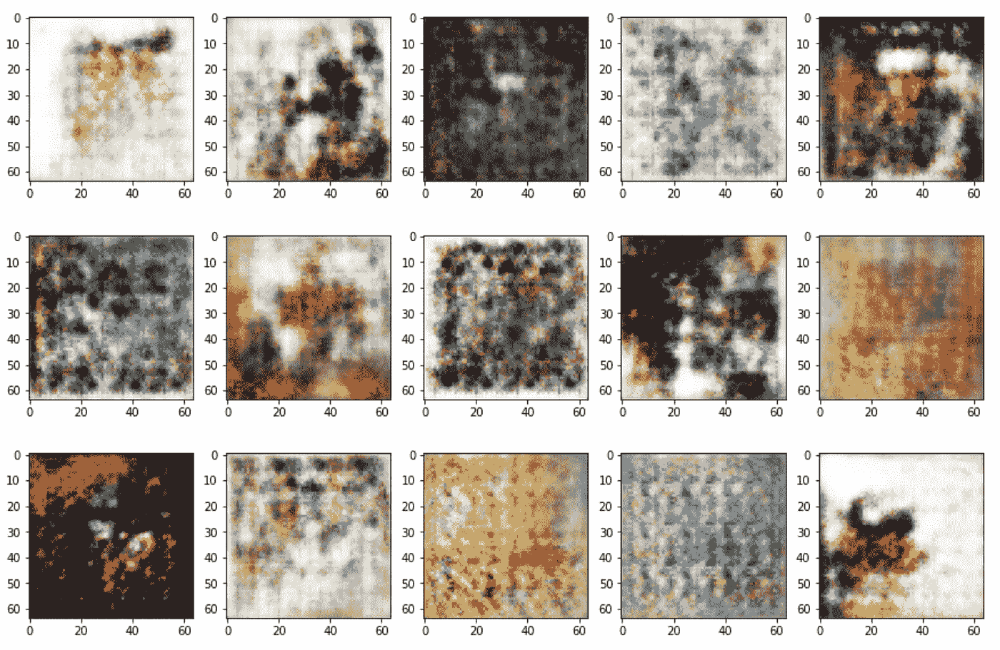
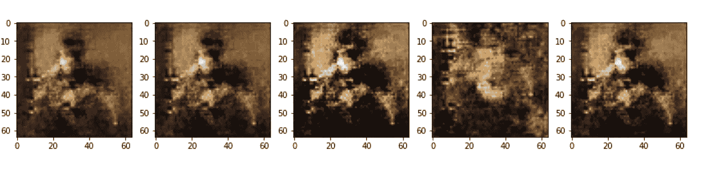
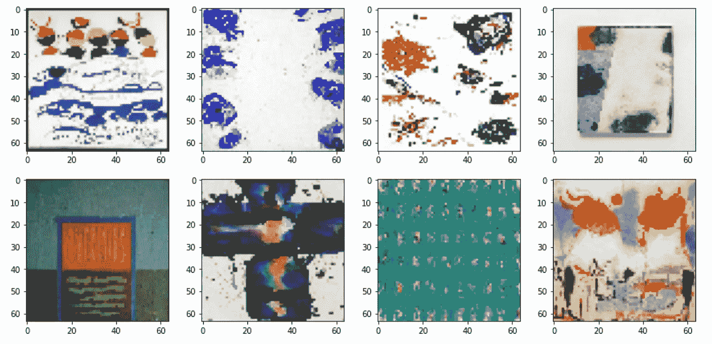
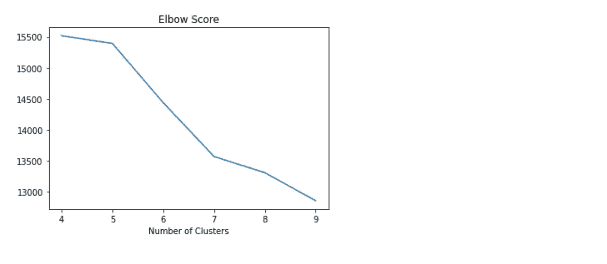
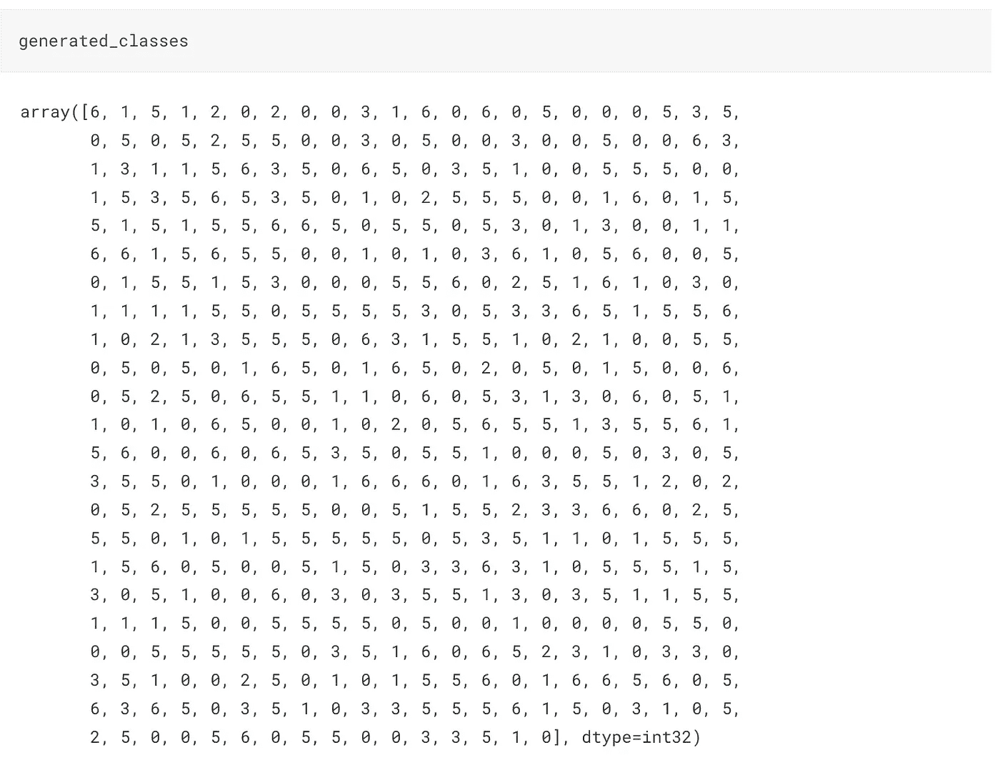
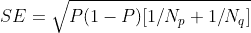
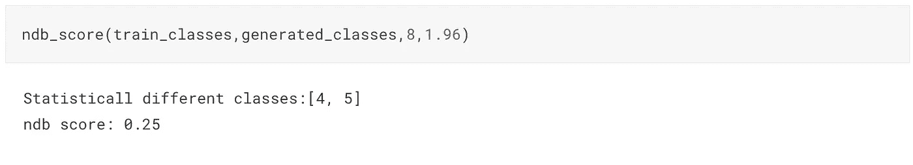

# 用 NDB 分数评估 GANs 中的模式崩溃

> 原文：<https://pub.towardsai.net/evaluating-mode-collapse-in-gans-using-ndb-score-446f17791d16?source=collection_archive---------3----------------------->

下面是我从 GAN 生成的一些艺术作品。他们一点也不引人注目，但他们是多样化的。然而，情况并非总是如此。



GAN 生成的图像

下一组图片来自我训练的另一个甘。它们不仅可怕，而且一模一样。



Gan 生成的图像

众所周知，甘人很难训练。它们很少(如果有的话)收敛，并且经常遭受模式崩溃。如上图所示，当 GANs 无法获得数据分布中的不同模式并无情地生成相似的图片时，就会发生模式崩溃。

仅仅通过绘制图像来发现模式崩溃是很方便的，但是随着数据集大小的增加，对其进行定量评估可能会更方便。我们将使用**NDB 分数**来完成。

这篇文章假设你熟悉 GAN 训练机制。如果你不知道它们是如何运作的，请参考这篇[文章](https://jonathan-hui.medium.com/gan-whats-generative-adversarial-networks-and-its-application-f39ed278ef09)。

# **模式崩溃**

你看，模式崩溃在甘的训练策略中根深蒂固。真实世界的数据是多模态的，理想的 GAN 必须捕捉所有这些模态。例如，MNIST 数据集中的每个数字都是一个独立的模式，您可能更喜欢生成所有数字的 GAN。然而，我们通常不会鼓励他们这样做。

假设生成器很好地构造了数字“2”来欺骗鉴别器。它不需要再拥挤了。然而，在训练迭代期间，鉴别器将接收这些生成的被标记为假的二进制数，并随着时间的推移，学会捕捉虚张声势。当这种情况发生时，生成器可以很容易地切换到另一个数字，比如“3”，并继续模式崩溃循环。直觉上，你可以认为这是在工作不足的情况下对额外工作的冷漠。

现在，让我们学习定性地跟踪这一现象。

# 设置 GAN

可以在以下链接中找到此实施的完整记录:

[](https://www.kaggle.com/code/shashank069/gan-art-and-ndb-score/notebook) [## 甘艺术与乐谱

### 使用 Kaggle 笔记本探索和运行机器学习代码|使用来自多个数据源的数据

www.kaggle.com](https://www.kaggle.com/code/shashank069/gan-art-and-ndb-score/notebook) 

[https://github . com/shashank 14k/Generative _ Models/blob/main/GAN/notebooks/GAN-art-and-nd b-score . ipynb](https://github.com/shashank14k/Generative_Models/blob/main/GAN/notebooks/gan-art-and-ndb-score.ipynb)

用于培训的数据可以在[这里找到](https://www.kaggle.com/datasets/bryanb/abstract-art-gallery) ( [执照](https://creativecommons.org/publicdomain/zero/1.0/))。这是其中的一些图片。



我们将从进口开始。

```
import numpy as np
import matplotlib.pyplot as plt
import tensorflow  as tf
from tensorflow.keras import layers
from tensorflow.keras.models import Sequential
from tensorflow.keras.layers import Dense, Reshape, Conv2D, BatchNormalization, Conv2DTranspose
from tensorflow.keras.layers import LeakyReLU, Dropout, ZeroPadding2D, Flatten, Activation
from tensorflow.keras.optimizers import Adam
from sklearn.cluster import KMeans
```

接下来，我们将使用 TensorFlow 数据加载器从目录中加载图像，将它们的形状缩小到(64，64)，并对它们进行归一化。注意，这里的批处理大小是全局批处理的一半，因为另一半来自生成器图像。

```
BATCH = 64
IMG_SIZE = (64,64)
LATENT_DIM = 100
EPOCHS = 600
PATH = "../input/abstract-art-gallery/Abstract_gallery/Abstract_gallery" *#Importing data*
batch_s = int(BATCH/2)
*#Import as tf.Dataset*
data = tf.keras.preprocessing.image_dataset_from_directory(PATH, label_mode = None, image_size = IMG_SIZE, batch_size = batch_s).map(lambda x: x /255.0)
```

现在让我们来构建生成器和鉴别器。请注意，鉴别器不包括任何池层。根据这篇 2015 年[的论文](http://https//arxiv.org/pdf/1511.06434.pdf)，交错卷积比池化层表现更好。

```
generator=Sequential()
generator.add(Dense(4*4*512,input_shape=[LATENT_DIM]))
generator.add(Reshape([4,4,512]))
generator.add(Conv2DTranspose(256, kernel_size=4, strides=2, padding="same"))
generator.add(LeakyReLU(alpha=0.2))
generator.add(BatchNormalization())
generator.add(Conv2DTranspose(128, kernel_size=4, strides=2, padding="same"))
generator.add(LeakyReLU(alpha=0.2))
generator.add(BatchNormalization())
generator.add(Conv2DTranspose(64, kernel_size=4, strides=2, padding="same"))
generator.add(LeakyReLU(alpha=0.2))
generator.add(BatchNormalization())
generator.add(Conv2DTranspose(3, kernel_size=4, strides=2, padding="same",
                                 activation='sigmoid'))discriminator=Sequential()
discriminator.add(Conv2D(32, kernel_size=4, strides=2, padding="same",input_shape=[64,64, 3]))
discriminator.add(Conv2D(64, kernel_size=4, strides=2, padding="same"))
discriminator.add(LeakyReLU(0.2))
discriminator.add(BatchNormalization())
discriminator.add(Conv2D(128, kernel_size=4, strides=2, padding="same"))
discriminator.add(LeakyReLU(0.2))
discriminator.add(BatchNormalization())
discriminator.add(Conv2D(256, kernel_size=4, strides=2, padding="same"))
discriminator.add(LeakyReLU(0.2))
discriminator.add(Flatten())
discriminator.add(Dropout(0.5))
discriminator.add(Dense(1,activation='sigmoid'))
```

定义培训流程

```
class **GAN**(tf.keras.Model):
    def __init__(self, discriminator, generator, latent_dim):
        super(GAN, self).__init__()
        self.discriminator = discriminator
        self.generator = generator
        self.latent_dim = latent_dim

    def compile(self, d_optimizer, g_optimizer, loss_fn):
        super(GAN, self).compile()
        self.d_optimizer = d_optimizer
        self.g_optimizer = g_optimizer
        self.loss_fn = loss_fn
        self.dloss = tf.keras.metrics.Mean(name="discriminator_loss")
        self.gloss = tf.keras.metrics.Mean(name="generator_loss")

    @property
    def metrics(self):
        return [self.dloss, self.gloss]

    def train_step(self, real_images):
        batch_size = tf.shape(real_images)[0]
        noise = tf.random.normal(shape=(batch_size, self.latent_dim))
        generated_images = self.generator(noise)
        combined_images = tf.concat([generated_images, real_images], axis=0)
        labels = tf.concat([tf.ones((batch_size, 1)), tf.zeros((batch_size, 1))], axis=0)
        labels += 0.05 * tf.random.uniform(tf.shape(labels))
        with tf.GradientTape() as tape:
            predictions = self.discriminator(combined_images)
            dloss = self.loss_fn(labels, predictions)grads = tape.gradient(dloss, self.discriminator.trainable_weights)
        self.d_optimizer.apply_gradients(zip(grads, self.discriminator.trainable_weights))

        noise = tf.random.normal(shape=(2*batch_size, self.latent_dim))
        labels = tf.zeros((2*batch_size, 1))
        with tf.GradientTape() as tape:
            predictions = self.discriminator(self.generator(noise))
            gloss = self.loss_fn(labels, predictions)
        grads = tape.gradient(gloss, self.generator.trainable_weights)
        self.g_optimizer.apply_gradients(zip(grads, self.generator.trainable_weights))
        self.dloss.update_state(dloss)
        self.gloss.update_state(gloss)
        return {"d_loss": self.dloss.result(), "g_loss": self.gloss.result()}
```

现在，让我们转到评估。我们将使用 k-means 聚类，这可能在定性上没有意义，因为我们所有的图像都是随机的绘画(单个类)。尽管如此，我希望 k-means 算法能够识别它们之间微妙的相似之处，并创建适当的聚类。

我们有形状的 RGB 图像(64，64)。为了降低维度，我们将沿着最后一个轴对数组进行平均，以将其转换为灰度。请注意，转换为灰度的实际公式是不同的。更多信息请参考此[链接](https://www.kaggleusercontent.com/kf/109724707/eyJhbGciOiJkaXIiLCJlbmMiOiJBMTI4Q0JDLUhTMjU2In0..HZt6f9T0li9A_Q8jD_FGqg.QMgQ2PtJ5EviJHKNG6-uz1-P8u39TO2Y5l1jyB2fOKaMQY0dx-jbbtos7PWCGBeDPO5baMlc08Ca9gpzI_a2ihJOyYiJUTPOAonG09Tg4fDQz3TnciDd_rGmJWUuRWMock1bhV4L08p3YQHPnqX8FTof0rGWxWABbtp5v9MwYhQxvmiBibVCx0fNlCy5G-mBSzC5_3W2_fRC2TXQMC7L4TFlidmGRbyrgLc8I4VxDfT_RwYMbhDYgKD2x2p220OWB8-YKWLnMfUpljNH9jxkjgB0Xs3MT-c5JxYUzGkpRsINVcXLhZv2muSUA-Px7F6f3vo-BWyYzIryJOrPihlI7s__1jaaV005BknMdj3rIfUpPBIzCdRcfdrpgStCRu3NPOcmkwnpeXYTA1ESpI8ic4oST_D6CDH_RO3KyuV_s6RjWMI9-IWbYB25RoHTxStvWcDMErDfBmTHTw7D22JbW5BZcq4tkJx4_z8epnMrZ6xOlwdkzDTNLyyIEdnIp3AZ_76AogZa3eambE3zd3L93mnyzwiHnJ55zpgOztlW0clIzk88-Wya7t540PC0rJyxOxSv1YkdPo4cXYstc2McKbUU2wbVovoDUzePvLhZKr0OcmFCNzUND5RqQAPinNJP9MdTur3a7o_APVn1dS5nwF7fjz0vDQ913QznwyhwG0w.q3cRIUL4Ytk8oTJbFyju7w/!https://e2eml.school/convert_rgb_to_grayscale.html)。我们可以使用自动编码器/PCA 来进一步缩小维度，但我现在不会这么做。最后，为了聚类，我们还将使图像变平。

```
images = np.asarray(images)
images = np.mean(images,axis=3)
images = images.reshape((images.shape[0],-1))
```

为了限制计算量，我只使用了前 500 张图片来创建聚类。肘部得分还没有完全稳定下来。这可能是因为同一类图像之间的细微差异。进一步降低图像维数可能有助于创建更好的聚类。为了便于说明，我们将使用第 7 簇中的扭结。

```
elbow_scores=[]
for c **in** range(4,10):
    kmeans = KMeans(c)
    kmeans.fit(images[:500])
    elbow_scores.append(kmeans.inertia_)

plt.plot(range(4,10),elbow_scores)
plt.xlabel('Number of Clusters')
plt.title('Elbow Score')
plt.show()
```



作者图片

现在，我们将从生成器中生成 500 幅图像，并查看它们属于哪一类。

```
kmeans=KMeans(7)
train_classes=kmeans.fit_predict(images[:500])
arr = tf.random.normal(shape=(500,LATENT_DIM))
generated_portraits = generator(arr)
generated_portraits = np.array(generated_portraits).mean(axis=3).reshape((generated_portraits.shape[0],-1))
generated_classes = kmeans.predict(generated_portraits)
```

我们已经生成了除第四组以外的所有图像。GAN 似乎已经很好地学习了分布，并且可以通过更多的训练迭代/超参数调整来改进。接下来，我们扩展这个评估来创建一个更具体的统计测试(NDB 分数)。



作者图片

# NDB 分数

理想的 GAN 必须非常接近真实的数据分布。这是用 NDB 分数量化的。计算方法如下:

1.  将训练数据(t 样本)聚类到“n”个箱中(就像我们将绘画聚类到 7 个箱中一样)
2.  生成(g 个样本)图像
3.  预测每个生成图像的聚类(bin)
4.  对于每个箱子，进行以下测试:

a.计算箱中训练样本和生成样本的比例

b.将它们的差值除以标准误差 SE，计算如下。



作者图片

这里的“P”和“q”是指训练和生成的数据，“P”是混合样本的比例。

c.如果对应于 z 得分的 p 值小于阈值，则认为该条柱在统计上不同

5.将统计上不同的箱数除以箱总数。这会产生一个数字 b/w 0 和 1，量化真实分布和学习分布之间的差异。

6.如果上述量大于设定的阈值，则认为 GAN 遇到了模式崩溃。

```
def ndb_score(training_data_classes,generated_data_classes,num_classes,z_threshold):
    ndb = []
    NT = len(training_data_classes)
    NG = len(generated_data_classes)
    for i **in** range(num_classes):
        nt = np.sum(training_data_classes==i)
        pt = nt/len(training_data_classes) *#training data proportion for bin*
        ng = np.sum(generated_data_classes==i)
        pg = ng/len(generated_data_classes) *#generated data proportion for bin*
        P = (nt+ng)/(NT+NG)
        SE = (P*(1-P)*((1/NT)+(1/NG)))**0.5
        if abs((pt-pg)/SE) > z_threshold:
            ndb.append(i)
    print(f"Statisticall different classes:**{**ndb**}**")
    print(f"ndb score: **{**len(ndb)/num_classes**}**")
```



我们的 GAN 的 NDB 分数为 0.25，只有两个集群(4，5)在统计上有所不同。所以，我们已经成功地避开了模式崩溃的迂回壕沟。该函数可以成为 GAN 类的一部分，并作为验证方案在每个时期结束时运行。你可以在这里找到代码。

## 结论

谢谢你一直读到最后。围绕如何避免模式崩溃有很多想法。除了调整超参数和尝试不同的损失函数，可以采用不同的训练策略。这篇[论文](https://arxiv.org/pdf/1606.03498.pdf)详细介绍了一些机制。我会试着在其他的文章中介绍它们。

参考资料:

1.  [https://wandb . ai/authors/DCGAN-nd b-test/reports/Measuring-Mode-Collapse-in-GANs-vmlldzoxnzg 5 mdk #:~:text = The % 20 ndb % 20 score % 20 is % 20 one，in % 20 The % 20 score % 20 over % 20 time](https://wandb.ai/authors/DCGAN-ndb-test/reports/Measuring-Mode-Collapse-in-GANs--VmlldzoxNzg5MDk#:~:text=The%20NDB%20score%20is%20one,in%20the%20score%20over%20time)。
2.  [https://arxiv.org/abs/1805.12462](https://arxiv.org/abs/1805.12462)
3.  数据集:[https://www.kaggle.com/datasets/bryanb/abstract-art-gallery](https://www.kaggle.com/datasets/bryanb/abstract-art-gallery)