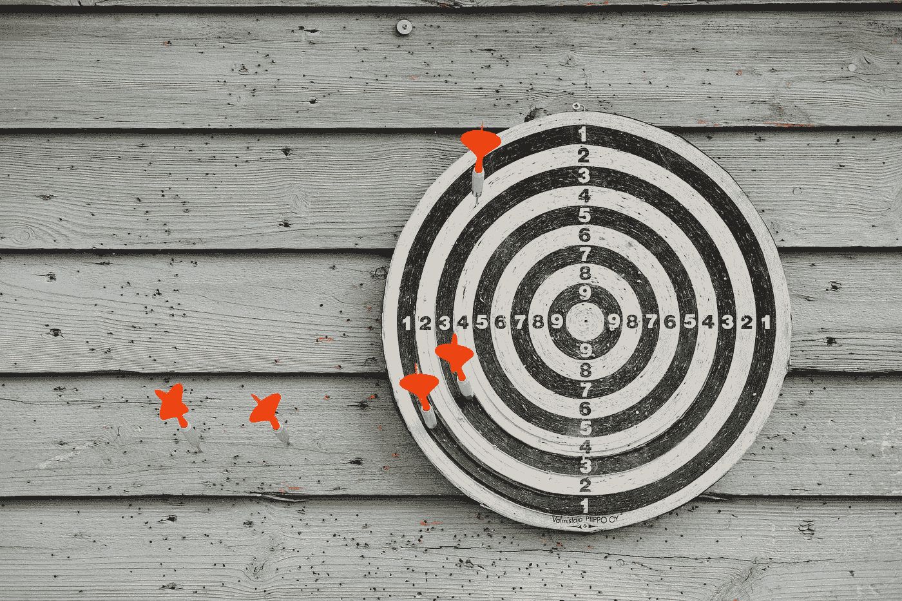

# 使用机器学习评估合成数据

> 原文：<https://pub.towardsai.net/evaluating-synthetic-data-using-machine-learning-4d299b15c942?source=collection_archive---------2----------------------->

## ***对抗验证评估合成数据***

“低准确度分数”是一个在为分类问题建立机器学习模型时可能会给许多数据科学专业人员带来噩梦的短语。然而，在极少数情况下，糟糕的准确度分数可能是好事，尤其是在执行**对抗验证**时。

对抗性验证用于评估两个数据集是否来自同一分布。通常，它用于测量机器学习问题中使用的训练和测试集中的数据偏移。类似地，对抗性验证可用于评估合成数据的质量。

照片由 [Miikka Luotio](https://unsplash.com/@mluotio83?utm_source=unsplash&utm_medium=referral&utm_content=creditCopyText) 在 [Unsplash](https://unsplash.com/s/photos/dart-board?utm_source=unsplash&utm_medium=referral&utm_content=creditCopyText) 上拍摄

**合成数据:概述**

简单来说，合成数据是人工生成的数据，在数学上和统计上代表现实世界的数据。使用算法(例如，SMOTE、ADASYN、变分自动编码器、GANs 等)创建合成数据。)并可以在执行数据分析和构建机器学习模型时作为真实世界数据的替代品。

合成数据能够保护数据隐私，因为它掩盖了敏感信息，因此，合成数据在金融和医疗领域非常有价值。合成数据还节省了收集、处理和标记大规模数据集所需的成本和人力，因为一些标记良好的数据可以用来生成大量的合成数据。

由于生成合成数据有多种方式，因此需要一种合适的评估方法来衡量合成数据相对于真实数据的质量。对于这样的评估，本文主要关注对抗性验证。

您可以通过参考[本文](/gans-for-synthetic-data-generation-1cca50317d87)获得关于合成数据以及如何使用强大的开源 GAN 实现生成合成数据的更多见解:

 [## 用于合成数据生成的 GANs

### 使用开源 GAN 实现生成合成数据的实用指南。

pub.towardsai.net](/gans-for-synthetic-data-generation-1cca50317d87) 

**对抗验证简介**

照片由 [Unsplash](https://unsplash.com/s/photos/check?utm_source=unsplash&utm_medium=referral&utm_content=creditCopyText) 上的[agency followeb](https://unsplash.com/@olloweb?utm_source=unsplash&utm_medium=referral&utm_content=creditCopyText)拍摄

机器学习有许多令人兴奋的创新应用:从检测猫和狗到在 MRI 图像中准确突出肿瘤。在本文中，我们将了解如何使用机器学习来确定两个数据集之间的相似性，即对抗性验证。

对抗性验证背后的理论非常简单:训练一个分类模型来区分两个数据集，即训练集和测试集。为每个数据创建标签，指示数据是否来自训练集，并且新标签用作训练模型的目标。

在一般的分类问题中，高准确度表示模型表现良好。但是对于对抗性验证，较低的准确度分数表示较好的性能。较低的准确度分数意味着模型在区分两类数据(来自或不来自训练集)方面存在问题。这表明训练集和测试集的分布是相似的。如果获得高精度，该模型在区分训练集和测试集方面没有问题，因此，可以得出结论，训练集和测试集具有不同的分布。

**使用对抗验证评估合成数据**

对抗性验证也可用于确定合成数据的质量。不是使用训练和测试集，而是使用真实数据和合成数据来训练机器学习模型。如果模型表现差，则表明合成数据和真实数据具有相似的属性，如果模型表现异常好，则表明真实数据和合成数据彼此完全不同。

对于该实验，使用用于生成合成数据的流行算法 SMOTE(合成少数过采样技术),并且生成的数据与真实数据一起用于训练模型。

[最近地球物体](https://www.kaggle.com/datasets/sameepvani/nasa-nearest-earth-objects)数据集用于训练模型。一个相对简单的数据集，包括直径、离地距离、脱靶距离等细节。美国宇航局证实的小行星。每个小行星都被标记了它是否对地球有危险，只有危险的小行星才被考虑用于这个实验。

最初，加载数据，并删除数据中不必要的字段。

由于数据的所有特征都是数字的，[鲁棒定标器](https://scikit-learn.org/stable/modules/generated/sklearn.preprocessing.RobustScaler.html)用于定标数据。

预处理数据用于生成合成数据。利用 [SMOTE](https://imbalanced-learn.org/stable/references/generated/imblearn.over_sampling.SMOTE.html) 将少数数据(即危险小行星)用于生成合成数据。生成合成数据后，无害小行星将被移除。

现在移除了危险标签，并创建了一个单独的数据框，其中仅包含合成数据。

为真实数据创建了一个新的标签(is_synth ),该标签仅由危险的小行星和合成数据组成。此标签指示特定数据行是否是合成的。然后，合成数据和真实数据被合并以创建最终的训练数据。

创建最终数据后，数据被拆分为训练集和测试集，进行缩放，然后在训练集上训练一个分类器。[选择功能强大的梯度推进模型库 LightGBM](https://lightgbm.readthedocs.io/en/v3.3.2/pythonapi/lightgbm.LGBMClassifier.html#lightgbm.LGBMClassifier) 模型作为分类模型。一旦模型被训练，测试集被用于评估模型的性能。

该模型的执行准确率为 68.67%。这表明该模型在分类哪些数据是合成的或真实的方面存在一些问题。因此，可以得出结论，SMOTE 算法在生成合成样本方面对危险的小行星数据非常有效。

本文工作原理的知识库可以在[这里](https://github.com/Vaseekaran-V/Evaluate_Synthetic_Data)找到。

**遗言**

在当前以数据为中心的人工智能发展中，合成数据至关重要。有许多工具和库可用于生成合成数据。然而，评估生成数据的质量可能是有问题的，这可以通过执行对抗性验证来解决。

对抗验证通常用于评估训练数据和推断数据之间的数据偏移。本文提供了一个使用对抗验证来确定合成数据相对于真实数据的质量的实际实现。

我们使用合成数据和真实数据建立机器学习分类模型。为数据创建新标签，说明特定数据是否是合成的。在评估过程中，如果模型表现良好(得分较高)，则意味着模型可以清晰地区分真实数据和合成数据。因此，合成数据与真实数据相比是不同的，并且如果模型具有差的分数，则可以推断合成数据和真实数据是相似的。

希望你学会了一个比较简单的方法来评估合成数据。我希望你喜欢这篇文章，我希望听到你对这篇文章的反馈，因为这将有助于我改进。干杯！