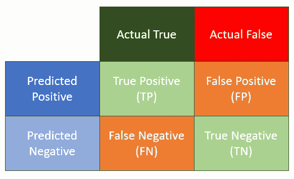
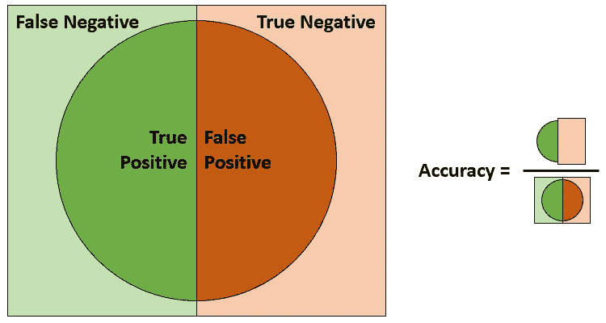
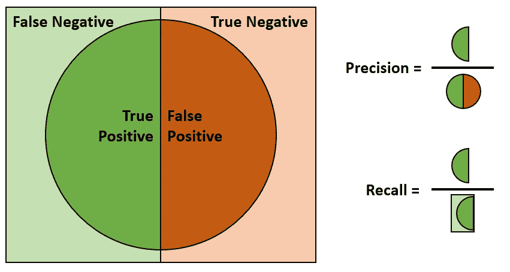
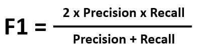
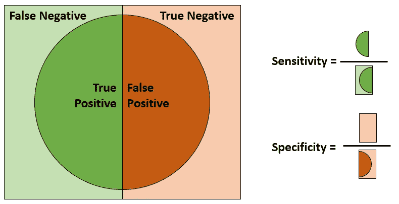
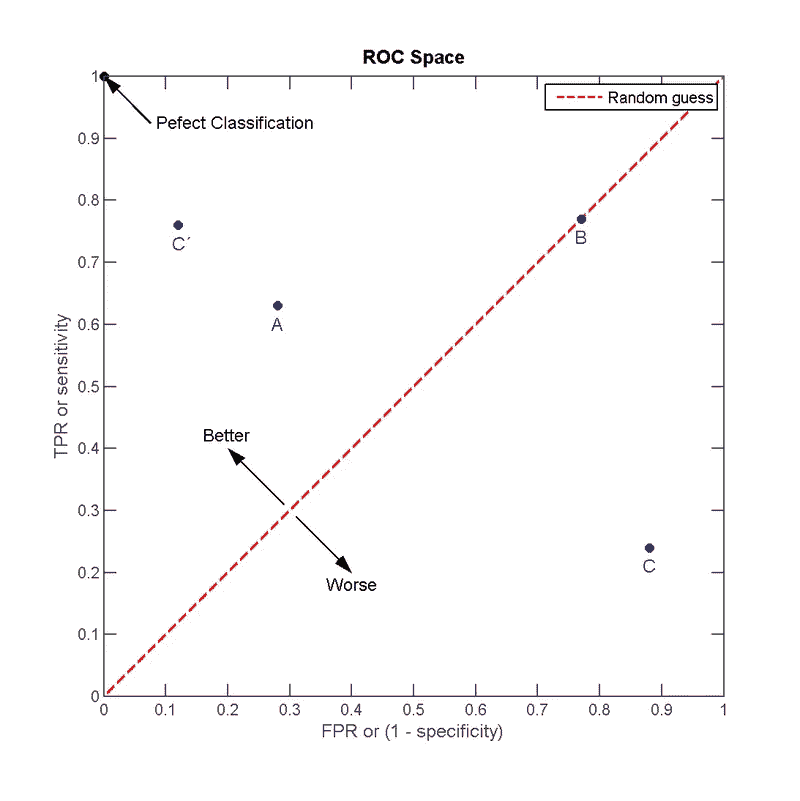
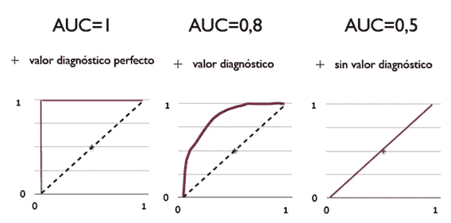

# 分类问题的评估标准

> 原文：<https://pub.towardsai.net/evaluation-metrics-for-classification-problems-e7442092bc5?source=collection_archive---------1----------------------->

## 数据科学

## 为什么一开始就需要定义指标

[马志威](https://unsplash.com/@makcedward?utm_source=medium&utm_medium=referral)在 [Unsplash](https://unsplash.com/?utm_source=medium&utm_medium=referral) 上的照片

> 如果你不知道如何证明一个模型是好是坏，这就好比你想得到某样东西却不知道它是什么。作为一名数据科学家工作了几年后，我坚信在早期阶段定义指标是非常重要的事情。

这个故事将涵盖几个分类指标。您也可以查看以下案例，了解其他评估指标

*   [内部和外部评估指标](https://medium.com/towards-artificial-intelligence/evaluation-metrics-are-what-you-need-to-define-in-the-earlier-stage-99dbfae51472)
*   [回归问题的度量](https://medium.com/towards-artificial-intelligence/evaluation-metrics-for-regression-problems-fff2ac8e3f43)
*   [文本问题的度量](https://medium.com/towards-artificial-intelligence/evaluation-metrics-for-textual-problems-6e881feef5ad)

# 分类指标

## 混淆矩阵介绍

在介绍分类指标时，必须提到`Confusion matrix`。`True positive`(TP)`true negative`(TN)`false positive`(FP)`false negative`(FN)是基本要素。它呈现:

混淆矩阵

*   真阳性:预测结果为阳性，同时标注为阳性。
*   假阳性:预测结果为阳性，而它被标记为阴性。它也调用`Type I Error`。
*   假阴性:预测结果为阴性，而它却被标记为阳性。它也调用`Type II Error`。
*   真阴性:预测结果为阴性，同时被标注为阴性。

基于这 4 个元素，你可以把它扩展到很多计算，比如精度、召回率、特异性。

## 简单易懂(准确)

`Accuracy`都是最容易测量的，大家都明白是什么意思。它只是从总计数中计算出正确分类的数量。当分类问题是平衡时，我们可以使用`accuracy`作为度量标准之一。

精确度公式

例如，分类问题是决定图像是属于猫还是狗。鉴于猫和狗的形象分布均匀，这仍然是可以接受的。但是如果分布是 999:1 呢？看起来我们可以轻松达到 99.9%。

## 选择的困境(精确和召回)

虽然`accuracy`直白易懂；有时这可能不是好的指标。例如，你想对一些罕见的案例进行分类，比如这个人是不是亿万富翁/首席执行官。要达到 99.9%的准确率是非常容易的，因为亿万富翁/ CEO 是极少数情况。在极端情况下，我不需要建立一个模型来分类，但总是返回“假”。我还是能得到 99.9%的准确率。在这个场景中，我们可以使用`precision`和`recall`。

精确度和召回率公式

我们可能无法建立一个同时具有高精度和高召回率的模型，因为这两者经常处于紧张状态。换句话说，在提高精度的时候，召回率会变坏，反之亦然。你必须回顾你的业务问题，以便平衡它。有时候，我们更喜欢高的`precision`而不是`recall`，而在其他一些情况下，我们可能会渴望高的`recall`。

在下面的场景中，我们更喜欢高的`precision`率(更多的假阳性案例),同时我们可以容忍低的`recall`率。

*   安全系统中的人脸/指纹识别
*   检测生产线何时需要停止维护

另一方面，我们希望有高的`recall`率(更多的假阴性病例),而你可以容忍低的`precision`率。

*   检测风力涡轮机何时需要维护
*   检测是否有地震。

您可能会感到困惑，为什么我们需要生产线维护预测的高精度，而我们需要风力涡轮机维护预测的高召回率。

要看`false positive`和`false negative`的成本。如果`false positive`的成本很高，那么我们想要更高的精度。参考生产线维护预测问题。我们可能意识到生产线出现故障的几率很低，如果我们继续停止生产线进行检查，将会产生巨大的利润影响。因此，我们可能希望有一个高`precision`而不是高`recall`。另一方面，如果风力发电机停止运行可能会导致电力供应中断，并且维护检查的成本相对较低，我们会选择高`recall`而不是高`precision`。

所以，这真的取决于错误预测的成本(不是`false positive`就是`false negative`)。为了以防万一，你需要平衡`precision`和`recall`，你可以考虑使用`F1`分数。

## 平衡困境(F1)

`F1`是介绍如果你的分类问题对`precision`和`recall`要求高而`accuracy`不好测量。从公式中可以看出`F1`包括了`precision`和`recall`两个结果。

F1 公式

`F1`在分布极不均匀的情况下，如果想兼顾精度和召回率，可以使用。

# 皇家对空观察队

`ROC`(接收方运营商特性)是表示分类结果的另一个度量。与`precision`和`recall`不同的是，`ROC`包含了`true negative`，表示归类为负面的记录的编号，并且是正确的。

灵敏度和特异性公式

此指标是为二元分类器设计的。如果您的业务问题是一个多类问题，您可以在测量期间将其转换为多个二元分类问题。

## 摇摆空间

在该图中，X 轴表示预测的错误阳性病例和全部阴性病例，而 Y 轴表示预测的正确阳性病例和全部阳性病例。最好的模型落在左上角，最差的落在右下角。

ROC 空间来自 [wiki](https://zh.wikipedia.org/wiki/ROC%E6%9B%B2%E7%BA%BF)

为了可视化，您可能需要知道:

*   对角线(从左下方到右上方)代表随机猜测。换句话说，如果你的模型结果落在对角线上，你的模型比随机猜测要好。
*   如果你的模型非常差(靠近右下角)，它也可以是一个好模型，因为我们可以保留(或镜像)结果。例如，模型预测它为正。我们可以把它改成负数。

## 受试者工作特征曲线

除了`ROC space`，`ROC curve`是`ROC`计算下的另一个可视化。在模型以置信度(也称为概率)对结果进行分类之后，我们可以将阈值转向最终的输出结果。一般来说，我们可以简单地将阈值设置为 0.5。这意味着如果置信度大于 0.5，它将被视为阳性病例。实际上，我们可以将该阈值调整为其他值，例如 0.7，并且我们可以通过`ROC curve`来决定我们应该使用哪个阈值。

ROC 曲线图形

为了可视化，您可能需要知道:

*   在相同模型但不同阈值的情况下，如果降低阈值，ROC 结果只会向上/向右/向上和向右移动。

## 罗马纪元

`AUC`(又名 ROC 和 AUC ROC 曲线下面积)是另一个使用 ROC 结果的指标？它计算`ROC curve`下的面积。

AUC 图来自[维基](https://zh.wikipedia.org/wiki/ROC%E6%9B%B2%E7%BA%BF)

为了使`AUC`形象化，你可能需要知道:

*   该值必须介于 0 和 1 之间，1 是最佳结果。
*   如果值在 0.5 和 1 之间，则该模型优于随机猜测。
*   如果一个值小于 0.5，该模型仍然比随机猜测要好，因为我们可以像在`ROC curve`中提到的那样反演结果。
*   最坏的情况是值在 0.5 左右，类似于随机猜测。如果是这样的话，随机猜测可能是一个更好的选择。

# 关于我

我是湾区的数据科学家。专注于数据科学、人工智能，尤其是 NLP 和平台相关领域的最新工作。你可以在[媒体博客](https://medium.com/@makcedward/)、 [LinkedIn](https://www.linkedin.com/in/edwardma1026) 或 [Github](https://github.com/makcedward) 上找到我。