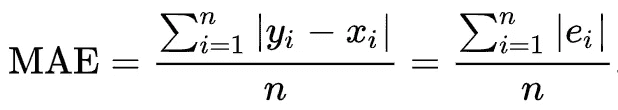
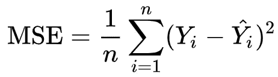
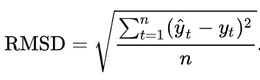
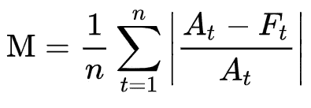
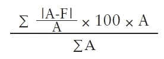

# 回归问题的评估标准

> 原文：<https://pub.towardsai.net/evaluation-metrics-for-regression-problems-fff2ac8e3f43?source=collection_archive---------3----------------------->

## 数据科学

## 为什么一开始就需要定义指标

[马志威](https://unsplash.com/@makcedward?utm_source=medium&utm_medium=referral)在 [Unsplash](https://unsplash.com/?utm_source=medium&utm_medium=referral) 上拍照

> 如果你不知道如何证明一个模型是好是坏，这就好比你想得到某样东西却不知道它是什么。作为一名数据科学家工作了几年后，我坚信在早期阶段定义指标是非常重要的事情。

这个故事将涵盖几个回归度量。您也可以查看以下案例，了解其他评估指标

*   [内部和外部评估指标](https://medium.com/towards-artificial-intelligence/evaluation-metrics-are-what-you-need-to-define-in-the-earlier-stage-99dbfae51472)
*   [分类问题的度量](https://medium.com/towards-artificial-intelligence/evaluation-metrics-for-classification-problems-e7442092bc5)
*   [文本问题的度量](https://medium.com/towards-artificial-intelligence/evaluation-metrics-for-textual-problems-6e881feef5ad)

# 回归度量

回归的区别之一是它包含连续值。除了混淆矩阵，您可以使用另一组计算来理解您的模型。您将了解到:

*   **M** 可以指**A**b 绝对 **E** 错误(MAE)
*   平均误差(MSE)
*   **R**oot**M**ean**S**方形误差(RMSE)
*   M 可以是**A**b 绝对 **P** 百分比 **E** 误差(MAPE)
*   **W** 八个**M**E**A**b**P**百分比 **E** 误差(WMAPE)

## 平均绝对误差

`MAE`测量两个连续值之间的差异。你可以考虑两个值，预测值和实际值。计算步骤如下:

1.  预测值和实际值之间的差异
2.  取绝对值
3.  对所有值重复步骤 1 和步骤 2，并将所有值相加
4.  除以对数

MAE 公式(来自[维基](https://en.wikipedia.org/wiki/Mean_absolute_error))

很容易计算和理解，但也有一些缺点。当取绝对值时，你忽略了方向，这意味着高估或低估。第二，异常结果可能是主导结果。如果您的回归问题对上述问题敏感，您可能不会考虑将`MAE`作为度量。

例如，您正在为乘客构建一个预测航班延误的模型，以便乘客可以决定他们什么时候去机场。在这种情况下，过度预测的损失比预测不足大得多。因为如果超出预测，乘客可能会错过航班。另一方面，如果航班在预测之内，乘客只会浪费时间等待。如果一个航班延误 10 天，而大多数航班延误只有 1 小时。`MAE`会非常高，误导观众。

## 均方误差

`MSE`(又名`MDE`)类似于`MAE`，但它取实际值和预测值之差的平方。更高的权重将与更高的误差相关联。换句话说，它关注的是一个大的错误。因为值是平方，所以最小值是 0。

## 均方根误差(RMSE)

`RMSE`(又名`RMSD`)是预测值和实际值的均方差。这个等式类似于`MSE` expect。它在最后取平方根。它让你明白数据有多集中。

RMSE 公式(来自[维基](https://en.wikipedia.org/wiki/Root-mean-square_deviation)

## 平均绝对百分比误差(MAPE)

`MAPE`不使用实际值，而是使用百分比误差来表示结果。设实际值为[5，10]，预测值为[10，2]。MAPE 是 90% =((| 5–10 |/5)+(| 10–2 |)/10)/2 * 100%。

MAPE 公式(来自[维基](https://en.wikipedia.org/wiki/Mean_absolute_percentage_error)

## 加权平均绝对百分比误差

`WMAPE`把更多的注意力放在大值上。它克服了一些`MAPE`限制。`MAPE`小值和大值同等对待，但可能会引入误导。此外，如果值为零，它对值也是鲁棒的。

公式如下所示。a 是实际，F 是预测值(预测值)。你可能注意到，我们可以去掉 A，简化为 sum(A-F)*100/(sum(A))。由于不需要对单个值进行除法运算，WMAPE 可以处理零的情况(expect sum(A)为 0)。

WMAPE 公式(来自 IBF)

这里有一个例子:

*   实际值分别为 1 和 100，而预测值分别为 2 和 101。虽然两者的绝对差值都是 1，但百分比误差分别为 100%和 1%。WMAPE 对此场景具有鲁棒性。
*   如果实际值是 0，MAPE 不能计算它除以零。WMAPE 不会除以单个值，而是除以实际值的总和。除非实际值之和为 0(在大多数场景中这种情况应该很少见)，否则我们可以利用 WMAPE 来计算它。

# 拿走

*   没有最好的指标，但是你需要根据你的数据选择合适的指标。此外，您可以使用多个指标来评估您的模型。如果你不知道，你可以先试试`RMSE`和`WMAPE`。`RMSE`指的是实际误差，而`WMAPE`关注的是百分比误差。
*   `MAE`比`MSE`和`RMSE`更容易理解。注意异常值，但这可能很难向非技术用户解释。
*   `MAPE`显示百分比误差，但它对大范围的值和零情况不稳定。在上述情况下,`WMAPE`优于`MAPE`。

# 关于我

我是湾区的数据科学家。专注于数据科学、人工智能，尤其是 NLP 和平台相关领域的最新发展。你可以通过 [Medium、](https://medium.com/@makcedward/) [LinkedIn](https://www.linkedin.com/in/edwardma1026) 或者 [Github](https://github.com/makcedward) 联系我。