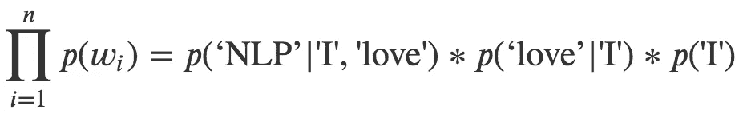
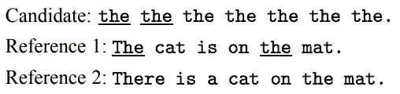
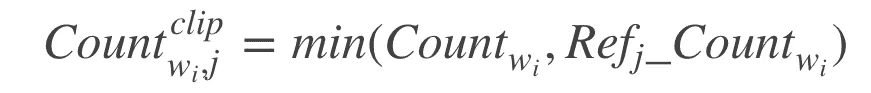
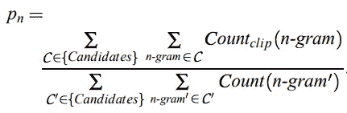
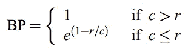
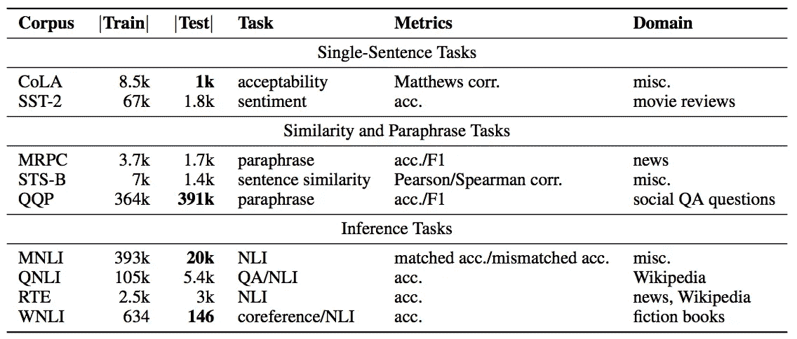
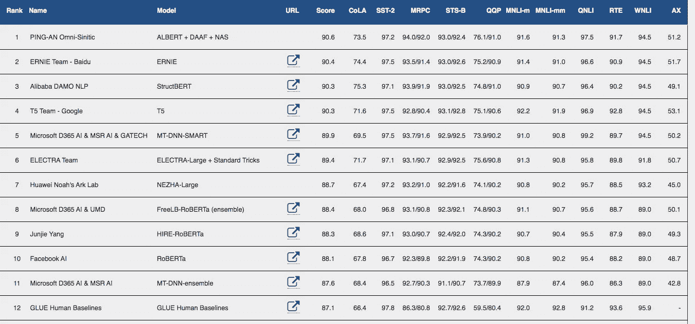

# 文本问题的评估标准

> 原文：<https://pub.towardsai.net/evaluation-metrics-for-textual-problems-6e881feef5ad?source=collection_archive---------0----------------------->

## [数据科学](https://towardsai.net/p/category/data-science)

## 为什么一开始就需要定义指标


[马志威](https://unsplash.com/@makcedward?utm_source=medium&utm_medium=referral)在 [Unsplash](https://unsplash.com/?utm_source=medium&utm_medium=referral) 上拍照

> 如果你不知道如何证明一个模型是好是坏，这就好比你想得到某样东西却不知道它是什么。作为一名数据科学家工作了几年后，我坚信在早期阶段定义指标是非常重要的事情。

这个故事将涵盖几个文本指标。您也可以查看以下案例，了解其他评估指标

*   [内部和外部评估指标](https://medium.com/towards-artificial-intelligence/evaluation-metrics-are-what-you-need-to-define-in-the-earlier-stage-99dbfae51472)
*   [分类问题的度量](https://medium.com/towards-artificial-intelligence/evaluation-metrics-for-classification-problems-e7442092bc5)
*   [回归问题的度量](https://medium.com/towards-artificial-intelligence/evaluation-metrics-for-regression-problems-fff2ac8e3f43)

# 文本评估指标

在自然语言处理(NLP)领域，我们有许多下游任务，如翻译、文本识别和翻译。在这个故事中，我们将讲述:

*   文本生成:困惑
*   翻译:BLEU
*   文本识别:CER 和 WER
*   语言理解:胶水

## 困惑

可能的任务:语言模型

语言模型是指机器生成的文本如何类似于人类编写的文本。换句话说，给定 k 个前一个单词和正确的分数，生成 k+1 个令牌。你的困惑越低，你的模型就越好。

以“我爱 NLP”为例。我们要计算得到“我”的概率，给定前一个词是“我”得到“爱”的概率，给定前一个词是“我”和“爱”得到“NLP”的概率。



“我爱 NLP”的困惑

## 双语评估替角

可能的任务:神经机器翻译(NMT)，字幕生成(即 Image2Text 问题)

由于专业翻译的人工标注非常昂贵，因此引入 BLEU 来衡量候选文本(由机器翻译)和参考文本(由人类翻译)之间的差异。该值介于 0 和 1 之间，1 是最好的分数。BLEU 的计算涉及到 n-gram 精度和句子简洁惩罚的概念。

下面的例子将使用这个典型的例子来演示计算。候选是由机器学习模型翻译的文本，而参考 1 和 2 是由人类翻译的文本。



BLEU 演示的典型示例(Papineni 等人，2002 年)

首先，BLEU 不是用 uni-gram，而是用 n-gram 来计算分数。高的单字分数代表译文的完整性，而单字分数代表译文的流畅性。

下面的公式计算出 j 个参考字中存在的第 I 个字。



Count wi:候选词中第 I 个单词的个数。Ref j_Count wi:第 j 个引用中的字数 w

在上面的例子中，对于参考文献 1，我们可以得到“the”的答案是 min(7，2) = 2。参考文献 2 的答案是 min(7，1) = 1。


参考中存在 w 的最大数量

在上面的例子中，我们得到的答案是 2，而公式是 max(1，2)。在实际计算中，它将不仅是一元语法，而是多元语法。计算是一样的，但只是分别比较“猫”、“猫是”等等，而不是“这个”、“猫”、“是”。



修正的 N-gram 精度(Papineni 等人，2002 年)

由于公式计算，一个短句很容易得高分。因此 Papineni 等人提出对候选句子中调用 BP 的那些较少的词进行包含惩罚。

如果候选词中的单词数与参考词相同，那么就没有罚分 1。如果候选人是“猫”，而参考是“猫在垫子上”。所以 r 是 6 而 c 是 2。以上面的例子为例，BP 是 e^(1- 6 / 2) = 7.3891。



BP 公式(Papineni 等人，2002 年)

最后，BLEU 分数通过下式计算


蓝色配方奶粉(Papineni 等人，2002 年)

我们可以利用 NLTK 包来计算它，得分是 0.5026。

```
from nltk.translate.bleu_score import sentence_bleucandidate = ['The', 'cat', 'sat', 'on', 'the', 'mat']
reference = [['The', 'cat', 'is', 'on', 'the', 'mat']]
weights = (0.34,0.33,0.33,0)score = sentence_bleu(reference, candidate, weights)
```

缺点是:

*   不要考虑同义词。由于它只计算单词精确匹配，如果参考文本中不存在这些同义词，同义词将被视为不正确。
*   [停用词](https://medium.com/@makcedward/nlp-pipeline-stop-words-part-5-d6770df8a936)也有助于准确性。停用词(如 a，an，the)没有太多意义，会在文本中反复出现。它可以提高精确度。

## 字符错误率(CER)

可能的任务:语音识别、光学字符识别(OCR)、手写识别。

CER 计算将一个单词转换成另一个单词的最小操作数 [Levenshtein 距离](https://towardsdatascience.com/measure-distance-between-2-words-by-simple-calculation-a97cf4993305)。


CER 公式

## 单词错误率(WER)

可能的任务:语音识别、光学字符识别(OCR)、手写识别。

WER 已经从[得出了 Levenshtein 距离](https://towardsdatascience.com/measure-distance-between-2-words-by-simple-calculation-a97cf4993305)的实际值。它用参考单词计算最小距离。替换、删除和插入属于误差，WER 是基于误差计算的。根据误差的编辑距离，公式将选择这些误差中的最小距离。


WER 公式

缺点是它假设不同误差的影响是相同的。有时，插入错误可能比删除有更大的影响。另一个限制是，这种度量不能将替换错误与删除和插入错误区分开来。

## 通用语言理解评估(GLUE)

胶水是由 NYU 的一个小组提出的。它包括九个英语理解任务。它还带有一个人类基线分数，供从业者评估他们的模型有多好。最后的分数只是简单的累加了九个任务的分数。越高越好。



任务描述与统计(王等，2018)

从下面的排行榜中，你可能会注意到人类基线(排名第 12)低于许多著名模特，如 [T5](https://medium.com/dataseries/text-to-text-transfer-transformer-e35dc28bae14) 、 [MT-DNN](https://towardsdatascience.com/when-multi-task-learning-meet-with-bert-d1c49cc40a0c) 和[罗伯塔](https://medium.com/towards-artificial-intelligence/a-robustly-optimized-bert-pretraining-approach-f6b6e537e6a6)。



GLUE 的排行榜(来自 [GLUE](https://gluebenchmark.com/leaderboard)

# 关于我

我是湾区的数据科学家。专注于数据科学、人工智能，尤其是 NLP 和平台相关领域的最新发展。你可以通过[媒体博客](https://medium.com/@makcedward/)、 [LinkedIn](https://www.linkedin.com/in/edwardma1026) 或 [Github](https://github.com/makcedward) 联系我。

# 延伸阅读

*   [胶水](https://gluebenchmark.com/)

# 参考

*   K.帕皮尼尼、s .鲁科斯、t .沃德和朱伟杰。 [BLEU:一种自动评估机器翻译的方法](https://www.aclweb.org/anthology/P02-1040.pdf)。2002
*   A.王、辛格、迈克尔、希尔、利维和鲍曼。GLUE:自然语言理解的多任务基准和分析平台。2018.