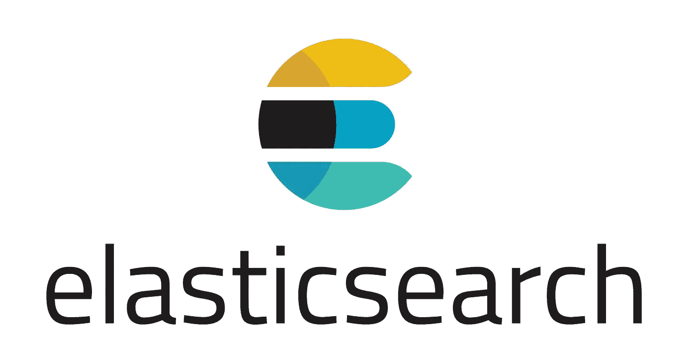
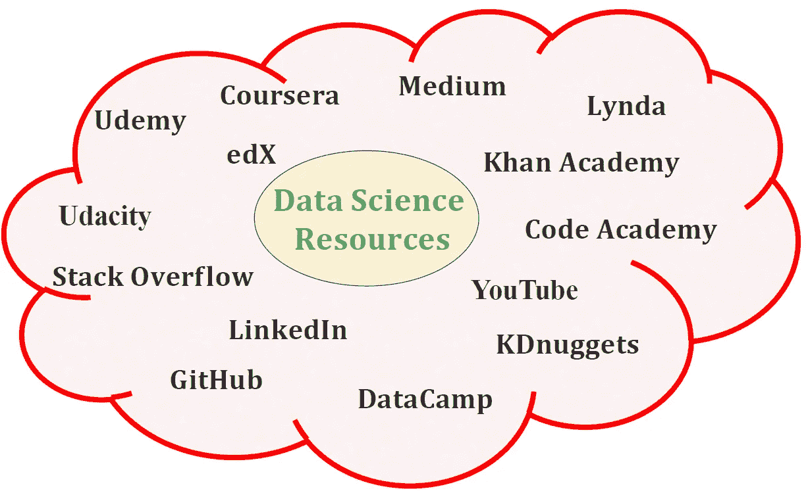
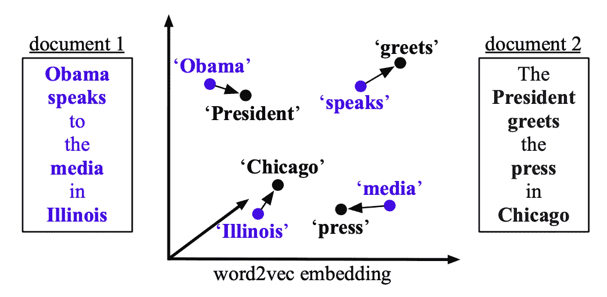
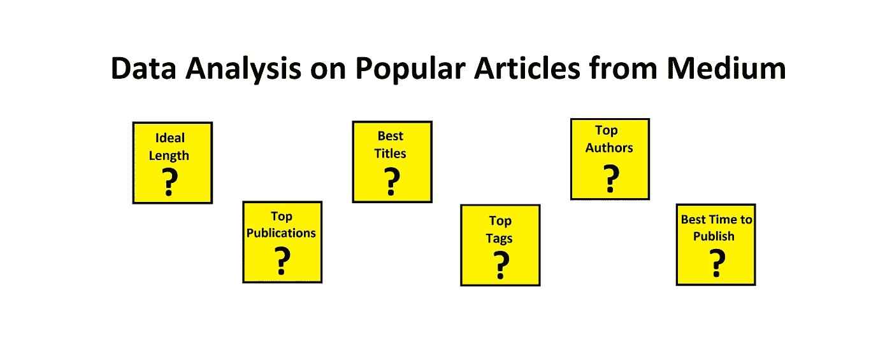
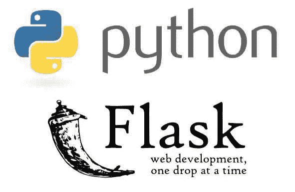

# 每个人都可以理解机器学习…以及更多！

> 原文：<https://pub.towardsai.net/everyone-can-understand-machine-learning-and-more-46839f4a47ae?source=collection_archive---------3----------------------->

## [新闻](https://towardsai.net/p/category/news)，[快讯](https://towardsai.net/p/category/newsletter)

## 一些很酷的公告，人工智能世界的新内容，以及我们每月的精选

***如果你阅读这封邮件有困难，请在*** [***网络浏览器***](https://mktg.best/84r4c) ***上查看。***

人工智能领域的工作进展非常迅速。今天 [**的论文代码**](https://mktg.best/b0d5v) [**宣布**](https://medium.com/paperswithcode/papers-with-code-partners-with-arxiv-ecc362883167) 他们与 arXiv 的合作关系，其中代码链接现在显示在 arXiv 的文章上，作者可以通过 arXiv 提交代码，使其成为热心的研究人员和实践者的一大补充。

[**NeurIPS**](https://mktg.best/os2nz) 还宣布了一个很酷的挑战，由 [**论文主办的 2020 ML 再现性挑战，代码**](https://mktg.best/b0d5v) ，鼓励从事 ML 工作的人参与(包括爱好者！).如果你想了解更多，可以查看一下[**他们的公告**](https://mktg.best/amto5) ，听起来挺整齐的。

在其他新闻中，如果你对强化学习感兴趣，我们鼓励你看看[**MineRL**](https://mktg.best/onw7j)**——他们的研究小组刚刚宣布将他们的比赛延长至 2021 年 2 月。所以如果你想在《我的世界》建立一些高效的人工智能代理，一定要去看看！**

**还有，[**Scale AI**](https://mktg.best/uts8z)**宣布他们正在赞助学生和独立研究人员创建有前景的数据集。有兴趣的话可以看看 Aerin Kim 的 [**公告。**](https://mktg.best/3j3ey)****

****最后但同样重要的是，别忘了 10 月 11 日是 2020 年亚马逊研究奖的截止日期。如果你喜欢申请或了解更多，你可以在 [**亚马逊科学**](https://mktg.best/ck-pi) 上这样做。****

> *****贵公司是否有兴趣支持艾未未的努力？如有赞助机会，请* [***发邮件给我们***](mailto:pub@towardsai.net) *。*****

****现在进入月度精选！我们挑选这些文章是基于读者群、粉丝和某篇文章的浏览量。我们希望你和我们一样喜欢阅读它们。此外，我们开始做一些新的东西！我们将选出我们的十大表现文章，我们的编辑将选择一到两篇表现不突出，但由于其质量而入选本月的文章。****

****如果可以，请将我们的 [**订阅链接**](https://towardsai.net/subscribe) 分享给你的朋友和熟人。我们承诺不会向他们的收件箱发送垃圾邮件。如果您对我们的时事通讯有任何反馈，请随时给我们发送 [**电子邮件**](mailto:pub@towardsai.net) 。****

# ****📚本月编辑精选文章↓📚****

********

****照片由 [GregMontani](https://pixabay.com/users/GregMontani-1014946/) 在 [Pixabay](https://pixabay.com/photos/castle-avenue-trees-nature-sky-5511046/) 上拍摄****

## ****[大家都能理解机器学习—回归树模型](https://mktg.best/09l-8)作者[克里斯托弗·陶](https://medium.com/u/b8176fabf308?source=post_page-----46839f4a47ae--------------------------------)博士。****

*****这篇文章旨在解释回归树机器学习模型，没有任何流行词汇和科学表达，所以你不需要任何先决知识或计算机科学/数学学位来理解它。*****

****作为最常用的机器学习模型之一，决策树通常用于分类目的。但是，它也可用于预测连续数值。在这篇文章中，我将介绍一种特殊类型的决策树——回归树。如果你不是数据科学家或数据分析师，请不要担心，我将尽力帮助你理解回归树是如何在没有任何公式和方程的情况下构建的…****

******[**阅读更多**](https://mktg.best/09l-8)******

************

******来源:Ivo Rainha 在 [Unsplash](https://unsplash.com/photos/Lg9NLmu4B_A) 上拍摄的照片******

## ******[我们对最佳数据科学书籍的推荐—免费和付费](https://towardsai.net/p/data-science/best-data-science-books-free-and-paid-data-science-book-recommendations-b519046dcca5)由[提供给人工智能团队](https://medium.com/u/aea8a19ea239?source=post_page-----46839f4a47ae--------------------------------)******

******在过去的一年里，我们查看了超过 23，000 本[[1](https://www.amazon.com/s?k=data+science)]数据科学书籍，我们从技术性、解释复杂主题的能力、深度和经过验证的评论等方面挑选了我们认为最好的付费和免费书籍。在过去的十年里，数据科学已经成为信息技术领域专业人士薪酬最高、声誉最高的领域之一。如今， [**数据科学**](https://mld.ai/mldcmu) 应用已经成为大多数(如果不是全部)企业不可避免的事情。因此，熟练的数据科学专业人员激增…******

******[**阅读更多**](https://towardsai.net/p/data-science/best-data-science-books-free-and-paid-data-science-book-recommendations-b519046dcca5)******

************

******图片来自官方页面:[elastic.co](https://www.elastic.co/)******

## ******[弹性搜索初学者指南—第 1 部分](https://mktg.best/-rj2q)作者 [Chetan Ambi](https://medium.com/u/e21a9c4ed934?source=post_page-----46839f4a47ae--------------------------------)******

******如果您想知道什么是 Elasticsearch，我们为什么要使用 Elasticsearch，Elasticsearch 的替代产品/竞争对手是什么，那么您来对地方了。在这篇文章中，我将尝试回答所有这些问题。那么，我们开始吧。… Elasticsearch —是一个分布式、开源的搜索和分析引擎，适用于所有类型的数据，包括文本、数字、地理空间、结构化和非结构化数据。Elasticsearch 是建立在 Apache Lucene 上的…******

********[**阅读更多**](https://mktg.best/-rj2q)********

************

******Benjamin O. Tayo 的图片******

## ******[学习数据科学从未如此简单](https://mktg.best/l7iff)作者 [Benjamin Obi Tayo 博士](https://medium.com/u/3a025d440e6b?source=post_page-----46839f4a47ae--------------------------------)******

******在本文中，我将讨论几个可以帮助您掌握数据科学基础的资源。在现代信息技术时代，有大量的免费资源用于数据科学自学。事实上，您可以从无数可用资源中设计自己的数据科学课程…******

********[**阅读更多**](https://mktg.best/l7iff)********

************

******奥拉夫·阿伦斯·罗特内在 [Unsplash](https://unsplash.com/s/photos/problem?utm_source=unsplash&utm_medium=referral&utm_content=creditCopyText) 上拍摄的照片******

## ******[saite ja Kura](https://mktg.best/64s1i)[解决了](https://medium.com/u/8c2586dd6938?source=post_page-----46839f4a47ae--------------------------------)5 个棘手的 SQL 查询******

******SQL(结构化查询语言)是数据科学家工具箱中非常重要的工具。掌握 SQL 不仅从面试的角度来看是必要的，而且通过能够解决复杂的查询来很好地理解 SQL 将使我们在竞争中处于领先地位。在这篇文章中，我将谈论我发现的 5 个棘手的问题和我解决它们的方法…******

******[**【阅读更多】**](https://mktg.best/64s1i)******

********

****图片由[openclipbart-Vectors](https://pixabay.com/users/OpenClipart-Vectors-30363/)在 [pixabay](https://pixabay.com/vectors/alphabet-word-images-animation-1297651/)****

## ****[火箭:快速准确的时间序列分类](https://medium.com/towards-artificial-intelligence/rocket-fast-and-accurate-time-series-classification-f54923ad0ac9) by [Alexandra Amidon](https://medium.com/u/4ae76d513ea6?source=post_page-----46839f4a47ae--------------------------------)****

****大多数具有最新(SOTA)精度的时间序列分类方法计算复杂度高，可扩展性差。这意味着它们在较小的数据集上训练很慢，并且在大型数据集上实际上不可用。ROCKET(随机卷积核变换)可以在很短的时间内达到与竞争 SOTA 算法(包括卷积神经网络)相同的精度。这些算法在 UCR 档案馆的基准数据集上进行了评估****

******[**阅读更多**](https://mktg.best/g4g9b)******

************

******如何判断这个被标记的图像对训练模型是否“有用”？多读点了解一下。来源:知识共享的衍生，图片由弗兰克·科恩托普拍摄******

## ******[如何通过自动标注、不确定性估计和主动学习提高数据标注效率](https://mktg.best/95ssr)作者[金玄](https://medium.com/u/4abd183d5def?source=post_page-----46839f4a47ae--------------------------------)******

******在这篇文章中，我们将深入研究机器学习理论和技术，这些理论和技术是为了评估我们在 [Superb AI](http://www.superb-ai.com/) 的自动标记 AI 而开发的。更具体地说，我们的数据平台如何估计自动标注的不确定性，并将其应用于主动学习。在开始之前，最好先了解一下最流行的方法可以被归类到哪些类别。根据我们的经验，深度学习不确定性估计的大多数工作分为两类…******

********[**阅读更多**](https://mktg.best/95ssr)********

************

******来源: [Unsplash](https://unsplash.com/photos/rHfsPolwIgk)******

## ******[Python 生存分析教程——如何、做什么、何时以及为什么](https://towardsai.net/p/machine-learning/survival-analysis-with-python-tutorial-how-what-when-and-why-19a5cfb3c312)作者 [Pratik Shukla](https://medium.com/u/dbf92a012bd3?source=post_page-----46839f4a47ae--------------------------------)******

******本文全面回顾了如何执行统计生存分析的详细步骤和代码，统计生存分析用于调查某个事件发生所需的时间，例如新冠肺炎疫情期间的患者生存时间、工程产品的故障时间，甚至是初次联系客户后完成销售的时间…******

********[**阅读更多**](https://towardsai.net/p/machine-learning/survival-analysis-with-python-tutorial-how-what-when-and-why-19a5cfb3c312)********

************

******来源:*图片来自[原文](http://proceedings.mlr.press/v37/kusnerb15.pdf)******

## ******[单词移动距离(WMD)解释:一种有效的文档分类方法](https://mktg.best/473fd)通过[邻近](https://medium.com/u/f73dccb855ce?source=post_page-----46839f4a47ae--------------------------------)******

******文档分类和文档检索已经显示出广泛的应用。文档分类的一个基本部分是正确地生成文档表示。Matt J. Kusner 等人在 2015 年提出了单词移动器距离(WMD) [1]，其中单词嵌入被纳入到计算两个文档之间的距离中。给定预先训练的单词嵌入，通过计算“一个文档的嵌入单词需要‘行进’到达另一个文档的嵌入单词的最小距离量”，可以用语义来测量文档之间的不相似性******

********[**阅读更多**](https://mktg.best/473fd)********

************

******来源:图片由 Shareef Shaik 提供******

## ******[2500+热门文章的史料教给我们什么？](https://mktg.best/t-mcw)作者[谢里夫·沙克](https://medium.com/u/b7b36814d144?source=post_page-----46839f4a47ae--------------------------------)******

******几天前，当我写第二篇关于媒体的文章时，我把它交给了我的朋友们审阅。其中一个马上告诉我，这个标题很有俘虏感，可以吸引读者，我没有把他的话当回事，以为他只是在鼓励我。我终于在一个周六下午发表了它。当天点击量达到了 70 次。第二天早上，当我醒来检查我是否比我的第一个博客做得更好时，我的博客达到了 120 次浏览。我有点失望，不是因为它的观点，而是它没有得到应有的关注。我不再检查它，沉迷于我的其他作品。那天晚些时候，当我偷看时，我被吓了一跳，这篇文章已经超过了 10K 50%的浏览量…******

********[**阅读更多**](https://mktg.best/t-mcw)********

************

******图片来自 [Pixabay](https://pixabay.com/?utm_source=link-attribution&utm_medium=referral&utm_campaign=image&utm_content=5544365) 的[马里奥·哈根](https://pixabay.com/users/mariohagen-17468991/?utm_source=link-attribution&utm_medium=referral&utm_campaign=image&utm_content=5544365)******

## ******[由](https://mktg.best/091yc) [Dhilip Subramanian](https://medium.com/u/61418d489e25?source=post_page-----46839f4a47ae--------------------------------) 为深度学习项目构建自定义图像数据集******

******在过去的三个月里，我主要在 NLP 工作。我花了很长时间处理图像数据。因此，我决定建立一个独特的图像分类器模型，作为我个人项目和学习的一部分。在现在的疫情，我最想念的一件事就是旅行。这几天经常在 Instagram 上看到很多旅行的 vlogs 和旅行的图片，想知道我们什么时候才能回到正常的世界…******

********[**阅读更多**](https://mktg.best/091yc)********

************

******资料来源:Fiverr******

## ******[使用 Python 的 Flask Web 应用](https://mktg.best/epp14)作者 [Sharon Lim](https://medium.com/u/2ffb6e30076e?source=post_page-----46839f4a47ae--------------------------------)******

******随着深度学习模型的训练，我们如何将训练好的模型部署为 web 应用？进入**Flask**—Python 最流行的 web 应用框架。通过利用 Flask 的功能，我们可以为全栈应用程序建立一个强大的基础，为更广泛和功能丰富的网站探索新的领域。它使用户能够完全控制网页服务和内部数据流。我们将处理以下问题陈述，并探索迁移学习和 flask web 应用程序在深度学习项目中的使用…******

******[**阅读更多**](https://mktg.best/epp14)******

## ******🙏感谢您成为[的订阅者](https://towardsai.net/subscribe)与[走向 AI](https://towardsai.net) ！🙏******

> *******在社交媒体上关注我们↓*******
> 
> ******[*脸书*](https://www.facebook.com/towardsAl/) *|* [*推特*](https://twitter.com/towards_ai?lang=en)*|*[*insta gram*](https://www.instagram.com/towards_ai/)*|*[*LinkedIn*](https://www.linkedin.com/company/towards-artificial-intelligence)|[*谷歌新闻*](https://news.google.com/publications/CAAqBwgKMNiLmgswgpayAw?oc=3&ceid=US:en) *|* [*移动提要*](https://feed.towardsai.net/)******