# 每个人都能理解机器学习——回归树模型

> 原文：<https://pub.towardsai.net/everyone-can-understand-machine-learning-regression-tree-model-28e3541b3e79?source=collection_archive---------1----------------------->

照片由 [GregMontani](https://pixabay.com/users/GregMontani-1014946/) 在 [Pixabay](https://pixabay.com/photos/castle-avenue-trees-nature-sky-5511046/) 上拍摄

## [机器学习](https://towardsai.net/p/category/machine-learning)

## 没有公式、方程式和科学陈述的回归树模型介绍

*本文旨在解释回归树机器学习模型，没有任何流行词汇和科学表达，因此您不需要任何先决知识或计算机科学/数学学位来理解它。*

作为最常用的机器学习模型之一，决策树通常用于分类目的。但是，它也可用于预测连续数值。在这篇文章中，我将介绍一种特殊类型的决策树——回归树。如果你不是数据科学家或数据分析师，请不要担心，我会尽力帮助你了解回归树是如何在没有任何公式和方程的情况下构建的。

你不需要数学学位就能理解这一点:)

# 抽样资料

照片由[设计师](https://pixabay.com/users/congerdesign-509903/)在 [Pixabay](https://pixabay.com/photos/apples-fruit-jam-fruit-preserve-5543778/) 上拍摄

让我们想象一个场景。我们普遍认为，学生在学习上花费越多，期末考试的分数就应该越高。假设我们有一群小学生被调查，问他们每周一般花多少小时学习，然后和他们的考试成绩关联起来就有了下面这个数据集。

嗯，这看起来有点理想，因为我们知道考试结果不应该只受学习时间的影响，但这没关系。我们只是用它来演示回归树模型。还有一点很重要，就是数据绝对不是下图所示的线性。

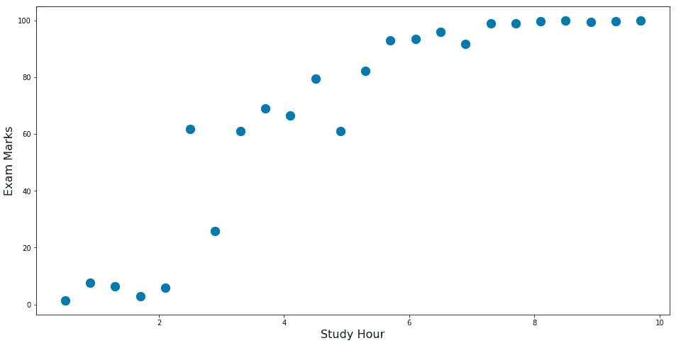

# 分割节点(制作分支)

[Deeezy](https://pixabay.com/users/Deeezy-15467098/) 在 [Pixabay](https://pixabay.com/photos/canyon-gorge-perspective-nature-5552326/) 上拍摄的照片

毫不奇怪，构建回归树的过程基本上就是决定如何分割节点。或者，我们可以简单地说“做一个分支”。

## 分支是什么意思？

假设我们想通过拆分条件为“学习时间< 3.1”. This number “3.1” is the number between the 7th and the 8th data point, which is shown below (it shows 6th and 7th because we started from 0)

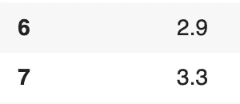

As shown in the figure below, the red vertical line (Study Hour = 3.1) splits the data into the left region and the right region.

For each of the left and the right, we can calculate the average of all the data points with their “Marks”. The average for the left 7 points is **15.96** 的数据得到树的第一个分支，而右边 16 个点的平均值是 **87.65** 。

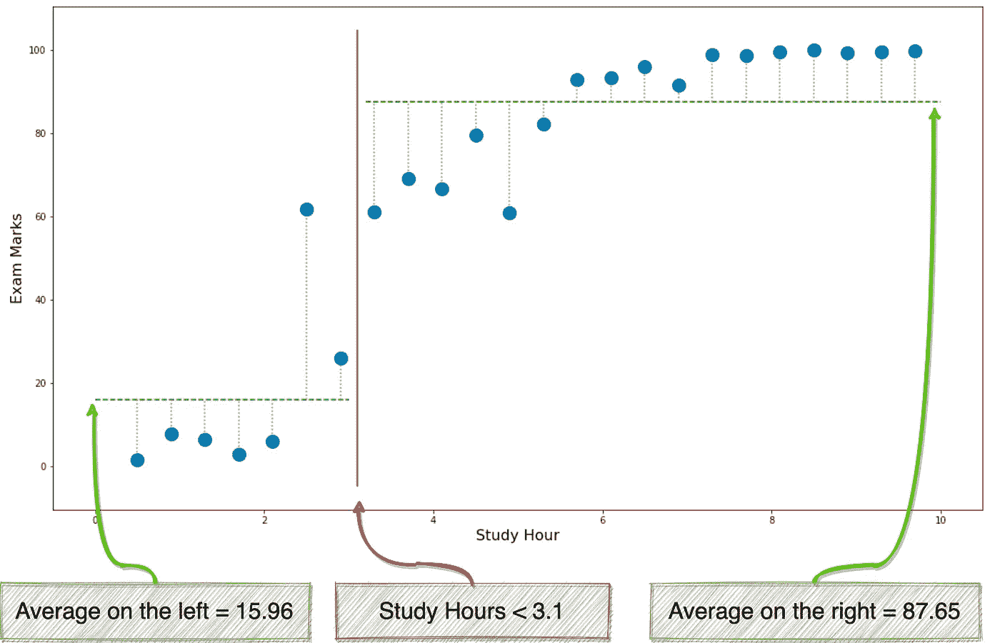

假设我们要做一个这样的分支，那么

*   每个学习时间少于 3.1 小时的学生将被预测为 15.96 分
*   每个学习时间大于或等于 3.1 小时的学生将被预测为 87.65 分

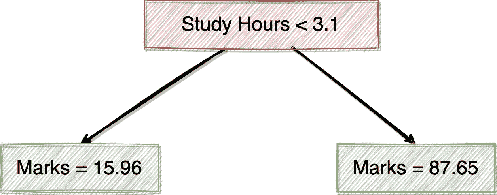

因此，我们最终得到如上所示的树。

但是，如何才能决定拆分条件呢？换句话说，为什么我们使用第 7 个和第 8 个之间的值进行分割，而不使用第 8 个和第 9 个或其他值？总共有 24 个值，所以我们有 23 个不同的分裂条件候选。

基本标准如下:

> **每次拆分误差最小**

## 误差的测量

如果我们想将误差降至最低，我们首先需要知道如何测量误差。

显然，当我们使用上面的树预测标记时，肯定会出现“错误”。例如，根据数据集，一个每周学习 0.5 小时的学生只有 1.4 分(如下所示)。然而，我们当前的回归树将预测它是 15.96 分。

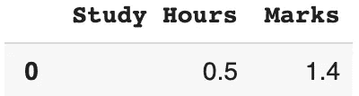

那么，误差就是两个值之差。也就是 15.96–1.4 = 14.56。在下图中，所有的灰色虚线都是“错误”。

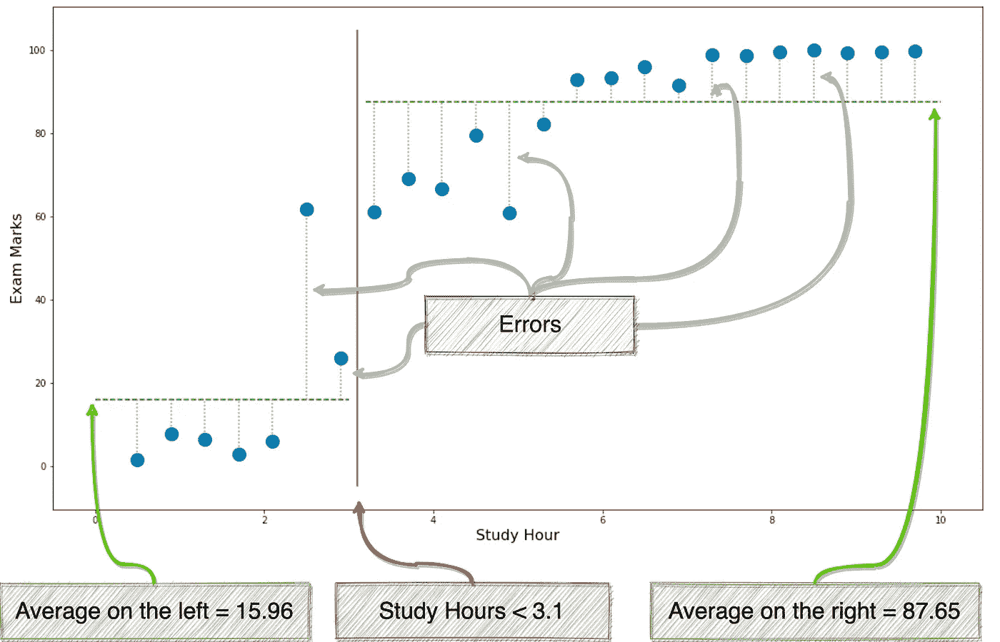

好的。那么，如何决定最佳的拆分条件呢？基本上，我们会尝试每一种可能的方法来分割数据集，如下所示，然后选择误差最小的一个。

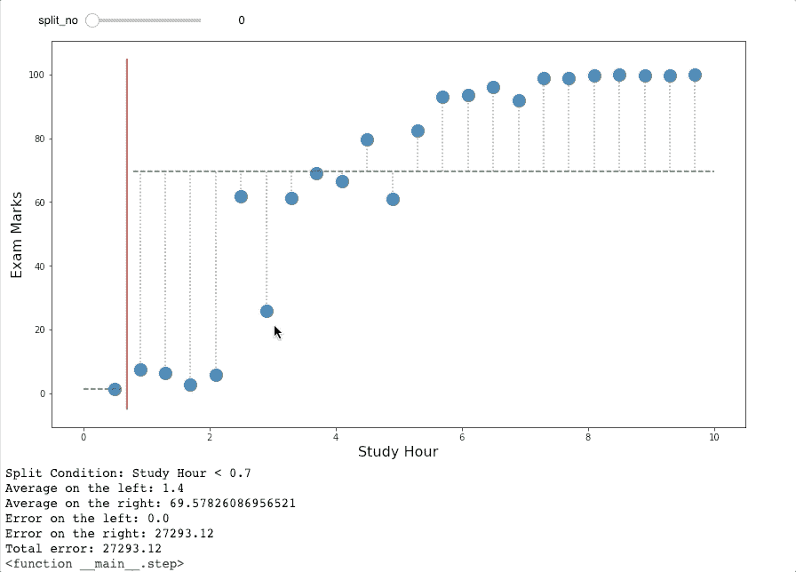

如果你注意上面的 GIF，你会发现，当我们在第 7 点和第 8 点之间拆分时，“总误差”会最小。总误差是实际标记和预测(平均)标记之间的差值的平方值，因此它是一个非常大的数字。

## 继续分裂

当然，虽然条件“学习时间< 3.1”是第一次分割的最佳条件，但它没有得到充分优化，因为总误差仍然很大。所以，我们需要继续分裂这棵树，使它成为一个更好的模型。

在之前使用条件“学习时间< 3.1”进行拆分后，我们得到了两个分支。左边的有 7 个样本，右边的有 17 个样本。

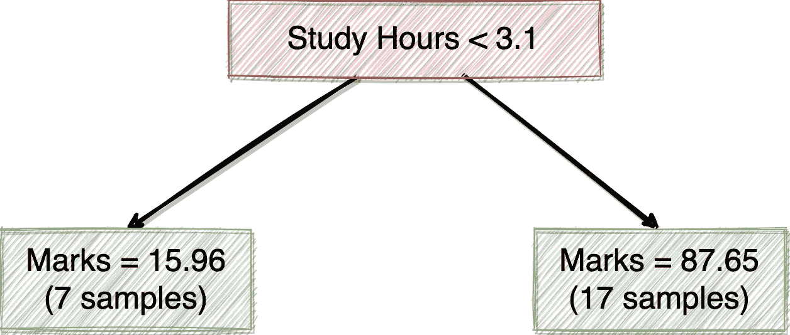

上面示出的相同逻辑将被分别应用于左样本和右样本，以便我们可以如下对左样本和右样本进行最佳分割。

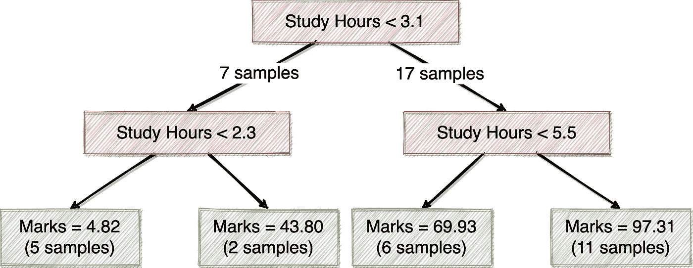

那就好多了！现在，当我们有一个过去只学习 0.5 小时的学生时，我们会预测分数是 4.82，而实际分数是 1.4。我们通过不断分割回归树模型，成功地改进了它。

# 过度拟合问题

由 [raffaeledl](https://pixabay.com/users/raffaeledl-17131402/) 在 [Pixabay](https://pixabay.com/photos/village-rural-field-mountain-5521554/) 上拍摄的照片

现在我们知道了回归树模型是如何构建的。按照上面演示的逻辑，我们可以不断改进我们的模型，以获得越来越好的预测结果。

但是，你有没有发现有一个问题？

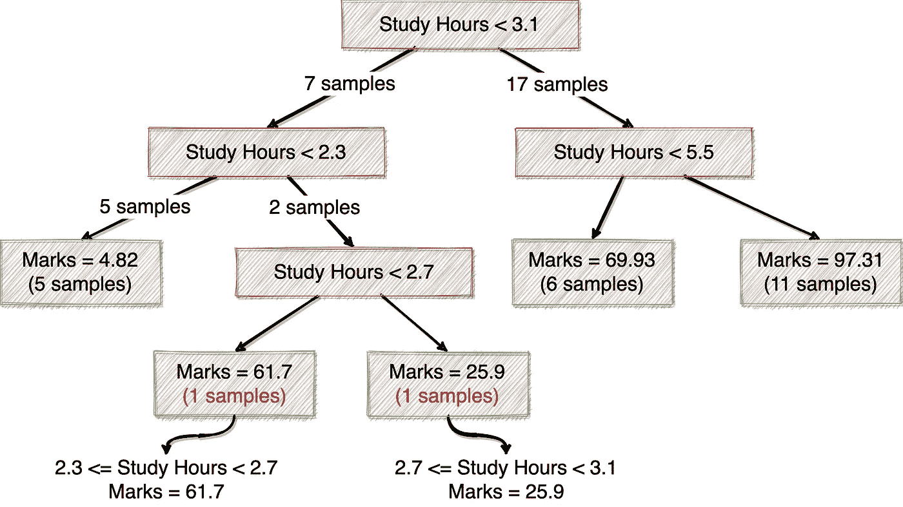

我们来看看上图。我们可以继续分割第二个分支，它有两个样本，平均分数为 43.8。所以，我们有另外两个分支。

*   当学习时间在 2.3 和 2.7 之间时，学生的分数预计为 61.7
*   当学习时间在 2.7 小时和 3.1 小时之间时，学生的分数预计为 25.9 分

如果我们使用我们的数据集(如下)验证该树，我们将发现这两个样本的误差为零！

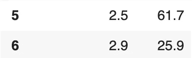

但是等等，有些不对劲。看起来我们的回归树模型认为学习时间多一点的学生分数会低一些。这说不通啊！

这是因为我们的原始数据集并不完美。实践中也有发生。毕竟不能说学生的考试成绩只看学习时间。例如，一些学生可能非常聪明，不需要像其他人一样花很多时间来获得相同的分数。

在这种情况下，我们的模型完全符合我们的训练数据集，但在实践中会失败。也就是所谓的“**过拟合**”。

理论上，无论是分类还是回归，决策树机器学习模型都可以在训练数据上达到 100%的准确率。只要让树有大量的分支，每个分支只有 1 个样本，这将达到 100%的准确率。然而，这样的树在实践中毫无用处。我们需要避免过度拟合的问题。

# 避免过度拟合问题

由 [almatel](https://pixabay.com/users/almatel-18074652/) 在 [Pixabay](https://pixabay.com/photos/rice-field-rice-terraces-landscape-5530707/) 上拍摄的照片

不幸的是，过拟合问题无法完全避免。但是有很多方法可以降低它的程度。有两种常用的方法。

## 限制树的深度

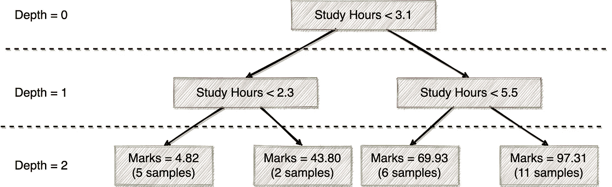

如果我们看一下上面生成的树，我们可以很容易地定义树的“深度”。基本上树的根会是深度= 0，拆分后的下一级是深度= 1，以此类推。

因此，我们可以限制树的深度，比如说**最大深度是 2** ，以减少过拟合问题。然后，树的构建将在这里停止，因为我们已经达到了最大深度。

## 限制叶子上的样本数

减少过拟合问题的另一种方法是限制叶子上的样本数量。如果你注意到我在树中使用了不同的颜色，绿框是“叶节点”,因为它们是树的末端，也用于预测。

假设我们限制样本的数量必须大于 **5** ，那么我们应该得到如下的树。

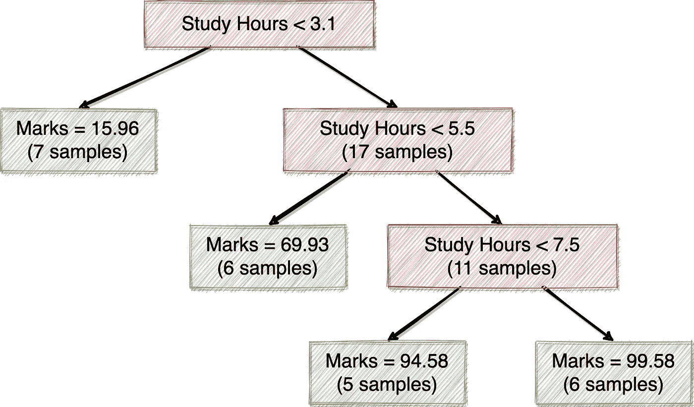

在上面的回归树中，我们没有少于 5 个样本的叶节点。另外，请注意，具有 7 个样本和平均分数= 15.96 的第一个叶节点将不会被分割，因为我们从前面的例子中知道，在分割后，其中一个分支将只有 2 个样本。

在实践中，减少过拟合问题的两种方法可以一起使用。

# 摘要

由 [EvgeniT](https://pixabay.com/users/EvgeniT-4930349/) 在 [Pixabay](https://pixabay.com/photos/autumn-lake-plane-trees-nature-4667080/) 拍摄的照片

在这篇文章中，我挑战了自己，在没有任何公式、方程或科学表达式的情况下解释回归树机器学习算法。我相信一个没有任何计算机科学和数学学位的人应该能够理解这个 ML 模型的机制和直觉。

本文重点讨论了如何构造回归树以及如何确定分裂条件。然后，我还介绍了过拟合问题和用于减少过拟合问题程度的常用方法。

 [## 通过我的推荐链接加入 Medium 克里斯托弗·陶

### 作为一个媒体会员，你的会员费的一部分会给你阅读的作家，你可以完全接触到每一个故事…

medium.com](https://medium.com/@qiuyujx/membership) 

如果你觉得我的文章有帮助，请考虑加入 Medium 会员来支持我和成千上万的其他作者！(点击上面的链接)