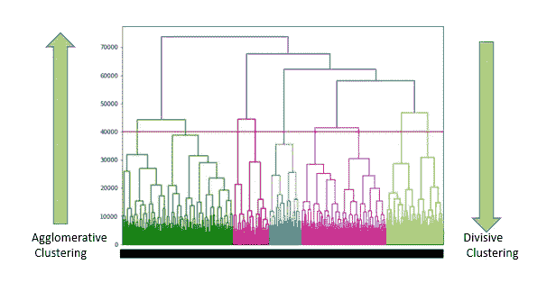
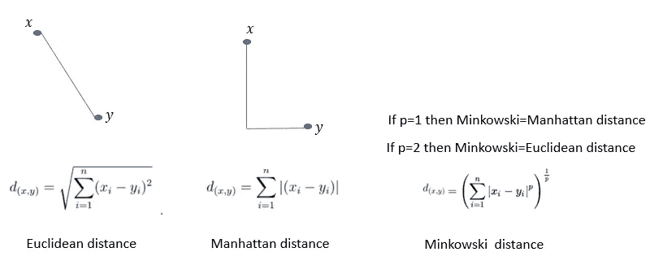
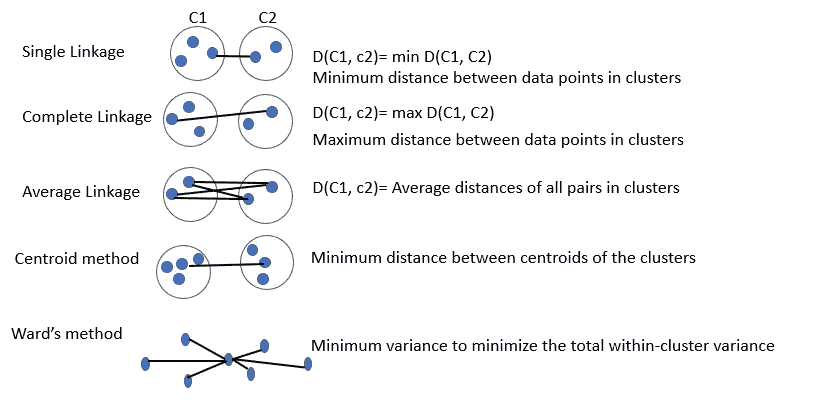
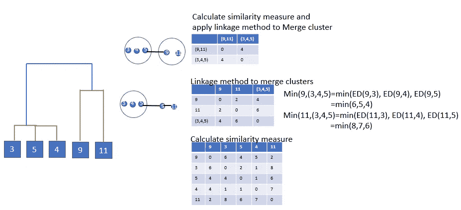
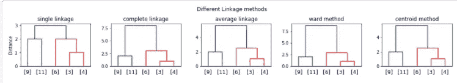
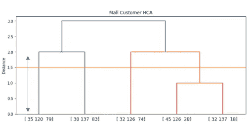
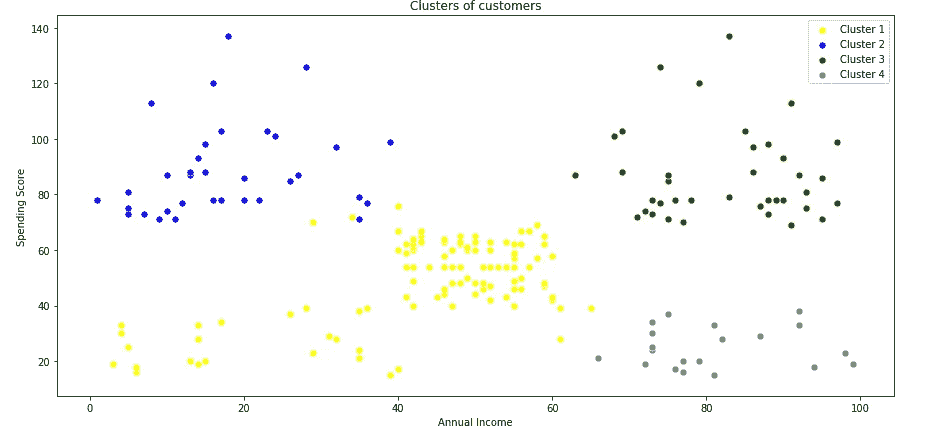

# 关于层次聚类的一切

> 原文：<https://pub.towardsai.net/everything-on-hierarchical-clustering-60bf613377a2?source=collection_archive---------0----------------------->

## [机器学习](https://towardsai.net/p/category/machine-learning)

## 一种无监督聚类算法，用于将具有共同特征的数据分层聚类成不同的组

在本文中，您将了解到。

*   什么是层次聚类，它用在什么地方？
*   两种不同类型的层次聚类——凝聚聚类和分裂聚类
*   了解不同的联系和度量后，层次聚类算法如何工作？
*   什么是树状图？
*   从树状图中寻找最佳聚类数
*   使用 python 实现分层聚类

聚类是对无标签数据进行无监督学习的最常见形式，用于根据距离度量将具有共同特征的对象聚类成离散的簇。

**常见的聚类算法有**

*   **基于质心的聚类**像[k 意味着](/k-means-clustering-techniques-to-find-the-optimal-clusters-7eea5431a4fb)是高效的，但是对初始条件和离群值敏感
*   **基于密度的聚类**如 [DBSCAN](https://medium.com/swlh/dbscan-density-based-spatial-clustering-for-applications-with-noise-476d95c1f14a) 将数据聚类到由低密度区域分隔的高密度区域。
*   **基于分布的聚类**类似于使用期望最大化(EM)的高斯混合模型，这是一种生成概率模型，试图找到最能模拟数据集的高斯概率分布
*   **层次聚类**

> 层次聚类构建聚类的层次结构，而无需根据相似性得分预先指定聚类的数量

分层聚类有助于

*   **客户细分**可以使用人口统计、收入或购买模式对客户进行细分
*   **社交网络分析**根据个人和团体的兴趣和对可用信息的访问来了解他们的动态。
*   **根据共同特征将基因组数据**整理成有意义的生物结构
*   **城市规划集群**确保商业区不在工业区内，或者住宅区不在工业区内。

层次聚类或者是自下而上的，称为聚集聚类，或者是分裂聚类，使用自上而下的方法。

## **凝聚聚类**

一种**自下而上的方法，其中每个数据点在开始**、**被认为是单个聚类，聚类基于相似性**被迭代合并，直到所有数据点都被合并到一个聚类中。

聚集聚类**基于使用距离度量计算的最大相似性聚集成对的聚类，以获得新的聚类**，从而减少每次迭代的聚类数量。他们**只考虑本地模式**而不考虑全球分布。

## 分裂聚类

一种**自上而下的方法**，与凝聚型集群的自下而上的方法相反。分裂聚类**从包含来自数据集的所有数据点**的一个聚类开始。然后**使用类似 KMeans 的平面聚类算法**迭代地分割聚类，直到每个数据点都属于一个单独的聚类。**分裂聚类比自底向上的聚集聚类产生更精确的层次结构**。分裂聚类**通过查看数据集中存在的完整信息来解释全局模式**。



## 深入研究聚集聚类的工作原理

**第一步** : **所有的数据点被指定为一个单点簇**。如果数据集中有 *m* 个观察值，每个点被分配到一个聚类，我们将有 *m* 个聚类。

第二步:找到壁橱或最相似的一对集群，将它们合并成一个集群。层次聚类使用相似性度量来组合最相似的聚类对。**使用欧几里德距离、曼哈顿距离(城市街区距离)、闵可夫斯基距离或余弦相似性来测量聚类之间的相似性。**



**第三步:在确定两个最近的聚类之后，使用链接方法来确定如何合并这两个聚类**。几种联动方式有**单联动、完全联动、平均联动、质心法或沃德法。**



不同的链接合并两个最接近或相似的集群

**重复第 2 步和第 3 步，直到所有观察结果都聚集在一起。整合成一个集群**



## 系统树图

**层次聚类通常使用树状图*来可视化。*树状图*是基于相似性或不相似性度量的点的*树状表示。树状图具有一个轴的数据项和沿着另一个轴的距离，其中两个合并点或聚类之间的距离单调增加。**

计算每一对点之间的距离分数

**基于不同连锁方法的树状图**

```
**from scipy.cluster.hierarchy import dendrogram, linkage
import matplotlib.pyplot as plt
%matplotlib inline
plt.figure(figsize=(15,5))
data= [[i] for i in [9, 3, 6, 4, 11]]
linked_s = linkage(data, 'single', metric='euclidean')
plt.subplot(2, 5, 1)****dendrogram(linked , labels=data)
plt.ylabel('Distance')
plt.title("single linkage")****linked_s = linkage(data, 'complete', metric='euclidean')
plt.subplot(2, 5,2)
dendrogram(linked_s , labels=data)
plt.title("complete linkage")****linked_s = linkage(data, 'average', metric='euclidean')
plt.subplot(2, 5,3)
dendrogram(linked_s , labels=data)
plt.title("average linkage")****linked_s = linkage(data, 'ward', metric='euclidean')
plt.subplot(2, 5,4)
dendrogram(linked_s , labels=data)
plt.title("ward method")****linked_s = linkage(data, 'centroid', metric='euclidean')
plt.subplot(2, 5,5)
dendrogram(linked_s , labels=data)
plt.title("centroid method")
plt.show()**
```



**凝聚式聚类实现**

数据集- [商城客户数据集](https://www.kaggle.com/shwetabh123/mall-customers)

```
**import pandas as pd**
# Read the dataset into a dataframe
**dataset = pd.read_csv('Mall_Customers.csv',index_col='CustomerID')**
# Drop duplicates
**dataset.drop_duplicates(inplace=True)
plt.figure(figsize=(10,5))**
# Creating the input variable
**X= dataset.iloc[:, [1,2,3]].values
linked_s = linkage(X, 'complete', metric='CityBlock')
dendrogram(linked , labels=X)
plt.ylabel('Distance')
plt.axhline(y=1.5, color='orange')
plt.title("Mall Customer HCA")
plt.tight_layout(pad=3.0)
plt.show()**
```



**从树状图中寻找最佳聚类数**

找出上面蓝色箭头所示的垂直线中的最大高度差。选择阈值的方式是，它切割最高的垂直线。

**聚类的数量将是与使用阈值绘制的线相交的垂直线的数量。**

在上面的例子中，聚类的最佳数量是 4

**运行凝聚聚类**

```
**from sklearn.cluster import AgglomerativeClustering
import seaborn as sns
agg_cluster = AgglomerativeClustering(n_clusters=4).fit_predict(X)**#Visualising the clusters
**plt.figure(figsize=(15,7))
sns.scatterplot(X[agg_cluster == 0, 2], X[agg_cluster == 0, 1], color = 'yellow', label = 'Cluster 1',s=50)
sns.scatterplot(X[agg_cluster == 1, 2], X[agg_cluster == 1, 1], color = 'blue', label = 'Cluster 2',s=50)
sns.scatterplot(X[agg_cluster == 2, 2], X[agg_cluster == 2, 1], color = 'green', label = 'Cluster 3',s=50)
sns.scatterplot(X[agg_cluster == 3, 2], X[agg_cluster == 3, 1], color = 'grey', label = 'Cluster 4',s=50)
plt.grid(False)
plt.title('Clusters of customers')
plt.xlabel('Annual Income')
plt.ylabel('Spending Score')
plt.legend()
plt.show()**
```



**关于分层集群的其他知识**

分层聚类对异常值很敏感，并且不能处理缺失数据

分层聚类在处理较小的数据集时特别有效。当聚类完成时，随着更多的数据点被考虑，它在计算上变得更加昂贵。

## 结论:

层次聚类是一种无监督聚类方法，根据距离度量将具有共同特征的对象聚类成离散的簇。分层算法通过连续合并或拆分聚类来构建聚类，而无需预先指定聚类的数量。相似性得分使用不同的方法计算，如欧几里德距离或城市街区距离。当我们连续合并聚类时，这是凝聚聚类，而当我们连续分裂时，这种聚类被称为分裂聚类。使用树状图来可视化层次聚类。

## 参考资料:

[层次凝聚聚类(stanford.edu)](https://nlp.stanford.edu/IR-book/html/htmledition/hierarchical-agglomerative-clustering-1.html)

[](https://www.mygreatlearning.com/blog/hierarchical-clustering) [## 什么是层次聚类？层次聚类简介

### 什么是层次聚类聚类是用于创建同构群的流行技术之一…

www.mygreatlearning.com](https://www.mygreatlearning.com/blog/hierarchical-clustering) 

[princeton.edu hierarchical-clustering.pdf](https://www.cs.princeton.edu/courses/archive/fall18/cos324/files/hierarchical-clustering.pdf)

[https://developers.google.com/machine-learning/clustering](https://developers.google.com/machine-learning/clustering)