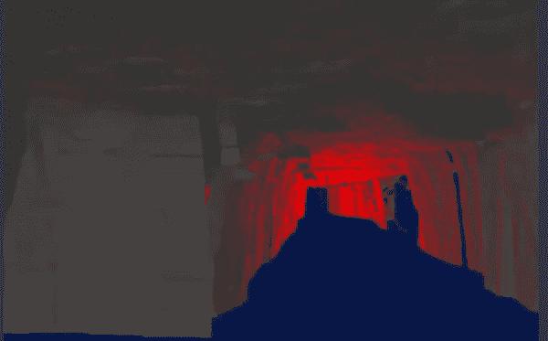
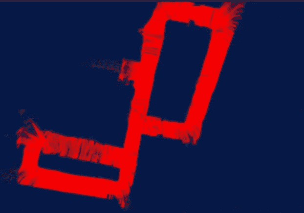
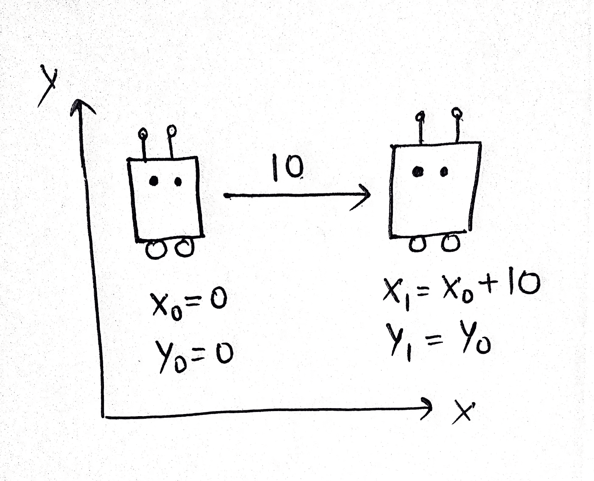
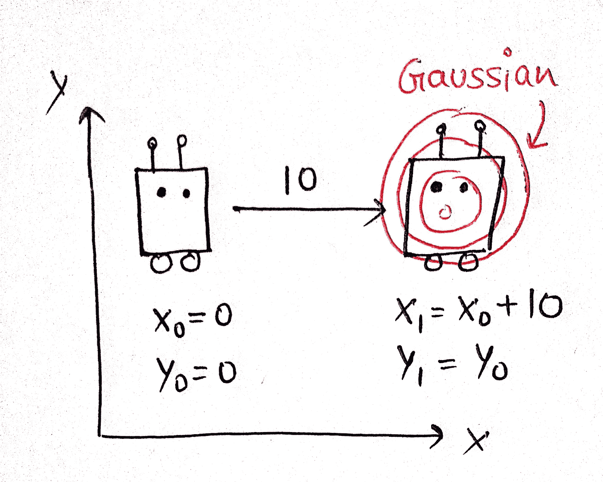
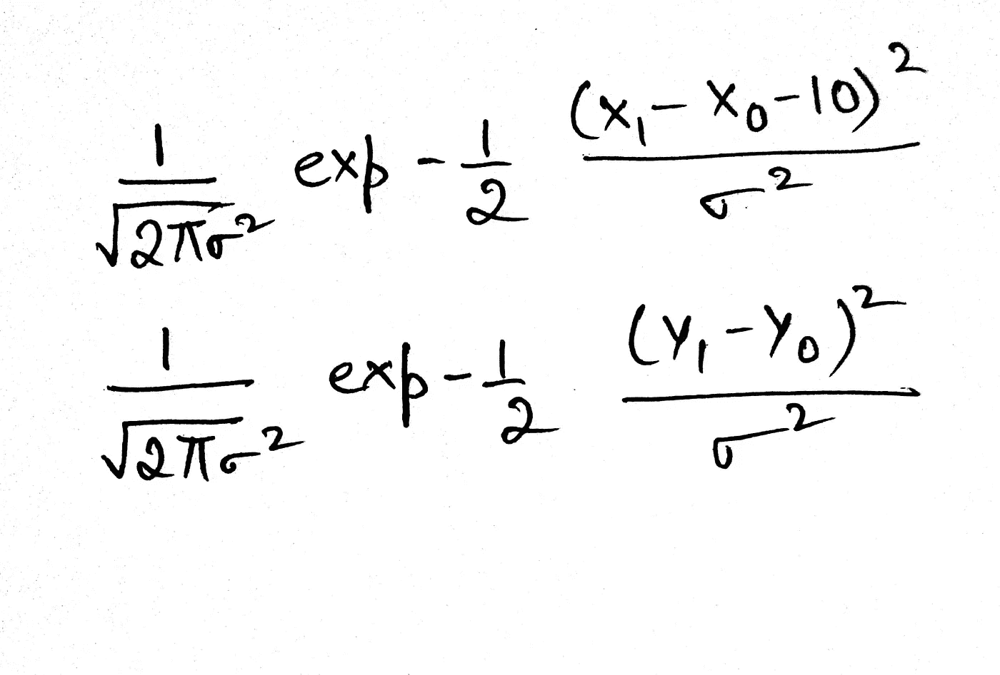
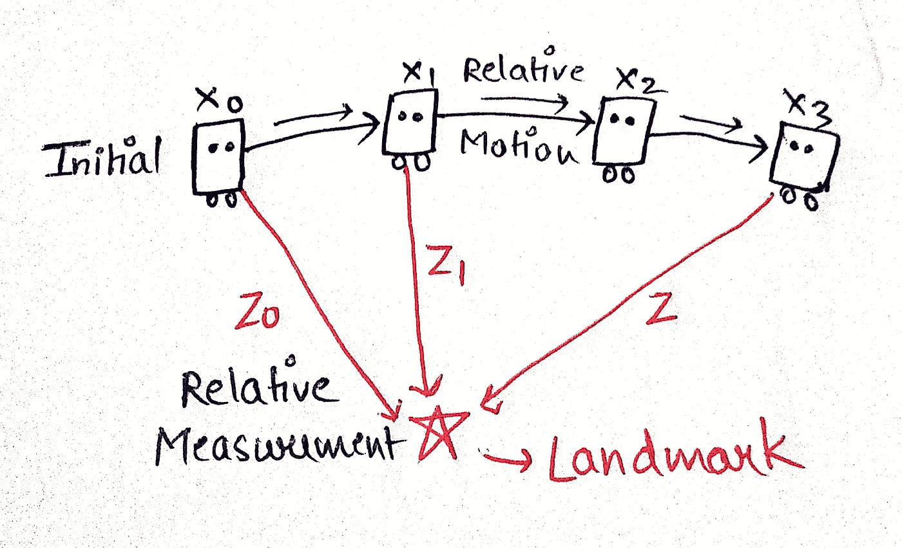

# GRAPH SLAM:这一开创性制图技术的初学者指南

> 原文：<https://pub.towardsai.net/everything-you-need-to-know-about-graph-slam-7f6f567f1a31?source=collection_archive---------2----------------------->

# **简介**

*“SLAM”是指某个传感器相对于其周围环境同时定位(即位置/方向)的方法，同时绘制环境地图。这是机器人和自主系统领域的一个活跃的研究领域。*

# 背后的数学

SLAM(同步定位和绘图)可以实现二维世界！它基本上是机器人传感器测量和运动的组合，以创建/定位机器人，并仅根据机器人随时间收集的传感器和运动数据创建环境地图。 **SLAM 为您提供了一种实时跟踪机器人在世界上的位置，并识别建筑物、树木、岩石和其他世界特征等地标位置的方法。**

作者视频:宾夕法尼亚州一个废弃地下煤矿的 3D 地图

由于运动的不确定性和现有地图的缺乏，用机器人构建地图具有挑战性。这就是 SLAM 发挥作用的地方，它提供了一种精确跟踪机器人位置的解决方案。在所有可用的 SLAM 方法中，GRAPH SLAM 是最容易理解的方法之一，也是该领域许多专家的最爱。

作者图片:SLAM 生成的地图

> **基于图形的 SLAM 方法通过提取原始传感器测量值来构建简化的估计问题。这些原始测量值被图中的边所代替，这些边可以被视为“虚拟测量值”。**

为了简单地理解这一点，让我们假设机器人的初始位置**X = 0&Y = 0；对于**这个例子，假设不考虑航向方向&罗盘。
让我们假设机器人在 x 方向上向右移动 10°，那么现在在理想世界中运动后的位置(X1)将是 **X1= X0+10** 和 **Y1= 0。**

作者图片

但各种卡尔曼滤波器表明，运动实际上是不确定的，所以最好说运动后的实际位置(X1)将是以(10，0)为中心的高斯，但机器人可能在其他地方。

作者图片

X 变量的数学公式如下:
与其将 X1 设置为 X0+10，不如用高斯函数来表示，当这两个值相同时，高斯函数达到峰值。所以，如果我们做 X1- X0- 10，把它变成正方形，然后变成高斯型，我们会得到一个与 X1 & X0 相关的概率分布。这对于 Y &同样适用，因为根据我们的运动，Y 没有变化，所以 Y1 & Y0 应保持尽可能接近。

作者图片

这两个高斯函数的乘积就是我们的约束。目标是在位置 X0 为(0，0)的情况下，最大化位置 X1 的可能性。因此，GRAPH SLAM 所做的就是使用一系列这样的约束来定义概率。
GRAPH SLAM 收集其初始位置，最初是(0，0)(初始约束)，然后是将每个机器人姿态与前一个机器人姿态相关联的大量相对约束(相对运动约束)。作为一个例子，让我们使用机器人在不同位置可以看到的界标，这将是相对测量约束(每次机器人看到界标)。

作者图片

这些约束一起找到机器人路径最可能的配置以及地标的位置，这就是映射过程。

> 参考:Udacity 的计算机视觉纳米度！

对于那些有兴趣看到 GRAPH SLAM 的代码实现的人，我们建议查看 GitHub 上的‘地标检测跟踪 SLAM’项目。该资源提供了该技术的实际操作体验和对其应用的更深入理解:
代码: [**地标检测跟踪 SLAM**](https://github.com/Garima13a/Landmark-Detection-Tracking-SLAM-)

# 结果:

# **结论**

总之，GRAPH SLAM 是一项尖端技术，正在彻底改变机器人领域。通过为地图绘制和导航提供高效而精确的解决方案，它在各种行业中有着广泛的应用。无论您是经验丰富的专家还是初学者，Github 上的“地标检测跟踪 SLAM”项目都提供了一个深入研究 GRAPH SLAM 的实现并更深入了解这一令人兴奋的技术的绝佳机会。随着 GRAPH SLAM 的不断发展和改进，很明显，它将在塑造机器人的未来以及其他方面发挥重要作用。