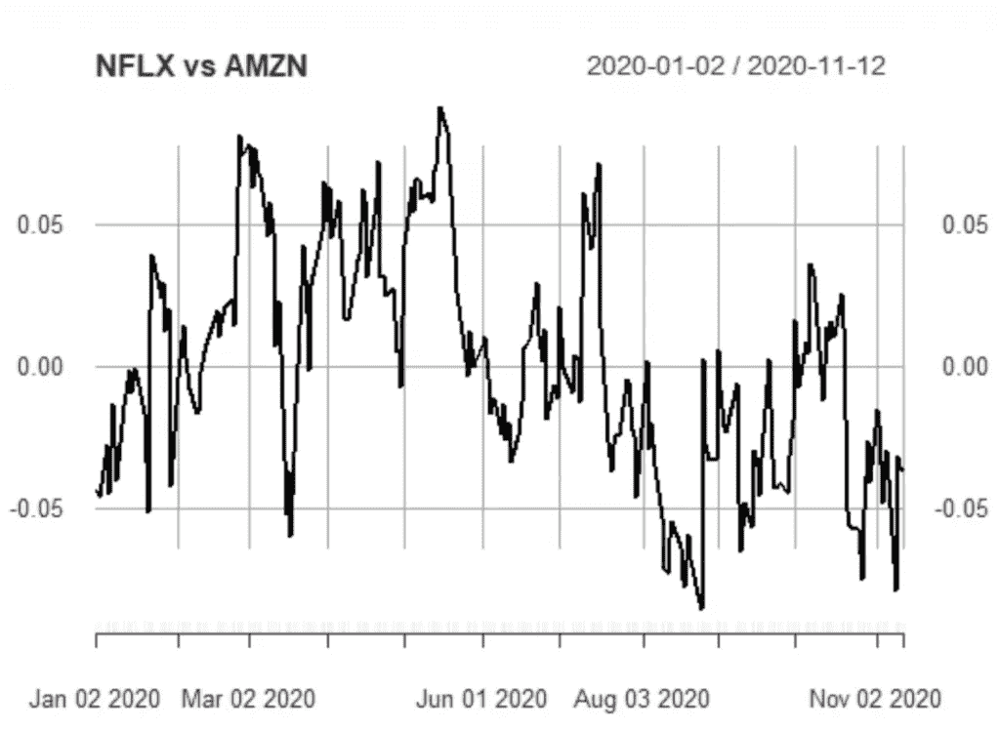
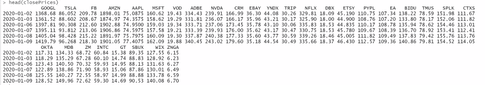
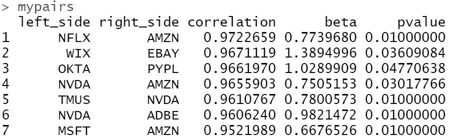
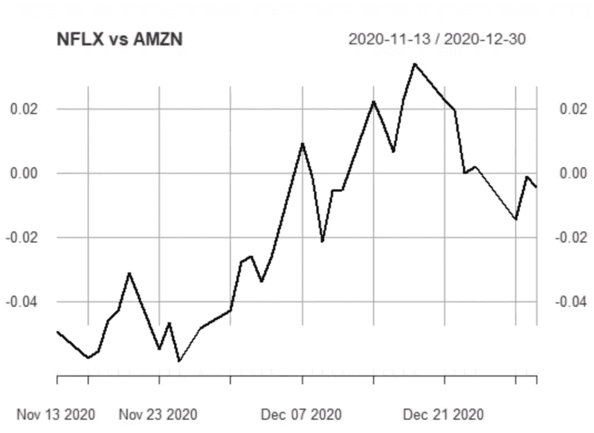

# 配对交易示例

> 原文：<https://pub.towardsai.net/example-of-pairs-trading-4f3c75142961?source=collection_archive---------5----------------------->

## [R](https://towardsai.net/p/category/programming/r) ，[统计](https://towardsai.net/p/category/statistics)

## 使用 R 的 Pairs 交易策略的演练示例



# 介绍

统计套利交易是股票交易的一种定量和计算方法，被对冲基金广泛应用于产生市场中性回报。这种策略最简单也是最受欢迎的版本被称为**配对交易**，它包括识别被认为具有某种长期均衡关系的资产对。当价差已经充分偏离平衡值时，通过对这对组合采取适当的多空头寸，如果价差通过平仓收敛到平衡，就可以获利。类似的想法支配着考虑更大资产篮子的更复杂的策略。我们将专注于 pairs 交易策略，努力
精确说明两只股票之间长期均衡关系的概念，然后我们尝试描述并应用一种计算方法来模拟错误定价动态。在开始分析之前，有必要澄清统计套利
交易不是无风险的策略，因此跟踪它的投资者应该保持警惕。

# 获取股票价格

我们将在 R 中工作，我们将使用 quantmod 包获得股票价格。对于这个例子，我们将考虑纳斯达克 30 只任意股票的收盘价。注意 30 只股票产生 435 对。在现实世界中，我们经常使用数千只股票和数百万对股票。让我们来看看从 2020 年 1 月 1 日到 2021 年 1 月 3 日的 30 只股票的收盘价:

*   “谷歌”
*   《TSLA》
*   " FB "
*   “AMZN”
*   《AAPL》
*   《MSFT》
*   "视频点播"
*   《ADBE》
*   《NVDA》
*   "客户关系管理"
*   "易趣"
*   " YNDX "
*   “旅行”
*   《NFLX》
*   " DBX "
*   " ETSY "
*   《PYPL》
*   " EA "
*   “毕都”
*   " TMUS "
*   " SPLK "
*   《CTXS》
*   “奥克塔”
*   " MDB "
*   《ZM》
*   《INTC》
*   " GT "
*   《SBUX》
*   《WIX》
*   “锌嘎”

```
library(tidyverse)
library(tseries)
library(quantmod)

mySymbols <- c('GOOGL', 'TSLA', 'FB', 'AMZN', 'AAPL', 'MSFT', 'VOD',  'ADBE', 'NVDA', 'CRM',
               'EBAY', 'YNDX', 'TRIP', 'NFLX', 'DBX', 'ETSY', 'PYPL','EA', 'BIDU', 'TMUS',
               'SPLK', 'CTXS', 'OKTA', 'MDB', 'ZM', 'INTC', 'GT', 'SBUX', 'WIX', 'ZNGA')myStocks <-lapply(mySymbols, function(x) {getSymbols(x, 
                                                             from = "2020-01-01", 
                                                             to = "2021-01-03",
                                                             periodicity = "daily",
                                                             auto.assign=FALSE)} )names(myStocks)<-mySymbolsclosePrices <- lapply(myStocks, Cl)
closePrices <- do.call(merge, closePrices)names(closePrices)<-sub("\\.Close", "", names(closePrices))
head(closePrices)
```



# 构建对子

这种策略的目的是构建一个由两只长期均衡的股票组成的投资组合。然后，当价差明显偏离平衡时，我们采取适当的头寸。通过在价差收敛时平仓，或相对错误定价的措施，可以获利。从上面的讨论中，很明显，我们正在寻找价格波动强烈相关的股票，以便有机会实施配对交易策略。定义潜在协整对的最简单方法是考虑大约 **220** 日收盘价来计算股票价格的相关性。一种广泛使用的方法是“距离法”,即通过两个标准化价格序列之间的距离或平方差来衡量货币对的共同运动。最后，一个合理的方法是考虑股票价格的对数，然后计算它们的相关性。

我们的方法是:

1.  将数据分为训练数据集和测试数据集。作为训练数据集，我们考虑第一个 **220 个**观察值，并将剩余的最后 32 个观察值作为测试数据集。
2.  我们取收盘价的对数。
3.  在训练数据集上，我们运行 log(pAt)=β×log(pBt)+εt 的线性回归，其中 pAt 和 pBt 分别是股票 A 和 B 的每日收盘价。系数β是协整系数，随机项εt 是价差。**注意，我们选择在没有截距系数的情况下运行回归**。这是不必要的，因为两种方法都是正确的。
4.  对于每一对，我们从[增强的 Dickey-Fuller 检验(ADF)](https://en.wikipedia.org/wiki/Augmented_Dickey%E2%80%93Fuller_test) 中获得相关系数、β系数和 p 值。我们应用 ADF 测试来检测协整对。
5.  合格的配对是相关系数大于 95%且 p 值小于 5%的配对

让我们在 R:

```
# get the correlation of each pairleft_side<-NULL
right_side<-NULL
correlation<-NULL
beta<-NULL
pvalue<-NULLfor (i in 1:length(mySymbols)) {
  for (j in 1:length(mySymbols)) {

    if (i>j) {
      left_side<-c(left_side, mySymbols[i])
      right_side<-c(right_side, mySymbols[j])
      correlation<-c(correlation, cor(train[,mySymbols[i]], train[,mySymbols[j]]))

      # linear regression withoout intercept
      m<-lm(train[,mySymbols[i]]~train[,mySymbols[j]]-1)
      beta<-c(beta, as.numeric(coef(m)[1]))

      # get the mispricings of the spread
      sprd<-residuals(m)

      # adf test
      pvalue<-c(pvalue, adf.test(sprd, alternative="stationary", k=0)$p.value)

    }
  }

}df<-data.frame(left_side, right_side, correlation, beta, pvalue)mypairs<-df%>%filter(pvalue<=0.05, correlation>0.95)%>%arrange(-correlation)
mypairs
```



从 435 对中，我们保留了上面的 7 对。

# 关注一对

让我们把重点放在 NFLX 和 AMZN 对上，它们分别由网飞和亚马逊股票组成。我们的策略是，当价差偏离 0 时，用价差开仓，希望它会再次收敛到均值 0。让我们在训练数据集上绘制分布图:

**训练数据集**

```
myspread<-train[,"NFLX"]-0.7739680*train[,"AMZN"]
plot(myspread, main = "NFLX vs AMZN")
```


通过分析价差，我们可以确定何时开仓、何时平仓的交易信号。我们可以使用分位数或 3 个标准差。为简单起见，我们假设我们的交易信号分别是 **0.04** 和 **-0.04** 。该战略如下:

*   当价差大于 0.04 时，我们卖出价差，这意味着我们卖出 NFLX，买入 AMZN
*   当价差低于-0.04 时，我们买入价差，这意味着我们买入 NFLX，卖出 AMZN
*   每当价差再次收敛到 0 时，我们就平仓。

**测试数据集**

让我们来看看测试数据集的分布情况:

```
myspread<-test[,"NFLX"]-0.7739680*test[,"AMZN"] 
plot(myspread, main = "NFLX vs AMZN")
```



正如我们所看到的，11 月 13 日的价差低于-004，正如预期的那样，它在 12 月 7 日收敛到均值。

# 结论

配对交易是一种在熊市和牛市都适用的策略。这不是一个无风险策略，因为有可能一对永远不会收敛到均值。此外，当我们回测配对交易策略时，我们需要假设允许卖空，并考虑交易成本和卖空费用。

*原载于*[*https://predictivehacks.com*](https://predictivehacks.com/example-of-pairs-trading/)*。*