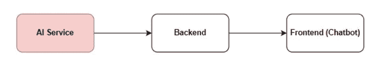
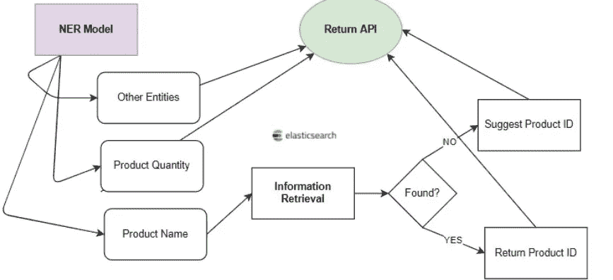
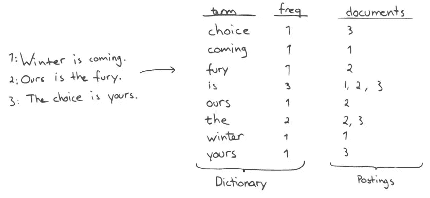
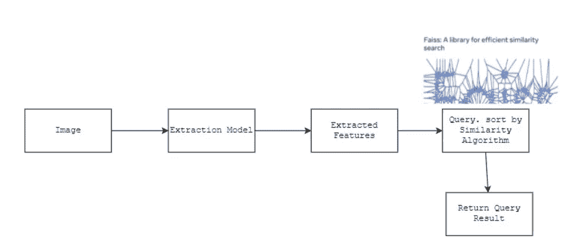
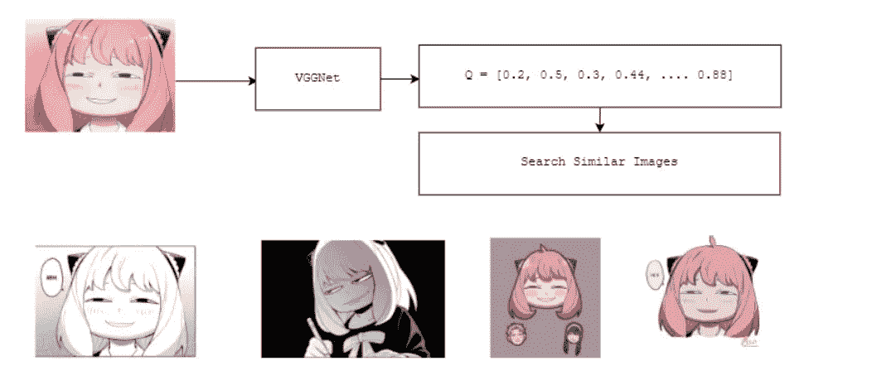
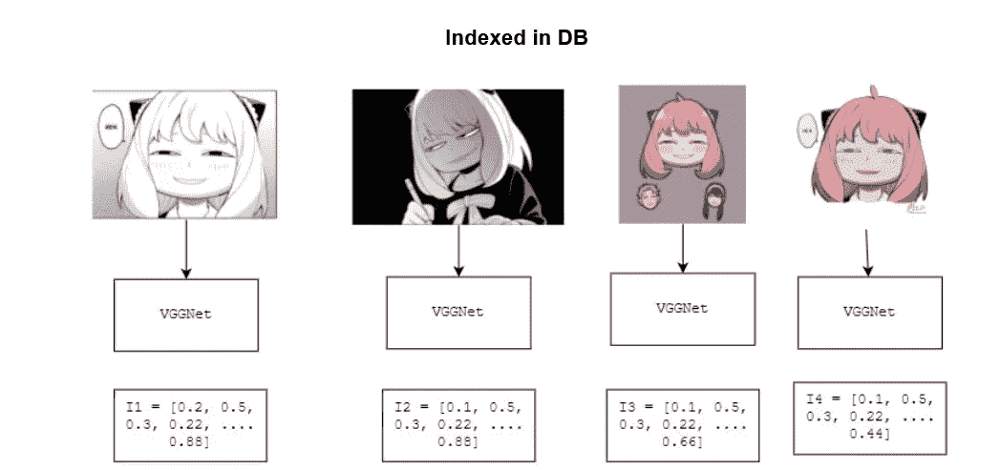
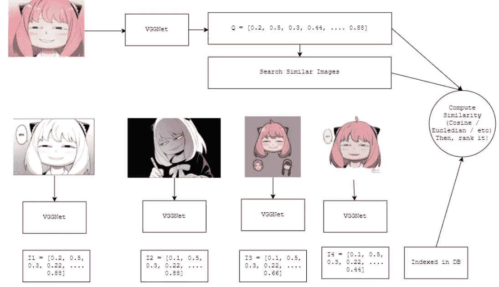
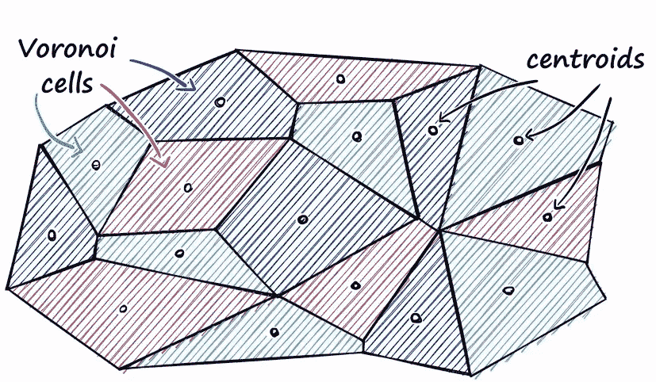
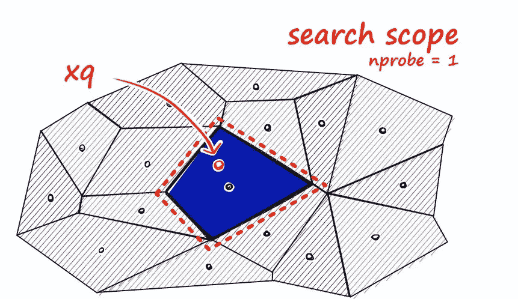
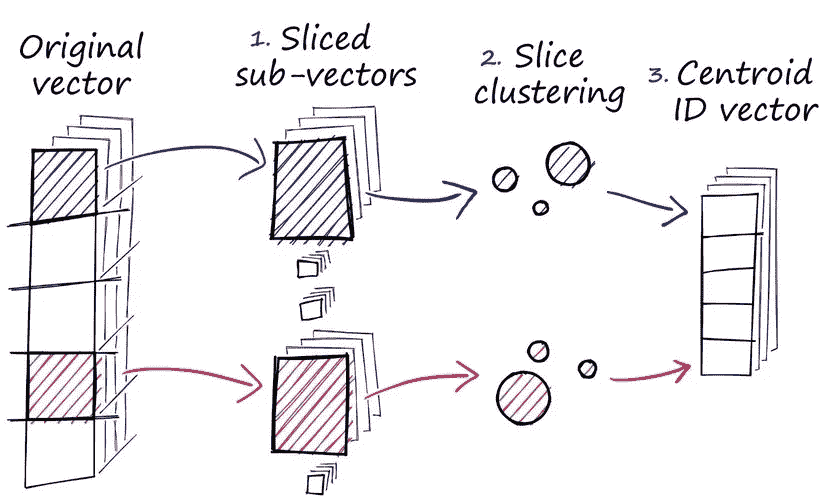

# 图文信息检索应用实例

> 原文：<https://pub.towardsai.net/examples-of-information-retrieval-application-on-image-and-text-388ee229fb6f?source=collection_archive---------2----------------------->

## 图像和文本用例中的信息检索


美国宇航局在 [Unsplash](https://unsplash.com?utm_source=medium&utm_medium=referral) 拍摄的[照片](https://unsplash.com/@nasa?utm_source=medium&utm_medium=referral)

你好，欢迎来到我的第二篇博客。在这篇文章中，我想写下我被邀请作为印度尼西亚大学高级信息检索课程的客座讲师时分享的内容。我分享了几个可以在现实世界中使用的信息检索实现思想。

我将在这里写一些高层次的技术细节。所以，我觉得这个帖子是新手友好的，只要你懂信息检索的基础知识。即使上面提到了 NLP 或者 Image，我也会用直觉来描述。

所以，看我的帖子开心点:)。

# 介绍

信息检索是从资源集合中检索相关资源的过程。流行且广泛使用的信息检索实现之一是像 Google、Bing 和 DuckDuckGo 这样的搜索引擎。它们接收来自用户的查询，并根据查询本身返回相关文档。

IR 的算法主要是用评分算法将查询与源的集合进行比较。评分算法用于计算查询和文档本身之间的相关性。将排序后的检索文档返回给用户。

我将分享一些基本的工具和算法的信息检索实现与自然语言处理和图像。它们是“自动订单提取”和“图像网站的图像检索”我还将提供每个示例有用性的背景。

# 自动订单提取

**自动订单提取**是一项自动提取和解析收到的订单消息的服务。比如一个卖衣服的，把这个服务部署到一个消息传递 app 上(我们可以叫它`chatbot`)，自动提取卖家需要的信息。然后，提取的信息用于处理交易。请看下面的例子:

```
[BUYER]: 
Hi, here is my order:

Name: **Si Meong** <NAME>
Address: **Meow Meow Street** <ADDRESS>

Order:
**1** <Product Quantity> **T-Shirt Meow** <Product Name>

Thank you!

Regards,

Customer
```

> `****` *是提取的信息，* `*< >*` *是提取的信息的标签*

# 为什么这个实现很重要？

想象一下，你有一个大商店，允许使用消息应用程序订购产品。一天之内，你有 2000 份客户订单。我们需要看到数据和产品订单，对它们进行处理和验证。是的，对于大量的请求，手动完成所有这些工作会很麻烦。这就是为什么我们需要一种方法来自动化它。

# 如何实施，做些什么？

自动化它的一个简单而常见的做法是使用模板。例如:

```
Name: <NAME>
Address: <ADDRESS>
Order:<Product Quantity> <Product Name>
```

它可以通过使用正则表达式(Regex)技术轻松实现。可悲的是，使用它有一些缺点:

1.  刚性，用户应该根据模板来放置消息。错别字或任何附加信息将使服务无法提取信息。
2.  产品名称上的错别字会使产品无法被检测，无法提取。

这就是自然语言处理(NLP)，特别是通过使用命名实体抽取(NER)系统可以解决的第一个问题。第二个问题可以通过使用信息检索系统来解决。首先，我们提取我们想要提取的实体加上产品名称和数量。为了解决打字错误的问题，我们使用信息检索技术来推荐相似的产品。

# 结束实施

通常，服务部署在后端服务之后，如下所示:



*这种思想的完整体系*

这里，我们将只关注 AI 服务并返回提取的信息。

对于人工智能服务，它看起来像这样:



下面是服务输入的例子。

```
[BUYER]: 
Hi, here is my order:

Name: **Si Meong** <NAME>
Address: **Meow Meow Street** <ADDRESS>

Order:
**1** <Product Quantity> **T-Shirt Meow** <Product Name>
**4** <Product Quantity> **Shoet Moew** <Product Name>
Thank you!

Regards,

Customer
```

我们假设`Shoet Moew`不在产品列表中，类似的产品是`Shirt Moew`和`Short Moew`。

传递的信息(在 JSON 中)

```
{
  "name": "Si Meong",
  "address": "Meow Meow Street",
  "order": [
    {
      "qty": 1,
      "product_name": "t_shirt_meow"
    }
  ],
  "suggest": [
    {
      "query": "Shoet Moew",
      "qty": 4,
      "suggest": ["shirt_moew", "short_moew"]
    }
  ]
}
```

首先，我们将进入 NER 的细节。

# 命名实体识别(NER)

下面是对 NER 的描述。

> *“命名实体识别(NER)的任务是用相应的类型标记文本中的实体。”—paperswithcode.com*

NER 的输出提取了我们想要的实体。例如:

1.  名字
2.  地址
3.  银行
4.  注意
5.  产品名称
6.  产品数量
7.  电话号码

在上面的例子中，我们只提取姓名、地址、产品数量和名称。

# NER 培训:数据

要制作 NER 系统，我们要么使用现成的服务(通常不适合您的需求)，要么开发您的 NER 系统。当前创建 NER 系统的流行技术是使用机器学习。为了创建它，我们需要`train`一个带有标签 NER 数据集的 NER `model`。您需要一组数据，这些数据包含带有实体标签的成对文本。

训练模型时的问题是准备数据。我们需要类似于真实场景分布的数据。如果有数据，可以手动注释。但是，如果你只有很少的数据，或者根本没有数据，

您可以编写代码来生成数据合成，使用数据合成库，或者利用上下文无关语法(CFG)来生成它们。如果使用 CFG，可以使用 Python 中的`nltk`包。它有一个 CFG 工具。

# 培训 NER:模型

我们需要一个模型，可以根据提供的数据来概括实体提取。机器学习中当前流行的方法是使用深度学习模型。在 NLP 中，像 BERT 或 ROBERTA 这样的预训练模型很受欢迎。我们需要做的是对数据再次训练预训练的模型(我们称之为`fine-tune`)..

对于印度尼西亚数据，您可以使用 IndoBERT 或 IndoNLU 模型，并根据您的数据对它们进行训练。这将产生一个伟大的质量模型。你可以在 [Huggingface](https://www.huggingface.co) 上搜索它们，并根据你的数据对模型进行微调。

# 信息检索:弹性搜索

文中一个流行的信息检索是 **elasticsearch** 。它是一个建立在 Apache Lucene 之上的信息检索工具，在 Apache Lucene 中它被优化来完成检索工作。

它很快，因为它使用倒排索引来做它的搜索系统。它将查询术语与文档术语进行匹配。它不会搜索没有查询术语(或单词)的文档。在选择文档之后，它们将通过评分函数进行排序。



*弹性搜索的倒排索引。从* [*到*](http://elastic.co)

在这个问题中，我们有一个错别字问题。因此，精确匹配是不合适的。好在弹性搜索有`fuzzy query`可以解决错别字问题。它将使用 **levenshtein 距离**算法来扩展查询中的术语。你可以在这个[维基百科页面](https://en.wikipedia.org/wiki/Levenshtein_distance)上阅读更多细节。

弹性搜索有自己的评分功能，可以对检索到的文档进行排名。它遵循 Apache Lucene 的实现。更多详情可以访问这个[页面](https://www.elastic.co/guide/en/elasticsearch/guide/current/practical-scoring-function.html)。

# 订单自动提取综述

我们使用 NER 模型从消息中提取实体。然后使用 IR 工具(elasticsearch)将产品与卖家的产品列表进行匹配。

以下是基于上述输入的聊天机器人响应示例:

```
[RESPONSE]:

Here is your biodata:
Name: Si Meong
Address: Meow Meow Street

Order:
1 x T shirt Meow = IDR 2.000.000
"Shoet Moew" is not found, did you mean "Shirt Moew", "Short Moew"?
```

# 图像检索

如题，它是一种用图像代替文本的信息检索。给定一个查询图像，返回与查询相似的图像。

# 为什么这个实现很重要？

有时，用户会忘记他们想要搜索的东西的名称。假设用户有图像，则可以选择使用图像相似性进行搜索。此外，在某些情况下，用户希望通过图片而不是名称来搜索某样东西。

# 如何实施，做些什么？

我们需要实现一个可以通过使用图像作为查询来检索图像的 IR 系统。为此，我们可以使用计算机视觉知识。我们需要将图像表示成可以用作相似性评分输入的东西。在一个 IR 系统中，有一个术语叫做**向量空间模型**，在这里你将文档(在这里是图像)表示为权重向量。所以，我们需要用向量来表示图像。

可以通过使用计算机视觉中的深度学习模型，提取出能够代表图像的向量。你可以利用计算机视觉预训练模型。这意味着您可以使用一个模型来输出一个**向量**，用于计算查询和文档(图像)的相关性。通过使用距离或相似性算法，我们可以计算每幅图像之间的距离。

这是人工智能服务的管道:



我们将深入了解每一个问题的细节

# 提取模型

正如我上面所说的，我们使用一个模型将图像表示为一个向量。有许多计算机视觉预训练模型可以使用，如 VGG 网，雷斯网，Eff-net 和 VIT。我们可以使用其中的一个，无需再次微调，输出向量。这里有一个例子:


有时，预先训练的模型需要更多的改进以适合你的需要。为此，您可以通过使用 ArcFace 对其进行微调来再次训练它。你需要带标签的图像数据来训练它，每个类告诉你它们应该有近似的矢量输出。微调会使一个类中的每个图像彼此变得更接近。它具有较高的类内相似性和类间差异。这种技术常用于人脸识别模型。

# 行动中的图像提取

假设我们有一个图像商店(例如:NFT)并使用图像检索，您选择使用 VGGNet 作为计算机视觉预训练模型。假设您的数据库集合中有 4 幅图像:



您从图像查询中提取向量。您还可以对数据库中的图像进行同样的操作。



最后，对这些图像与数据库中的每个图像之间的相似性进行排序。



为了对相似性进行排序，我们可以使用一个简洁的开源软件。它叫做 faiss。

# 相似性搜索:faiss

Faiss 是一个可以对密集向量进行相似性搜索的库。它被广泛用于图像检索。它拥有多种相似性距离算法，如欧几里德相似性和余弦相似性。它可以很快，因为它有一个巧妙的技巧来进行快速索引(相似性计算)。

# Faiss 效率:划分为 Voronoi 单元和量化

这两个功能在 Faiss 上都可以有效地做到。第一个是将索引数据库中的向量划分或聚类成 Voronoi 单元的能力。它把你的数据分成 k 个簇。执行查询时，将向量与所有聚类的质心(中心)点进行比较。然后你取 n 个集群，对这 n 个集群上的数据进行全面搜索。用户选择 n 和 k。参见下面 Voronoi 单元的图示。



另一个惊人的技巧是利用 Faiss 的量子化。它收缩原始向量并量化向量中的值。首先，它将向量分割成子向量。然后，它根据数据库中的所有向量对其向量进行聚类，然后将每个子向量的值更改为 cluster-ID。您可以看到下图:



其中三张照片取自[这里](https://www.pinecone.io/learn/faiss-tutorial/)

以上图片和解释摘自这个[博客](https://www.pinecone.io/learn/faiss-tutorial/)(感谢精彩的插图)。更多详情请随意访问。

# 结论


*随机猫~。照片由*[*Manja Vitolic*](https://unsplash.com/@madhatterzone?utm_source=unsplash&utm_medium=referral&utm_content=creditCopyText)*上*[*un splash*](https://unsplash.com/s/photos/cat?utm_source=unsplash&utm_medium=referral&utm_content=creditCopyText)*。*

我编写了两个使用文本和图像信息检索的实现。这里有你可以使用的流行工具，比如`elasticsearch`和`faiss`。这些工具有一些巧妙的技巧来进行有效的搜索。我们可以使用它们在生产中部署 IR 系统。

有一个关于如何部署红外系统的表面。还有一个额外的步骤，你可以使用，如微调，使模型更好，并重新排名。你可以研究它们来制造一个更强大的红外系统。

欢迎对下面的帖子发表评论或向我提问。

# 注意

这篇文章转自我的博客:[https://haryoa.github.io/posts/example-ir-systems/](https://haryoa.github.io/posts/example-ir-systems/)。欢迎参观！