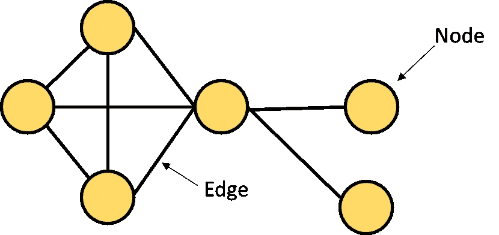
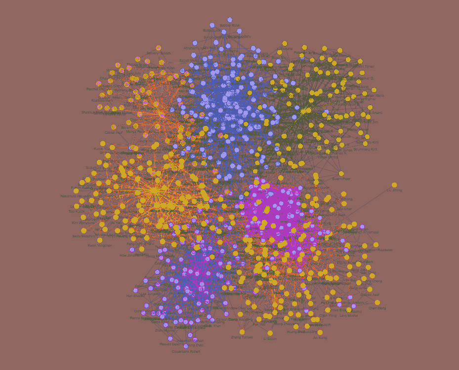
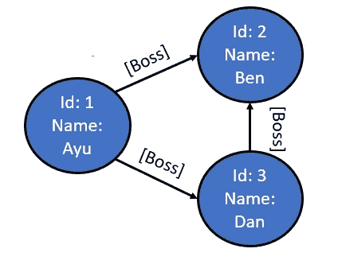
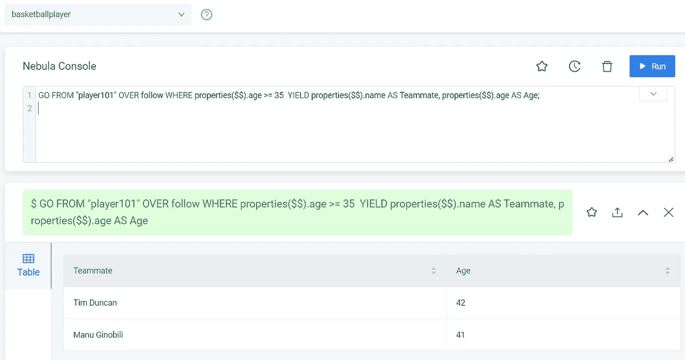
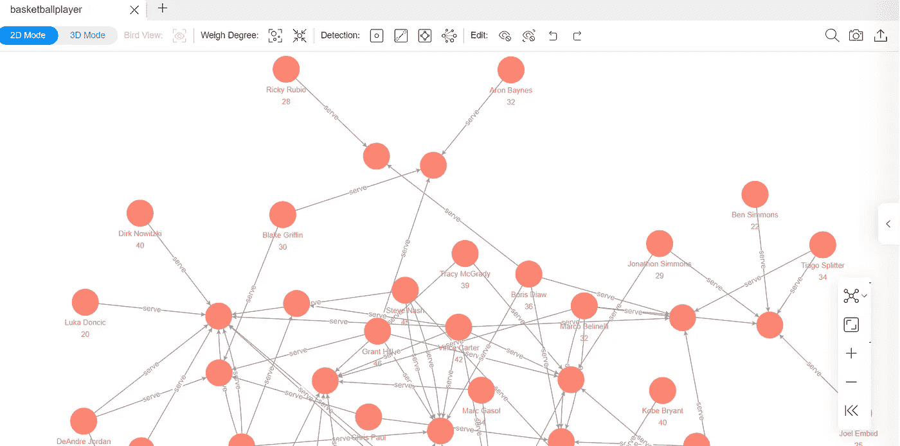

# 使用开源图形数据库 NebulaGraph 扩展您的技能

> 原文：<https://pub.towardsai.net/expand-your-skills-with-open-source-graph-database-nebulagraph-6086c2fc5a64?source=collection_archive---------1----------------------->

## 为你的技能学习广泛使用的图表数据库


丹·梅耶斯在 [Unsplash](https://unsplash.com?utm_source=medium&utm_medium=referral) 上的照片

数据无处不在，可以以任何形式存储。随着当前技术的进步，数据不仅以表格的形式存储，还可以有另一种可能的形式。其中之一是图形形式，我们称之为图形数据库。

图形数据库以图形形式存储数据，但是图形到底是什么呢？许多人会自然而然地认为图表是一种可视化的东西，比如条形图或饼图。不过这里的一个图指的是数学理论中的[图。](https://en.wikipedia.org/wiki/Graph_(discrete_mathematics))

图形是一种数学结构，用于模拟对象之间的关系。每个图由通过边(线/链接)连接的顶点(节点/点)组成。如果我们创建一个插图，图表将类似于下图。



作者图片

图形模型可以扩展为属性图或属性图，属性图是具有属性的图形对象——顶点和边包含彼此重要的信息。

在属性图中，顶点可以是任何标签，如个人、企业名称、编程语言等。与边一起的是顶点之间的关系，例如，交互、接近度、花费时间等。边也可以是有向的[或无向的](https://www.javatpoint.com/directed-and-undirected-graph-in-discrete-mathematics)，这表示关系的性质。



作者图片

例如，属性图示例可以显示在上图中。图像显示了 [ArXiv](https://www.kaggle.com/code/aiswaryaramachandran/coauthor-network-analysis-using-graph-embeddings/data) 合著网络之间的关系，以及每个合著者之间的关系有多密切。

在数据分析中，使用属性图有一些好处，包括:

*   图形可用于记录数据关系并帮助发现感兴趣的特定顶点，
*   当引入新顶点时，该图可以帮助发现顶点和变化之间的任何隐藏关系，
*   可视化网络对于人类阅读数据中的信息更加直观。

有了图形的诸多好处，我们被介绍到了[图形数据库](https://en.wikipedia.org/wiki/Graph_database)，它使用图形结构来表示和存储数据。

图形数据库到底是如何工作的，我们如何使用诸如 NebulaGraph 这样的开源项目在我们的项目上实现图形数据库？让我们开始吧。

# **图形数据库**

[图形数据库](https://en.wikipedia.org/wiki/Graph_database)利用图论和属性图概念，以图形结构构建存储器，作为数据的表示和存储方式。图形数据库不是将数据表示为表格，而是使用顶点作为数据，将关系存储为边。



作者图片

上图显示了图形数据库如何使用 Vertice 来存储数据实体(有 ID 和姓名的人),边作为数据之间的关系(有向或无向)。

为什么我们使用图形数据库，有一些概念提供的优势；它们是:

*   图形数据库优先保留数据之间的关系
*   即使数据量增加，图形数据库的性能也保持不变
*   灵活的模式允许用户在不危及当前结构的情况下调整结构
*   基于敏捷，允许图形数据库跟踪应用程序中的任何变化

图形数据库与关系数据库相比有什么不同？如果我们做一个比较，有一些内在的差异:

*   关系数据库依赖于表(行和列)，而图形数据库依赖于图(顶点和边)，
*   关系数据库通过使用外键来表示表中数据之间的关系，而图形数据库使用边，
*   关系数据库需要表之间复杂的连接语法，而图形数据库不需要连接语法，
*   关系数据库中的许多用例是事务性用例，而图数据库侧重于关系密集型用例。

关系数据库和图形数据库都用来存储数据，但方式不同。何时使用它们取决于用例以及开发的应用程序。

# **星云图数据库为图形数据库**

[NebulaGraph](https://nebula-graph.io/) 数据库是一个开源的图形数据库，拥有数十亿个顶点和数万亿条边的大规模图形，包括毫秒级的延迟。它很容易用于云系统，易于扩展，并且具有弹性。

图形数据库是开源的，这意味着它可以免费使用，对社区贡献开放，如果可能的话，可以很容易地与另一个项目集成。由于其开放性，NebulaGraph 数据库对于任何学习图形数据库的初学者来说都是完美的，对于任何想要实现它们的专业人员来说都是好的。

NebulaGraph 数据库已被许多公司用于各种[用例](https://nebula-graph.io/cases)，包括:

*   数据沿袭和数据治理
*   金融风险控制
*   欺诈检测
*   智能助理和搜索结果召回
*   威胁情报和数据分析

以及更多的用例。当用例清晰并且需要不断扩展时，实现开源数据库图可能是有益的。

## **安装喷雾器**

有很多方法可以在你的本地机器或云系统上安装 NebulaGraph 数据库，你可以在的[文档中找到。但是，安装 NebulaGraph 数据库的先决条件要求您使用 Linux 或 Ubuntu 环境，所以请使用您熟悉的环境。](https://docs.nebula-graph.io/3.2.1/4.deployment-and-installation/1.resource-preparations/)

安装 NebulaGraph 数据库最简单的方法可能是遵循[快速入门](https://docs.nebula-graph.io/3.2.1/2.quick-start/1.quick-start-workflow/)指南，该指南允许您使用 RPM 或 DEB 软件包系统安装 NebulaGraph。在我的试验中，我会使用 Ubuntu 1804 来安装 NebulaGraph。

首先，我们需要使用 wget 将包下载到您想要的位置。

```
wget https://oss-cdn.nebula-graph.io/package/3.2.1/nebula-graph-3.2.1.ubuntu1804.amd64.debwget https://oss-cdn.nebula-graph.io/package/3.2.1/nebula-graph-3.2.1.ubuntu1804.amd64.deb.sha256sum.txt
```

由于我使用 DEB 包来安装 NebulaGraph 数据库，接下来，我将使用下面的代码行来进行安装。

```
sudo dpkg -i nebula-graph-3.2.1.ubuntu1804.amd64.deb
```

接下来，我们需要启动星云图数据库。您需要在脚本中运行`nebula.service`。

```
sudo /usr/local/nebula/scripts/nebula.service
```

然后你需要在你的机器上安装 Nebula 控制台来执行各种功能。你可以查看你想要的[版本](https://github.com/vesoft-inc/nebula-console/releases)，但是我将使用 Linux 版本作为例子。

```
wget https://github.com/vesoft-inc/nebula-console/releases/download/v3.2.0/nebula-console-linux-arm64-v3.2.0
```

不要忘记更改执行控制台的权限。

```
chmod 111 nebula-console
```

使用默认系统，我们可以运行下面的代码来启动控制台。

```
./nebula-console -addr 127.0.0.1 -port 9669 -u root -p root
```

对于第一次使用的用户，我们需要添加存储主机。

```
ADD HOSTS 127.0.0.1:9669
```

如果所有安装进展顺利，我们就可以开始试用 NebulaGraph 数据库了。这之后的详细步骤可以参考下面的[页](https://docs.nebula-graph.io/3.2.1/2.quick-start/4.nebula-graph-crud/)。出于可视化的目的，我将使用带有示例数据集的 [Nebula Studio](https://docs.nebula-graph.io/3.2.1/nebula-studio/about-studio/st-ug-what-is-graph-studio/) 的示例。

## **试用喷雾器**

NebulaGraph 数据库使用了一种查询语言，我们称之为 [nGQL](https://docs.nebula-graph.io/3.2.1/3.ngql-guide/1.nGQL-overview/1.overview/) (NebulaGraph 查询语言)。nGQL 是一种类似 SQL 的查询语言，专用于图形模式。如果你已经知道 SQL，学习这门语言就很容易了。

例如，要在 NebulaGraph 数据库中创建空间，需要使用下面的查询。

```
CREATE SPACE basketballplayer(partition_num=15, replica_factor=1, vid_type=fixed_string(30));
```

[插入顶点](https://docs.nebula-graph.io/3.2.1/3.ngql-guide/12.vertex-statements/1.insert-vertex/)将使用以下查询示例。

```
INSERT VERTEX player(name, age) VALUES "player100":("Tim Duncan", 42);
```

同样，[插入边缘](https://docs.nebula-graph.io/3.2.1/3.ngql-guide/13.edge-statements/1.insert-edge/)将使用以下查询。

```
INSERT EDGE follow(degree) VALUES "player101" -> "player100":(95);
```

最后，使用`GO`查询来[读取数据](https://docs.nebula-graph.io/3.2.1/3.ngql-guide/7.general-query-statements/3.go/)的示例方法如下。

```
GO FROM "player101" OVER follow WHERE properties($$).age >= 35  YIELD properties($$).name AS Teammate, properties($$).age AS Age;
```

如果你想在不安装任何东西的情况下尝试 NebulaGraph 数据库查询，你可以访问[在线 NebulaGraph 工作室](https://playground.nebula-graph.io/explorer)。



作者图片

在上面的例子中，我在 basketballplayer 空间上运行 GO 查询，从可用的顶点中选择球员信息。

此外，作为一名数据科学家，您可能对图形数据库的可视化方面感兴趣。在这种情况下，我们可以尝试[星云探测器](https://explorer.nebula-graph.io/explorer)来可视化图形。



作者图片

在 NebulaGraph 数据库中，您仍然可以尝试学习更多的功能。建议你访问[文档](https://docs.nebula-graph.io/3.2.1/)了解更多。

# **结论**

图形数据库是一种以图形结构来表示和存储数据的存储方式。它本质上不同于关系数据库，在关系数据库中，图形数据库依赖于顶点和边，而不是通常的表。

使用图形数据库的优点包括保留数据之间的关系、稳定的性能、容易调整的结构以及基于敏捷的。

为了更容易访问，人们可以使用 NebulaGraph 数据库来学习图形数据库，并将其用于任何专业活动，因为 NebulaGraph 的开放性质。

使用 NebulaGraph 数据库有很多好处，包括云系统的易用性、可伸缩性以及对功能扩展的弹性。此外，尽管 NebulaGraph 数据库是一个开源项目，但它们允许以毫秒级的延迟托管数十亿个顶点和数万亿条边。

希望有帮助！