# ELI5:期望最大化聚类

> 原文：<https://pub.towardsai.net/expectation-maximization-em-clustering-every-data-scientist-should-know-2b47fbd0dbc0?source=collection_archive---------1----------------------->

## 每个数据科学家都应该知道的聚类技术


图片来源:Unsplash

假设你认识 100 个人，你根据他们的性格特征给他们打分(1-10)，比如风趣、互动、聪明、勤奋等。现在，你想找一群性格特征相似的人。我们如何做到这一点？

**我们执行聚类**！

在这篇博客中，我将涉及以下主题:

*   *聚类&其类型。*
*   *高斯混合模型背后的直觉(GMM) &期望最大化(EM)。*
*   *EM 聚类中如何挑选聚类个数？*
*   *什么时候使用 EM 聚类？*
*   *EM 的 Python 实现。*

我们开始吧！

## 什么是集群？

聚类是将数据点分组在一起的一种方式，使得同一聚类中的数据点彼此之间比不同聚类中的数据点更相似。

## 有两种类型的聚类技术:

1.  硬聚类:一个数据点只属于一个聚类。集群之间没有重叠。比如- K-means 聚类，层次聚类等。
2.  软聚类:一个数据点可以同时属于多个聚类(带有一些权重/概率)。集群之间有重叠。例如，加权 K 均值和高斯混合模型(GMM)。

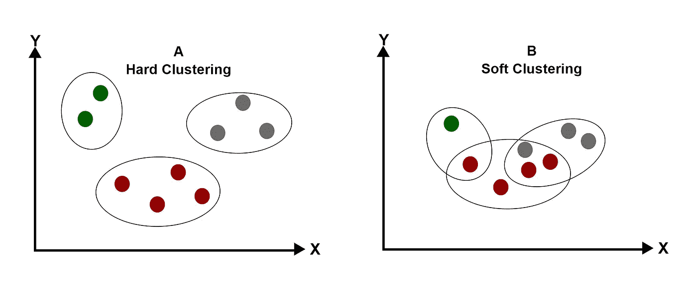

硬聚类与软聚类(图片由作者提供)

# 高斯混合模型(GMM)和期望最大化(EM)算法

*   高斯混合模型(GMM)是进行软聚类的概率方法。每个数据点被分配给具有不同概率的多个聚类。
*   由高斯混合模型创建的分类遵循高斯(正态)概率分布。
*   要构建任何分布，我们需要一些基本参数。为了构造高斯分布，我们需要找到分布的均值和方差。这就是期望最大化(EM)算法发挥作用的地方。

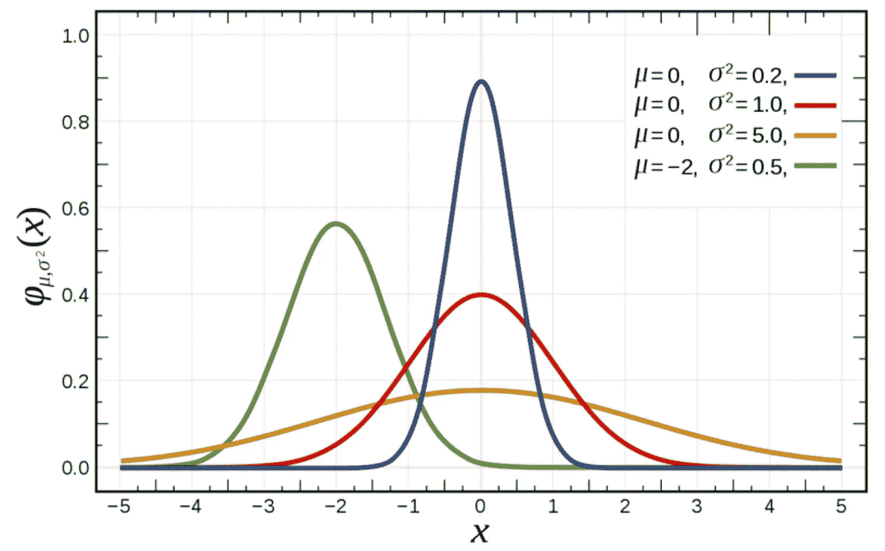

基于均值和方差的不同类型的高斯分布(图片来源:维基百科)

*   期望最大化(EM)算法是一种寻找概率分布参数(均值/方差)的方法。

让我们了解一下期望最大化(EM)是如何使用一维表示来构建高斯分布的。

## 一维理解

假设我们想要对一维空间中的数据点执行高斯混合聚类。

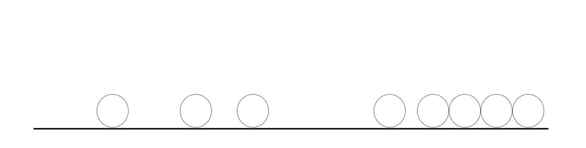

一维数据(图片由作者提供)

为了创建上述数据点的高斯分布，我们需要找到两点:

1.  高斯数(我们稍后再看)。
2.  每个高斯函数的均值和方差，这样我们就可以构造高斯函数并给它们赋值。

现在让我们假设这个分布需要 2 个高斯分布。EM 算法执行以下步骤来寻找高斯分布的均值和方差。

**步骤 1:** 从随机放置的高斯分布开始——具有随机均值和方差。

我们已经创建了 2 个随机高斯(黄色和蓝色)，如下所示。

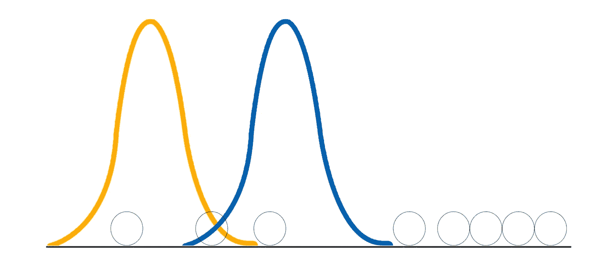

初始化随机高斯(图片由作者提供)

**第二步(E 步):**找出哪一个点离两个高斯点中的哪一个更近。没有硬任务完成。每个点都有分配给蓝色和黄色分布的概率。

使用以下公式计算将点 x 分配给具有均值‘μ’和标准偏差’**【σ’**的高斯分布的概率:

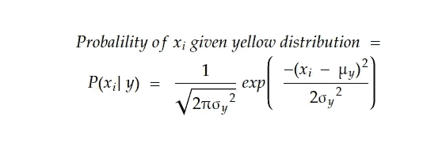

将数据点 x 分配给分布 y 的概率(图片由作者提供)

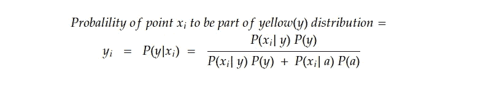

作者图片

靠近黄色的点很有可能是黄色分布的一部分，而靠近蓝色的点很有可能是蓝色分布的一部分。

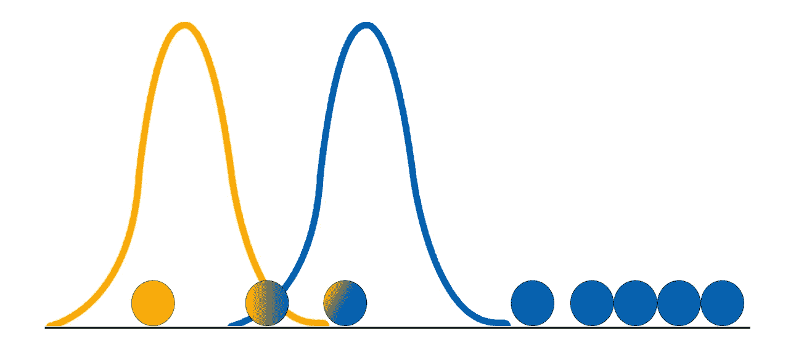

分配点给每个高斯(图片由作者提供)

**第三步(M 步):**更新高斯分布的均值和方差，以改进点分配。

使用每个点(y *1* ，y *2* ，…)的概率更新每个分布的平均值和标准偏差。第二步计算的 y *n* ，如下图。

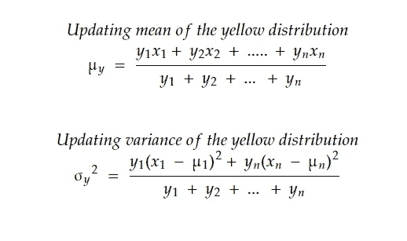

更新黄色分布的均值和方差(图片由作者提供)

类似地,“蓝色”分布的概率、均值和方差也使用上述公式进行更新。

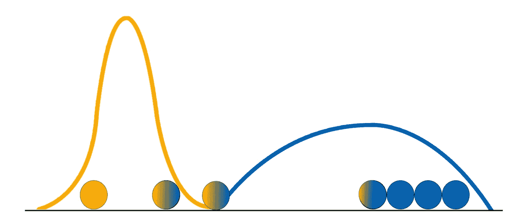

更新的高斯分布(图片由作者提供)

**步骤 4:** 重复步骤 2 和 3，直到高斯不再更新，从而收敛。

经过几次迭代后，高斯分布将收敛，如下所示。

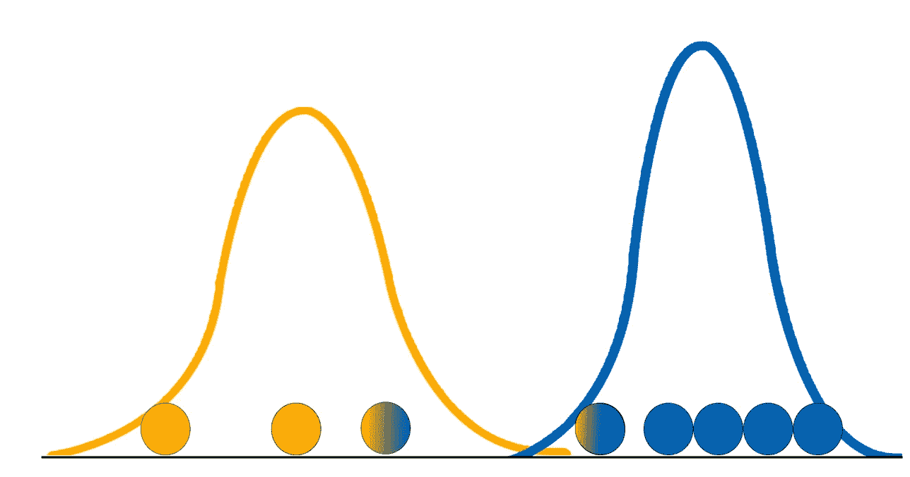

最终高斯分布(图片由作者提供)

## 怎么挑 K？

就像 k-means 聚类中没有直接的方法找到 k 一样，高斯混合也没有直接的方法。

直觉上，我们希望在假设数据是从高斯混合模型生成的情况下，最大化数据的对数似然。


对数似然性(图片由作者提供)

如果高斯数等于数据点数(每个数据点都有自己的高斯数)，对数似然将达到最大值。但是，凭直觉，这并不理想，所以我们必须找出一个停止条件。那么解决办法是什么呢？

奥卡姆剃刀原则:我们需要在所有模型中选择最‘简单’的模型来拟合我们的数据。我们可以通过最大化 BIC 和最小化 AIC 来做到这一点，在这种情况下，它会惩罚具有大量特征(或高斯)的模型，并尝试选择一个简单的模型。

## 什么时候使用高斯混合模型？

1.  根据高斯分布生成数据时，识别数据模式和异常。
2.  高斯混合模型可用于生成与原始数据相似的合成数据点，从而有助于数据扩充。

# 使用 Python 实现期望最大化

***导入需要的包***

```
# for matrix inverse
**import** **numpy** **as** **np**                              
**from** **numpy.linalg** **import** inv                    *# for matrix inverse*
**import** **matplotlib.pyplot** **as** **plt**                 
**from** **scipy.stats** **import** multivariate_normal     *# for generating probability density function* 
```

***创建输入数据***

```
# consider a random mean and covariance value
m1 = [2,2]     
m2 = [10,10]                                              
cov1 = [[4, 2], [2, 4]]                                      
cov2 = [[2, -1], [-1, 2]]#Generating 200 samples for each mean and covariance
x = np.random.multivariate_normal(m1, cov1, size=(200,))  
y = np.random.multivariate_normal(m2, cov2, size=(200,))
d = np.concatenate((x, y), axis=0)
```

***标绘输入数据***

```
plt.figure(figsize=(10,10))                                 
plt.scatter(d[:,0], d[:,1], marker='o')     
plt.axis('equal')                                  
plt.xlabel('X-Axis', fontsize=16)              
plt.ylabel('Y-Axis', fontsize=16)                     
plt.title('Ground Truth', fontsize=22)    
plt.grid()            
plt.show()
```

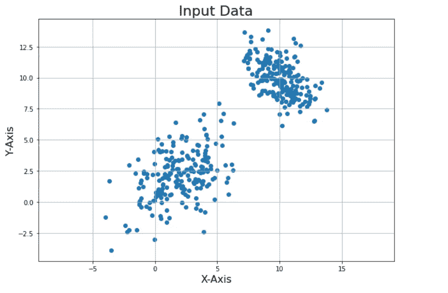

> ***第一步:参数的初始猜测***

```
m1 = random.choice(d)
m2 = random.choice(d)
cov1 = np.cov(np.transpose(d))
cov2 = np.cov(np.transpose(d))
pi = 0.5
```

***标绘初始状态***

```
x1 = np.linspace(-4,11,200)  
x2 = np.linspace(-4,11,200)
X, Y = np.meshgrid(x1,x2) Z1 = multivariate_normal(m1, cov1)  
Z2 = multivariate_normal(m2, cov2)pos = np.empty(X.shape + (2,))                *# a new array of given shape and type, without initializing entries*
pos[:, :, 0] = X; pos[:, :, 1] = Y plt.figure(figsize=(10,10))                                                          *# creating the figure and assigning the size*
plt.scatter(d[:,0], d[:,1], marker='o')     
plt.contour(X, Y, Z1.pdf(pos), colors="r" ,alpha = 0.5) 
plt.contour(X, Y, Z2.pdf(pos), colors="b" ,alpha = 0.5) 
plt.axis('equal')                                                                  *# making both the axis equal*
plt.xlabel('X-Axis', fontsize=16)                                                  *# X-Axis*
plt.ylabel('Y-Axis', fontsize=16)                                                  *# Y-Axis*
plt.title('Initial State', fontsize=22)                                            *# Title of the plot*
plt.grid()                                                                         *# displaying gridlines*
plt.show()
```

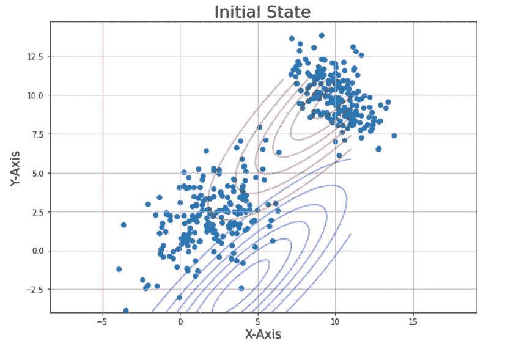

> ***第二步:期望第二步***

```
*##Expectation step*
**def** Estep(lis1):
    m1=lis1[0]
    m2=lis1[1]
    cov1=lis1[2]
    cov2=lis1[3]
    pi=lis1[4]

    pt2 = multivariate_normal.pdf(d, mean=m2, cov=cov2)
    pt1 = multivariate_normal.pdf(d, mean=m1, cov=cov1)
    w1 = pi * pt2
    w2 = (1-pi) * pt1
    eval1 = w1/(w1+w2) **return**(eval1)
```

> ***第三步:最大化步骤***

```
*## Maximization step*
**def** Mstep(eval1):
    num_mu1,din_mu1,num_mu2,din_mu2=0,0,0,0 **for** i **in** range(0,len(d)):
        num_mu1 += (1-eval1[i]) * d[i]
        din_mu1 += (1-eval1[i]) num_mu2 += eval1[i] * d[i]
        din_mu2 += eval1[i] mu1 = num_mu1/din_mu1
    mu2 = num_mu2/din_mu2 num_s1,din_s1,num_s2,din_s2=0,0,0,0
    **for** i **in** range(0,len(d)): q1 = np.matrix(d[i]-mu1)
        num_s1 += (1-eval1[i]) * np.dot(q1.T, q1)
        din_s1 += (1-eval1[i]) q2 = np.matrix(d[i]-mu2)
        num_s2 += eval1[i] * np.dot(q2.T, q2)
        din_s2 += eval1[i] s1 = num_s1/din_s1
    s2 = num_s2/din_s2 pi = sum(eval1)/len(d)

    lis2=[mu1,mu2,s1,s2,pi]
    **return**(lis2)
```

***功能绘制 EM 算法***

```
**def** plot(lis1):
    mu1=lis1[0]
    mu2=lis1[1]
    s1=lis1[2]
    s2=lis1[3]
    Z1 = multivariate_normal(mu1, s1)  
    Z2 = multivariate_normal(mu2, s2) pos = np.empty(X.shape + (2,))                *# a new array of given shape and type, without initializing entries*
    pos[:, :, 0] = X; pos[:, :, 1] = Y    plt.figure(figsize=(10,10))                                                          *# creating the figure and assigning the size*
    plt.scatter(d[:,0], d[:,1], marker='o')     
    plt.contour(X, Y, Z1.pdf(pos), colors="r" ,alpha = 0.5) 
    plt.contour(X, Y, Z2.pdf(pos), colors="b" ,alpha = 0.5) 
    plt.axis('equal')                                                                  *# making both the axis equal*
    plt.xlabel('X-Axis', fontsize=16)                                                  *# X-Axis*
    plt.ylabel('Y-Axis', fontsize=16)                                                  *# Y-Axis*
    plt.grid()                                                                         *# displaying gridlines*
    plt.show()
```

> ***第四步:调用函数，重复直到收敛***

```
iterations = 20
lis1=[m1,m2,cov1,cov2,pi]
for i in range(0,iterations):
    lis2 = Mstep(Estep(lis1))
    lis1=lis2
    if(i==0 or i == 5 or i == 10 or i == 19):
        plot(lis1)
```

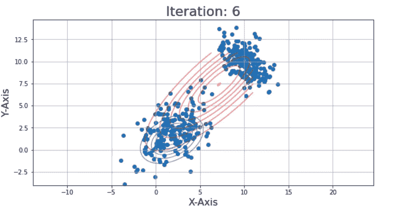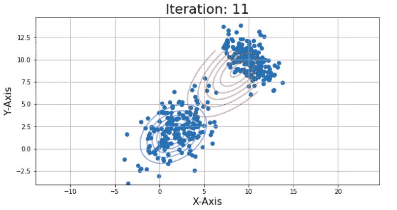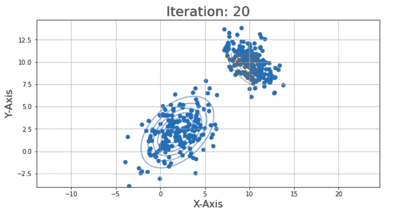

如果你觉得这个博客有用，分享一些掌声:)如果你想让我涵盖任何数据科学主题，请随时发表评论。

# 谢谢大家！

你可以在收件箱里看到我所有的帖子。 [***说到这里*** *！*](https://anmol3015.medium.com/subscribe)

*如果你自己喜欢体验中等，可以考虑通过* [***报名会员***](https://anmol3015.medium.com/membership) *来支持我和其他几千个作家。它每个月只需要 5 美元，它极大地支持了我们，作家，你可以在媒体上看到所有精彩的故事。*

## **参考:**

[](https://medium.com/@prateek.shubham.94/expectation-maximization-algorithm-7a4d1b65ca55) [## 期望值最大化算法

### K-means 方法是硬分配聚类的一个例子，其中每个点只能属于一个聚类…

medium.com](https://medium.com/@prateek.shubham.94/expectation-maximization-algorithm-7a4d1b65ca55)