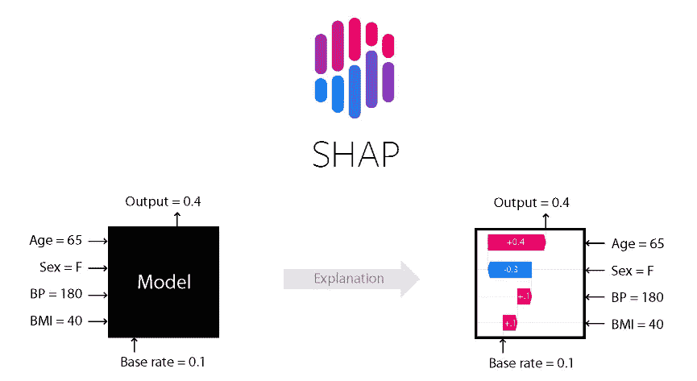
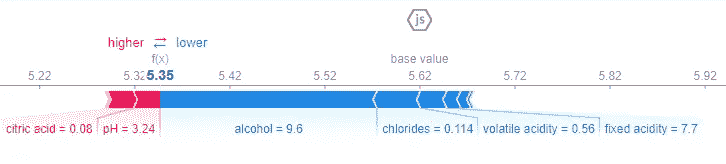
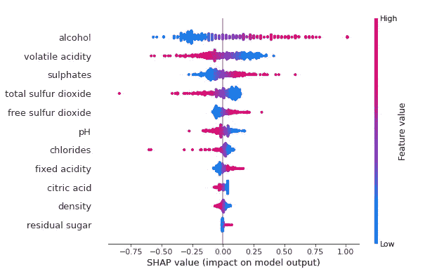
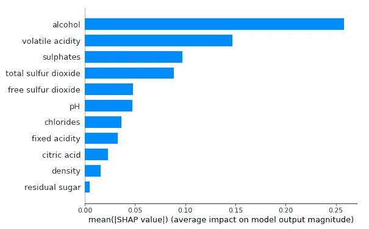
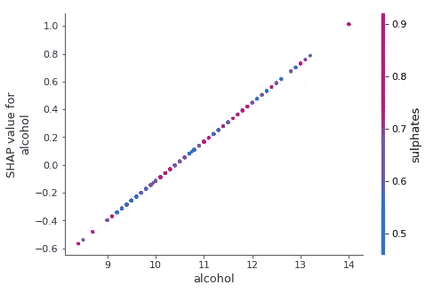

# 用内核 SHAP 解释你的机器学习预测

> 原文：<https://pub.towardsai.net/explain-your-machine-learning-predictions-with-kernel-shap-kernel-explainer-fed56b9250b8?source=collection_archive---------0----------------------->

## [数据科学](https://towardsai.net/p/category/data-science)，[机器学习](https://towardsai.net/p/category/machine-learning)

## 如何使用 SHAP 库用内核解释器解释你的机器学习预测



来源: [SHAP](https://github.com/slundberg/shap)

# 什么是 SHAP

正如在 [Github](https://github.com/slundberg/shap) 页面— *上所述，“SHAP(SHapley Additive explaints)是一种解释任何机器学习模型输出的博弈论方法。它使用博弈论的经典 Shapley 值及其相关扩展将最优信用分配与本地解释联系起来。*

在上一篇文章 [**这里**](https://medium.com/towards-artificial-intelligence/how-to-explain-your-machine-learning-predictions-with-shap-values-a8332c3e5a11) 中，我们谈到了针对波士顿房价预测数据集的`TreeExplainer`(它使用了树 SHAP 算法)。在这篇博客中，让我们了解如何使用`KernelExplainer`(核 SHAP 算法)进行模型解释。

# 内核 SHAP(线性石灰+沙普利值)

核 SHAP 是一种模型不可知的方法，用于估计任何机器学习模型的 SHAP 值。正如您从标题中可以猜到的，核 SHAP 算法基于两个组件-局部代理(LIME)和 Shapley 值。它是在 SHAP 库中的 **KernelExplainer** 方法中实现的。

[](https://medium.com/towards-artificial-intelligence/how-to-explain-your-machine-learning-predictions-with-shap-values-a8332c3e5a11) [## 如何用 SHAP 值解释你的机器学习预测

### SHapley 加法解释

medium.com](https://medium.com/towards-artificial-intelligence/how-to-explain-your-machine-learning-predictions-with-shap-values-a8332c3e5a11) 

请阅读下面的章节，了解内核 SHAP 背后的详细讨论和数学知识。

[](https://christophm.github.io/interpretable-ml-book/shap.html#kernelshap) [## 5.10 SHAP (SHapley 附加解释)|可解释的机器学习

### 本章目前仅在此网络版本中可用。电子书和印刷品将紧随其后。SHAP(沙普利添加剂…

christophm.github.io](https://christophm.github.io/interpretable-ml-book/shap.html#kernelshap) 

# 例子

在本示例部分，让我们使用 sklearn 解决一些葡萄酒质量数据集的回归问题。

```
import sklearn
import pandas as pd
import numpy as np
import shap
import time
from sklearn.model_selection import train_test_split
from sklearn.metrics import mean_squared_errorfrom sklearn.linear_model import LinearRegressiondataset_url = ‘https://archive.ics.uci.edu/ml/machine-learning-databases/wine-quality/winequality-red.csv'df = pd.read_csv(dataset_url, sep=’;’)y = df[‘quality’]
X = df[[‘fixed acidity’, ‘volatile acidity’, ‘citric acid’, ‘residual sugar’,’chlorides’, ‘free sulfur dioxide’, ‘total sulfur dioxide’, ‘density’,’pH’, ‘sulphates’, ‘alcohol’]]# Split the data into train and test data:
X_train, X_test, y_train, y_test = train_test_split(X, y, test_size = 0.2, random_state=42)# Build the model with the random forest regression algorithm:
lin_regr = LinearRegression()
lin_regr.fit(X_train, y_train)
y_pred = lin_regr.predict(X_test)print(‘RMSE:’, np.sqrt(mean_squared_error(y_test, y_pred)))# rather than use the whole training set to estimate expected 
# values, we summarize with a set of weighted kmeans, each weighted # by the number of points they represent.
X_train_summary = shap.kmeans(X_train, 10)
```

KernelExplainer 方法需要三个参数— `model`、`background dataset`、&、`link`。在下面的代码中，我们将传递一个经过训练的线性回归模型。背景数据集用于生成扰动数据集。如果背景数据集很小，则使用整个数据；否则可以使用如上所示的汇总数据集。对于分类问题，我们可以将参数`link`设置为‘logit ’,以获得 logit 中的特征贡献。

```
shap.initjs()
ex = shap.KernelExplainer(lin_regr.predict, X_train_summary)
shap_values = ex.shap_values(X_test.iloc[0,:])
```

## 力图

力图用于解释个别情况的预测。以下示例显示了测试数据集中第一个实例的力图。

```
shap.force_plot(ex.expected_value, shap_values, X_test.iloc[0,:])
```



作者图片

*   `f(x)`是模型预测(5.35)。
*   `base value`是整个测试数据集的平均预测值。这是在我们不知道当前输出的任何特征的情况下预测的值。
*   将预测值推高的要素显示为红色，将预测值推低的要素显示为蓝色。
*   `alcohol`特征对葡萄酒质量有很高的负面影响，并将预测向左推。将葡萄酒质量推向较低值的其他重要特征是`chlorides, volatile acidity` & `fixed acidity`。
*   `pH`特征对葡萄酒质量有积极影响，其次是`citric acid`特征。

## 汇总图

摘要图用于找出对模型最重要的特征。在下面的示例中，我们绘制了每个样本的每个要素的 SHAP 值。然后，根据所有样本的 SHAP 值的总和对该图进行排序。

```
shap_values = ex.shap_values(X_test)
shap.summary_plot(shap_values, X_test)
```



作者图片

*   特征按`feature importance`降序排列。
*   `Color`表示该变量在该观察中是高(红色)还是低(蓝色)。
*   每个特征的水平线上的每个点显示该值*的影响是否与更高(红色)或更低(蓝色)的预测*相关联。
*   我们还可以看到每个特征和目标变量之间的`correlation`。高水平的“酒精”对葡萄酒质量有着积极的影响。请注意，“高”来自红色，而“积极”影响显示在 X 轴上。同样，我们可以说“挥发性酸度”的高值与目标变量负相关。

带`plot_type='bar'`的汇总图将给出可变重要性图。预测能力高的特征显示在顶部，预测能力低的特征显示在底部。



作者图片

## 依赖图

为了理解单个特征如何影响模型的输出，可以使用依赖图。部分相关性图显示了一个或两个特征对机器学习模型的预测结果的边际影响。它表明目标和特征之间的关系是线性的、单调的还是更复杂的。它会自动包含您选择的变量与之交互最多的另一个变量。

在下图中，`alcohol`特征与`sulphates`特征交互最多，我们可以看到`alcohol`与目标变量之间的线性趋势。

```
shap.dependence_plot(“alcohol”, shap_values, X_test)
```



作者图片

请浏览更多官方文档中的 [**内核解释器示例**](https://shap.readthedocs.io/en/latest/examples.html#kernel-explainer) 以及分类示例。

## 密码

# 结论

在本文中，您已经了解了线性时间、Shapley 值，以及这两者与内核 SHAP 的关系。您还了解了如何使用 Kernel Explainer 实现模型可解释性的例子。在以后的博文中，我会尽量涵盖来自 SHAP 图书馆的`Deep Explainer`和`Linear Explainer`。

如果你正在读这篇文章，那么我相信你也会对下面关于同一主题的文章感兴趣。

[](https://medium.com/towards-artificial-intelligence/how-to-explain-your-machine-learning-predictions-with-shap-values-a8332c3e5a11) [## 如何用 SHAP 值解释你的机器学习预测

### SHapley 加法解释

medium.com](https://medium.com/towards-artificial-intelligence/how-to-explain-your-machine-learning-predictions-with-shap-values-a8332c3e5a11) [](https://medium.com/towards-artificial-intelligence/lime-explaining-any-machine-learning-prediction-d663c457a740) [## LIME 解释任何机器学习预测

### 用石灰向可解释的人工智能迈出第一步

medium.com](https://medium.com/towards-artificial-intelligence/lime-explaining-any-machine-learning-prediction-d663c457a740) 

*阅读更多关于 Python 和数据科学的此类有趣文章，* [***订阅***](https://pythonsimplified.com/) *到我的博客*[**【www.pythonsimplified.com】**](http://www.pythonsimplified.com)***。*** 你也可以通过 [**LinkedIn**](https://www.linkedin.com/in/chetanambi/) 联系我。

我希望你喜欢阅读这篇文章。如果你喜欢我的文章并想订阅 Medium，你可以在这里订阅:

[](https://chetanambi.medium.com) [## Chetan Ambi -介质

### 阅读 Chetan Ambi 在媒体上的文章。数据科学|机器学习| Python。参观 https://pythonsimplified.com/…

chetanambi.medium.com](https://chetanambi.medium.com) 

# 参考

[1].[https://github.com/slundberg/shap](https://github.com/slundberg/shap)

[2].[https://medium . com/analytics-vid hya/shap-part-2-kernel-shap-3c 11e 7a 971 b 1](https://medium.com/analytics-vidhya/shap-part-2-kernel-shap-3c11e7a971b1)

[3].[https://towards data science . com/understanding-how-lime-explains-predictions-d 404 e 5d 1829 c](https://towardsdatascience.com/understanding-how-lime-explains-predictions-d404e5d1829c)