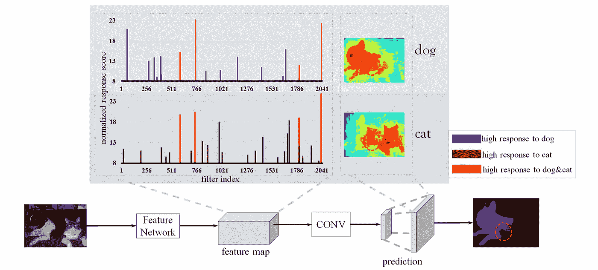
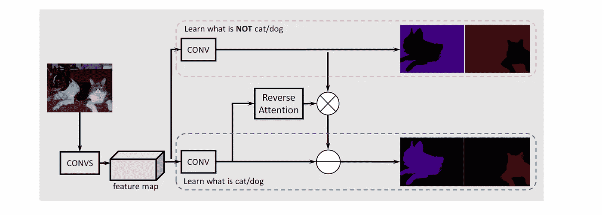
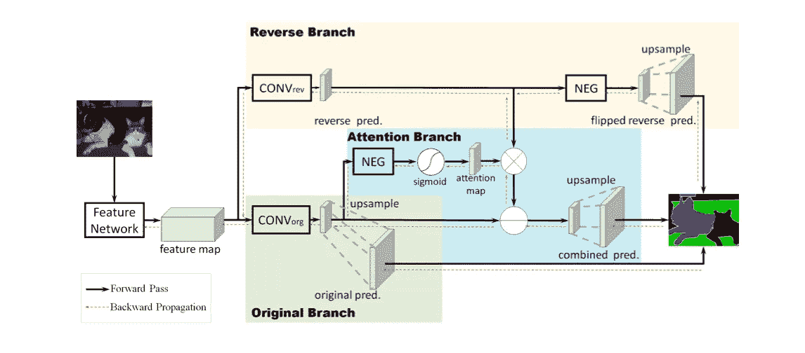
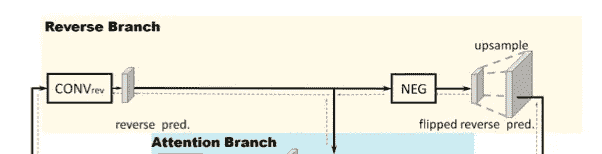
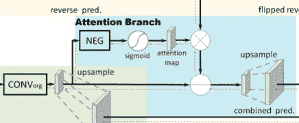
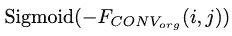
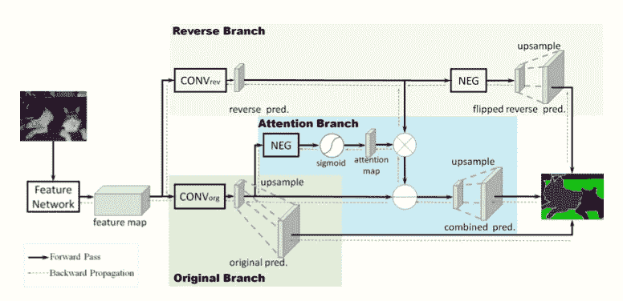
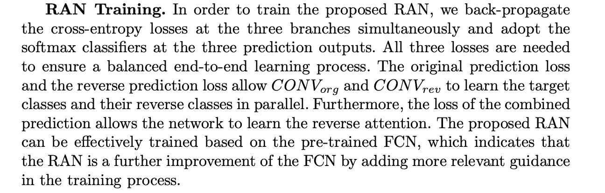
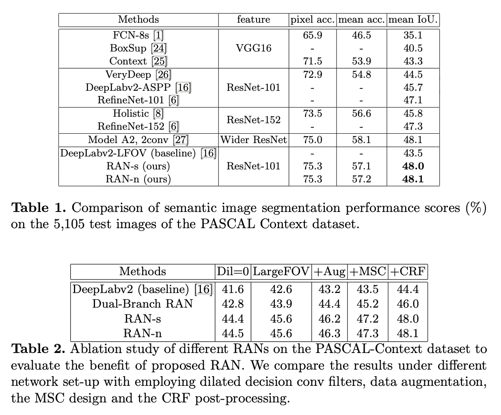

# 解释:图像分割中的反向注意网络(RAN)

> 原文：<https://pub.towardsai.net/explained-reverse-attention-network-in-image-segmentation-baa6bdf08ac4?source=collection_archive---------2----------------------->

德文·艾弗里在 [Unsplash](https://unsplash.com?utm_source=medium&utm_medium=referral) 上的照片

# 目录

[⭐️问题](#c6cf)
[⭐️一解](#85f3)
[⭐ ️Reverse 关注网(冉)](#cc2a)
∘ [反向关注分支(RB)](#cf42)
∘ [反向关注分支(RAB)](#563c)
∘ [结合成绩](#db70)
[⭐️训练](#dd68)
[⭐️表演](#0f67)
[引用](#7a83)

# ⭐️问题

*   大多数基于 CNN 的语义分割方法专注于简单地获得正确的预测，而没有**机制教导模型辨别类别之间的差异。** ( *因此不太常见的类别的特征可能会被忽略*)
*   由于类别之间的视觉相似性，高级特征在不同的类别中共享，这可能在包含不同类别的 **边界的**区域中产生混淆的结果(例如，具有对象的背景，因为它们具有相似的*激活强度*】**)或者当它们混合在一起时。******

图一

为了更好地理解这个问题，请参见图 1。从注意力热图中可以看出，很明显，大多数当今的编码器-解码器模型在两个对象“混合”在一起的部分会有强烈的神经激活(*又名。具有模糊的边界或区域，其中 2+个对象共享相似的空间模式*)，在预测期间，模型根本不应该过多关注那些“混合”部分。

# ⭐️的解决方案

*   作者设计了一种机制来识别这些混合的特殊区域，并放大较弱的激活以捕捉目标对象，因此**网络不仅学习辨别背景类别，还学习辨别图像中存在的不同对象。**

因此，他们提出了一种新颖的架构，并将其命名为“**反向注意网络**”(**冉**)来解决上述问题。

图 2:他们提议的网络:RAN

在 RAN 中，有两个不同的分支(*一个用红色圈出，一个用蓝色圈出*)，分别用于学习背景特征和对象特征。

为了进一步**突出从对象类学到的知识**，一个**反向注意结构**被指定生成**每类掩码**以放大混乱区域中对象类的激活。

最后，将预测融合在一起以产生最终预测。

# ⭐ ️Reverse 关注网络

为了更详细地理解所提出的模型，请参见图 3。

图 RAN 的整体视图。有三种颜色的树枝，分别是黄色、蓝色和绿色。

给出输入图像后，将该过程分解为几个步骤:

*   使用选定的模型架构生成特征图(*通常是 ResNet-101 或 VGG16，但也可以变化* ) **来学习对象特征。**
*   然后，地图被分成两个分支。

图 4:反向分支(从图 3 中截取)。

## **反向分支** (RB)

*   用黄色着色，该模型首先训练一个 **CONV_rev** 层，以明确地学习“**反向对象类**”(*反向对象类是对象类*的反向基础事实)。
*   为了得到反向的对象类，背景和其他类设置为 1，而对象类设置为 0。
*   然而，当它是多类分割问题时，通常使用一种替代方法，即在馈送到基于 softmax 的分类器之前，反转所有类激活的符号(****负*** *块*)。这种方法允许 **CONV_rev** 层使用相同的基于类别的基本事实标签进行训练。*

**

*图 5:反向注意分支(从图 3 中截取)。*

## ***反向注意分支(RAB)***

*   *由于较差的性能，**反向注意分支**被提出来突出被原始预测忽略的区域(*包括* *混合区域和背景区域*)，而不是通过激活反向分支直接对原始预测应用逐元素减法。反向注意的输出会产生一个面向类别的面具来放大反向激活图。*
*   *如图 3 和图 5 所示，来自输入图像的初始特征图被馈送到**conv _ 组织**层。*
*   *然后，结果特征图的像素值被**负**块翻转。*
*   *然后， **sigmoid** 函数被应用于在[0，1]之间转换像素值，然后将特征图馈送到注意图，在那里应用注意遮罩。*
*   *上述步骤可以总结为公式 1，其中 I，j 表示像素位置。*
*   *因此，具有小的或负面反应的区域将通过**否定**和**s 形**操作来突出显示，但是正面激活(或置信分数)的区域将在反向注意分支中被抑制。*

**

*一级方程式*

## *结合结果*

*   *然后，来自**反向注意分支**的映射被**反向分支逐元素相乘。**从原始预测中减去结果图，生成最终预测。*

**

*图 RAN 的整体视图(为了便于参考，复制了它！).*

# *⭐️培训*

*这超出了本文的范围，所以我们只向您展示本文的原文:*

**

# *⭐️表演*

**

*表 1:在流行数据集上与流行语义分割架构的性能比较。*

***谢谢！❤️***

# *引用*

*[1] [具有反向注意的语义分割](https://arxiv.org/pdf/1707.06426.pdf)*