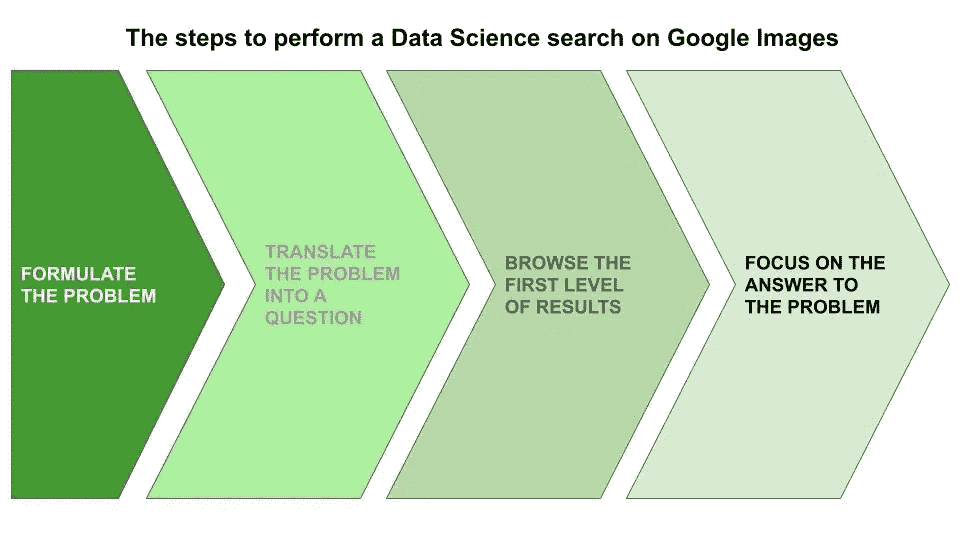
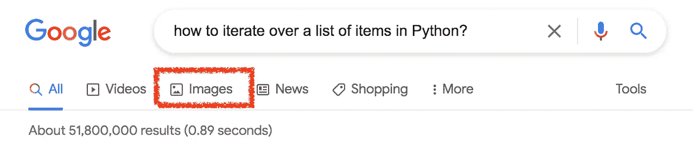

# 探索 Google 图片以搜索数据科学内容

> 原文：<https://pub.towardsai.net/exploiting-google-images-to-search-for-a-data-science-content-4b8d9b6cf87e?source=collection_archive---------3----------------------->

## [数据科学](https://towardsai.net/p/category/data-science)

## 关于如何改善你在谷歌上的搜索策略的一些建议

作者图片

在过去的几年里，在谷歌上搜索我们问题的正确答案已经成为最具挑战性的任务之一。不管你有哪个问题。这种能力就是在网上找到正确的答案。

数据科学家也有同样的问题:**无论他们必须解决代码中的问题，还是如果他们正在寻找最好的图表来讲述他们的数据，他们总是在他们首选的搜索引擎上打开一个标签。**

在这篇短文中，我向你展示了以下利用谷歌图片改善搜索的策略:

*   阐明你的问题
*   翻译成一个问题
*   浏览第一级结果
*   专注于你问题的答案

# 1 阐述你的问题

寻找正确答案的第一步是问题的公式化。数据科学家可能面临的问题包括:

*   在 Python/R 中实现给定的函数
*   提高机器学习算法的性能
*   为一些具体数据选择正确的图表
*   特定算法的工作原理。

# 2 把问题翻译成问句

下一步是把问题转化成一个非常具体的问题。如果你想得到正确的结果，你应该非常精确。参考前面的问题示例，您可以将它们转化为以下问题:

*   如何在 Python 中迭代一个条目列表？
*   我如何减少过度拟合？
*   如何表示男性/女性数据？
*   K-neighbors 分类器是如何工作的？

一旦问题被定义，你可以在谷歌上搜索它。

照片由[艾米丽·莫特](https://unsplash.com/@emilymorter?utm_source=medium&utm_medium=referral)在 [Unsplash](https://unsplash.com?utm_source=medium&utm_medium=referral) 拍摄

# 3 浏览第一级结果

谷歌现在会给你它的结果。现在，您可以切换到 Google Images 选项卡，如下图所示:

作者图片

**你会看到许多有趣的视觉效果。你可以快速滚动它们，选择对你有用的。**

当你点击一个结果时，图片的预览会在右边打开，在它下面，会有许多其他相似的图片。

> 谷歌图像的使用将加快你的搜索，并会给出非常有用的结果。

# 4 关注你问题的答案

确定 3-4 张有用的图片后，如果图片已经回答了您的问题，您可以点击每张图片；如果您想访问包含该图片的网站，则可以点击右侧图片预览下方的 ***访问*** 按钮。

瞧，很可能你已经找到了问题的答案:)

[WillSpirit L.N.](https://unsplash.com/@willspirit?utm_source=medium&utm_medium=referral) 在 [Unsplash](https://unsplash.com?utm_source=medium&utm_medium=referral) 上拍摄的照片

**如果你习惯使用谷歌图片进行搜索，你会发现你会很快找到你要找的东西。**

# 摘要

在这篇短文中，我描述了一个通过 Google Images 加速数据科学内容搜索的策略。首先，你必须清楚地定义你的问题，然后你可以把它转化成一个问题，在谷歌图片上搜索。最终，你会找到解决问题的方法！

如果你已经走了这么远来阅读，对我来说今天已经很多了。谢谢！你可以在[这篇文章](https://alod83.medium.com/which-topics-would-you-like-to-read-c68314dc6813)中读到更多关于我的内容。

# 相关文章

 [## 用 Twitter 扩展你的知识的 6 个技巧

### 将 Twitter 作为一个免费、有趣和互动的学习场所的初学者指南

betterhumans.pub](https://betterhumans.pub/6-tips-for-extending-your-knowledge-with-twitter-af2bc8c16bdb)  [## 如何将您的数据科学想法转化为受资助的项目

### 为你的数据科学想法和项目寻找资金的一些建议。

towardsdatascience.com](https://towardsdatascience.com/how-to-turn-your-data-science-idea-into-a-funded-project-f919dbaff104)  [## 如何根据数据科学项目撰写科学论文

### 关于如何将数据科学项目转化为精彩的科学论文的一些提示。

towardsdatascience.com](https://towardsdatascience.com/how-to-write-a-scientific-paper-from-a-data-science-project-62d7101c9057) 

# 离开前再说一句…

最近我开始了一个新的[媒体简介](https://angieelle.medium.com/)，在那里我发表我的文学作品:

我不再做梦了，因为我的梦想离我太远了。我不再做梦了，因为梦让我错过了现实的一大部分。

[继续阅读……](https://medium.com/illumination/i-stopped-dreaming-f32c4bff120f)

# **新到中？**你可以每月订阅几美元，解锁无限文章——[点击这里](https://alod83.medium.com/membership)。