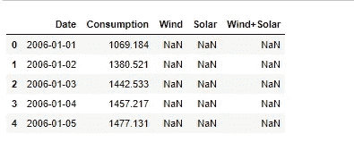
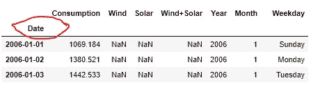
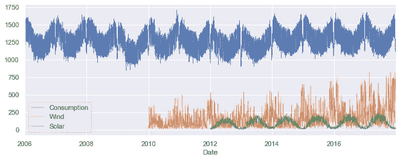
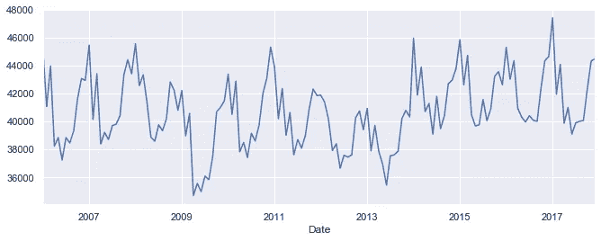
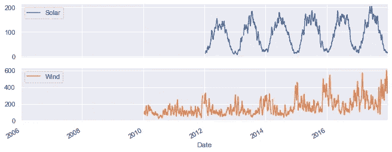
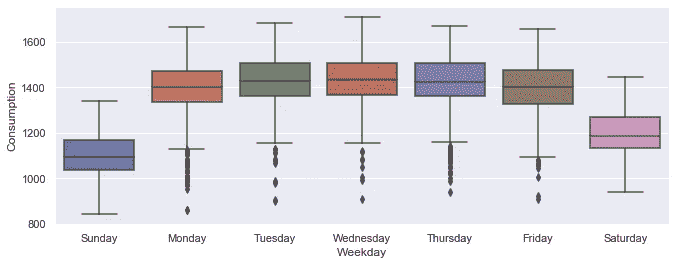

# 时间序列数据的探索性分析和可视化

> 原文：<https://pub.towardsai.net/exploratory-analysis-and-visualization-of-time-series-data-53aa5c8b547f?source=collection_archive---------0----------------------->

## [数据可视化](https://towardsai.net/p/category/data-visualization)

## 数据争论、创建时间序列对象、过滤和可视化，所有这些都是您可以充分利用时间序列数据的事情


杰克·希尔斯在 [Unsplash](https://unsplash.com?utm_source=medium&utm_medium=referral) 拍摄的照片

时间序列是你能遇到的最简单的数据形式。为什么简单？因为它的核心只是一列观察值和另一列相应的时间段。

从实用的角度来看，时间序列也是最重要的数据类型之一。仅仅一个简单的时间序列图就可以揭示如此多的信息，即使是未经训练的眼睛也可以提取有价值的见解，以做出重要的商业决策。

然而…..

如果处理不当，这种最简单的数据形式、最重要的讲述者和最广泛使用的数据类型可能很难处理。

因此，在本文中，我将触及时间序列分析的一些基本分析过程——对于理解数据、讲故事或高级建模和预测至关重要。

让我们开始吧。

# 1.数据争论

数据争论包含广泛的活动，可以说是数据科学中最耗时的任务。一些人经常指出，数据争论是数据科学家在任何一天所做的 80%的工作。

**1.1 导入&检查**

第一项任务是导入数据。在这个演示中，我使用了[一个预先格式化的数据集](https://raw.githubusercontent.com/jenfly/opsd/master/opsd_germany_daily.csv)，这样你就可以跟着练习了。这是一个关于各种形式的能源消耗的多元数据，在 2006 年至 2017 年之间每月报告一次。它共有 4，383 个观察值和 7 列。您需要以下几行代码来获取机器上的数据。

```
# import libraries
import pandas as pd
import numpy as np# import data
data = "[https://raw.githubusercontent.com/jenfly/opsd/master/opsd_germany_daily.csv](https://raw.githubusercontent.com/jenfly/opsd/master/opsd_germany_daily.csv)"df = pd.read_csv(data)# take a peek 
df.head()
```

导入后，您想通过调用`head()`函数来了解数据。



图:调用 head()函数来查看数据集

您可以做的一些其他操作是选择和重命名列、排序和过滤、分组、合并等。您还需要检查数据中可能丢失的值。以下代码行为您提供了每一列的所有 null 值的总和。

```
df.isnull().sum()
```

**2 处理缺失值**

这是一个干净的玩具数据集，所以它没有任何空值，但如果有空值，有几个选项可以处理它们:

*   **行删除:**如果数据集相对较大，则删除缺少值的完整记录
*   **替换:**用(a)列平均值、(b)最近邻居的平均值、(c)移动平均值或(d)用最后一次观察值填充来替换缺失的单元格
*   **统计插补:**在给定数据集中其他信息的情况下，回归可能是确定缺失像元值的有效方法

# **2。创建时间序列对象**

原始数据通常不针对时间序列分析进行格式化，因此编程库(例如`pandas`)将它们视为任何其他数据帧，其中时间维度存储为字符串而不是`datetime`对象。所以首要任务是将普通的数据框架转换成时间序列对象。

为此，您需要遵循以下步骤:

*   将时间列转换成`datetime`对象
*   将新列设置为系列的索引
*   通过分解时间索引创建新列(例如，2020–06–12 获得三个新列:年、月和日)

```
# convert Date column to a datetime object
df["Date"] = pd.to_datetime(df["Date"])# set Date as the index
df = df.set_index("Date")# add new columns by splitting index
df["Year"] = df.idex.year
df["Month"] = df.index.month
df["Weekday"] = df.index.weekday_name# take a peek at the new dataframe
df.head()
```



图:转换为日期时间对象并设置为索引的日期列

# **3。限幅/滤波**

既然您已经将普通的数据框转换为时间序列对象，那么就没有限制了！你可以随心所欲地对数据进行切片、切块和过滤，也可以随心所欲地以不同的方式呈现和可视化。例如，现在可以过滤特定年/月/日或特定日期范围的数据:

```
# filtering data for a specific year
df.loc["2006"]# filter data for a specific month of the year
df.loc["2006-01"]# filter data within a range of dates
df.loc["2006-02-02" : "2007-01-12"]
```

# **4。可视化**

一张图胜过千言万语！

数据可视化是数据科学的基础，无论是用于探索性数据分析、构建更好的模型，还是用于可视化[讲故事](https://towardsdatascience.com/storytelling-with-data-a-data-visualization-guide-for-business-professionals-97d50512b407)。

时间序列数据更是如此。很难想象一个没有情节的时间序列分析；下面是我展示的几个基本情节，但是，天空才是极限！

```
# install libraries
import matplotlib.pyplot as plt
import seaborn as sns# set default figure dimensions
sns.set(rc={'figure.figsize':(11, 4)})
```

## 4.1 单变量

一旦读入数据并将其转换为时间序列对象，第一个图通常是简单的可视化，以获得数据的“感觉”。

```
# simple visualization of multivariate time series
df_weather[["Consumption"]].plot(linewidth = 0.45)
```


图:简单的单变量时间序列图

## 4.2 多元

您也可以仅使用一行代码来绘制多元时间序列。

```
# plottng multivariate
df[["col1", "col2", "col3"]].plot()
```



图:多元时间序列图

## 3.3 多元重采样

时间序列对象的美妙之处在于您可以进行*重采样。*也就是说，您可以按不同的时间维度(每周、每月、每年等)对数据进行分组。)然后使用一行代码将它们全部绘制出来。

下面是一个重采样示例，其中每天的观察值被分组为每月的总和(在代码中找到“M”表示每月)。这是上述 4.1 中同一图的不同表示。

```
# Resampling daily/monthly/annually with mean/sum
df['Consumption'].resample("M").sum().plot()
```



图:将每日观察总结为每月总数的重新取样方法

## 4.4 滚动窗口

也称为*移动平均*，滚动窗口对最后 *N* 次观察进行平均或求和，并显示为单个数据点。

```
# sumplots of rolling window
df[["Solar", "Wind"]].rolling(window=12).mean().plot(subplots=True)
```



图:N = 12 的滚动窗口

## 4.5 箱线图

箱线图是一种非常强大的可视化信息的方式。在时间序列中，您可以按不同的时间单位对数据进行汇总或分组，并在单个箱线图中查看值的分布。

```
# boxplot of weekdays
sns.boxplot(data = df, x = 'Weekday', y = 'Consumption')
```



图:显示工作日分布和数据差异的箱线图

## 最后的想法

本文的目的是探索时间序列数据分析的几个基本方面:数据争论、创建时间序列对象、过滤和可视化。我希望你已经找到了一些有用的技巧和窍门来处理时间序列数据，以及如何将它们可视化。在以后的文章中，我将会用更多的代码片段更深入地探讨这些主题。

敬请期待！