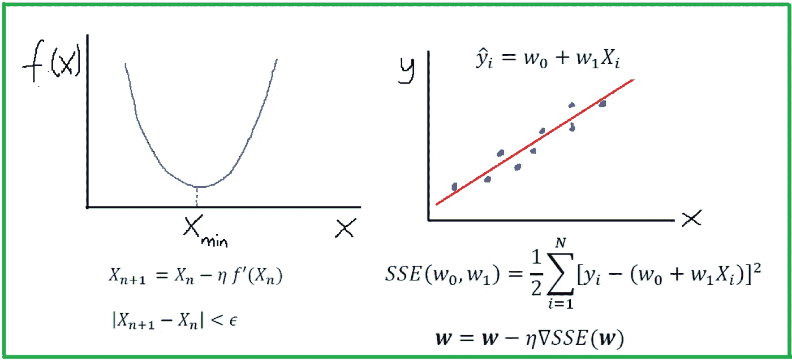
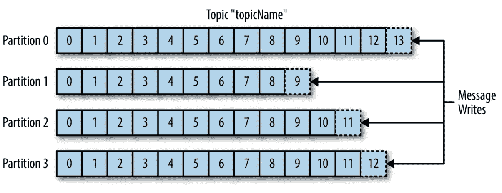

# 探索性数据分析(EDA) —不要问如何，要问什么…等等！

> 原文：<https://pub.towardsai.net/exploratory-data-analysis-eda-dont-ask-how-ask-what-and-more-7bdfe21f9b3d?source=collection_archive---------3----------------------->

## [新闻](https://towardsai.net/p/category/news)，[快讯](https://towardsai.net/p/category/newsletter)

## 什么是新的人工智能，什么是变化，一个令人兴奋的免费活动，我们的编辑每月精选，等等！

**如果你阅读这封邮件有困难，请在** [**网络浏览器**](https://mktg.best/jam-6) **上查看。**

对于《走向人工智能》来说，这是忙碌的一个月。我们的社交媒体网络拥有超过 115，000 名关注者，现在我们拥有超过 11，000 名订阅者，这一切**都要感谢你们**！我们的热心读者继续与我们保持联系，无论是通过分享、评论还是参与我们的作品。就我们而言，我们承诺将继续努力为您提供高质量的内容。

可扩展的机器学习，可扩展的 Python，为所有人— [加入免费活动](https://mktg.best/53c03)！

📅 [**【免费】Ray Summit 月 30 日-10 月 1 日:面向所有人的可扩展 Python&ML**](https://mktg.best/53c03)了解开源 Python 框架 Ray 如何用于构建分布式应用和库，包括后端基础设施和 ML 平台。Ray 发展迅速，由于其灵活性、可伸缩性和高效性，数百家公司正在使用它。 [**通过 livestream 加入 Ray Summit**](https://mktg.best/53c03) 或访问会议点播，全部完全免费— [**在此注册**](https://mktg.best/53c03) 。📅

现在进入月度精选！我们挑选这些文章是基于读者群、粉丝和某篇文章的浏览量。我们希望你和我们一样喜欢阅读它们。此外，我们开始做一些新的东西！我们将选出我们的十大表现文章，我们的编辑将选择一到两篇表现不突出，但由于其质量而入选本月的文章。

如果可以，请把我们的 [**订阅链接**](https://towardsai.net/subscribe) 分享给你的朋友和熟人。我们承诺不会向他们的收件箱发送垃圾邮件。如果您对我们的简讯有任何反馈，请随时给我们发送 [**电子邮件**](mailto:pub@towardsai.net) 。

# 📚本月编辑精选文章↓📚

迷失在虚无的海洋中(有时感觉像 EDA)——来自 [Unsplash](https://unsplash.com)

## [探索性数据分析(EDA)——不要问如何，问什么](https://mktg.best/-9gnu)作者 [Itamar Chinn](https://medium.com/u/4ff4e7aa4387?source=post_page-----7bdfe21f9b3d--------------------------------)

任何数据科学项目的第一步都是 EDA。本文将解释为什么 EDA 中的每一步都很重要，以及为什么我们应该关心我们从数据中学到了什么。EDA 或探索性数据分析是在我们开始寻找问题的解决方案之前，了解我们的数据集中有哪些数据的过程。换句话说，这是一种不带偏见假设地分析数据的行为，目的是为了有效地预处理数据集以进行建模…

图 1:蒙特卡罗模拟方法被用于许多行业，从股票市场到金融、能源、银行和其他预测模型。|来源:[像素](https://www.pexels.com/photo/white-android-tablet-turned-on-displaying-a-graph-186464/)

## 普拉蒂克·舒克拉、罗伯特·伊里翁多撰写的《蒙特卡洛模拟》Python 深度教程

蒙特卡罗方法是一种使用随机数和概率来解决复杂问题的技术。蒙特卡洛模拟，或称概率模拟，是一种用于理解金融部门、项目管理、成本和其他预测 [**机器学习**](https://mld.ai/mldcmu) 模型中风险和不确定性影响的技术…

何塞·巴勃罗·多明格斯在 [Unsplash](https://unsplash.com/?utm_source=unsplash&utm_medium=referral&utm_content=creditCopyText) 上拍摄的照片

## [观察者模式与发布订阅模式](https://mktg.best/vpdpv)作者[穆尼什·戈亚尔](https://medium.com/u/32def722c919?source=post_page-----7bdfe21f9b3d--------------------------------)

不要把这两种相似但不同的模式搞混了，要知道什么时候用哪个。这种差异不仅对普通软件工程师很重要，对数据工程师也很重要，并且是理解数据管道的事件驱动架构的基础。在我们最终列出它们之间的区别之前，让我们分别来看看这两者…

Benjamin O. Tayo 的图片

## [机器学习中的微积分](https://mktg.best/1t6-s)作者 [Benjamin Obi Tayo 博士](https://medium.com/u/3a025d440e6b?source=post_page-----7bdfe21f9b3d--------------------------------)

机器学习算法(如分类、聚类或回归)使用训练数据集来确定权重因子，这些权重因子可应用于未知数据以实现预测目的。*每一个机器学习模型背后都是一个严重依赖微积分的优化算法*。在本文中，我们将讨论一种这样的优化算法，即梯度下降近似(GDA ),并且我们将展示如何使用它来构建一个简单的回归估计器…

来源: [Reddit](https://www.reddit.com/r/funny/comments/7umfdz/darth_panda/)

## [优化你的熊猫代码的综合指南](https://mktg.best/0vzhl)埃亚尔·特拉贝尔西

在这篇指南中，我将向您展示一些最常见的陷阱，这些陷阱可能会导致本来非常好的 Pandas 代码对于任何时间敏感的应用程序来说都太慢，并通过一组提示和技巧来避免它们。

让我们提醒自己，除了可爱的动物之外，熊猫是什么🐼。这是一个广泛使用的数据分析和操作库，它将所有数据加载到 RAM 中。

## [Apache Spark 中针对大数据迁移工作负载的数据验证框架](https://mktg.best/aq6xi)作者[Karthikeyan Siva Baskaran](https://medium.com/u/dbfbd40186a6?source=post_page-----7bdfe21f9b3d--------------------------------)

质量保证测试是大数据的关键领域之一。数据质量问题可能会毁掉许多大数据、数据湖、ETL 项目的成功。无论数据是大是小，对数据质量的需求不会改变。高质量的数据是从中获得洞察力的绝对驱动力。数据质量的衡量基于它是否通过获得必要的洞察力满足了业务需求…

Fernand De Canne 在 [Unsplash](https://unsplash.com/?utm_source=medium&utm_medium=referral) 上拍摄的照片

## [用 Python 从零开始构建神经网络](https://mktg.best/zy7fv)作者[拉希达·纳斯林·萨克斯](https://medium.com/u/8a36b941a136?source=post_page-----7bdfe21f9b3d--------------------------------)

神经网络被开发出来模仿人脑。虽然我们还没有到那一步，但神经网络在机器学习中非常有效。上世纪八九十年代流行。最近它变得更受欢迎。计算机的速度足以在合理的时间内运行一个大型神经网络。在本文中，我将讨论如何实现一个神经网络。

照片由 [Rae Tian](https://unsplash.com/@rae_1991?utm_source=medium&utm_medium=referral) 在 [Unsplash](https://unsplash.com/?utm_source=medium&utm_medium=referral) 上拍摄

## [使用 RNNs 和 TensorFlow](https://mktg.best/kn77b) 创作你自己的哈利波特短篇故事[作者阿米沙·乔德哈尼](https://medium.com/u/d833b750f3b1?source=post_page-----7bdfe21f9b3d--------------------------------)

还在等你的霍格沃茨来信吗？
想在大会堂享受盛宴？
探索霍格沃茨的秘密通道？从奥利凡德买你的第一根魔杖？
*叹*你不是一个人。

过了这么久，我还有(*？* ) *一直*痴迷[哈利波特](https://harrypotter.bloomsbury.com/uk/)，最近开始学习神经网络。看到深度学习能让你变得多么有创造力，这很有意思，所以我想，为什么不把它们酝酿出来呢？

本文向您展示了我为实现它而编写的全部代码。
但是对于所有的赫敏，你可以直接在这里找到 GitHub 代码[并自己运行它！](https://github.com/amisha-jodhani/text-generator-harry-potter)

分区主题

## [深入卡夫卡](https://mktg.best/ytdyj)作者[维韦克·乔杜里](https://medium.com/u/27ca1e213060?source=post_page-----7bdfe21f9b3d--------------------------------)

这篇文章的目的是对 Apache Kafka 的概念有更多的理解，比如主题、分区、消费者和消费者群体。卡夫卡的基本概念在我的**上一篇文章里已经讲过了。**正如我们所知，卡夫卡中的信息被分类或存储在主题中。简单地说，Topic 可以被理解为一个数据库表。里面的卡夫卡主题被分解成分区…

资料来源:[调查统计](https://www.surveysensum.com/customer-experience/text-analytics/)

## [释放自然语言处理的文本分析能力](https://mktg.best/ga6sx)作者 [Sharon Lim](https://medium.com/u/2ffb6e30076e?source=post_page-----7bdfe21f9b3d--------------------------------)

自然语言是一种用于人类日常交流的语言。它在本质上对于文本和语音都是高度非结构化的，因此很难被机器解析和理解。**自然语言处理(“NLP”)涉及自然人类语言和计算机之间的交互。它是语言学、计算机科学和人工智能领域的交叉。**

照片由[赫塞·科林斯](https://unsplash.com/@jtc?utm_source=medium&utm_medium=referral)在 [Unsplash](https://unsplash.com/?utm_source=medium&utm_medium=referral) 上拍摄

## [NLP 模型由](https://mktg.best/4anc3)[量子统计](https://medium.com/u/7a94371c6509?source=post_page-----7bdfe21f9b3d--------------------------------)伪造

在最新微调的 NLP 模型上简化推理管道是快速原型开发的必要条件。然而，由于有太多不同的模型架构和 NLP 库可供选择，这可能会使原型设计成为一项耗时的任务。因此，我们创建了**NLP 模型锻造**。1，400 个微调模型的数据库/代码生成器，这些模型是由顶级 NLP 研究公司精心策划的，如拥抱脸、脸书(ParlAI)、迪普帕洛夫和 AI2。

来源:[朱庇特](https://mktg.best/w92y-)

## [如何通过](https://mktg.best/jyd6q) [Chetan Ambi](https://medium.com/u/e21a9c4ed934?source=post_page-----7bdfe21f9b3d--------------------------------) 将 Jupyter 笔记本发布为媒体博客

我最近开始在 Medium 上写关于数据科学和 Python 的文章。在撰写任何技术文章时，一项耗时的工作就是提供可复制的支持代码。我一直在使用 GitHub Gist，有时会使用 Jupyter Notebook 或其他 Python 编辑器中的代码截图。但是这需要时间，因为我们需要在中型编辑器和 Gist 或其他 Python 编辑器之间切换…

## 🙏感谢您成为《走向人工智能》的[订户](https://towardsai.net/subscribe)！🙏

> 🤖在社交媒体上关注 AI↓🤖
> 
> [脸书](https://www.facebook.com/towardsAl/) | [推特](https://twitter.com/towards_ai?lang=en)|[insta gram](https://www.instagram.com/towards_ai/)|[LinkedIn](https://www.linkedin.com/company/towards-artificial-intelligence)|[谷歌新闻](https://news.google.com/publications/CAAqBwgKMNiLmgswgpayAw?oc=3&ceid=US:en) | [Flipboard](https://flipboard.com/@Towards_AI) | [移动 Feed](https://feed.towardsai.net/)