# 探索性数据分析(EDA) —动手操作纽约 Airbnb 数据集

> 原文：<https://pub.towardsai.net/exploratory-data-analysis-eda-hands-on-nyc-airbnb-dataset-c835f08195da?source=collection_archive---------2----------------------->

## [数据分析](https://towardsai.net/p/category/data-analysis)

## 探索和分析纽约 Airbnb 数据集的完整指南

来源:[卡格尔](https://www.kaggle.com/bavalpreet26/eda-air-bnb-26)

我已经开始用一个特定的数据集来解释探索性数据分析(ed a ),以帮助更好地理解 EDA。EDA 是一种广泛的方法&它包括不同的实现方式，因数据集而异。要了解 EDA 的基础知识，请查看这篇[文章](https://medium.com/analytics-vidhya/overview-of-exploratory-data-analysis-with-haberman-dataset-6b7e2cf73a58)，因为它给出了 EDA 的概述，而这篇文章的重点是 EDA 的实践，而不是 EDA 的基础知识。

# 什么是探索性数据分析(EDA)？

*   如何确保你准备好在项目中使用机器学习算法？
*   如何选择最适合自己数据集的算法？
*   如何定义潜在可用于机器学习的特征变量？

**探索性数据分析(EDA)** 有助于回答所有这些问题，确保项目取得最佳成果。这是一种总结、可视化和熟悉数据集重要特征的方法。

让我们从一些实际的实现开始。在那之前记住；

## EDA 过程

1.  问题
2.  核实
3.  写
4.  重复

## 资料组

从 [NYC Airbnb data](https://www.kaggle.com/dgomonov/new-york-city-airbnb-open-data) 下载数据集

**记住:** **目标是预测给定数据的租赁价格。**

**注:**我刚刚在 NYC Airbnb 给 EDA 讲解了一些步骤，以获得任何问题接近 EDA 的直觉。要了解关于这个数据集的更多信息，请查看 Github。

**尽量理解数据。**

比如:**问**类似的问题；

数据集中有多少列？

那些列的数据类型是什么？

有多少数据点包含空值？即缺少值

如何替换这些缺失的值？

数据集中有多少个数据点？

所有带数字的列的范围是什么？

什么是平均值、中位数、众数、百分位数等。特性的值？

在某个范围内，这个特性有多少个值？

尝试**回答**或**验证**以下这些问题或类似问题:

现在，检查输出& **记下**观察结果。例如:

data.dtypes 的输出如下:

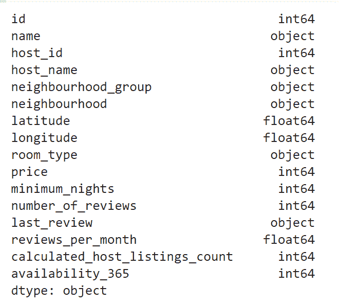

参考:作者

而**观察**可以是:

*   有些列包含文本，所以可能需要使用 BoW、tfidf、w2vec 等。用于数据建模。

同样，data.isnull()的输出。sum()为；

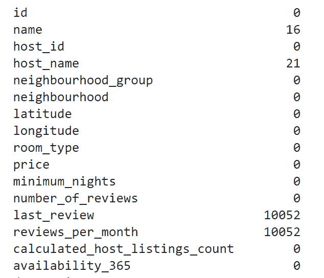

参考:作者

而**观察**可以是:

*   有 4 列有空值，必须替换它们，因为这可能会影响以后考虑同一列的剩余值。

所以在这里，下一步是替换这些空值，如上面的代码片段所示。

现在，要知道特定特征的数据点范围，使用直方图的单变量绘图是一个好的选择。

输出:

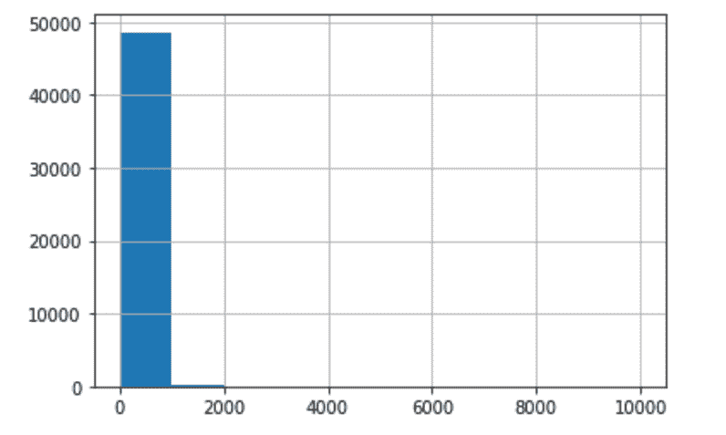

参考:作者

观察:

*   价格大多在 1000 以内。

现在，

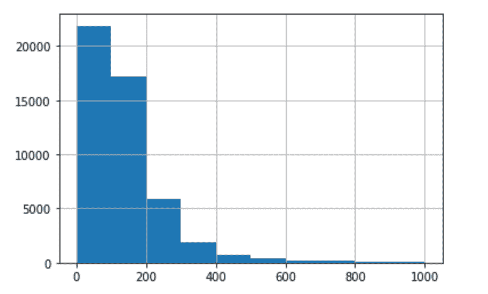

参考:作者

**观察:**

*   总共有 239 个数据点的租赁价格高于 1000 英镑。
*   这些要么是超级奢华的列表，要么是在输入过程中出现错误。尽管如此，由于这些记录扭曲了我们的数据，我们可以将它们视为离群值并丢弃它们。

输出:

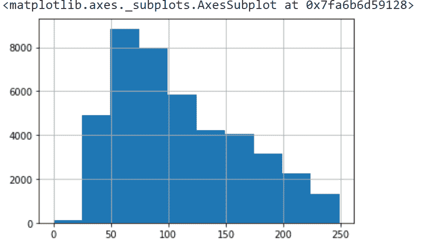

参考:作者

输出:

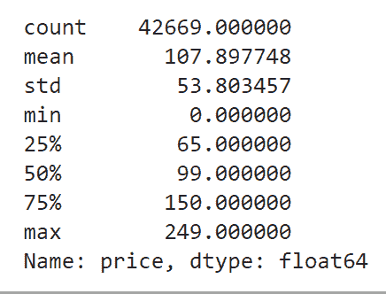

参考:作者

**观察:**

*   这是租金值的一种高斯分布< 250.
*   Considering threshold = 250 is a good option.

Likewise, trying to know different features of the dataset.

Output:

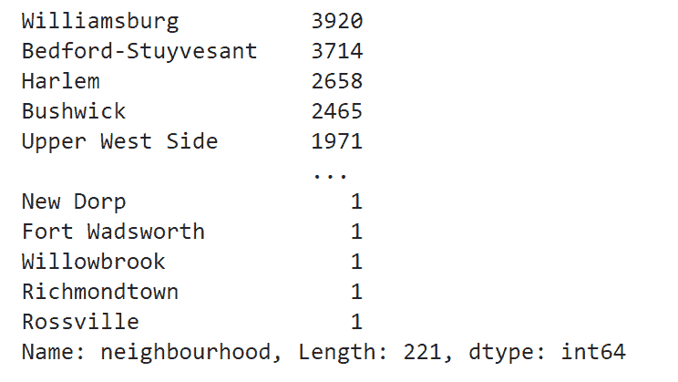

Reference: Author

**观察:**

*   几乎覆盖了 90%的数据。

输出:

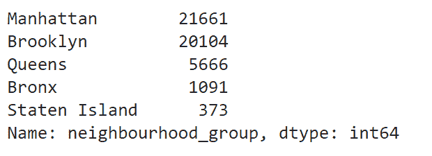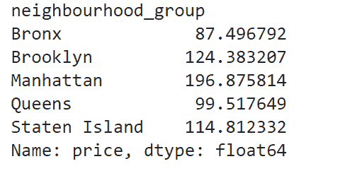

参考:作者

**观察:**

*   有 5 个组& 85%被曼哈顿和布鲁克林覆盖。

输出:

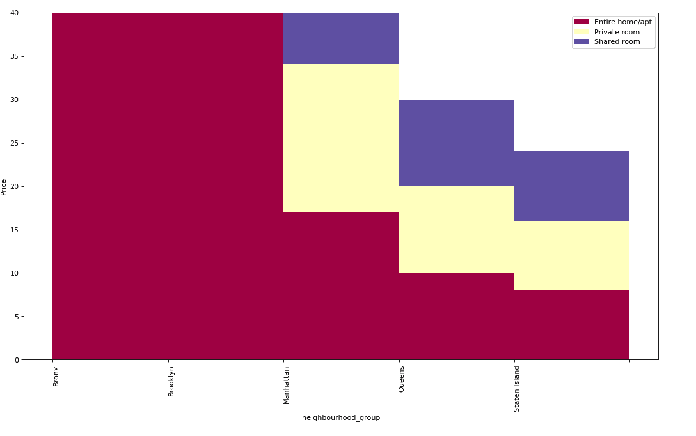

参考:作者

*   这里我们可以注意到，布鲁克林和曼哈顿往往有更多价格> 150 英镑的房源。此外，大多数高于 100 英镑的房源都是全屋型，其次是最便宜的单间和合租房。
*   在探索特性之后，最好去掉对预测不重要的特性。

现在，

此外，检查特征之间的相关性也很重要；

探索房型特征；

输出:

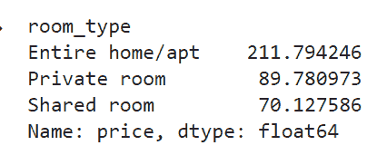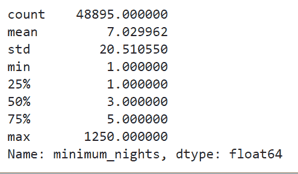

参考:作者

*   大多数情况下，房间类型要么是整个家庭，要么是私人房间。

在 EDA 过程中，检测异常值也是一件至关重要的事情。现在，探索，最小 _ 夜专栏；

输出:

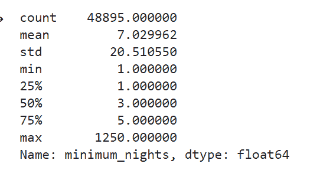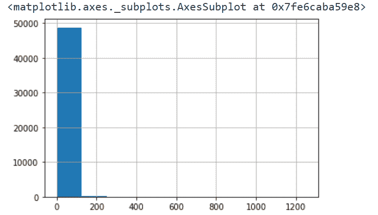

参考:作者

*   挺诡异的，范围在 1 晚到 1250 晚之间。从图上看，大部分晚上都在 100 以下。

输出:

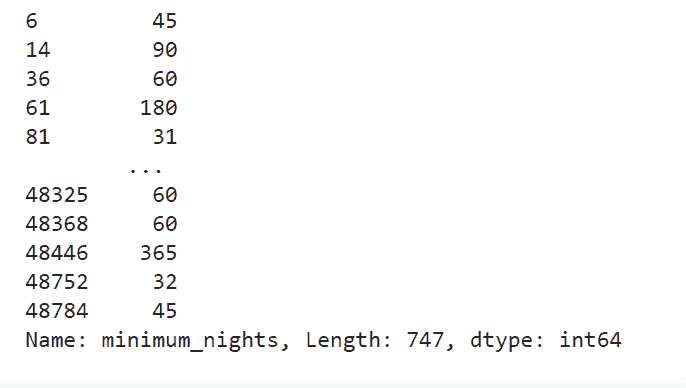

参考:作者

*   只有 747 个数据点的 minimum_nights > 30，因此用 30 替换所有这些数据点。

现在，绘制所有特征的相关图；

输出:

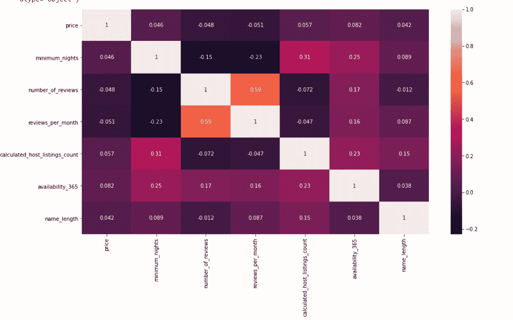

参考:作者

这个图可以描绘出很多关于实现解决问题目标的重要特征。现在，数据可以用来建立一个简单的线性回归模型，然后人们可以决定数据建模的方法。

可以从 [Github](https://github.com/rajviishah/Exploratory-Data-Analysis/blob/master/EDA_NYC_Airbnb.ipynb) 找到源代码。

如果您有任何问题或建议，请通过 [LinkedIn](http://nkedin.com/in/rajviishah/) 联系我。

## 参考资料:

*   [https://www . ka ggle . com/pavansanagapati/a-simple-tutorial-on-explorative-data-analysis](https://www.kaggle.com/pavansanagapati/a-simple-tutorial-on-exploratory-data-analysis)
*   [https://www . ka ggle . com/amitjadhav 96/Airbnb-NYC-价格-预测/笔记本#型号-解读](https://www.kaggle.com/amitjadhav96/airbnb-nyc-price-predictions/notebook#Model-Interpretation)