# 使用 Pyspark 进行探索性数据分析(EDA)

> 原文：<https://pub.towardsai.net/exploratory-data-analysis-eda-using-pyspark-b43e71fcec9f?source=collection_archive---------0----------------------->

## [数据分析](https://towardsai.net/p/category/data-analytics)， [Python](https://towardsai.net/p/category/programming/python)

本文的目标是对数据集执行分析，并回答一些问题以获得数据的洞察力。我们将学习如何连接到 Oracle DB，如何创建 Pyspark 数据帧，以及如何执行不同的操作来理解数据集的各个方面。
探索性数据分析(EDA)是通过总结数据集的主要特征来了解数据集。


数据分析

因为这是我第一个关于 EDA 的博客，所以我尽量保持内容简单，以确保我能引起读者的共鸣。因此，不再浪费一分钟，让我们开始分析。

## **1。Pyspark 连接和应用程序创建**

```
import pyspark
from pyspark.sql import SparkSession
spark= SparkSession.builder.appName(‘Data_Analysis’).getOrCreate()
```

## **2。Pyspark 数据库连接和导入数据集**

```
#Import Sales Data
sales_df = spark.read.format(“jdbc”).option(“url”, “jdbc:oracle:thin:sh/sh@//localhost:1521/orcl”).option(“dbtable”, “sales”).option(“user”, “sh”).option(“password”, “sh”).option(“driver”, “oracle.jdbc.driver.OracleDriver”).load()#Import Customer Datacust_df = spark.read.format(“jdbc”).option(“url”, “jdbc:oracle:thin:sh/sh@//localhost:1521/orcl”).option(“dbtable”, “customers”).option(“user”, “sh”).option(“password”, “sh”).option(“driver”, “oracle.jdbc.driver.OracleDriver”).load()#Import Products dataprod_df = spark.read.format(“jdbc”).option(“url”, “jdbc:oracle:thin:sh/sh@//localhost:1521/orcl”).option(“dbtable”, “products”).option(“user”, “sh”).option(“password”, “sh”).option(“driver”, “oracle.jdbc.driver.OracleDriver”).load()#Import Channels Datachan_df = spark.read.format(“jdbc”).option(“url”, “jdbc:oracle:thin:sh/sh@//localhost:1521/orcl”).option(“dbtable”, “channels”).option(“user”, “sh”).option(“password”, “sh”).option(“driver”, “oracle.jdbc.driver.OracleDriver”).load()#Import Country datacountry_df = spark.read.format(“jdbc”).option(“url”, “jdbc:oracle:thin:sh/sh@//localhost:1521/orcl”).option(“dbtable”, “countries”).option(“user”, “sh”).option(“password”, “sh”).option(“driver”, “oracle.jdbc.driver.OracleDriver”).load()
```

> Oracle 数据库连接需要 ojdbc6

## **3。显示数据**

```
#sales data
sales_df.show(10) 
print('Total Records in dataset',sales_df.count())
```

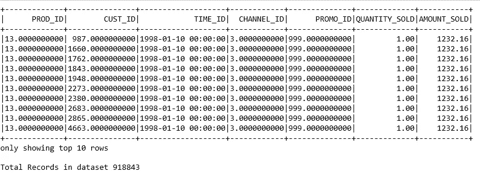

销售数据

```
#customer data
cust_df.show(5)
print(‘Total Records in dataset’,cust_df.count())
```

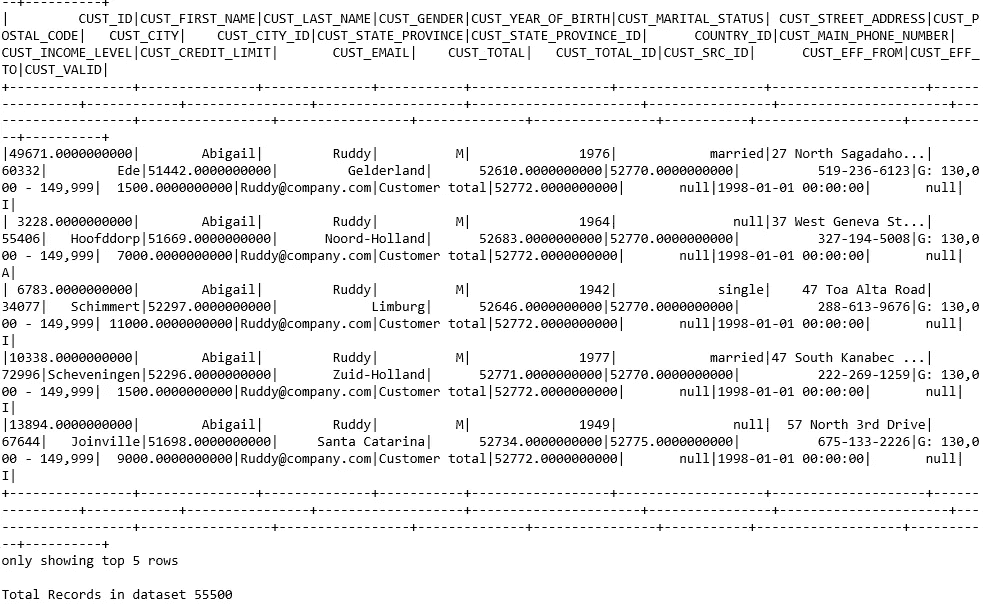

客户数据

```
#product data
prod_df.show(5)
print(‘Total Records in dataset’,prod_df.count())
```

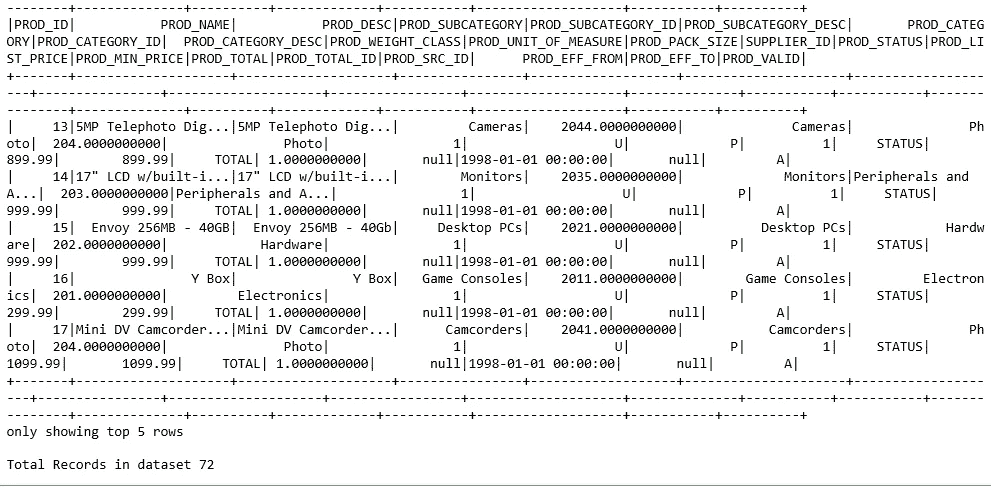

产品数据

```
#channels data
chan_df.show()
print(‘Total Records in dataset’,chan_df.count())
```

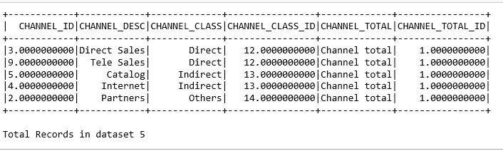

频道数据

```
#Country data
country_df.show(5)
print(‘Total Records in dataset’,country_df.count())
```

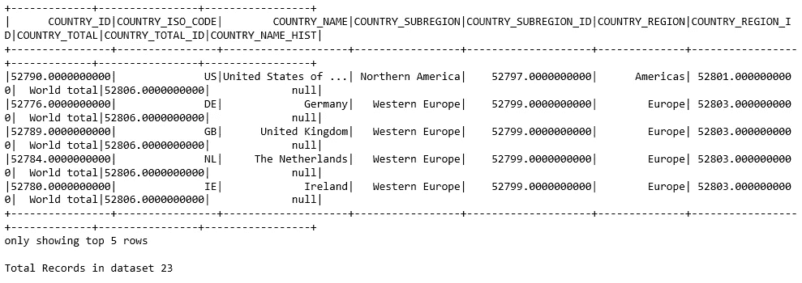

国家数据

## **4。显示数据框架的模式和列**

```
#dataframe schema
sales_df.printSchema()
```

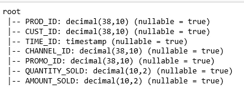

```
#display list of columns
sales_df.columns
```

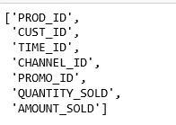

列

## **5。选择并过滤数据框上的条件**

```
#select some columns from product dataframe
prod_df.select(‘PROD_ID’,
 ‘PROD_NAME’,
 ‘PROD_DESC’,’PROD_STATUS’,
 ‘PROD_LIST_PRICE’,
 ‘PROD_MIN_PRICE’,’PROD_EFF_FROM’,
 ‘PROD_EFF_TO’,
 ‘PROD_VALID’).show(7)
```

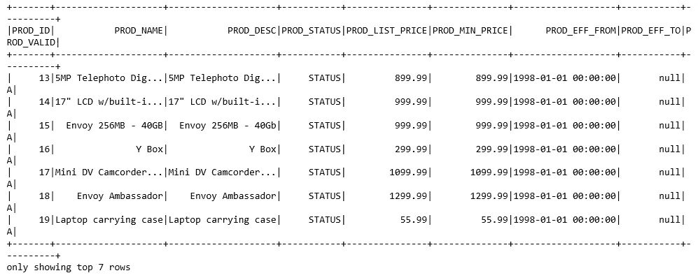

选择查询

```
#filter condition with selective columns
country_df.select(‘COUNTRY_ID’,
 ‘COUNTRY_ISO_CODE’,
 ‘COUNTRY_NAME’,).filter(country_df.COUNTRY_NAME==’India’).show()
```

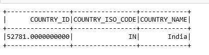

过滤器

将十进制数据转换为整数数据。

```
from pyspark.sql.types import IntegerType
country_df.select(country_df[‘COUNTRY_ID’].cast(IntegerType()).alias(‘COUNTRY_ID’),
 ‘COUNTRY_ISO_CODE’,
 ‘COUNTRY_NAME’,).filter(country_df.COUNTRY_NAME==’India’).show()
```

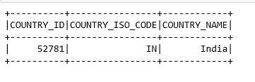

铅字铸造

## **6。分组依据和聚合**

让我们来看看客户在一年中的消费情况，以及从 1998 年到 2002 年的 4 年间的消费情况。

```
from pyspark.sql.functions import dayofyear,year
from pyspark.sql.functions import round, colsale_sum_df=sales_df.select(‘CUST_ID’,’TIME_ID’,’AMOUNT_SOLD’)cust_wise_df=sale_sum_df.groupBy(round(‘CUST_ID’,0).alias(‘CUST_ID’), year(sale_sum_df[‘TIME_ID’]).alias(‘YEAR’)).sum(‘AMOUNT_SOLD’)cust_wise_df.show(10)
```

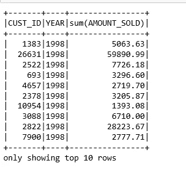

汇总客户销售数据

## **7。数据分类**

```
#Sort the records on basis of 
cust_wise_df.orderBy(cust_wise_df.CUST_ID).show(15)
```

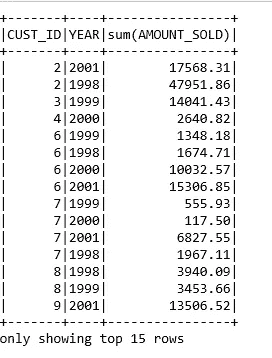

分类数据

让我们检查一年来的客户支出。

```
cust_wise_df.filter(cust_wise_df.CUST_ID==3261).show()
```

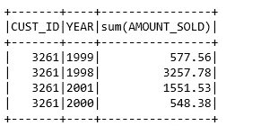

全年支出

## **8。一段时间内的客户访问量**

```
sale_sum_df.groupBy(sale_sum_df[‘CUST_ID’].cast(IntegerType()).alias(‘CUST_ID’)).count().show(10)
```

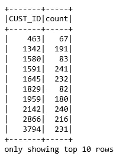

客户访问

## **9。四年内产品的总销售额**

```
 s_df=sales_df.select(round(‘PROD_ID’,0).alias(‘PROD_ID’),year(sale_sum_df[‘TIME_ID’]).alias(‘YEAR’),’AMOUNT_SOLD’)
#withColumnRenamed changes column name
s_df=s_df.withColumnRenamed(‘PROD_ID’,’PROD_ID_S’)p_df=prod_df.select(‘PROD_ID’,’PROD_NAME’)
p_df=p_df.withColumnRenamed(‘PROD_ID’,’PROD_ID_P’)#join the above two dataframes created
prod_sales_df=s_df.join(p_df,p_df.PROD_ID_P==s_df.PROD_ID_S,how='inner')#perform groupby and aggregation to sum the sales amount productwise
prod_sales=prod_sales_df.groupBy('PROD_ID_S','PROD_NAME').sum('AMOUNT_SOLD')
prod_sales=prod_sales.select(col('PROD_ID_S').alias('PROD_ID'),'PROD_NAME',col('sum(AMOUNT_SOLD)').alias('TOTAL_SALES'))
prod_sales.show(10)
```

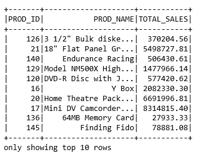

产品方面的总销售额

## 10。渠道总销售额

```
#find out which channel contributed most to the salesc_df=chan_df.select(col(‘CHANNEL_ID’).alias(‘CHANNEL_ID_C’),col(‘CHANNEL_DESC’).alias(‘CHANNEL_NAME’))sa_df=sales_df.select(col(‘CHANNEL_ID’).alias(‘CHANNEL_ID_S’),’AMOUNT_SOLD’)chan_sales_df=sa_df.join(c_df,c_df.CHANNEL_ID_C==sa_df.CHANNEL_ID_S,how=’inner’)
chan_sale=chan_sales_df.groupBy(round(‘CHANNEL_ID_C’,0).alias(‘CHANNEL_ID’)).sum(‘AMOUNT_SOLD’)chan_top_sales=chan_sale.withColumnRenamed(‘sum(AMOUNT_SOLD)’,’TOT_AMOUNT’)chan_top_sales.orderBy(‘CHANNEL_ID’).show()
```

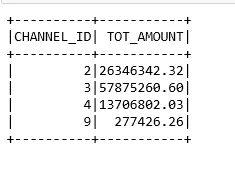

渠道销售

# **总结**

Pyspark DB 连接

使用 show()显示数据

数据帧的模式和列

在 DFs 上应用选择和过滤条件

分组依据和聚合

列重命名

一些数据见解

万岁，在这里我们使用 Pyspark 完成了探索性的数据分析，并试图让数据看起来合理。在接下来关于数据分析的文章中，我将分享更多 Pyspark 的功能。