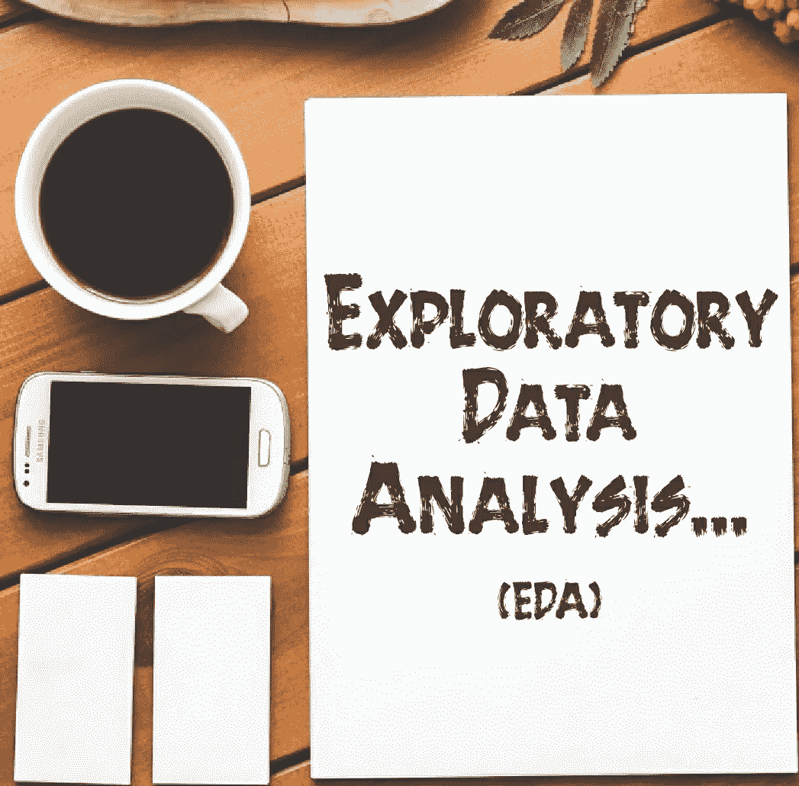
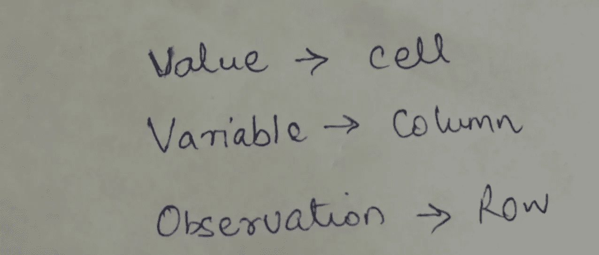
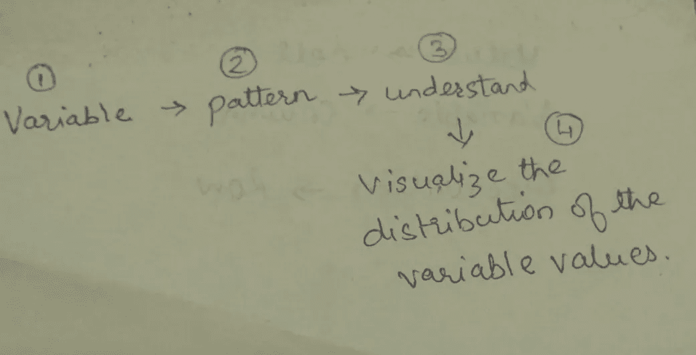
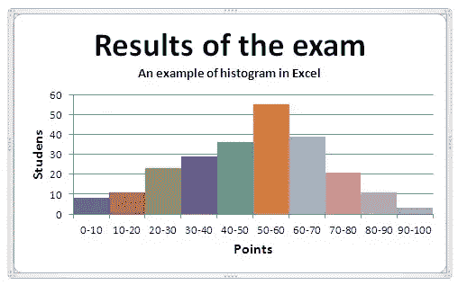
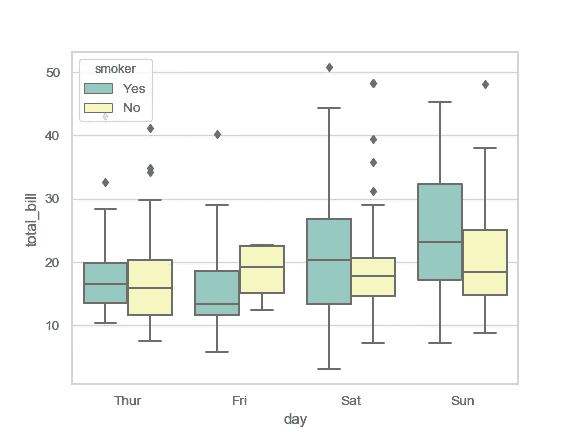
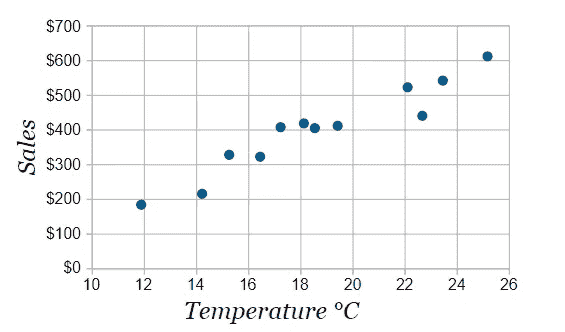

# 具有变异和协变的探索性数据分析(EDA)

> 原文：<https://pub.towardsai.net/exploratory-data-analysis-eda-with-variation-and-covariation-27f579e3a626?source=collection_archive---------2----------------------->

## [数据科学](https://towardsai.net/p/category/data-science)

大家好，欢迎回到我的博客，非常感谢你们的爱和支持，我希望你们都过得很好。今天，我们将学习和探索数据科学生命周期中使用的探索性数据分析(EDA)。

本博客将涵盖相关主题，什么是 EDA，EDA 使用的迭代周期，我们用于进行 EDA 的统计工具，基本术语，当他或她处理 EDA 过程时应该问什么样的问题&最后，我们将了解帮助我们处理 EDA 过程的变异和协变。所以，伙计们，带着你们所有的热情，让我们准备好，开始吧。

**什么是 EDA？**

这是一个向您展示或者说帮助您以系统的方式使用可视化和转换方法来探索数据的过程。它为生成关于数据观察的假设提供了建议。

让我们看看谷歌搜索引擎是怎么说我们的，什么是 EDA？

**Technopedia 对 EDA 的定义是:**

探索性数据分析(EDA)是一个术语，指的是用数据集完成的某些类型的初始分析和发现，通常是在分析过程的早期。一些专家将其描述为“瞥一眼”数据，以了解更多关于它代表什么以及如何应用它的信息。

***来源链接:***[***https://bit.ly/2QVKfwl***](https://bit.ly/2QVKfwl)

**数据决策组作者*迪诺火*将 EDA 定义为:**

探索性数据分析，简称 EDA，是对公司当前和历史调查中的现有数据进行详尽的分析。

**【https://bit.ly/2QMDxZc】**来源链接:

***最后，维基百科将 EDA 定义为:***

*在[统计](https://en.wikipedia.org/wiki/Statistics)、**探索性数据分析** ( **EDA** )是一种对 [数据集](https://en.wikipedia.org/wiki/Data_set)进行[分析以总结其主要特征的方法，通常采用可视化方法。一个](https://en.wikipedia.org/wiki/Data_analysis)[统计模型](https://en.wikipedia.org/wiki/Statistical_model)可以使用也可以不使用，但是 EDA 主要是为了看看数据能告诉我们什么，而不仅仅是正式的建模或假设检验任务。探索性数据分析是由 John Tukey[提倡的，目的是鼓励统计学家探索数据，并可能提出可能导致新的数据收集和实验的假设。EDA 与](https://en.wikipedia.org/wiki/John_Tukey)[初始数据分析(IDA)](https://en.wikipedia.org/wiki/Data_analysis#Initial_data_analysis) 不同，后者更侧重于检查模型拟合和假设检验所需的假设，并根据需要处理缺失值和进行变量转换。*

****来源链接:***[***https://bit.ly/2QOZoPP***](https://bit.ly/2QOZoPP)*

**

*[https://bit.ly/2pOAkxf](https://bit.ly/2pOAkxf)*

*展望未来，EDA 是统计学习者或数据科学家使用的一项任务，是一个迭代循环。他们在这个迭代循环中做什么？*

*理解这个循环需要三个步骤。首先，我们产生关于数据的问题。其次，通过对数据进行可视化、转换和建模来寻找答案。最后，利用你从数据中学到的东西，并从中提出新的问题。*

*我们都知道 EDA 是任何数据分析的重要组成部分。其中，我们调查数据的质量，并据此对数据进行清理。由于清理是 EDA 的一部分，我们应该询问您的数据是否符合您的预期？*

*EDA 的工具，业内大家常用的 EDA 的基本工具是**可视化，对你的数据进行转换&建模**以获得有价值的见解，进行进一步的探索和理解。这里的目标是加深对数据的理解。*

*EDA 中的调查指南通过针对数据集的特定部分提出问题，以最佳方式帮助我们&帮助您决定需要对数据进行哪些图表、模型或转换。*

*这里的要点是，我们应该问什么类型的问题才能给我们一个清晰的画面。因此，在这种情况下，两种类型的问题对于利用数据做出发现总是有用的。*

***1。什么类型的变异发生在我的变量*内？****

***2。在我的变量之间*发生了什么类型的*共变*？****

****重要术语:****

***变量**:是你可以测量的数量、质量或属性。*

***值:**测量变量时的状态。(数值可能因测量而异)。*

***观察:**假设为一个数据点。它是在相似条件下进行的一组测量。它可以包含几个值&不同的变量。*

***表格数据:**由一组数值组成。这里，值放在一个单元格中，变量位于一列&观察值位于整行。*

**

*表列数据*

*现在让我们了解一下变化，它可以被定义为一个变量(列)的值(单元)从一个测量值到另一个测量值的变化趋势。例如，我们测量一个连续值两次。我们将得到的结果值是两个不同的值。在分类变量中，如果你测量不同的对象，它也会变化。比如说两个人的眼睛颜色可能不一样。它还有助于我们理解数据中的异常值(异常值)以及缺失值。*

*简而言之，我们所做的是，我们取一个变量，我们观察它的模式，我们理解这些模式，最后，最好的方法是可视化变量值的分布。*

**

*这里让我们再做一次笔记:*

****变异:描述变量内部的行为。****

****协变:描述变量之间的行为。****

*因此**协变**被定义为两个或更多变量的值以相关方式(关系)一起变化的趋势。协变的过程是直接的。我们只是想象两个或更多变量之间的关系。*

*EDA 中用于可视化的基本工具是直方图、箱线图和散点图。*

***直方图:**一种可视化的方法，提供数值数据的分布。它也是一个概率分布函数(PDF)的估计。*

**

*[https://bit.ly/2KRZYIC](https://bit.ly/2KRZYIC)*

***箱线图:**一种图形化方法，用于通过四分位数可视化一组数字数据。它具有从方框垂直延伸的线，指示上四分位数(75%)和下四分位数(25%)之外的可变性&也包含异常值，如果数据中有异常值，这些异常值被称为晶须，因此它们被称为方框图和晶须图。*

**

*https://bit.ly/35yS5Qy*

***散点图:**一种可视化类型的图，用于显示数据集的两个变量的值。这里的数据标绘为采集点(数据点)；每个点代表一个数据点的整体观察。*

**

*[https://bit.ly/2XKNiIU](https://bit.ly/2XKNiIU)*

*我希望上面收集的东西是有知识的，并会给你一个关于这个主题的浏览，在这一点上，我想今天就到此为止。我很想知道您是否希望我涵盖任何与数据科学、机器学习等相关的主题。，那么请在我的博客评论区留下你的评论，这样我就可以把这些博客记录下来，并写下来供大家学习。*

*请关注我，获取我在[**Medium**](https://medium.com/@madhav_mishra)&[**LinkedIn**](https://www.linkedin.com/in/madhav-mishra-65783388/)上所有博客的更新。如果你真的喜欢上面的文章，那么请在下面评论，因为学习没有极限。*

*保持快乐，保持健康，保持谦逊！*